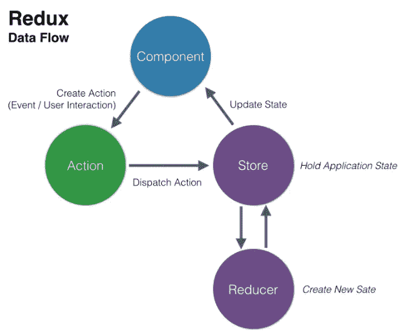
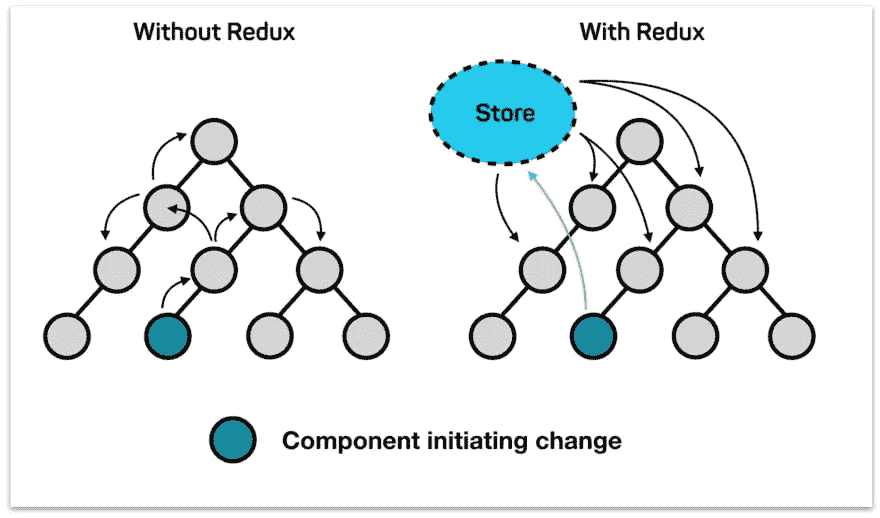

# 如何使用 redux toolkit 和使用 slice、react、typescript(前半部分，基础)

> 原文：<https://blog.devgenius.io/how-to-use-redux-toolkit-with-using-slice-react-first-half-part-basic-2bc18a42fae9?source=collection_archive---------2----------------------->


图片来自[https://blog . dastasoft . com/posts/how-to-get-better-easy-state-management-redux-toolkit](https://blog.dastasoft.com/posts/how-to-get-better-easier-state-management-redux-toolkit)

**目的**

如果你想创建一个更复杂的应用程序，你应该添加状态管理的特性。那么，如何管理应用程序的状态呢？嗯，其实你有几种方法，有用的是 redux。我决定分享我关于 redux 分成两部分的知识，这是基本的和真实的例子，因为 redux 是一个有点混乱的方法。因此，我将在本文中分享我的基本知识以及如何创建一个基本的计数器应用程序，并在下一篇文章中分享如何创建一个更复杂的应用程序。

**redux 是什么？**

```
Redux is an open-source JavaScript library for managing and centralizing application state. It is most commonly used with libraries such as React or Angular for building user interfaces. Similar to Facebook’s Flux architecture, it was created by Dan Abramov and Andrew Clark
```

以上句子摘自维基百科。据我所知，过去的 redux 是最复杂的。redux 数据流如下所示



图片来自[https://medium . com/@ aurelie . lebec/redux-and-react-native-simple-log in-example-flow-c 4874 cf 91 DDE](https://medium.com/@aurelie.lebec/redux-and-react-native-simple-login-example-flow-c4874cf91dde)

基本上，Redux 在保持状态纯净和不可变方面有点混乱，因为如果您可以直接更改存储日期，这将会出现一些问题。比如你改变了数据库上珍贵的客户端数据，这对你的公司是一个很大的负面影响，所以 Redux 不允许直接改变状态，他们允许你用“action”、“dispatch”、“reducer”来改变状态。

**redux 为什么有用？**



图片来自[https://blog . code centric . de/en/2017/12/developing-modern-offline-apps-react js-redux-electronic-part-3-react js-redux-basics/](https://blog.codecentric.de/en/2017/12/developing-modern-offline-apps-reactjs-redux-electron-part-3-reactjs-redux-basics/)

Redux 允许你从任何地方访问你的状态，这就是为什么 redux 被认为是一个非常有用的工具。在过去，当涉及到基本反应时，您可以通过使用道具来传递状态旁边的状态。换句话说，即使几乎所有的状态都不使用这个传递的状态，也应该传递状态以达到目的地。

你可能知道，现代的 react 有几种方法来传递你的状态，比如“useReducer”、“useContext”。所以有人说我们不需要 redux 了(甚至我的前端开发人员也说她现在避免使用 redux)。然而，这不是一个真实的事实，因为如果你想使用 useContext 和 useReducer 来使应用程序变得复杂，你应该使用几个 Context 和 Reducer，这样你的应用程序或 index.js 可能会有很多“提供者”，这有点混乱。

**什么是 redux toolkit？**

```
[Redux Toolkit](https://redux-toolkit.js.org/) is our official, opinionated, batteries-included toolset for efficient Redux development. It is intended to be the standard way to write Redux logic, and we strongly recommend that you use it.It includes several utility functions that simplify the most common Redux use cases, including store setup, defining reducers, immutable update logic, and even creating entire "slices" of state at once without writing any action creators or action types by hand. It also includes the most widely used Redux addons, like Redux
```

以上句子摘自官方网站。基本上 redux toolkit 是一个工具箱，其中包含了许多使用 redux 的有用工具。所以，我试着分享我的知识来使用这个工具。

**Redux 工具包中的“切片”是什么？**

```
A function that accepts an initial state, an object of reducer functions, and a "slice name", and automatically generates action creators and action types that correspond to the reducers and state.This API is the standard approach for writing Redux logic.Internally, it uses [createAction](https://redux-toolkit.js.org/api/createAction) and [createReducer](https://redux-toolkit.js.org/api/createReducer), so you may also use [Immer](https://immerjs.github.io/immer/) to write "mutating" immutable updates:
```

以上句子也来自官方网站。这是一个有用的工具，创造行动和减速器容易得多。那么，我们该如何利用它呢？

**如何将 redux 工具包与 react 配合使用(通过创建计数器 app)。**

app gif(一个最简单的计数器 app)。


**步骤**

1.  创建 react 应用程序。在我的例子中，我使用下面的命令用 typescript install 创建了这个应用程序

```
npx create-react-app “YOUR APP NAME” --template typescript
```

2.使用以下命令安装 redux toolkit。

```
npm install @reduxjs/toolkit
```

3.如果要使用 typescript，应该像下面这样添加 tsconfig.json，否则跳过这一部分。

4.创建如下所示的“counterSlice.tsx(或 js，jsx)”文件。从 reduxtoolkit 导入 createSlice，并使用它。您应该使用 createSlice 作为导出变量，设置名称和初始状态，减少。正如我写的 reducer 是用来“创建新状态”的，所以你应该加上你想如何改变你的状态。所以在我的例子中，由于我想“加数”和“减数”，所以我创建了两个减速器。如果你设置了 action.payload，当你使用这个动作时，你可以设置你想要的数字，所以我建议你使用 payload 而不是实数，如“1 ”,你可以导出每个动作和 reducers，如下所示。

5.如下图创建“store.tsx(或 js，jsx)”。您需要导入您在步骤 4 中创建的“configureStore”和 counterReducer，并如下设置这个 Reducer。实际上，如果你没有选择使用 typescript，你不需要导入 useSelecter 和 TypedUseSelectorHook，也不需要导出，因为这是为了在 redux-toolkit 中正确使用 typescript。

6.设置 provider 并存储在“index.tsx(或 js，jsx)”中，如下所示。这个提供商意味着提供商店的整个应用程序的信息。换句话说，你可以在你的应用中的任何地方使用这个商店的信息。注意:由于我创建了 redux 文件夹来存放 redux 相关的文件，所以它的路径略有不同(不是”。/store“但是”。/redux/store”)

7.通过使用 useSelector 和 useDispatch，使用您在“App.tsx(或 js，jsx)”中创建的 slice。useSelector 可用于显示应用程序中的商店信息，useDisplay 可用于通过使用 slice 来更改您的状态。在这种情况下，您设置了有效负载，因此如果您在 additional 的花括号内使用“2”而不是“1”，您可以将步长更改为 2 ex(0，2，4，6)。

8.搞定了。！你可以创建你的基本计数器应用程序。

**结论**

如果你使用 redux-toolkit，那么创建状态管理功能要比过去的 redux 容易得多，因为如果我们试图使用过去的 redux，我们需要准备每个 action、reducer 文件，并使用“connect”函数来连接存储。我知道这仍然很复杂，但这是一个非常强大的工具来管理你的应用程序中的状态。正如我在《目的》中写的，这是文章的前半部分。所以在我的下一篇文章中，我会解释一个更复杂的应用程序来更有效地使用 redux-toolkit。

**参考**

redux 官方网站:【https://redux.js.org/ 

redux take-kit 官方网站:【https://redux-toolkit.js.org/usage/usage-with-typescript 

Redux 已死:Redux 工具包万岁://[devsday.ru/blog/details/63269](http://devsday.ru/blog/details/63269)

Redux 和 React Native，简单登录示例流程:[https://medium . com/@ aurelie . lebec/redux-and-React-Native-simple-log in-example-flow-c 4874 cf 91 DDE](https://medium.com/@aurelie.lebec/redux-and-react-native-simple-login-example-flow-c4874cf91dde)

Redux 入門者向け初めてのRedux ToolkitとRedux Thunkの非同期処理: [https://reffect.co.jp/react/redux-toolkit](https://reffect.co.jp/react/redux-toolkit)

Redux-toolkitを使ったStoreをtypescriptで作ってみる: [https://zenn.dev/engstt/articles/293e7420c93a18](https://zenn.dev/engstt/articles/293e7420c93a18)

感谢您的阅读！！