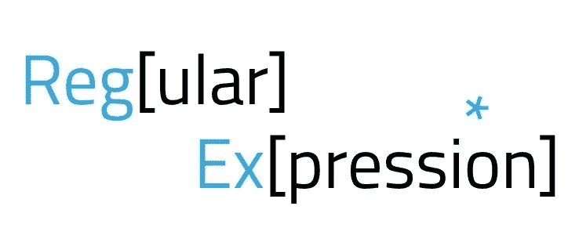
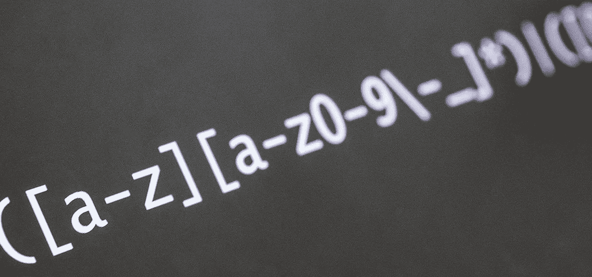
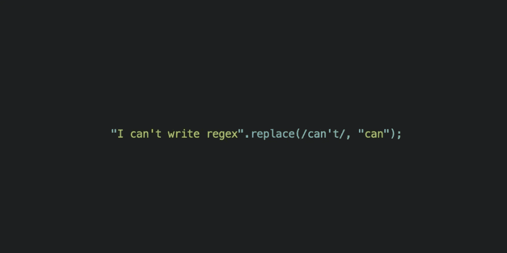

# Python 中如何使用正则表达式？

> 原文：<https://blog.devgenius.io/how-to-use-regular-expressions-in-python-ee2e61cb3416?source=collection_archive---------2----------------------->

正则表达式或正则表达式需要一些时间来适应它。但是一旦你习惯了，你会发现 RegEx 对你的 Python 编程几乎是必不可少的。



本文将了解什么是正则表达式，正则表达式的用途，以及如何在 Python 中使用它。

## 内容计划:

1.  [*什么是 RegEx？*](#f968)
2.  [*正则表达式的语法*](#6896)
3.  [*如何在 Python 中使用 RegEx？*](#61f2)
    3.1 [*语法示例*](#8e99)
    ⠀⠀3.1.1 [*方括号([])*](#ba9f) ⠀⠀3.1.2*[*圆点(。)*](#025b)
    ⠀⠀3.1.3[*\ w 和\ w*](#4b3f)*\ d 和\ d*
    ⠀⠀3.1.5[*\ s 和\ s*](#bba0)
    ⠀⠀3.1.6[*^和\ a*](#c2e2)
    ⠀⠀3.1.7[*$和\ z*](#422e)
    ⠀⠀3.1.8
    )
    ⠀⠀3.1.12[**？, +?，还有呢？？*](#f046)
    ⠀⠀3.1.13[*重复次数{m }*](#91c0)
    ⠀⠀3.1.14*[*重复次数{m，n}*](#8b17)
    [*重复次数{ m，n }？*](#8c3e)
    ⠀⠀3.1.16[*圆括号()*](#89c0)
    ⠀⠀3.1.17[*竖线(| )*](#1ae9)**
4.  **[*RE 模块的主要功能*](#b085)
    4.1[*findall()函数*](#ef5e)
    4.2[*split()函数*](#71a2)
    4.3 [*sub()函数*](#eb30)**
5.  **[*奖励给你*](#a175)**
6.  **[*结论*](#8038)**

# **1.什么是正则表达式？**

****正则表达式(RegEx)** 是一个特殊的字符序列，它使用搜索模式来查找一个或一组字符串。它可以通过将文本与特定模式进行匹配来检测文本的存在与否，还可以将一个模式分成一个或多个子模式。Python 提供了`re`模块，允许你在 Python 中使用 RegEx。**

****

# **2.正则表达式的语法**

**正则表达式的语法分为两部分:**元字符**和**特殊序列**。让我们一起来看看。**

## **元字符:**

****元字符**被视为正则表达式的构成元素。正则表达式是匹配字符串中字符组合的模式。元字符在搜索模式时有特殊的含义，主要用于定义搜索标准和任何文本操作。**

****特殊序列:****

**特殊序列表示具有单向含义的基本预定义字符类。每个特殊序列使某些常见的设计更便于使用。**

**例如，您可以使用序列`'\d'`作为字符类`'[0-9]'`的简化定义，这意味着它对应于 0 到 9 之间的任何数字。**

**如果你现在不知道什么是有效的，不要担心！我们将检查每个案例中的一个例子。**

****

# **3.如何在 Python 中使用 RegEx？**

**在 Python 中使用 RegEx 需要导入`re`模块。这个模块有几个功能。我们将使用`re.search()`函数来看看**元字符**和**特殊序列**是如何工作的。**

## **3.1 语法示例**

**最初，您应该知道`re.search()`函数来看看例子。**

## **search()函数**

**`search()`函数在字符串中搜索匹配项，如果匹配就返回一个匹配对象。如果有多个匹配项，将只返回第一个匹配项:**

## **3.1.1 方括号([ ])**

> ***指定要匹配的唯一字符集。***

**方括号`'[]'`中的字符代表一个**字符类**，一个应该匹配的枚举字符集。字符类元字符序列将对应于该类中包含的任何字符。**

**您可以像这样列出单个字符:**

**元字符序列`'[aptg]’`匹配任何单个`'a'`、`'p'`、`'t'`或`'g'`字符。在这个例子中，正则表达式`'Pi[aptg]'`匹配`'Pip'`和`'Pig'`(也匹配`'Pit'`和`'Pia'`)。**

**字符类还可以包含由连字符`'-’`分隔的字符范围，在这种情况下，它匹配范围内的任何单个字符。例如，`'[a-z]'`是从`'a'`到`'z'`的任何小写字母字符，包括所有小写字母字符，而`'[0-9]'`匹配任何数字字符:**

**同样在上面的例子中，`'[0-9][0-9]’`匹配两个数字的序列。匹配的`'Pronounce 123'`字符串的第一部分是`'12'`。**

**您可以通过指定第一个字符`'^'`来补充一个字符类，在这种情况下，它匹配不在集合中的任何字符。在以下示例中，`'[^0-9]’`匹配任何非数字字符:**

**这里，match 对象显示字符串中不是数字的第一个字符是`'h'`。**

**如果一个字符类中的`'^'`字符不是第一个字符，那么它没有任何特殊意义，它匹配一个文字`'^'`字符:**

## **3.1.2 点(。)**

> ***指定一个通配符。***

**`'.’`元字符匹配除换行符之外的任何单个字符:**

**作为一个正则表达式，`'Pyt.on'`基本上意味着`'Pyt'`字符，然后是除换行符之外的任何字符，然后是`'on'`字符。在上面展示的第一个字符串中，`'Python'`对应于模式，因为`'.'`元字符匹配`'h'`。**

**第二和第三根弦不匹配。在后一种情况下，即使在`'Pyt'`和`'hon'`之间有一个字符，它也是一个换行符，默认情况下，`'.'`元字符不匹配换行符。**

## **3.1.3 和**

> **根据字符是否为单词字符进行匹配*。***

**`'\w'`匹配任何字母数字单词字符。单词字符是大写和小写字母、数字和下划线`'_’`字符，因此`'\w’`基本上是`'[a-zA-Z0-9_]’`的快捷方式:**

**在这种情况下，字符串`'#().%A&*'`中单词的第一个字符是`'A'`。**

**`'\W’`则相反。它匹配任何非单词字符，相当于`'[^a-zA-Z0-9_]’`:**

**这里，`'#().%A&*'`中的第一个非文字字符是`'^'`。**

## **3.1.4**

> **字符与十进制数的匹配*。***

**`'\d’`匹配任何数字字符。`'\D'`正相反。它适合所有不是小数的字符:**

**`'\d’`基本等于`'[0-9]’`,`'\D’`等于`'[^0-9]'`。**

## **3.1.5**

> **根据字符是否代表空格*进行匹配。***

**`'\s'`匹配任何空白字符:**

**注意，与点`’.’`元字符不同，`'\s'`对应一个换行符。**

**`'\S’`是`'\s'`的反义词。它匹配任何非空白字符:**

**再次，`'\s’`和`'\S'`认为换行符是空白。在上面的例子中，第一个非空白字符是`'H'`。**

**字符类的序列`'\w’`、`'\W’`、`’\d'`、`'\D’`、`'\s’`和`'\S’`也可以出现在方括号字符类中:**

**在这种情况下，`'[\d\w\s]’`对应于任何数字、单词或空白字符。因为`'\w’`包含了`'\d'`，所以同样的字符类也可以表达成略短的`'[\w\s]'`。**

## **^和\A**

> **将匹配锚定到字符串的开头。**

**当正则表达式解析器遇到`'^'`或`'\A’`时，解析器的当前位置必须在搜索字符串的开头，以便找到匹配。**

**换句话说，regex `'^pip'`指定`'pip'`不能出现在搜索字符串中的任何地方，而是出现在开头:**

**`'\A’`功能相似:**

## **和\Z**

> **将一根火柴固定在一根绳子的末端。**

**当正则表达式分析器遇到`'$'`或`'\Z’`时，分析器的当前位置必须在搜索字符串的末尾，这样它才能找到匹配项。上面的`’$’`或`'\Z'`必须是搜索字符串的结尾:**

**作为一个特例，`'$'`(而不是`'\Z’`)也匹配搜索字符串末尾的一个换行符之前的位置:**

**在本例中，`'world'`严格来说并不在搜索字符串的末尾，因为它后面跟了一个额外的换行符。但是正则表达式分析器丢弃它，仍然称它为匹配。该异常对`'\Z'`无效。**

## **B 和 B**

> **将匹配锚定到单词边界。**

**`'\b’`断言正则表达式分析器的当前位置必须在一个单词末尾的开头。一个单词由一系列字母数字字符或下划线(`'[a-zA-Z0-9_]’`)组成，与`'\w’`字符类相同:**

**在上面的例子中，匹配发生在第 4 行**和第 5 行**，因为在`'world'`的开头有一个字边界。在**行 6** 上情况并非如此，因此匹配不成功。**

**类似地，在**第 14 行和第 15 行**上有匹配，因为在`'hello'`的结尾有一个字边界，而在**第 16 行**上没有。**

**在`'<regex>’`的两端使用特殊序列`'\b'`，当它作为一个完整的单词出现在搜索字符串中时，将匹配它:**

**`'\B’`与`'\b’`相反。它断言分析器的当前位置必须是*而不是*在一个字的开头或结尾:**

**在这种情况下，匹配发生在**行 6** 上，因为在搜索字符串`'helloworldfromPython'`中`'world'`的开头或结尾没有字边界。**

## **3.1.9 星号(*)**

> **匹配前面正则表达式的零次或多次重复。**

**例如，`'a*'`匹配零个或多个`'a'`字符。这意味着它将对应于一个空字符串`''`、`'a'`、`'aa'`、`'aaa'`等等。**

**让我们看看这些例子:**

**在**第 4 行**上，在`'one'`和`'two'`之间有零个`'-'`字符。在**线 5** 上有一个，在**线 6** 上有两个。元字符`'-*'`的序列在所有三种情况下都匹配。**

## **3.1.10 加号(+)**

> **匹配前面正则表达式的一个或多个重复项。**

**这类似于`’*’`，但是量化的正则表达式必须至少出现一次:**

**请记住，上面的`'one-*two’`匹配字符串`'onetwo'`，因为`'*'`元字符允许出现 0 次`'-'`。`'+’`元字符要求至少出现一次`'-'`。这意味着在这种情况下**行 4** 没有对应关系。**

## **3.1.11 问号(？)**

> **匹配前面正则表达式的零次或一次重复。**

**同样，它类似于`'*'`和`’+’`，但是在这种情况下，只有前面的正则表达式出现 1 次或 0 次才匹配:**

**这里有与**第 4 行和第 5 行**的匹配。但是在**第 6 行**上，有两个`'-'`字符，匹配不成功。**

## **3.1.12 *?, +?，还有呢？？**

> **`'*'`、`’+’`和`'?'`量词的非贪婪(或懒惰)版本。**

**仅在使用时，量词元字符`’*’`、`’+’`和`'?'`都是**贪婪**，这意味着它们产生尽可能长的匹配。以此为例:**

**正则表达式`'<.*>’`实际上意味着:**

*   **一个`’<’`字符**
*   **那么任何字符序列**
*   **然后是一个`'>'`字**

**但是哪个`’>’`人物？有三种可能性:**

1.  **紧接在`'Hello'`之后的那个**
2.  **紧接在`'World'`之后的那个**
3.  **紧接在`'again'`之后的那个**

**因为`’*’`元字符是贪婪的，它规定了可能的最长匹配，这包括了从`'>'`到`'World'`之后的所有字符。您可以在 match 对象中看到这是结果对应。**

**如果您想要尽可能短的对应，那么使用非贪婪元字符序列`'*?’`:**

**在这种情况下，匹配以`'Hello'`后的`'>'`字符结束。**

****注意:**你可以用正则表达式`'<[^>]*>’`做同样的事情，这意味着:**

*   **一个`'<'`人物**
*   **那么除了`'>'`之外的任何字符序列**
*   **然后是一个`'>'`字**

**对于一些不支持惰性量词的旧分析器来说，这是唯一可用的选项。令人高兴的是，Python 的`re`模块中的正则表达式分析器并非如此。**

**还有懒惰版本的`'+'`和`'?'`量词:**

****线 4 和 5** 上的前两个例子同上，仅使用`’+’`和`'+?'`代替`'*'`和`'*?’`。**

****第 6 行和第 7 行**的最后一个例子略有不同。一般来说，`?`元字符匹配前面正则表达式的 0 次或 1 次出现。贪婪的版本`'?'`匹配 1 个事件，所以`'Hi?’`匹配`'Hi'`，后面跟一个`'i'`。非贪婪版本`'??’`匹配 0 次，所以`'Hi??’`只匹配`'H'`。**

## **3.1.13 重复次数{m}**

> **精确匹配前面正则表达式的`m`次重复。**

**这类似于`’*’`或`’+’`，但是它精确地指定了前面的正则表达式必须出现多长时间才能匹配成功:**

**在这个例子中，`'1/{3}1’`匹配`'1'`，紧接着是 3 个`'/'`字符实例，然后是第二个`'1'`。当`'1'`字符之间的斜杠少于或多于 3 个时，匹配失败。**

## **3.1.14 重复次数{m，n}**

> **匹配前面的正则表达式从`m`到`n`的任意次数的重复，包括。**

**在下面的例子中，量化的`'<regex>’`是`'-{2,4}’`。当`'hi'`字符之间有 2、3 或 4 个破折号时匹配成功，否则匹配失败:**

## **3.1.15 重复{m，n}？**

> **非贪婪(懒惰)版的`'{m,n}’`。**

**`'{m,n}’`将匹配尽可能多的字符，`'{m,n}?'`将匹配尽可能少的字符:**

**在这种情况下，`'x{3,5}’`给出最长的可能匹配，因此它匹配 5 个`'x'`字符。`'x{3,5}?’`给出最短的匹配，这意味着它匹配 3。**

## **圆括号( )**

**分组并不是分组约束的唯一有用的目标。大多数(但不是全部)分组结构也捕获搜索字符串中与该组匹配的部分。您可以通过各种方式获取捕获的部分或在以后引用它。**

**还记得`re.search()`返回的 match 对象吗？匹配对象有两个定义的方法，允许访问捕获的组:`.groups()`和`.group()`**

****m.groups()****

> **返回一个元组，其中包含从正则表达式匹配中捕获的所有组。**

**让我们来看看这个例子:**

**每个表达式`'(\w+)’`对应一个单词字符序列。整个正则表达式`'(\w+):(\w+):(\w+)'`将搜索字符串分成三个逗号分隔的部分。**

**由于表达式`'(\w+)’`使用分组括号，相应的匹配部分被**捕获**。要访问捕获的匹配，您可以使用`.groups()`，它返回一个包含序列中所有捕获的匹配的元组:**

```
**>>> reg_1.groups()
('hello', 'world', 'again')**
```

**请注意，元组包含搜索字符串中出现的部分，但不包含逗号。这是因为组成部分的单词字符在分组括号内，但逗号不在。您在返回部分之间看到的逗号是用于分隔元组中的值的标准分隔符。**

****m.group( < n > )****

> **返回一个包含`<n>th`捕获匹配的字符串。**

**使用一个参数，`group()`返回一个捕获的匹配。请记住，参数是从 1 开始的，而不是从 0 开始的。因此，`reg_1.group(1)`是第一个记录器匹配，`reg_1.group(2)`是第二个记录器匹配，依此类推:**

**因为捕获的匹配项的编号是从 1 开始的，并且没有任何编号为 0 的组，`reg_1.group(0)`具有特殊的意义:**

**`reg_1.group(0)`返回整个匹配，`reg_1.group()`也做同样的事情。**

****m.group( < n >，< n >，…)****

> **返回一个包含指定的捕获匹配的元组*。***

**使用多个参数，`.group()`返回一个元组，该元组包含按给定顺序捕获的指定匹配项:**

**这只是方便的速记。您可以自己创建匹配元组:**

**这两种说法在功能上是相同的。**

## **3.1.17 竖线(|)**

> **指定要匹配的一组备选项。**

**形式为`'<regex1>|<regex2>|...|<regexn>'`的表达式最多对应一个指定的`'<regexi>’`表达式:**

**这里，`'hello|world|again'`将匹配`'hello'`、`'world'`或`'again'`中的任何一个。使用`’|’`可以分隔任意数量的表达式。**

**交替是非贪婪的。正则表达式分析器按照从左到右的顺序查看由`'|'`分隔的表达式，并返回找到的第一个匹配项。不测试其他表达式，即使其中一个会产生更长的匹配:**

**在这种情况下，在**行 6** 、`'multi|play'`上指定的模式将在`'multi'`或`'play'`上匹配。返回的匹配是`'multi'`，因为当从左向右扫描时，它首先出现，尽管`'play'`可能是一个更长的匹配。**

**您可以组合交替、分组和所有其他元字符，以达到任何级别的复杂性。在下面的例子中，`'(hello|world|again)+’`表示一个或多个字符串`'hello'`、`'world'`或`'again'`的序列:**

# **4.RE 模块的基本功能**

**你已经知道 RegEx 的`search()`功能，但是你应该知道其他的:**

# **4.1 findall()函数**

> **`findall()`函数返回一个包含所有匹配的列表。**

**该列表按找到的顺序包含匹配项。如果没有找到结果，则返回一个空列表:**

# **4.2 split()函数**

> **`split()`函数返回一个列表，其中的字符串在每次匹配时都被拆分。**

**您可以通过指定`maxsplit`参数来控制出现的次数:**

# **4.3 sub()函数**

> **`sub()`功能用您选择的文本替换匹配项。**

**用数字 9 替换每个空白字符。您可以通过指定`count`参数来控制替换的数量:**

# **5.给你的奖金**

**作为奖励，我想和你分享这张小抄，它会对你有用的。这里是你使用它所需要的一切，甚至更多。愿它永远触手可及！**

**[](https://drive.google.com/file/d/193lNx7lc6vjvjHkdeB64QSkmrXMjK63L/view?usp=sharing) [## python-regular-expressions-cheat-sheet.pdf

### 编辑描述

drive.google.com](https://drive.google.com/file/d/193lNx7lc6vjvjHkdeB64QSkmrXMjK63L/view?usp=sharing) 

并且也为了测试你的 RegEx check [这个站点](https://regex101.com/)的正确性！** ****

# **6.结论**

**让我们结束这一切。现在你知道了:**

*   **正则表达式是干什么用的**
*   **如何在 Python 中使用正则表达式**
*   **`re`模块的基本功能**

**并且具有:**

*   **Python 正则表达式备忘单**

***附言:如果你喜欢这篇文章，* [*关注我*](https://medium.com/@vlad.bashtannyk) ，*点击几下“拍手”然后* *留下反馈。祝你好运，高效编程！谢谢大家！***

**关注我 [*LinkedIn*](https://www.linkedin.com/in/vladyslav-bashtannyk/) 和*[*Twitter*](https://twitter.com/VladyslavBasht2)！***