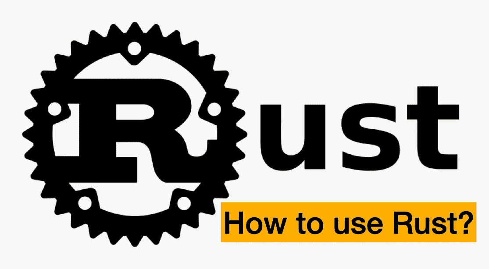
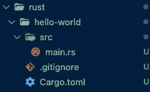

# 如何使用铁锈

> 原文：<https://blog.devgenius.io/how-to-use-rust-a5bf38397a82?source=collection_archive---------1----------------------->



# 目的

我听说 Rust 是一种非常有用的语言，可以取代 C 或 C++。我很惊讶，因为 C 或 C++是系统的，低级语言，这是独一无二的。所以我搜索信息，了解它，并与你分享。

# 什么是铁锈？

Rust 是 2006 年开发的相对较新的系统编程语言(首次发布是在 2015 年)。首先，这种语言是属于 Mozilla 的发明家 Graydon Hoare 的私人项目。然而，Mozilla 从 2009 年开始支持并改为官方版本。

# 为什么有用锈？

因为这种语言比 C 或 C++更安全，比 Java 更快。你可能知道 C 是最古老的语言之一，它发明于 1972 年，所以这种语言更注重效率而不是安全。尤其是关于指针。这个特性非常好而且有用，但是有时会导致一些问题，比如内存泄漏(由于未使用的内存而耗尽资源)。Rust 允许你访问内存，它有一个借用检查器，可以静态地分析内存的所有者和资源的生命周期。基本上，rust 将所有者和资源一一绑定来管理生命周期。由于这个特性，rust 不需要垃圾收集来释放内存。GC 也是一个非常有用的特性，但是这个特性有一个弱点，你不知道这个特性什么时候调用。相反，由于 rust 可以管理生命周期，因此它会在适当的时机丢弃未使用的资源，这意味着更安全和更快。而且 Rust 不像 Java 一样不需要解释器。换句话说，rust 更适合对付 OS 或者系统，速度更快。

正如我提到的，rust 有很多好的特性，但正因为如此，这门语言的学习曲线有点陡。如果你熟悉 C 或 C++，这对你来说不是很难。然而，如果你是一个初学者，有时你会因为很多，有时是独特的功能而感到困惑。

所以，让我们深入到例子中。

# 示例(Hello world)

1.  安装软件包(rustup)。

## Mac 或 Linux

```
% curl --proto '=https' --tlsv1.2 [https://sh.rustup.rs](https://sh.rustup.rs) -sSf | sh
```

## 窗口:

在官网下载文件，运行“rustup-init.exe”

2.在本地机器上设置路径。有几种方法，但我会告诉你我的方法(适用于 mac 用户)。这个方法是为 zsh 用户准备的，所以如果你使用 bash，你需要把 zsh 替换成 bash。

```
On your termimal% cd // Go to your home directory
% vim ~/.zshrc  
// If you don't have this file, you need to create it(touch .zshrc).You can check if this file exists "ls -a" command. Of couse you can use open or something instead of vim. Set below lines of code inside .zshrc file, and save it.export PATH="$HOME/.cargo/bin:$PATH"
export PATH="$HOME/.cargo/env:$PATH" Confirm above lines on your terminal% source ~/.zshrc
If above command doesn't work(command not found .zsh). You need to confirm separately
% source $HOME/.cargo/bin:$PATH
% source $HOME/.cargo/env:$PATH This is all you needed to set rust's path on your local(hopefully...lol)
```

3.创建项目并移动目录。您可以选择手动或使用软件包管理器默认安装的 cargo 来创建项目和文件设置。我会解释他们两个。

## 版本:手动创建项目

3–1–1 .手动创建项目并移动目录

```
% mkdir rust   // project name is up to you
% cd rust
% mkdir hello-world-manually  // project name is up to you
% cd hello-world-manually
```

3–1–2.创建“main.rs”文件并在里面写下下面的代码。fn 表示函数，而 println！意味着在控制台中显示代码(比如 javascript 中的“console.log”，python 中的“print”)

```
% touch main.rsfn main() {
    println!("Hello, world!");
}
```

3–1–3.运行下面的命令，你可以在你的控制台上看到 Hello world

```
% rustc main.rs
% ./main Hello, world! // result
```

## 版本:通过使用 cargo(包管理器)创建您的项目

3–2–1.使用 cargo 创建您的项目

```
% cargo new hello-world  // project name is up to you
```

注意，有些文件是由 cargo 自动生成的，如下图所示。这太酷了！



在 main.rs 中，您可以看到与您手动创建的代码完全相同的代码，如下所示

```
fn main() {
    println!("Hello, world!");
}
```

3–2–2.用 cargo 运行您的项目(不要忘记移动您的项目！)如果您手动执行，首先您需要将 rs 文件编译成二进制文件，然后运行它。但是在这种情况下，cargo 编译您的。rs 文件转换成二进制文件并显示出来。

```
% cd hello-world // move to your project
& cargo run
 Compiling hello-world v0.1.0 (/Users/owner/Desktop/webDevelopment/Playground/rust/hello-world)
    Finished dev [unoptimized + debuginfo] target(s) in 6.78s
     Running `target/debug/hello-world`
Hello, world!  // result
```

# 结论

正如我已经提到的，rust 是一种非常好的语言，它有很多有用的特性。而且，rust 有非常好的社区。我认为这是这种语言最强大的部分之一，因为你可以把整个信息看做一本书，也可以看视频。这种语言并不简单，所以这是一个很好的优势。如果你对 rust 感兴趣，我推荐你读一本书的文档。有很多，但在这本书里有友好的解释信息。

# 参考

官方网站:[https://www.rust-lang.org/learn](https://www.rust-lang.org/learn)

官书:【https://doc.rust-lang.org/book/】T2

学习 Rust 编程课程 replit 上的交互式 Rust 语言教程:【https://www.freecodecamp.org/news/rust-in-replit/ T5

铁锈的温和介绍:[https://stevedonovan.github.io/rust-gentle-intro/](https://stevedonovan.github.io/rust-gentle-intro/)

プログラミング言語「Rust」とは? “Hello, World!” で基本をおさえる: [https://atmarkit.itmedia.co.jp/ait/articles/2107/28/news010.html](https://atmarkit.itmedia.co.jp/ait/articles/2107/28/news010.html)

プログラミング言語 Rustのススメ: [https://qiita.com/elipmoc101/items/3c8b6d8332a9019e578c](https://qiita.com/elipmoc101/items/3c8b6d8332a9019e578c)

感谢您的阅读！！