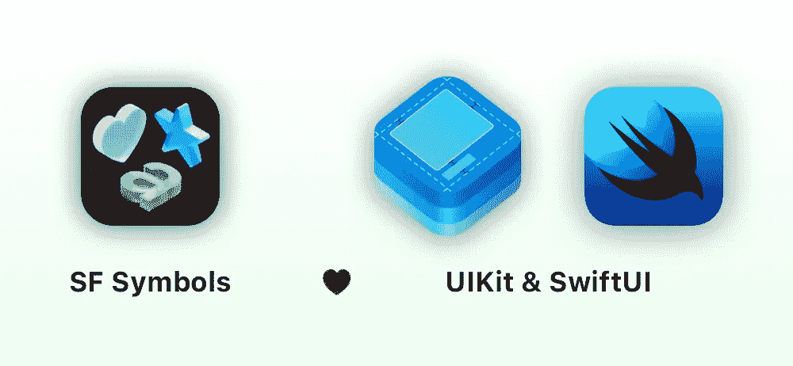
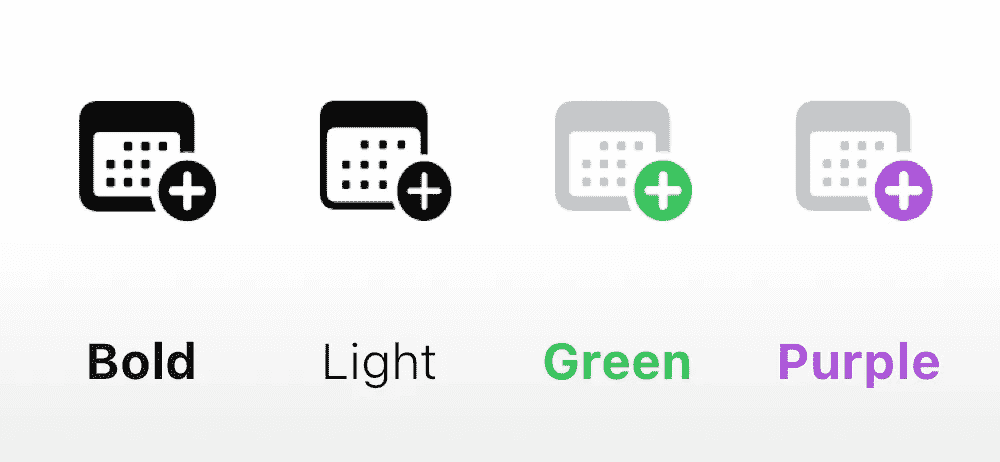
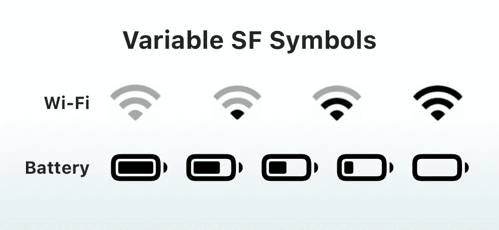

# 使用 SF 符号为您的应用程序添加出色的图标——iOS Swift 指南

> 原文：<https://blog.devgenius.io/how-to-use-sf-symbols-in-your-ios-app-ios-swift-guide-2e81ade5f69e?source=collection_archive---------9----------------------->

## SWIFT 编程

## SF Symbols 4:超过 4000 个高质量图标，旨在与您的应用程序无缝集成

带有几个说明性符号的 SF 符号应用程序图标。

# 1.什么是 SF 符号？

**SF Symbols** ，代表**旧金山符号**，是由 [**苹果**](https://developer.apple.com/sf-symbols/) 设计的一个图标库，与苹果平台的系统字体**旧金山**无缝集成。**从 **iOS 13** 开始支持 SF 符号**。

SF 符号的最后版本，SF 符号 4，包含超过 4000 个符号。它们都可以通过各种方式进行定制，以无缝集成到您的 iOS 应用程序中。

SF 符号**的众多优点之一是它们有九种粗细，因此与所有字体使用的标准字体粗细网格相匹配。你可以在 Mozilla 开发者网站上随意查看[字体粗细文档](https://developer.mozilla.org/en-US/docs/Web/CSS/font-weight)。**

**SF 符号**也可以以矢量格式导出，因此允许无限的编辑和定制。

所有 **SF 符号**的完整列表就在 [**SF 符号应用**](https://developer.apple.com/sf-symbols/) 中，可在**苹果开发者**网站上获得。我强烈建议你下载它，因为它包含了很多有用的信息，比如符号的名称。它还允许您复制粘贴符号，以防您想要将它们插入到字符串中。您还可以直接在 **SF Symbols** 应用程序中定制它们，并将其导出为矢量图标。

# 2.如何在你的应用中使用 SF 符号

SF 符号、UIKit 和 SwiftUI 徽标

**SF 符号**可与 **UIKit** 和 **SwiftUI** 一起使用。我们将在下面看到如何使用它们。

## 如何在 UIKit 中使用 SF 符号

**SF 符号**可以很容易地与您的 **UIKit** 应用程序集成，作为`**String**`或`**UIImage**`。

要将 **SF 符号**集成为`**String**`，将符号从 **SF 符号**应用程序复制粘贴到您的`**String**`中。你可以在句子中间使用它与其他繁体字混合，与其他 **SF 符号**组合，或者单独使用。此外，例如，如果您决定在`**UILabel**`中显示`**String**`，则 **SF 符号**的样式将自动匹配`**UILabel**`上定义的样式，例如字体大小、粗细和颜色。

为了将一个 **SF 符号**集成为一个`**UIImage**` **，**将符号名称从 **SF 符号** app 复制粘贴到初始化器`**UIImage(systemName: "")**`。在本文的下一部分，我们将看到如何应用额外的样式和定制。

## 如何在 SwiftUI 中使用 SF 符号

使用`**Image**`结构，SF 符号可以很容易地与您的 **SwiftUI** 应用程序集成。然后可以像往常一样使用字符串插值将 In 整合到`**Text**`中。

为了将 **SF 符号**集成为`**Image**` **，**将符号名称从 **SF 符号**应用程序复制粘贴到初始化器`**Image(systemName: "")**`。在本文的下一部分，我们将看到如何应用额外的样式和定制。

从 **iOS 15** 开始，你也可以使用`**symbolVariant**`方法来使用一个符号的变体。

如:`**Image(systemName: "multiply").symbolVariant(.circle.fill)**`

*你可以使用****Shift+Cmd+C****快捷键从* ***SF 符号*** *app 中复制名称而不是图标。*

# 3.如何自定义 SF 符号

定制重量和颜色的日历 SF 符号

从重量和尺寸到调色板， **SF 符号**具有无限的定制可能性，包括 **UIKit** 和 **SwiftUI** 。

## 应用 SymbolConfiguration 使用 UIKit 自定义 SF 符号

用 **UIKit** 定制 **SF 符号**的最佳方式是定义一个`**SymbolConfiguration**`并将其应用于呈现`**UIImageView**`。你甚至可以组合多个`**SymbolConfiguration**`。

以下是如何使用 **UIKit** 将自定义重量、大小和双色调色板应用于 **SF 符号**的示例:

## 使用 SwiftUI 应用修改器自定义 SF 符号

**SF 符号**在 **SwiftUI** 中的定制与任何视图的定制一样，通过修饰符。您可以组合多个修改器，例如应用自定义颜色和自定义权重。您将寻找的应用这些定制的两个修改器是`**.foregroundStyle()**`和`**.font()**`。

以下是如何使用 **SwiftUI** 将自定义重量、大小和双色调色板应用于 **SF 符号**的示例:

## **使用变量值的动态定制**

带有可变值定制的 Wi-Fi 和电池 SF 符号

从 **iOS 16** 开始，一些符号也支持**等电池或扬声器符号。 ***变量值*** 使您的应用程序能够动态地表示兼容的符号，以显示一段时间的进度或信号强度。要使用 ***变量值*** ，您可以在初始化时提供一个在`**0**`和`**1**`之间的值。**

****如何在 UIKit 中使用变量值:****

**`**UIImage(systemName: "wifi", variableValue: 0.4)**`。**

****swift ui 如何使用变量值:****

**`**Image(systemName: "wifi", variableValue: 0.4)**`。**

# **4.如何创建自定义 SF 符号**

**如果你想定制一个现有的 **SF 符号**来适应你的需求，或者创造一个全新的，这是完全可能的！**

**你所要做的就是将现有的 **SF 符号**导出为矢量，并在你常用的矢量设计应用中编辑它。我个人使用的是 [**素描 App**](https://www.sketch.com) ，但是你可以使用任何你喜欢的矢量设计工具。**

**在导出的矢量文件中，你会看到图标被多次显示。你必须应用于所有的变化，以确保它在你的应用程序中使用时能被正确地表示出来。系统会根据屏幕分辨率和使用的字体粗细自动选择合适的图标。例如，如果你只更新矢量文件中最粗的符号，但是在一个字体粗细较轻的标签中使用它，你就不会有图标。**

**完成修改并保存后，您可以将文件导入到 **Xcode** 的资源库中。它将被自动识别为一个 **SF 符号**，您可以使用标准的`**UIImage(named: "")**` 功能来使用它们。**

# **5.受限 SF 符号**

**在与 **SF 符号**一起提供的 4000 个图标的广泛范围内，其中一些图标被限制在特定的使用情况下，例如 FaceTime 符号、iCloud 符号以及大多数代表苹果产品或服务的符号。**

**受限符号在 **SF 符号库**中已明确声明，所以不应该有任何混淆。如果您有任何疑问，您应该随时参考 Apple 官方文档。**

# **概述**

****SF 符号**是 4000 多个高质量图标的集合，旨在与您的应用程序无缝集成。这些图标是高度可定制的，很容易集成到您的应用程序中，您甚至可以使用任何矢量设计工具编辑或创建自己的符号。**

****下面是将科幻符号整合到你的应用程序中的 5 个步骤:****

1.  ****从苹果开发者网站下载** [**SF 符号 app**](https://developer.apple.com/sf-symbols/) **。****
2.  ****将图标作为字符串或图像集成到 SwiftUI / UIKit 项目中。****
3.  **根据您的需要定制图标的大小、粗细和颜色。**
4.  ****使用矢量设计应用程序创建新的自定义符号。****
5.  ****注意 SF 符号库中的受限符号。****

# **您可能也会喜欢这些文章:**

** [## 如何使用 CAGradientLayer 在 Swift 中创建自定义渐变— iOS Swift 指南

### 为你的应用程序创建美丽渐变的 5 个步骤

medium.com](https://medium.com/swlh/how-to-create-a-custom-gradient-in-swift-with-cagradientlayer-ios-swift-guide-190941cb3db2)  [## 如何在 Swift——iOS Swift 指南中制作图像动画

### 使用 UIImage 和 UIImageView 创建动画图像的 5 个步骤

blog.devgenius.io](/how-to-animate-your-images-in-swift-ios-swift-guide-64de30ea616b)**