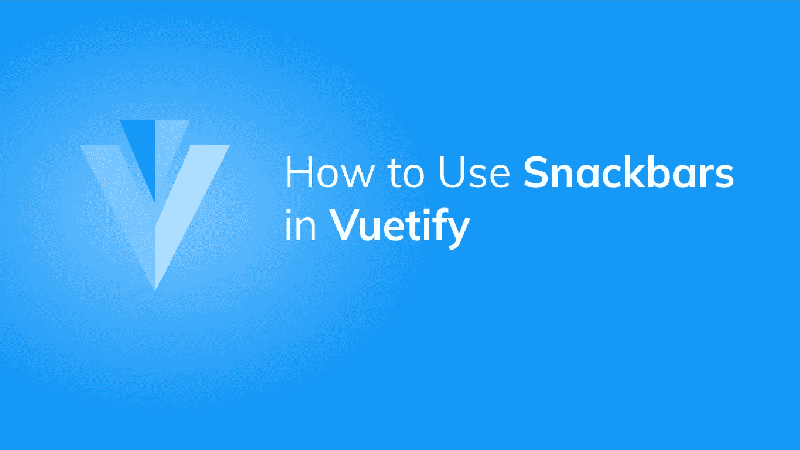
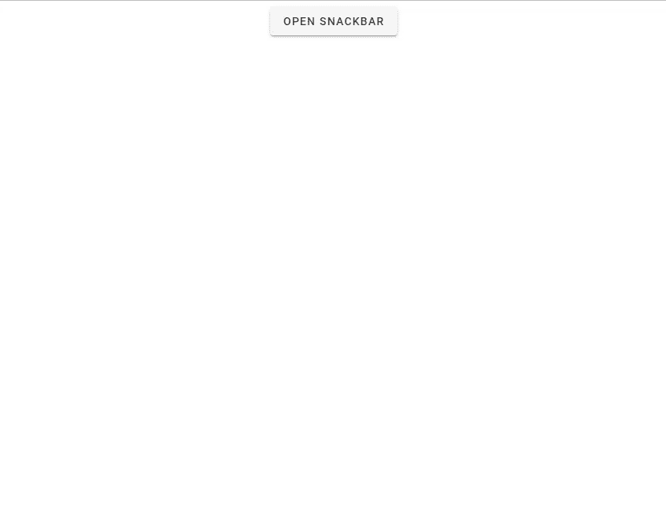
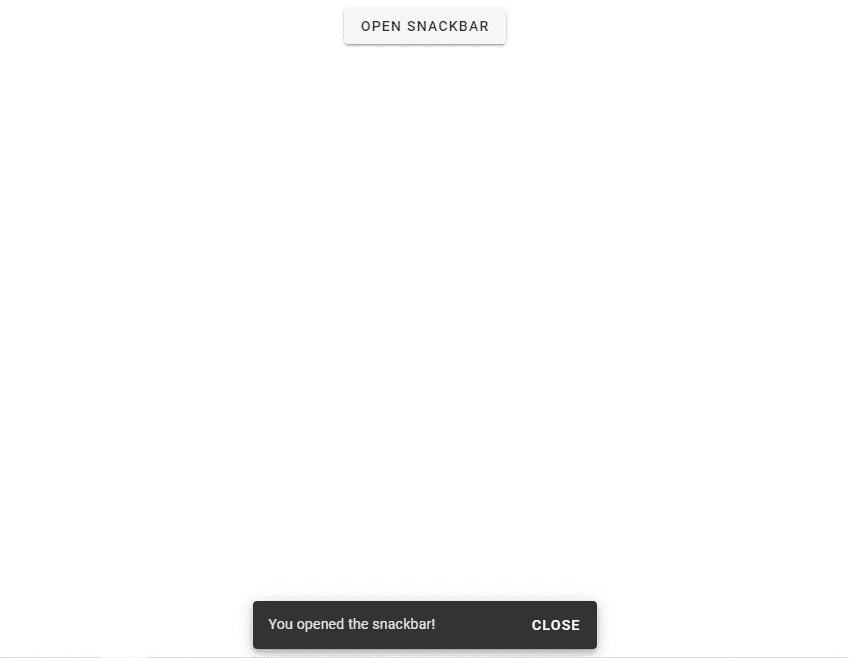
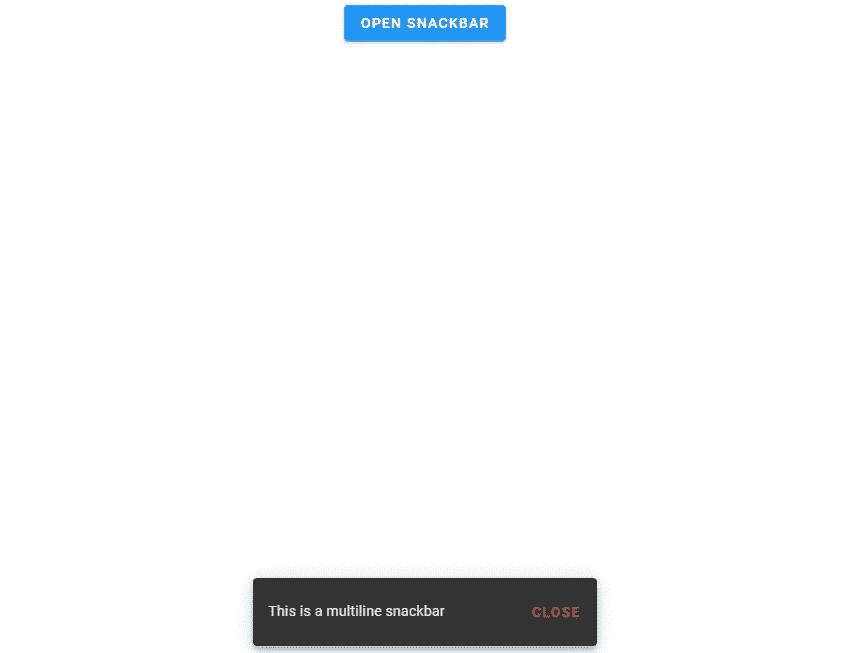

# 如何用 Vuetify 创建 Snackbars

> 原文：<https://blog.devgenius.io/how-to-use-snackbars-in-vuetify-fc9255939da3?source=collection_archive---------5----------------------->



snackbar 有助于显示快速消息。我们可以用它来通知用户应用程序中发生的某些事件(例如，从列表中删除一个项目)。它们还可能包含用户可以采取的与显示的信息相关的操作。在本文中，我们将学习如何使用 Vuetify 框架创建 snackbars。

# v-snackbar 组件

我们可以使用`v-snackbar`组件在 Vuetify 中创建 snackbars。在下面的代码中，我们在 snackbar 的`action`槽中创建了一个“关闭”[按钮](https://codingbeautydev.com/blog/vuetify-buttons/)。点击该按钮时，`snackbar`变量被设置为`false`以隐藏 snackbar。

```
<template>
  <v-app>
    <div class="text-center ma-2">
      <v-btn @click="snackbar = true"> Open Snackbar </v-btn>
      <v-snackbar v-model="snackbar">
        {{ text }} <template v-slot:action="{ attrs }">
          <v-btn text v-bind="attrs" @click="snackbar = false"> Close </v-btn>
        </template>
      </v-snackbar>
    </div>
  </v-app>
</template><script>
export default {
  name: 'App',
  data: () => ({
    snackbar: false,
    text: 'You opened the snackbar!',
  }),
};
</script>
```

`snackbar`默认为`false`，所以一开始我们只能看到打开 snackbar 的[按钮](https://codingbeautydev.com/blog/vuetify-buttons/):



点击[按钮](https://codingbeautydev.com/blog/vuetify-buttons/)将`snackbar`设置为`true`，显示 snackbar 组件:



# Vuetify 中的多线小吃店

有了`multi-line`道具，我们可以增加`v-snackbar`组件的高度，为更多内容腾出空间。

```
<template>
  <v-app>
    <div class="text-center ma-2">
      <v-btn dark color="blue" @click="snackbar = true"> Open Snackbar </v-btn> <v-snackbar v-model="snackbar" multi-line>
        {{ text }} <template v-slot:action="{ attrs }">
          <v-btn color="red" text v-bind="attrs" @click="snackbar = false">
            Close
          </v-btn>
        </template>
      </v-snackbar>
    </div>
  </v-app>
</template><script>
export default {
  name: 'App',
  data: () => ({
    snackbar: false,
    text: 'This is a multiline snackbar',
  }),
};
</script>
```



# 用美化来美化

使用 Vuetify 材料设计框架创建优雅 web 应用程序的完整指南。


在这里免费下载[](https://mailchi.mp/583226ee0d7b/beautify-with-vuetify)****！****

# **Vuetify 中的 Snackbar 超时**

**`timeout`道具允许我们自定义`snackbar`隐藏前的延迟:**

```
<template>
  <v-app>
    <div class="text-center ma-2">
      <v-btn dark color="indigo darken-2 ma-4" @click="snackbar = true">
        Open Snackbar
      </v-btn> <v-snackbar v-model="snackbar">
        {{ text }} <template v-slot:action="{ attrs }">
          <v-btn color="blue" text v-bind="attrs" @click="snackbar = false">
            Close
          </v-btn>
        </template>
      </v-snackbar>
    </div>
  </v-app>
</template><script>
export default {
  name: 'App',
  data: () => ({
    snackbar: false, text: 'This snackbar has a timeout of 3000.',
  }),
};
</script>
```

# **Vuetify Snackbar 形变体**

**我们可以使用`shaped`道具创建异形 snackbar 变体:**

```
<template>
  <v-app>
    <div class="text-center ma-2">
      <v-btn dark color="indigo darken-2 ma-4" @click="snackbar = true">
        Open Snackbar
      </v-btn> <v-snackbar v-model="snackbar" shaped>
        {{ text }} <template v-slot:action="{ attrs }">
          <v-btn color="blue" text v-bind="attrs" @click="snackbar = false">
            Close
          </v-btn>
        </template>
      </v-snackbar>
    </div>
  </v-app>
</template><script>
export default {
  name: 'App',
  data: () => ({
    snackbar: false,
    text: 'Welcome to Coding Beauty!',
  }),
};
</script>
```

****

# **Vuetify 中的圆形小吃店**

**将`rounded` 支柱设置到小吃条上的`true`将使其变圆:**

```
<template>
  <v-app>
    <div class="text-center ma-2">
      <v-btn dark color="indigo darken-2 ma-4" @click="snackbar = true">
        Open Snackbar
      </v-btn> <v-snackbar v-model="snackbar" rounded="pill">
        {{ text }} <template v-slot:action="{ attrs }">
          <v-btn color="green" text v-bind="attrs" @click="snackbar = false">
            Close
          </v-btn>
        </template>
      </v-snackbar>
    </div>
  </v-app>
</template><script>
export default {
  name: 'App',
  data: () => ({
    snackbar: false,
    text: 'Welcome to Coding Beauty!',
  }),
};
</script>
```

****

# **溃疡期小吃摊抬高**

**我们可以用`elevation`道具增加小吃摊的高度。在这里，我们将其设置为 24:**

```
<template>
  <v-app>
    <div class="text-center ma-2">
      <v-btn dark color="indigo darken-2 ma-4" @click="snackbar = true">
        Open Snackbar
      </v-btn> <v-snackbar v-model="snackbar" color="blue" elevation="24">
        {{ text }} <template v-slot:action="{ attrs }">
          <v-btn dark text v-bind="attrs" @click="snackbar = false">
            Close
          </v-btn>
        </template>
      </v-snackbar>
    </div>
  </v-app>
</template><script>
export default {
  name: 'App',
  data: () => ({
    snackbar: false,
    text: 'Welcome to Coding Beauty!',
  }),
};
</script>
```

****

# **Vuetify Snackbar 磁贴变体**

**设置 snackbar 上的`tile`道具会移除默认边界半径:**

```
<template>
  <v-app>
    <div class="text-center ma-2">
      <v-btn dark color="ma-4" @click="snackbar = true"> Open Snackbar </v-btn> <v-snackbar v-model="snackbar" color="red accent-2" tile>
        {{ text }} <template v-slot:action="{ attrs }">
          <v-btn dark text v-bind="attrs" @click="snackbar = false">
            Close
          </v-btn>
        </template>
      </v-snackbar>
    </div>
  </v-app>
</template><script>
export default {
  name: 'App',
  data: () => ({
    snackbar: false,
    text: 'Welcome to Coding Beauty!',
  }),
};
</script>
```

****

# **Vuetify Snackbar 文本变体**

**Vuetify 还提供了使用 snackbar 文本变量的`text`属性:**

```
<template>
  <v-app>
    <div class="text-center ma-2">
      <v-btn dark color="ma-4" @click="snackbar = true"> Open Snackbar </v-btn> <v-snackbar v-model="snackbar" color="indigo" text>
        {{ text }}
      </v-snackbar>
    </div>
  </v-app>
</template><script>
export default {
  name: 'App',
  data: () => ({
    snackbar: false,
    text: 'Welcome to Coding Beauty!',
  }),
};
</script>
```

****

# **Vuetify Snackbar 轮廓变体**

**我们可以使用`outlined`道具激活 Vuetify snackbar 组件上的轮廓变体:**

```
<template>
  <v-app>
    <div class="text-center ma-2">
      <v-btn dark color="ma-4" @click="snackbar = true"> Open Snackbar </v-btn> <v-snackbar v-model="snackbar" color="primary" outlined>
        {{ text }}
      </v-snackbar>
    </div>
  </v-app>
</template><script>
export default {
  name: 'App',
  data: () => ({
    snackbar: false,
    text: 'Welcome to Coding Beauty!',
  }),
};
</script>
```

****

# **摘要**

**Vuetify 提供了用于创建 snackbar 的`v-snackbar`组件，以及各种定制选项和变体。**

**[***注册***](http://eepurl.com/hRfyJL) *为我们的每周时事通讯更新更多来自我们的精彩内容。***

***获取更新后的文章在*[*codingbeautydev.com*](https://codingbeautydev.com/blog/vuetify-snackbar/)*。***