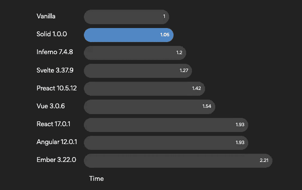
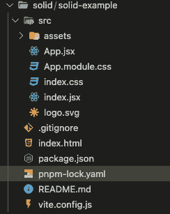
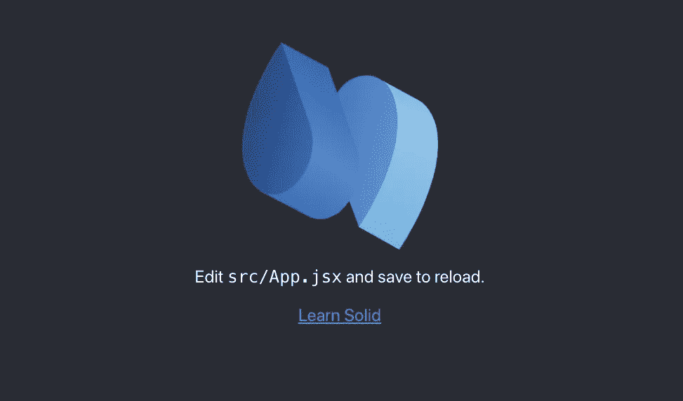
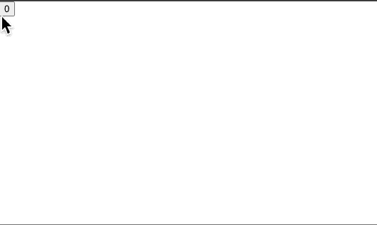

# 如何使用 Solid js

> 原文：<https://blog.devgenius.io/how-to-use-solid-js-2ee09d7ca08f?source=collection_archive---------8----------------------->


# 目的

当我知道 solid js 是像 next generations 一样有用的 js 框架之一时，我搜索了关于 solid js 的内容并与你分享。

# 什么是固体 js？

Solid js 是在 js 2021 状态下获得第一满意前端框架的 JS 框架。这个库不使用像 React，Vue，Angular 这样的流行框架使用的虚拟 DOM，这个特性类似于 Svelte。虽然我在之前的文章中提到，虚拟 dom 是为了防止部分代码改变时出现完整代码而发明的。Solid js 对这个问题的解决方案类似于 Svelte，这个框架检查频繁变化的 dom 并反映出来。因此，这个库必须具有高性能和轻量级。



上面的条形图显示了 JS 或 JS 框架之间的性能比较。当然，最快的是 vanilla js，但是 solid js 是第二快的。事实上，Solid js 的语法类似于 React，其中包括 JSX 符号，但这个库的性能几乎是 React 的两倍。这要感谢“没有虚拟 dom”。

Solid.js 的概念类似于 svelte 但是 Svelte 的语法类似于 Vue。虽然 Solid.js 的语法类似于 React，但是这个框架允许你使用自定义指令“use:”像 Vue 和 Svelte。因此，这个框架具有反应迅速、灵活、苗条的优点。

此外，这个框架使用 Vite 作为模块捆绑器，而不是 webpack。虽然 Webpack 是一个有用的模块捆绑器，但是这个捆绑器让我觉得很累或者很无聊，因为它太慢了。是的，如果你使用定制的 webpack，性能会提高，但是要花很多时间。但是，Vite 只是快，没有任何设置(因为“Vite”在法语中是“快”的意思)。当然，这个框架支持 TypeScript，因此您可以使用类型安全来编写代码。

好吧，让我们来看一个例子。

# 示例(柜台 app)。

1.  安装固体 js。安装需要的时间非常快，就像 flash 一样。

```
> npx degit solidjs/templates/js solid-example  // This name is up to you. Need to install the following packages:
  degit
Ok to proceed? (y) y
> cloned solidjs/templates#HEAD to solid-example
```

文件夹结构如下所示。您可能会注意到，这与 React structure 类似，但没有公共文件夹，有 pngm-lock.yaml 和 vite.config.js 作为设置文件。



2.移动到目录并安装 node_modules。

```
> cd solid-example
> npm i
```

如果你想运行你的应用程序，你可以输入`npm run dev`你可以看到如下默认屏幕



3.像下面一样改变你的 App.js 来使用 Counter.app。注意，导入方式和 React 是一样的。您可以进行命名导出和默认导出。

```
import { Counter } from "./Counter"; function App() {
  return <Counter />;
} export default App;
```

4.创建 Counter.js 文件并添加如下代码。它与 React 的语法相似，但有一个很大的区别是“创建信号”而不是“使用状态”。此方法的用法与 useState 非常相似，但有一个显著的区别，就是将 read count 和 setCount 作为 getter 和 setter。因此，您需要使用 as "count()"而不仅仅是" count "来使用计数值。

```
import { createSignal } from "solid-js"; export function Counter() {
  const [count, setCount] = createSignal(0);
  const increment = () => setCount(count() + 1);
 return (
    <button type="button" onClick={increment}>
      {count()}
    </button>
  );
```

5.基本的计数器应用程序已经完成了如下工作。



# Extra:固体 js 的特性

1.  创建信号

尽管 Solid js 也有上下文，但这创建了作为全局状态使用信号。

换句话说，您可以在不同的组件中使用相同的状态，而无需上下文或冗余方式。

例子如下。您可以将相同的状态与渲染器 DoubleCounter 一起使用。

```
import { Counter } from "./Counter";
import { createSignal } from "solid-js"; const [count, setCount] = createSignal(0); function Renderer() {
  return <Counter count={count} setCount={setCount} />;
} function DoubleCounter() {
  function doubleCounter() {
    setCount(count() * 2);
  }
 return <Counter count={count} setCount={doubleCounter} />;
} function App() {
  return (
    <>
      <Renderer />
      <DoubleCounter />
    </>
  );
} export default
```

正如你可能注意到的，这两个按钮是链接和不同的行为


2.创建效果

这类似于 React 中的 useEffect，但是不需要依赖数组，因为 Solid js 会自动检查。如果想“使用”状态但不想“跟踪”这个状态，可以在 createEffect 中添加“取消跟踪”回调函数。

```
const [exampleA, setExampleA] = createSignal('');
const [exampleB, setExampleB] = createSignal(''); createEffect(() => {
    console.log(exambleA());
}); createEffect(() => {
    const exampleC = exampleA();
    untrack(() => console.log(exampleC, exampleB()));
})
```

# 结论

Solid js 是一个 js 框架，与 React 有相似的语法，但是更高的性能和更有用的工具。不幸的是，这个框架还没有很多资源和社区，但是在官方文档中有很好的文档和教程。如果你对一个新的框架感兴趣，我推荐你去看看。

# 参考

官方文件:[https://www.solidjs.com/](https://www.solidjs.com/)

JS 的状态:[https://2021 . state of JS . com/en-US/libraries/front-end-frameworks](https://2021.stateofjs.com/en-US/libraries/front-end-frameworks)

替代品反应过来:【https://blog.openreplay.com/alternatives-to-react-solid-js 

ReactもSvelteも好きな私が思うSolid jsのいいところ: [https://qiita.com/tonio0720/items/c28b4d37e6ab860ea04d#:~:text=SolidJS%E3%81%A8%E3%81%AF&text=%E4%BB%AE%E6%83%B3DOM%E3%82%92%E4%BD%BF%E3%82%8F%E3%81%AA%E3%81%84,%E3%81%A7%E3%81%8D%E3%82%8B%E3%81%AE%E3%81%8C%E7%89%B9%E5%BE%B4%E3%81%A7%E3%81%99%E3%80%82](https://qiita.com/tonio0720/items/c28b4d37e6ab860ea04d#:~:text=SolidJS%E3%81%A8%E3%81%AF&text=%E4%BB%AE%E6%83%B3DOM%E3%82%92%E4%BD%BF%E3%82%8F%E3%81%AA%E3%81%84,%E3%81%A7%E3%81%8D%E3%82%8B%E3%81%AE%E3%81%8C%E7%89%B9%E5%BE%B4%E3%81%A7%E3%81%99%E3%80%82)

感谢您的阅读！！