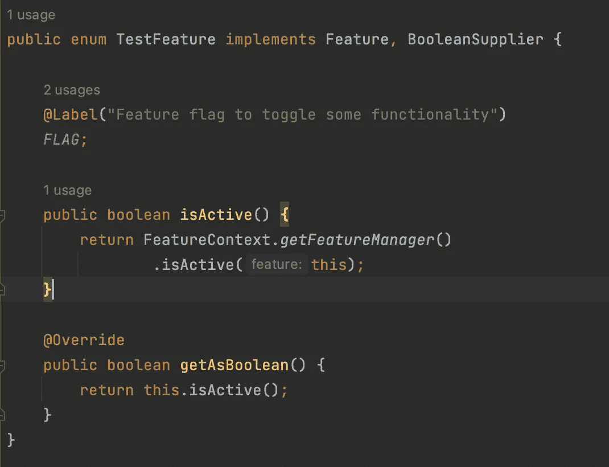
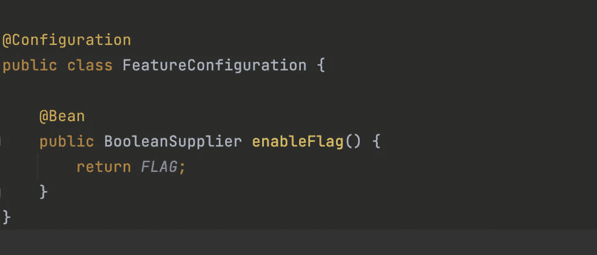
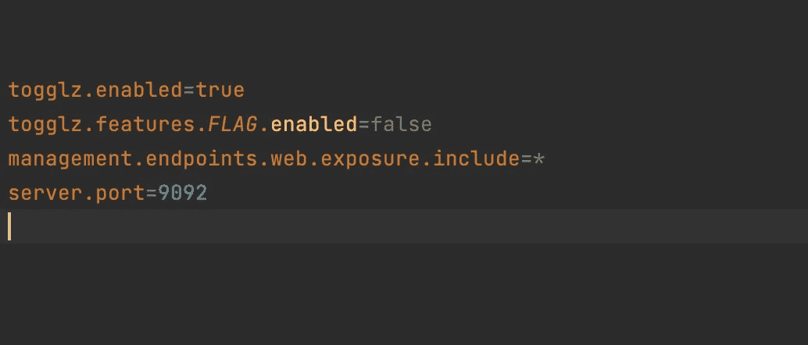
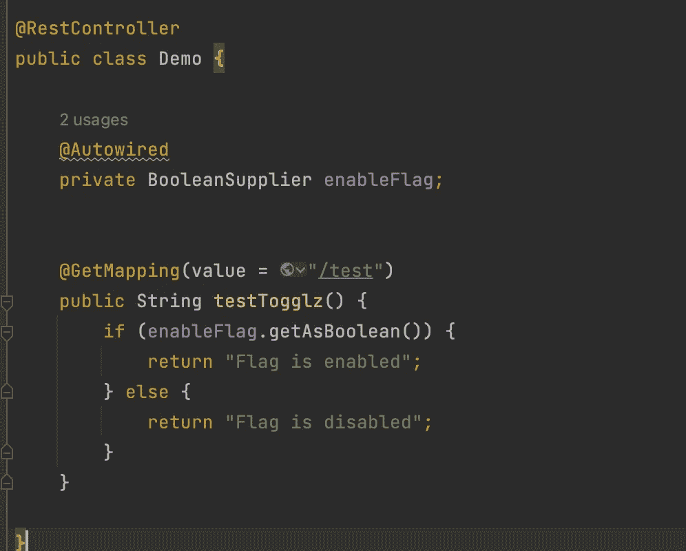
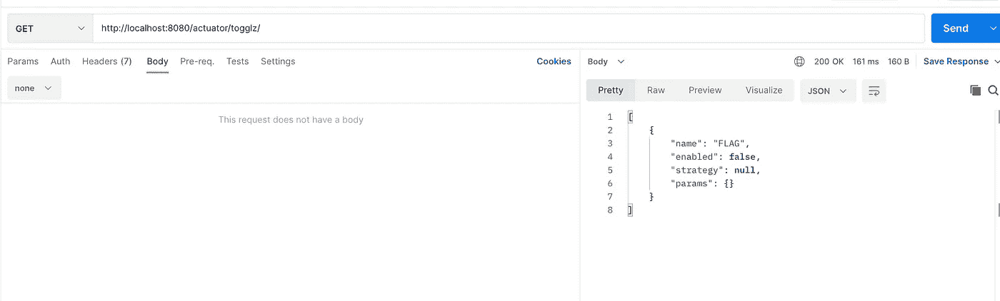
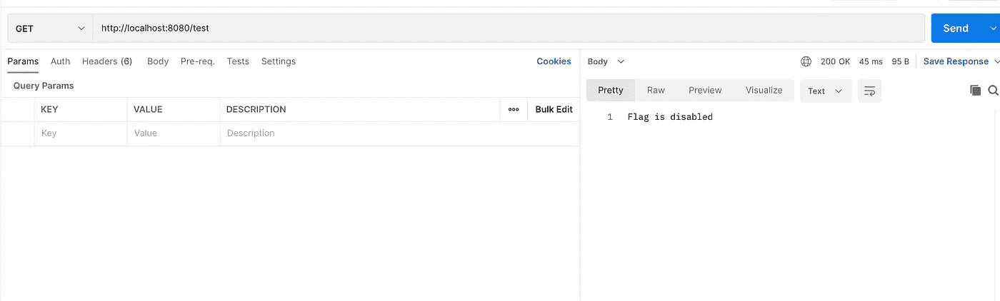
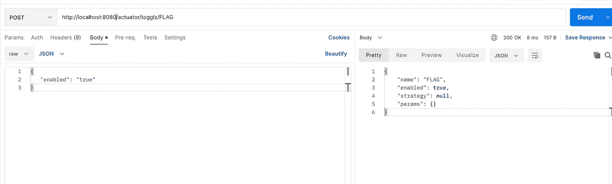
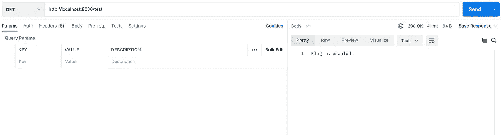

# 如何使用 spring boot togglz 库

> 原文：<https://blog.devgenius.io/how-to-use-spring-boot-togglz-library-d333286aee15?source=collection_archive---------2----------------------->


> **什么是 Togglz 库**

Togglz 是 Java 的[特性切换](http://martinfowler.com/bliki/FeatureToggle.html)模式的实现。在持续部署和交付的环境中，特性切换是一种非常常见的敏捷开发实践。基本思想是将切换与您正在处理的每个新功能相关联。这允许您在应用程序运行时启用或禁用这些功能，甚至是针对单个用户。

参考:【https://www.togglz.org/ 

> 使用弹簧靴的简单示例

1.  让我们从添加所需的库开始

```
implementation 'org.togglz:togglz-spring-boot-starter:3.0.0'
implementation 'org.springframework.boot:spring-boot-starter-actuator'
```

我们将需要执行器库来检查和修改切换值

2.创建实现功能的枚举



3.现在用 bean 创建一个配置类来获取我们的特性值



4.现在，让我们在 application.properties 文件中添加我们的配置(让我们将标志的默认值设为 false)



5.是时候在我们的实现中使用我们的特性标志了，下面是示例代码



搞定了。！！

是的，我们已经完成了我们的实现，是时候测试我们的特性了

**卷曲以检查开关**的值

```
curl --location --request GET '[http://localhost:8080/actuator/togglz/'](http://localhost:9092/actuator/togglz/') \
--header 'Content-Type: application/json'
```



注意:请记住，我们将特性的默认值设置为 false

现在让我们检查这个特性是否在我们的代码中工作



**卷曲来改变你的特征值**

```
curl --location --request POST '[http://localhost:8080/actuator/togglz/FLAG'](http://localhost:9092/actuator/togglz/FLAG') \
--header 'Content-Type: application/json' \
--data-raw '{
   "enabled": "true"
}'
```



既然我们已经更改了标志的值，让我们测试一下我们的逻辑



Yayyy！！按预期工作

在 spring boot 中实现特性 togglz 就是这么简单