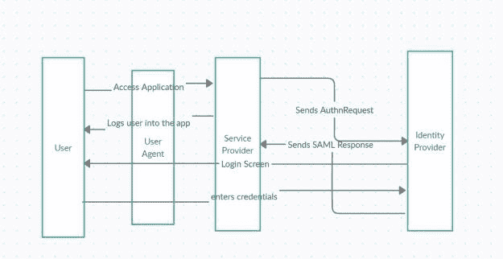
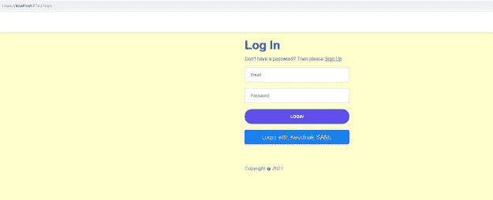
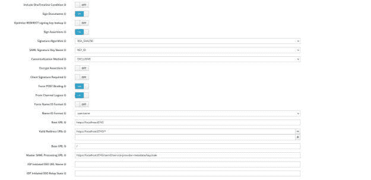

# 如何在 SAML 协议绑定中使用 Spring Security

> 原文：<https://blog.devgenius.io/how-to-use-spring-security-with-saml-protocol-binding-a4d48b847fc?source=collection_archive---------1----------------------->

在这篇文章中，我将展示如何使用 Spring Security 和 SAML 协议绑定来集成 Keycloak 身份提供者。如果你想了解如何使用 Keycloak，你可以在这里阅读。

# 什么是 SAML？

SAML 代表安全断言标记语言。它是服务提供商(SP)和身份提供商(IdP)之间交换身份验证和授权数据的开放标准。

**身份提供者** —执行认证并验证用户身份以获得授权，然后将其传递给服务提供者。

**服务提供者** —信任身份提供者，并基于授权向用户提供对服务的访问。

# SAML 认证流程

作为这个流程的一部分，我们将构建一个简单的待办事项列表应用程序。此后，用户将访问应用程序，并被重定向进行身份验证。

**SAML 认证用户流程:**

1.  用户访问服务提供商(SP)待办事项列表应用程序。
2.  应用程序将用户重定向到 Keycloak 登录屏幕。在这个重定向过程中，应用程序向 Keycloak IDP 发送一个 AuthnRequest。
3.  如果请求来自正确的依赖方/服务提供商，Keycloak IDP 会验证该请求。它检查发行者和重定向 URI (ACS URL)。
4.  Keycloak IDP 将 SAML 响应发送回服务提供商。
5.  服务提供商使用提供的 IDP 公共证书验证签名的响应。
6.  如果响应有效，我们将从断言中提取属性 NameID，并让用户登录。



**注意**—*Spring Security SAML extension 是一个用于提供 SAML 支持的库。但是在 2018 年之后，Spring 安全团队移动了那个项目，现在支持 SAML 2 认证作为核心 Spring 安全的一部分*。

# 将 Spring 安全性与 SAML 协议绑定一起使用

因此，一旦您创建了一个 Spring Boot 项目，我们将需要导入以下依赖项。

```
dependencies {
	implementation 'org.springframework.boot:spring-boot-starter-data-jpa'
	implementation 'org.springframework.boot:spring-boot-starter-jdbc'
	implementation 'org.springframework.boot:spring-boot-starter-thymeleaf'
	implementation 'org.springframework.boot:spring-boot-starter-web'
	/*
	 * Spring Security
	 */
	implementation 'org.springframework.boot:spring-boot-starter-security'
	runtimeOnly 'mysql:mysql-connector-java'
	providedRuntime 'org.springframework.boot:spring-boot-starter-tomcat'
	implementation 'org.springframework.security:spring-security-saml2-service-provider:5.3.5' +
			'.RELEASE'

	/*
	 * Keycloak
	 */
	implementation 'org.keycloak:keycloak-spring-boot-starter:11.0.3'
	testImplementation('org.springframework.boot:spring-boot-starter-test') {
		exclude group: 'org.junit.vintage', module: 'junit-vintage-engine'
	}
}
```

相应地，依赖关系`spring-security-saml2-service-provider`将允许我们添加依赖方注册。它还有助于身份提供商注册。

现在，我们将在我们的`SecurityConfig`中添加该注册，如下所示:

```
 @Bean
    public RelyingPartyRegistrationRepository relyingPartyRegistrationRepository() throws CertificateException
    {
        final String idpEntityId = "http://localhost:8180/auth/realms/ToDoListSAMLApp";
        final String webSSOEndpoint = "http://localhost:8180/auth/realms/ToDoListSAMLApp/protocol/saml";
        final String registrationId = "keycloak";
        final String localEntityIdTemplate = "{baseUrl}/saml2/service-provider-metadata" +
                "/{registrationId}";
        final String acsUrlTemplate = "{baseUrl}/login/saml2/sso/{registrationId}";

        Saml2X509Credential idpVerificationCertificate;
        try (InputStream pub = new ClassPathResource("credentials/idp.cer").getInputStream())
        {
            X509Certificate c = (X509Certificate) CertificateFactory.getInstance("X.509").generateCertificate(pub);
            idpVerificationCertificate = new Saml2X509Credential(c, VERIFICATION);
        }
        catch (Exception e)
        {
            throw new RuntimeException(e);
        }

        RelyingPartyRegistration relyingPartyRegistration = RelyingPartyRegistration
                .withRegistrationId(registrationId)
                .providerDetails(config -> config.entityId(idpEntityId))
                .providerDetails(config -> config.webSsoUrl(webSSOEndpoint))
                .providerDetails(config -> config.signAuthNRequest(false))
                .credentials(c -> c.add(idpVerificationCertificate))
                .assertionConsumerServiceUrlTemplate(acsUrlTemplate)
                .build();

        return new InMemoryRelyingPartyRegistrationRepository(relyingPartyRegistration);
    }
```

我们的登录也会随着 `HttpSecurity`发生如下变化:

```
httpSecurity.authorizeRequests()
.antMatchers("/js/**","/css/**","/img/**").permitAll()
.antMatchers("/signup","/forgotpassword").permitAll()
.antMatchers("/saml/**").permitAll()
.anyRequest().authenticated()
.and()
.formLogin()
.loginPage("/login").permitAll()
.and()
.saml2Login(Customizer.withDefaults()).exceptionHandling(exception ->
exception.authenticationEntryPoint(entryPoint()))
.logout()
.logoutUrl("/logout")
.logoutSuccessHandler(logoutSuccessHandler)
.deleteCookies("JSESSIONID")
.permitAll();
```

我们现在用的是 `saml2Login` 。默认情况下，如果您访问该应用程序，它将重定向到身份提供商。我们希望在自定义登录页面被重定向到身份提供者 keycloak 之前对其进行配置。这就是为什么我们有`authenticationEntryPoint`允许我们配置自定义登录页面。因此，现在如果我们在`https://localhost:8743/login`访问我们的应用程序，我们将看到下面的登录页面:



所以一旦你选择了`Login with Keycloak SAML`的选项，它就会发送一个`AuthnRequest`到 Keycloak。此外，该请求是一个未签名的请求。Keycloak 将发送一个签名的响应。控制器将接收该签名的响应以解码`NameId`属性。

```
@GetMapping(value="/index")
public String getHomePage(Model model, @AuthenticationPrincipal Saml2AuthenticatedPrincipal saml2AuthenticatedPrincipal)
{
   String principal = saml2AuthenticatedPrincipal.getName();
   model.addAttribute("username", principal);
   return "index";
}
```

一旦检索到`NameId`，它将让用户登录。

# 键盘锁上的配置

我们必须在 Keycloak 管理控制台中配置我们的应用程序。

*   为您的应用程序创建一个领域。
*   选择端点— SAML 2.0 IdP 元数据
*   在客户端—添加服务提供商。
*   对于您的客户端，配置根 URL、SAML 处理 URL(https://localhost:8743/SAML 2/service-provider-metadata/key cloak)
*   您还可以调整其他设置，如签名断言，包括 AuthnStatement。
*   当然，在“细粒度 SAML 端点配置”一节中配置 ACS URL。



# 代码库

这个项目的代码可以在我的 [github 库](https://github.com/yogsma/betterjavacode/tree/main/todolistkeycloaksaml)中找到。我还在我的书《简化 Spring 安全》中详细介绍了这一点。想了解更多，可以在这里买我的书[。](https://yogsma.gumroad.com/l/VgSdH)

# 结论

在这篇文章中，我展示了如何在 SAML 协议中使用 Spring Security。这些年来，Spring 安全性有了很多改进，现在它可以很容易地用于不同的协议，比如 OAuth，OIDC。如果你喜欢这篇文章，请在这里订阅我的博客。

*原载于 2021 年 7 月 27 日 https://betterjavacode.com*[](https://betterjavacode.com/programming/how-to-use-spring-security-with-saml-protocol-binding)**。**