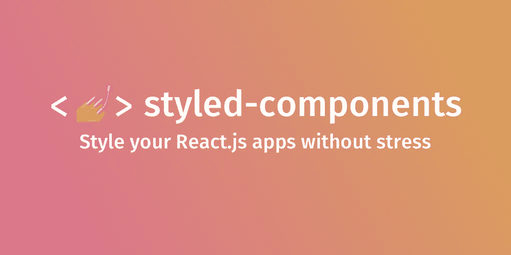
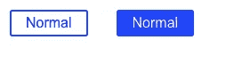

# 如何在 react 中使用样式化组件

> 原文：<https://blog.devgenius.io/how-to-use-styled-component-in-react-a276e2d421f8?source=collection_archive---------2----------------------->



图片来自[https://styled-components.com/](https://styled-components.com/)

**目的**

虽然我学习并使用了 react 的一些样式方法，如 tailwind css，css 模块，Scss，但我并不完全了解 JS 中的 CSS。所以我学会了它并分享我的知识。

**JS 中的 CSS 是什么？**

基本上，JS 中的 CSS 是网站的样式化方法之一。当我们在 JS 中使用 CSS 时，需要编写 JS 代码而不是 CSS。

很奇怪吗？但是，与 CSS 相比，它有一些优势。稍后我会解释。

**什么是风格化组件？？**

Styled-components 是 JS 方法中最流行的 CSS 之一，它不是一个新的方法，所以有很多用户，使用稳定，并且这种方法甚至现在还在改进，所以我选择了它。但基本上，这个领域有这么多的替代方案(比如情感)，所以你可以选择任何你想要的，因为这些库有不同的功能，它们有利弊。

什么是利弊风格的组件(一般包括 JS 中的 CSS)。

**优点**

不需要分开每一页(如 vue.js SFC)

虽然这一点有争议，但我们可以将 HTML、CSS、JS 文件全部集成在一个页面中。

如果你觉得每次都要修改 React 页面和 CSS 很烦人，这是一个非常好的功能。然而，如果造型部分太长，可能会很乱。所以我们也可以创建一个单独的页面来进行样式设计(我将用一个例子来说明这一点)。

避免 css 类名冲突。

正如你可能知道的，如果一个纯 css 名称与其他名称相同，它就会被冲突和覆盖，或者不能正常工作。如果自己发展，问题不大。团队合作怎么样？避免冲突是非常困难的，因为我们直到检查它时才知道其他人的类名。尤其是大项目。如果 CSS 不能正常工作，我们需要花很多时间来检查和发现命名冲突。一些团队有严格的命名约定或规则，但是我们仍然应该注意 css 名称。另一方面，JS 中的 css 不是纯粹的 CSS，避免类命名冲突要容易得多。

可以被传道具。

通常，我们需要为纯 css 中的每个元素设置 css 类名，这很难进行条件渲染。然而，由于我们可以传递 props 并在 styled-component 中使用它，我们可以更加动态地设置 css。

**缺点**

渲染稍微慢一点。

一般来说，styled-components 是一个元素，所以它比纯 css 花费的时间多一点。JS 库中的一些新 CSS 可以解决这个问题，但这是 JS 中 CSS 的基本缺点。

可能很难(尤其是对初学者)。

样式组件是非常强大和灵活的工具，所以我们可以做我们想做的事情。

例如，为整个文件创建自定义主题(如材质 ui)，使用 with ref 等..

灵活性是很好的方面，但也不是很简单。因此，它需要更多的时间来学习和正确使用，这对初学者或不喜欢逻辑的人来说可能很难。

可能难以与其他部件区分。

这尤其是样式化组件的缺点(JS 中的一些 CSS 可以避免它)。详细的，我将在后面解释，但是一般的组件和样式化的组件都使用 PascalCase。因此，有时很难区分哪些组件是样式化的组件，反之亦然。

好了，让我们深入举例。完成安装步骤后，我将挑选一些例子。

安装步骤

1.  创建一个 react 项目并移动该文件夹。

```
npx create-react-app explore-styled-components(this is your app name).cd explore-styled-components(move your folder).
```

2.安装样式组件来使用它。

```
npm install styled-components
```

3.添加解决方案(这是可选的，但官方指南建议这样做，以避免安装多个版本时出现冲突的整个问题类别)。

```
In "package.json"{
  "resolutions": {
    "styled-components": "^5" // This is your styled-components version
  }
}
```

4.完成设置，你可以在任何地方使用样式组件。

**例题**

示例 1(基本用法)

上面的例子是一个基本的有用的例子。

首先，我们应该从“样式组件”中导入“样式”功能。

其实“styled”这个名字只是一个约定，所以你可以用任何名字(比如你可以用 import s from“styled-components”)。非常好用)。如果你想改变这个名字，你需要改变使用它。然而，我建议你使用“styled ”,因为这对其他人来说更容易(如果每个人使用不同的名字，很难记住！)

如果你想使用这个“风格化”的功能，你可以使用

```
const “name” = styled.”element” `// Some css property`
```

如上。注意，您需要为每个样式化的组件设置元素。你需要用反勾号代替单引号或双引号。由于这个反勾号，我们可以在这个组件中使用普通样式的 css。基本上，Js 的样式是驼峰式的(例如，fontSize: 1.5rem)，这对初学者来说很奇怪，这也是令人困惑的一点。

如果你创建了风格化组件，你可以用 PascalCase 标签来作为普通组件。

这是我的屏幕，它的变化正如我所料。


示例 2(传球道具)

我说过，我们可以像上面那样传递道具。我为第二个按钮设置了“基础”道具，并将这个道具传递给样式化组件。可以传递回调函数样式等道具。

这是一个非常好的特性，因为如果你导出这个“样式按钮”，你可以在任何地方使用这个“普通”和“基于”的按钮。这将节省您的时间并防止重复代码。

这是我的屏幕，它按我预期的那样工作。



好了，你已经学会了基本的。因此，让我们将这些功能实现到一个应用程序中。

3.示例(尝试创建带有样式组件的应用程序)

我创建了一个具有样式组件功能的基本计数器应用程序。我为按钮创建了 2 个样式组件，1 个样式计数器，1 个按钮容器，1 个段落。我们不需要在标签中写很多代码，只需要事件监听器和道具。

这是我的屏幕，它像预期的那样工作。


请注意，这是一种更大的应用程序的想法，我建议将样式组件移动到一个不同的文件中，或者至少将样式部分移动到“导出默认值”下。

因为对于更大的 app 来说，有大量的组件和样式化的组件。所以很难跟踪实际的组件或样式组件。

下面的文件是改变造型部分低于“导出默认”。起初看起来很奇怪，但这也是在 vue.js 应用程序中编写的推荐方式，因为如果样式部分较长，很难跟踪逻辑和查看部分。

下面的文件是准备分开的 2 个文件的版本，并为每个文件放置逻辑和视图部分、样式部分。我个人喜欢这种方法，因为我们可以在看到导入部分时检查哪个组件指示了样式(因为我创建了“样式文件夹和样式文件，很容易与其他组件区分开来”)。

此外，我们可以不用搜索就导入这些样式组件，因为我们总是将样式组件放在这个样式文件夹和文件中。

**结论**

JS 中的 CSS 是对 react 组件进行样式化的最流行的方式之一，这可能是有用的。特别是，风格组件有很大的知名度和声誉。正如我提到的，这种灵活性是一个非常好的特性，所以我想用这种方法来保存代码，并且便于代码维护。

**参考**

Styled-components 官方指南:【https://styled-components.com/ 

如何在 React 中使用 styled-components:[https://www . smashingmagazine . com/2020/07/styled-components-React/](https://www.smashingmagazine.com/2020/07/styled-components-react/)

styled-components vs . Emotion for handling CSS:[https://blog . log rocket . com/styled-components-vs-Emotion-for-handling-CSS/](https://blog.logrocket.com/styled-components-vs-emotion-for-handling-css/)

styled-componentsのベーシックな使い方: [https://www.fundely.co.jp/blog/tech/2020/09/16/180026/](https://www.fundely.co.jp/blog/tech/2020/09/16/180026/)

styled-componentsでのファイル管理方法を改善する: [https://www.mk-engineer.com/posts/styled-components-element-file](https://www.mk-engineer.com/posts/styled-components-element-file)

感谢您的阅读！！