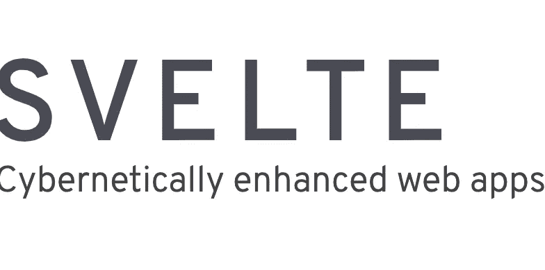

# 如何使用苗条

> 原文：<https://blog.devgenius.io/how-to-use-svelte-cc63f441018?source=collection_archive---------2----------------------->



图片来自[https://github.com/sveltejs/svelte](https://github.com/sveltejs/svelte)

# 目的

因为我想学习一项新技术，所以我现在专注于苗条身材。我将分享我的知识与比较反应。

# 什么是苗条？

```
Svelte is a new way to build web applications. It's a compiler that takes your declarative components and converts them into efficient JavaScript that surgically updates the DOM.
```

以上是关于苗条的官方解释。这是 Svelte 的独特之处，因为 React 是一个 JavaScript 库。虽然 Vue 和 Angular 是 JavaScript 的框架，但它类似于库。

然而，Svelte 是一个编译器，它采用了不同于 React 或任何其他框架的方法来解决普通 JavaScript 中的一个大问题。基本上，JS 框架包含 Angular，React，Vue 都是为了解决一个关于 DOM 的大问题而发明的。虽然与普通 JS 相比，jQuery 是编写一些 JavaScript 代码的非常好的库，但 DOM 更改并不理想，这意味着如果 DOM 中的一些节点文本、每个 DOM 元素都要重新呈现，即使这种更改与任何其他点都无关。这对于小 app 来说不算很差，但是大 app 呢？如果每次都要重新渲染 100k 的代码，哪怕只是一行代码发生了变化，也很容易想象浪费计算机资源和糟糕的性能。

React 或任何其他框架采用一种称为“虚拟 DOM”的方法来解决上述问题，即创建另一个类似的 DOM，并检测虚拟 DOM 和更改前的 DOM 的差异(协调)，只有这种差异反映到“真实”DOM。由于采用了这种方法，我们可以将影响限制在已更改的代码上。

然而，Svelte 没有这个虚拟 DOM 特性，这是避免重新渲染问题的方法。那么，Svelte 如何解决这个问题呢？这个回答是上面摘录的 Svelte 官方解释，就是 Svelte 是一个编译器。Svelte 在编译和检查过程中检测出所有可能发生变化的地方，并反映出“真实的 DOM”。换句话说，Svelte 有一个类似于虚拟 DOM 的角色。此外，svelte 没有一个大的编译文件，因为 Svelte 可以创建 JS 和 CSS 文件，而无需任何库代码，只需在编译期间删除这些代码。

这就是为什么 Svelte 用高速度和高性能解决了 JS 中的重新渲染问题，而且与 Vue，React 相比代码更少。

相反，苗条并不是解决整个 JS 问题的灵丹妙药。由于 Svelte 没有 Redux(React)、Vuex(Vue)这样庞大的生态系统，一般来说这个编译器对于大型项目和应用来说不够匹配。

# 示例(计数器应用程序)

1.  创造你的环境

```
npx degit sveltejs/template YOUR-APP-NAME
cd YOUR-APP-NAME
npm install(in this phase there is no node-module it's slightly different from CRA)
npm run dev
```

2.检查生成的代码(这是可选的)。你注意到 Svelte 使用捆绑包工具的 rollup 而不是 webpack。还有一个类型检查文件，所以我们也可以使用 typescript。厉害！！在 main.js 中，有一个 App 的实例化部分，所以这类似于 Vue2。

3.创建计数器文件夹和 Counter.svelte 文件。你可能注意到了，扩展。svelte 表示 svelte 文件，您可以使用它。这是非常基础的计数器 app，所以需要像下面这样写。需要的话需要写和。它非常类似于 Vue3 脚本设置语法(如果你熟悉 Vue)，但你不需要为 HTML 编写<template></template>标签，不需要设置和导入引用，甚至在样式中，这是自动“限定范围”的，这意味着这种样式只在这个 Counter.svelte 中有效。所以如果你在 App.svelte 中编写任何其他按钮，这种样式(在我的例子中，蓝色按钮文本对 App.svelte 按钮没有影响)。

这是对反应用户的警告，我们不能使用“onClick”，我们应该使用“on:click”。

4.将您的 Counter.svelte 文件导入 App.svelte，然后使用它。您可能会注意到，您不需要在 Counter.svelte 中默认导出，因为这是自动导出的(比如 vue 脚本设置语法)。

5.完成了。屏幕在下面。这是完美的工作。


# 结论

正如我提到的，Svelte 是轻量级的，非常有用的编译器。即使您创建了基本的计数器应用程序，与 Vue 和 React 相比，您也可以省略不必要的代码，因此您可以编写更简单的代码。在这种情况下，我只是创建了一个简单的计数器应用程序，但在官方文档中有许多好的教程，包括如何使用异步。我会把参考资料放进去，这样你可以检查一下。

# 参考

官方文件:[https://svelte.dev/](https://svelte.dev/)

官方教程:[https://svelte.dev/tutorial/basics](https://svelte.dev/tutorial/basics)

苗条身材实用介绍:[https://blog . open replay . com/a-Practical-Introduction-to-svelete](https://blog.openreplay.com/a-practical-introduction-to-svelte)

Vue 官方文档(脚本设置):[https://vuejs.org/api/sfc-script-setup.html](https://vuejs.org/api/sfc-script-setup.html)

Svelteとは何か? ReactやVueJSとの違いは?: [https://it-kyujin.jp/article/detail/1631/](https://it-kyujin.jp/article/detail/1631/)

感谢您的阅读！！