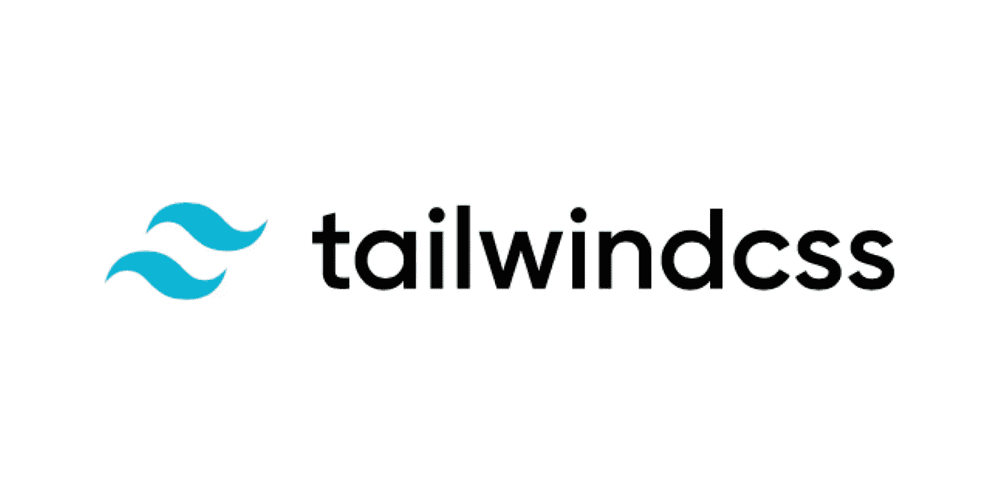
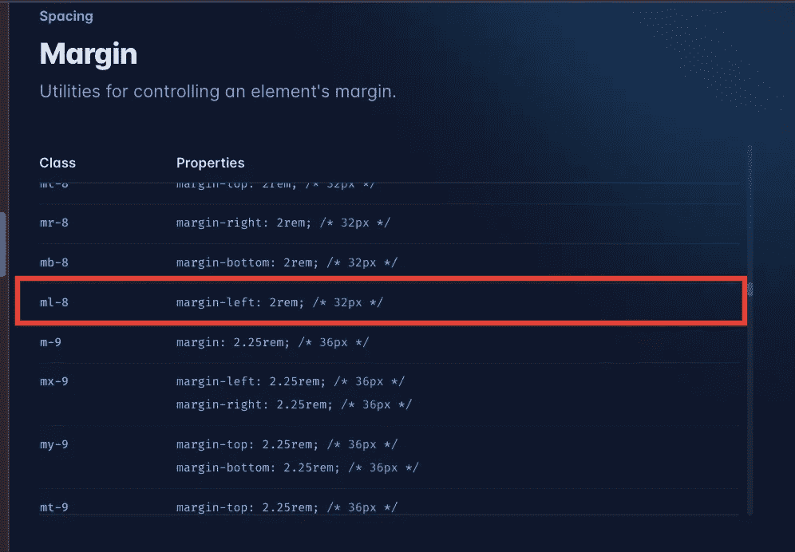

# 如何将 TailwindCSS 与 react 一起使用

> 原文：<https://blog.devgenius.io/how-to-use-tailwindcss-with-react-91ac74d74285?source=collection_archive---------6----------------------->



图片来自[https://laravel-news.com/tailwind-css-v3-alpha](https://laravel-news.com/tailwind-css-v3-alpha)

*我添加了“示例”部分，因为它似乎对其他人有帮助，并且旨在提高我的文章质量。

**目的**

由于我想使用 TailwindCSS，我试着介绍了我的应用程序，我发现它非常有用，所以我要与你分享。

**什么是顺风 CSS？**

```
**Rapidly build modern websites without ever leaving your HTML.**
```

1.  使用 css 更加直观

正如官方网站所说，“不用离开你的 HTML 就能快速建立现代网站，这是完全正确的，因为我们可以使用 tailwind 类型的“内联 css 更少的代码”。

例如，如果您想通过使用 tailwind 使用“显示:flex flex-方向:列对齐-项目:居中”，如下所示“flex flex-列项目-居中”。所以你不需要每次都改变 HTML 和 CSS 文件，并且可以减少我们的代码。

2.使用起来并不复杂。

如果你想使用 webpack，你应该在使用它之前安装大量的依赖项并编写大量的代码。然而，就顺风 CSS 而言，这是不必要的

3.没有模板。

虽然这是取决于具体情况的优势，但 Tailwind CSS 没有按钮之类的模板。你不需要因为 CSS 框架而担心你的网站或者按钮和别人相似。

所以，顺风是银弹？不是这样的，这真的取决于情况和开发商。

1.  学习成本

你不能使用普通的 css，换句话说，如果你不熟悉 CSS，你不应该使用这个框架，因为你应该学习很多东西来使用它。例如，如果你知道如何设计一个网站，你可以很容易地找到正确的信息，因为你可以在 tailwind 的文档中搜索。

2.可能是重复的代码

一般来说，你应该避免内联 css，因为它可能是重复的代码。这也是顺风 CSS 的缺点。尽管 Tailwind CSS 允许我们使用 tailwind.config.js 创建自定义变量或功能，但这可能会破坏 Tailwind 的优势。

3.一些(高级)功能没有准备好

例如，如果你想控制你的不透明度像 rgb(255，255，255，0.7)，这不是正常的工作方式。您应该使用自定义设置或使用[]的不同编写方法(例如，当您想要使用 z-index: 2 时，您只需编写 z-[2])。)

然而，定制 tailwind.config.js 并不困难。你只需添加如下“扩展”功能。在我的情况下，我想添加“玫瑰-rgba”功能，以附加不透明功能只有背景色，而不是文本。

```
module.exports = {
  content: ["./src/**/*.{js,jsx,ts,tsx}"],
  theme: {
    extend: {
      colors: {
        "rose-rgba": "rgba(136, 19, 55, 0.4)",
      },
    },
  },
  plugins: [],
};
```

那么，如何才能使用 Tailwind CSS 呢？我会一步一步给你看。

**安装步骤**

1.在 devDependency 中安装 Tailwind CSS。

```
npm install -D tailwindcss
```

2.初始化顺风 CSS。

```
npm init tailwindcss
```

3.在你的“tailwind.config.js”文件
中为你的所有模板文件添加 pass，例如我想使用[js，jsx，ts，tsx]。所以我写了如下。

```
module.exports = {
  content: [“./src/**/*.{js,jsx,ts,tsx}"], // this line is important to use tailwind CSS.
  theme: {
    extend: {
    },
  },
  plugins: [],
};
```

4.将顺风指令添加到 CSS 中。我建议你添加你的基本 css 文件。在我的例子中，我添加了“index.css”文件，因为我在这个例子中使用了“create-react-app”。

```
[@tailwind](http://twitter.com/tailwind) base;
[@tailwind](http://twitter.com/tailwind) components;
[@tailwind](http://twitter.com/tailwind) utilities;
```

5.搞定了。你可以在应用程序的任何地方使用 Tailwind CSS。

你能理解基本的顺风 CSS 功能吗？所以，我将分享我们如何在一个真实的应用程序中使用 Tailwind CSS。

**例子**


像上面一样，我可以用更少的代码添加一些样式，如“display: flex”，“justify-content: center”和“margin-left: 2rem(32px)”。太棒了。

但是，请小心，因为如何编写 css 特性略有不同。可以查官方文档去搜！

下图是文档的一部分，ml-8 表示“左边距:2rem(32px)”，因为类号表示 4px (8*4 = 32px)。老实说，这并不直观，但如果你熟悉这个系统，它会舒服得多！



正如我提到的，如果你想使用自定义 css 属性，你需要如下设置 tailwind config。怎么用？

```
tailwind.config.jsmodule.exports = {
  content: ["./src/**/*.{js,jsx,ts,tsx}"],
  theme: {
    extend: {
      colors: {
        "rose-rgba": "rgba(136, 19, 55, 0.4)",
      },
    },
  },
  plugins: [],
};
```

嗯，这很简单。在我的例子中，我想用这种颜色作为背景，所以我用了如下。

```
<div *className*="bg-rose-rgba">
//some code</div>
```

如果你不想做任何额外的设置，你可以使用下面的 do like。

```
<div className="top-[117px]">   
//some code</div>
```

但是如果你能使用它，它取决于财产。例如，如果你试图使用

className ="bg-[rgba(136，19，55，0.4)]"，工作不正常。

```
<div className="bg-[rgba(136, 19, 55, 0.4)]">   
//not working</div>
```

**通知**

正如我所写的，使用它并不困难。然而，我对顺风 CSS 中的某些部分感到恼火。

Tailwind CSS 最讨厌的部分是我们应该搜索每个 CSS 来介绍它。

如果你只是添加一些类似“displey: flex”的特性，那很好。但是如果你想使用一些复杂得多的 CSS 功能，搜索起来很麻烦。例如，如果你想引入一个功能，当你在鼠标悬停时会出现一些单词。

超文本标记语言

```
<div class="sample6">
 
 <div class="mask">
  <div class="caption">It's fresh !</div>
 </div>
</div>
```

半铸钢ˌ钢性铸铁(Cast Semi-Steel)

```
.sample6(div) {
 width:   280px;
 height:   188px;
 overflow:  hidden;
 margin:   10px 8px 10px 16px;
 position:  relative;
}
.sample6 .caption(word) {
 font-size:  130%;
 color:   #fff;
 padding-top:  80px;
 padding-left:  100px;
}
.sample6 .mask(for mask) {
 width:   100%;
 height:   100%;
 position:  absolute;
 top:   -100%; 
 left:   0;
 background-color: rgba(0,0,0,0.4);
 -webkit-transition: all 0.6s ease;
 transition:  all 0.6s ease;
}
.sample6:hover .mask(for hover) {
 top:   0; 
}
```

你应该有几个 CSS 来添加这些功能。如果你使用 CSS，我们不关心这个问题，因为你可以使用某种模板，但当你想使用 Tailwind CSS 时，你不能使用它，因为没有这样的模板，你不能使用 tailwind basic 进行详细设置，所以你应该使用自定义设置来使用上述功能。

**结论**

首先，我对 Tailwind CSS 印象深刻，因为我可以更直观地创建我的应用程序，所以我喜欢这个 CSS 框架的功能。然而，我觉得这不是银弹，因为如果我想引入先进的 CSS，这是很难引入我的应用程序。这就是为什么，正如我所说，这完全取决于具体情况。在我看来，如果你想创建一个更加可定制的应用，你不需要有顺风功能，因为我猜顺风 css 牺牲了灵活性而不是效率。这是我的观点，所以对于这个 CSS 框架有一些不同的观点。至少我觉得用起来很舒服，而且我想继续使用这个功能。

**参考**

官方网站:[https://tailwindcss.com/](https://tailwindcss.com/)

github 回购:【https://github.com/aujourdui/burger-delivery 

感谢您的阅读！！