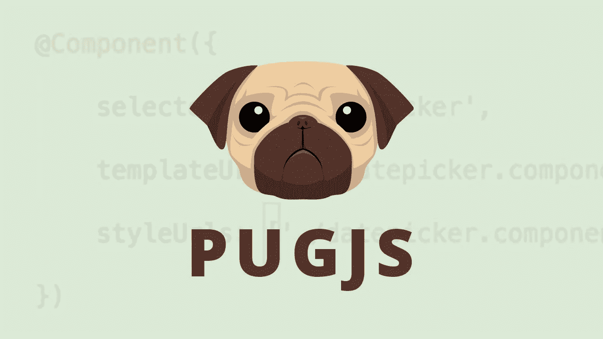

# 如何在你的 Express.js App 中使用模板？

> 原文：<https://blog.devgenius.io/how-to-use-templates-in-your-express-js-app-3ff9f4607423?source=collection_archive---------3----------------------->

你有没有想过“如果我构建了一个巨大的 web 应用程序，现在我需要为每个用户创建一个个人资料页面，那会怎么样😨“或者你需要在你的网络应用程序上查看每条新闻的页面？

还有很多其他的场景，你想想办法简单地为不同的内容呈现相同的页面**，在这篇文章中我有这个问题的答案😅**



**让我们简单谈谈模板引擎**

所以什么🦆模板到底是不是工程？它解决了我什么问题？所以根据 [express.js 文档](https://expressjs.com/en/guide/using-template-engines.html)

> 一个*模板引擎*使你能够在你的应用中使用静态模板文件。在运行时，模板引擎用实际值替换模板文件中的变量，并将模板转换为发送给客户端的 HTML 文件。这种方法使得设计 HTML 页面更加容易。

因此，它允许我们将参数传递给我们自己的预定义模板，它还支持逻辑，如条件，过滤和所有这些东西，所以你可以很好地控制数据

**我应该使用什么模板引擎？**

老实说，有很多选择，其中包括

*   哈巴狗
*   翡翠
*   Ejs
*   髭

许多其他的你可以看这里的，对于这个教程，我选择了最简单的选项 [Pug](https://pugjs.org/api/getting-started.html) ，它有很棒的特性，模板语言本身也很简单🍋拥挤的

**立项安装 PUG**

每个节点/快速项目的步骤都很简单

创建一个新目录，并使用`mkdir express_templates && cd express_templates`导航至该目录

使用`npm init --y`用默认值初始化一个新项目

然后使用 npm `npm i pug`安装 Pug 即可

我们还需要 nodemon 来节省时间，所以`npm i --save-dev nodemon`

让我们写一些 puggggggg 代码😉

**设置我们的 EXPRESS APP 与 PUG 合作**

这是非常简单的，但只是想把它放在一个单独的部分

在要求 Pug 本身`app.set('view engine', 'pug');`之后，将这个添加到你的 express 代码中，这将告诉 express 寻找用于渲染模板的`.pug`文件，默认情况下，它将在一个名为`views`的目录中查找，所以请继续创建那个目录，因为我们将创建我们的第一个模板

**编写我们的第一个 PUG 模板**

所以在你的`views`目录下创建一个新文件，命名为`home.pug`,现在这个`.pug`扩展名表示这是一个 pug 文件，所以它的语法和 html 有一点点不同，但是相信我，这是一样简单的

请粘贴这段代码

**缩进很重要，**不管怎样，让我们看看这到底是什么意思，把 Pug 文件想象成 html 文件，但是有变量和其他东西，因为这就是模板的字面意思，它帮助我们传递参数并在文件中进行编程，所以这告诉我们文件中的 title 标签等于一个名为`title`的变量，然后我们看到一个 h1 标签，但是它的文本值等于一个名为`message`的变量

那么我们到底该如何传递这些论点呢？

**向模板文件传递参数**

既然我们已经准备好了模板，接下来要做的就是将这些参数传递给`.pug`文件，这也很简单

我们将创建一条路线，使我们的模板呈现如下:

```
app.get("/", (req,res) => {
    res.render('home.pug', {
        title: 'welcome to pug',
        message: 'this is soooooo pug 😜'
    })
});
```

因此，要传递参数，我们只需向`render()`方法提供第二个参数，它是一个映射到模板文件中那些变量的对象，就是这样

让我们在我们的 PUG 中编写 JAVASCRIPT😍

好的，那么 Pug 允许我们用自己的`.pug`写内联 javascript，当然是为了逻辑目的，所以让我们写一些基本的东西

要编写 javascript，我们必须以破折号`-`开始一行，并注意缩进，因为这很重要，所以将其添加到我们的`h1`的正下方

```
- const user = {name: "Cecelia", age:18,country: "Italy"}h2= user.name
```

现在，您可以编写任何您想要的 javascript，也可以与数据进行交互

重要的是要注意， ***我们要写的 javascript 是 node.js 代码，而不是你常用的浏览器 DOM javascript***

换句话说，警报、提示、确认和浏览器 web APIs 是无效的，我们可以通过简单地编写`— console.log("which console tho")`来确认这一点。现在，如果您打开浏览器开发工具，您不会发现任何记录，但如果您检查您的终端，您会发现它记录在那里

**帕格中的条件句**

所以让我们写一个小条件，如果 Cecelia 是一个 javascript 开发人员，她会在她的名字旁边分配一些可爱的表情符号，如果她不是……让我们找出答案😉

```
- const user = {name: "Cecelia", age:18,country: "Italy", preference: "javascript"}- if(user.preference === "javascript") h1 #{user.name} 😽- else h1 #{user.name} kiss this 🐸
```

很有趣吧？注意这里缩进的重要性，因为我们有一个`else`块，这就是为什么我总是建议使用缩进来避免大多数错误

**在 PUG 中插补**

我知道，我知道，🇬🇧是一个多么奇特的词，但是让我们来解释一下，它的意思是把变量和普通的字符串“结合”，我们之前在给 Cecelia 一只青蛙的时候看到过，注意我没有加等号，因为我本质上没有给一个标签赋值

这是一个更有趣的例子

```
- let currentDateTime = new Date().toLocaleString()h2 Current date and time is: #{currentDateTime}
```

注意我们是如何使用#{}语法将变量注入到字符串中的

**迭代项目**

Pug 提供了一个非常简单的*指令*,使我们能够轻松地迭代任何集合，而不需要编写 javascript，所以让我们来看一个`each`指令的例子

```
ul each val in ["winter", "spring", "summer", "automn"] li= val
```

那有多有趣和简单？我们也可以像这样使用插值的强大功能

```
each lang in ['ruby', 'python', 'javascript'] h4 #{lang} is a fun language to learn
```

瞧，✨，现在你和帕格在一起很开心，不是吗:)好了

**扩展模板**

这是 Pug 和模板引擎的一个非常重要的特性，它能够“继承”一个基本布局并扩展它，所以让我们创建一个名为`base.pug`的新模板

所以这个想法很简单，我们有一个基本布局，它的内容必须出现在每一个其他模板/页面中，例如导航栏和页脚，这个基本模板有“块”,你可以把它想象成占位符内容，我们可以在每个模板**中操作，它扩展了基本模板**

我们的`base.pug`将包括一个令人沮丧的导航栏，因为这里是凌晨 2 点，我不能被打扰，还有一个页脚，它将有一个标题和内容的块，它的“静态”内容是引导 CDN，这样我们就不需要在每个模板中包括那些烦人的链接，所以让我们开始编码

1.  我们的`base.pug`

```
html 
  head 
    block title
    link(rel="stylesheet", href="[https://cdn.jsdelivr.net/npm/bootstrap@5.1.3/dist/css/bootstrap.min.css](https://cdn.jsdelivr.net/npm/bootstrap@5.1.3/dist/css/bootstrap.min.css)", integrity="sha384-1BmE4kWBq78iYhFldvKuhfTAU6auU8tT94WrHftjDbrCEXSU1oBoqyl2QvZ6jIW3", crossorigin="anonymous")
  body.container
    navbar
      ul
        li home
        li feed
        li shop 
        li about
    block content
    footer
        p 2022 total nerd
```

我从他们的官方 CDN 中加入了引导 CDN，这样它可以在我们所有扩展`base.pug`的模板上工作

2.我们的`users.pug`

```
extends base.pug 
blcok title
  title users page
block content
  h1= title
  p welcome to the users page
```

正如你所看到的，你所要做的就是从基础模板中填充积木，瞧，✨，你有一个完整的🍑网页

3.我们的`news.pug`

```
extends base.pugblock title 
    title news page
block content 
    h1 news
    p welcome to the news page where you can read the latest news
```

4.我们的`articles.pug`

```
extends base.pugblock title
  title articles page
block content
  h1 articles
  p welcome to the articles page, enjoy reaading
```

就是这样，现在我们可以用这么少的代码创建尽可能多的页面了！

**关于继承要记住的事情**

嗯，只是一个简单的经验法则 ***总是填写块和每个内容的基础布局，没有块关键字，将出现在所有的子模板***

非常感谢你的阅读，我希望你喜欢这个话题，我希望总是给你带来有趣的话题，但如果你有问题或希望我在未来就特定话题写博客，请不要犹豫留下评论

祝你白天/晚上休息愉快😗