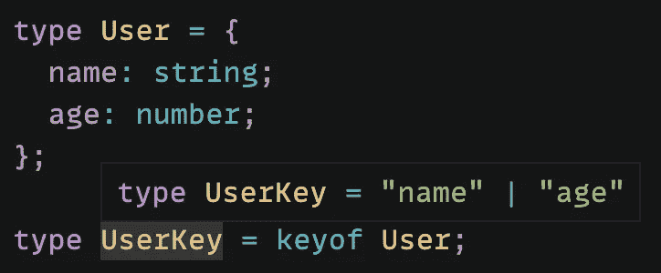
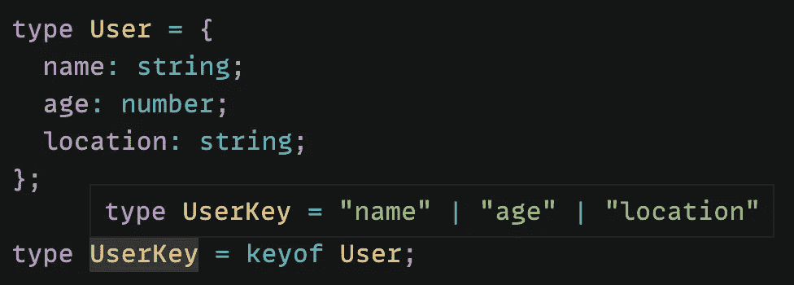
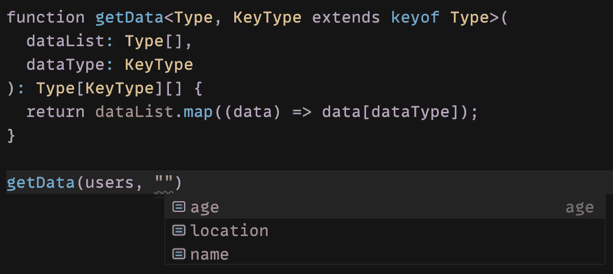
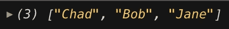

# 如何在 TypeScript 中使用“keyof”类型运算符

> 原文：<https://blog.devgenius.io/how-to-use-the-keyof-type-operator-in-typescript-6d5e0ea6740f?source=collection_archive---------0----------------------->

## 探索“keyof”类型运算符及其在一般函数中的使用


照片由[弗洛里安·伯格](https://unsplash.com/@bergerteam?utm_source=medium&utm_medium=referral)在 [Unsplash](https://unsplash.com?utm_source=medium&utm_medium=referral) 上拍摄

在 TypeScript 中，有许多方法可以从其他类型创建类型。其中一种方法是使用`keyof`类型的操作符。

在本文中，我们将看看 TypeScript 中的`keyof`类型操作符，并学习如何在一般函数中使用它。如果您还不熟悉通用函数，请先阅读下面的文章。

[](/introduction-to-generics-in-typescript-e81ed146a330) [## TypeScript 中的泛型介绍

### 什么是泛型，我们如何在 TypeScript 中使用它们？

blog.devgenius.io](/introduction-to-generics-in-typescript-e81ed146a330) 

如果您不熟悉 TypeScript，请阅读下面的文章，熟悉一些基本概念。

[](https://levelup.gitconnected.com/type-annotation-vs-type-inference-in-typescript-85ba2194ebe1) [## TypeScript 中的类型注释与类型推理

### 如何在 TypeScript 中向变量添加类型

levelup.gitconnected.com](https://levelup.gitconnected.com/type-annotation-vs-type-inference-in-typescript-85ba2194ebe1) 

# 什么是“keyof”类型的运算符？

在 TypeScript 2.1 中，他们引入了`keyof`类型操作符。`keyof`类型操作符接受一个对象类型并创建其键的联合类型。

例如，假设我们创建了一个`User`类型，名字为`string`，年龄为`number`。

```
type User = {
  name: string;
  age: number;
};
```

我们可以使用`keyof`类型操作符创建一个`User`类型键的联合类型。

```
type UserKey = keyof User;
```

现在，`UserKey`类型会有一个`"name" | "age"`类型。



当然，我们可以将`UserKey`硬编码为`"name" | "age"`的联合类型。然而，如果我们想在将来给`User`类型添加更多的属性，我们也必须更新`UserKey`类型。

通过使用`keyof`，如果我们向`User`添加一个新属性，那么`UserKey`联合类型也将改变。

例如，我在`User`类型上添加了一个位置属性作为`string`。现在`UserKey`型变成了`"name" | "age" | "location"`的联合型。



# 在一般函数中使用“keyof”

现在我们已经了解了`keyof`类型操作符的作用，让我们看看如何在一个通用函数中使用它。

对于这个例子，我将创建一个用户数组，每个用户都有一个`User`类型。

```
const users: User[] = [
  {
    name: "Chad",
    age: 31,
    location: "Japan"
  },
  {
    name: "Bob",
    age: 29,
    location: "USA"
  },
  {
    name: "Jane",
    age: 30,
    location: "France"
  }
];
```

然后我将创建一个名为`getData`的通用函数。

```
function getData<Type, KeyType extends keyof Type>(
  dataList: Type[],
  dataType: KeyType
): Type[KeyType][] {
  return dataList.map((data) => data[dataType]);
}
```

这可能看起来比实际情况更复杂，所以让我仔细分析一下。

首先，我们将把两个类型变量传递给这个泛型函数:`Type`和`KeyType`。`Type`将物品放入类型数组中。`KeyType`将延伸`keyof Type`。换句话说，它将是`Type`的一把钥匙。

```
**function getData<Type, KeyType extends keyof Type>**
```

函数本身将接受两个参数:

*   **数据列表**——一系列的`Type`
*   **数据类型** —某个特定键的`Type`

```
function getData<Type, KeyType extends keyof Type>(
  **dataList: Type[],
  dataType: KeyType**
)
```

该功能的返回类型为`Type[KeyType][]`。这意味着它将是每个项目的`KeyType`属性的数组。

```
function getData<Type, KeyType extends keyof Type>(
  dataList: Type[],
  dataType: KeyType
): **Type[KeyType][]** 
```

最后，我们将添加函数的逻辑。这个函数将简单地映射到数据列表数组，并返回我们指定的属性值。

```
function getData<Type, KeyType extends keyof Type>(
  dataList: Type[],
  dataType: KeyType
): Type[KeyType][] {
  **return dataList.map((data) => data[dataType]);**
}
```

如果我调用该函数并传入`users`数组作为第一个参数，您可以看到我的文本编辑器正在为第二个参数建议值。这是因为 TypeScript 知道第二个参数必须是`User`类型的键。所以要么`age`、`location`或者`name`。



如果我使用`name`作为第二个参数，它将向控制台提供一个名称数组。



因为我们将它作为一个通用函数，所以我可以用不同类型的数据创建一个新的数组，并且仍然使用这个函数。这是泛型函数和使用`keyof`类型运算符的力量的一个例子。

# 结论

谢谢你的阅读！希望本文能对您理解 TypeScript 中的`keyof`类型运算符有所帮助。

如果您想继续了解有关 TypeScript 的更多信息，请查看下面的文章。

[](https://javascript.plainenglish.io/typescript-tip-convert-an-array-of-strings-into-a-string-literal-union-type-ee46c2c6e337) [## 类型脚本提示:将字符串数组转换为字符串文字联合类型

### 使用“const”断言和索引访问类型

javascript.plainenglish.io](https://javascript.plainenglish.io/typescript-tip-convert-an-array-of-strings-into-a-string-literal-union-type-ee46c2c6e337)