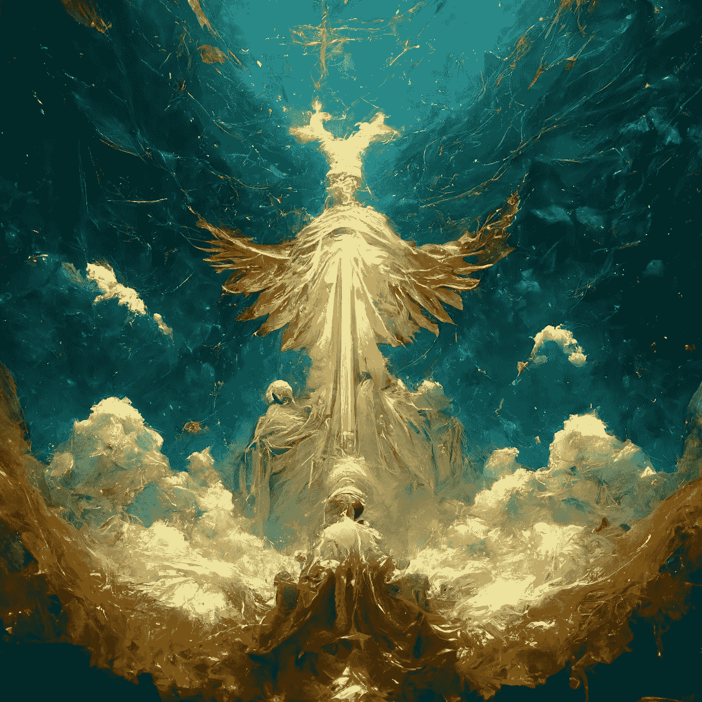
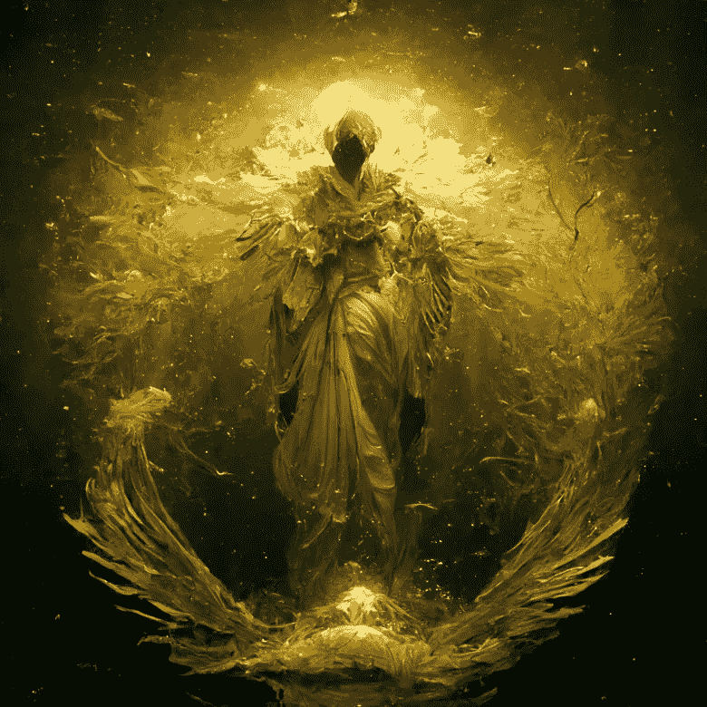
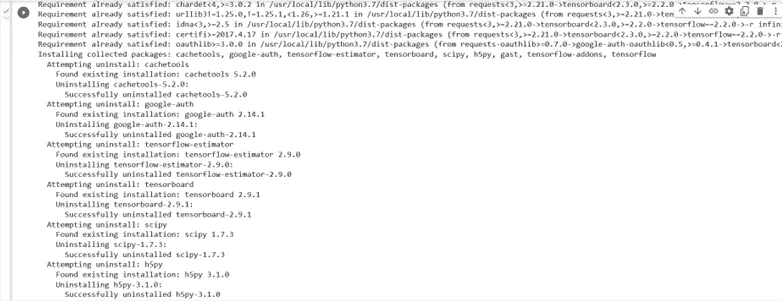
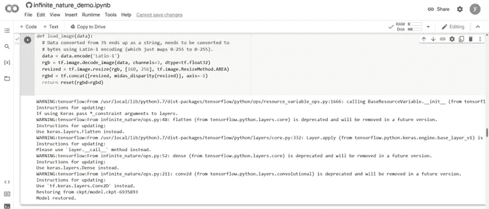
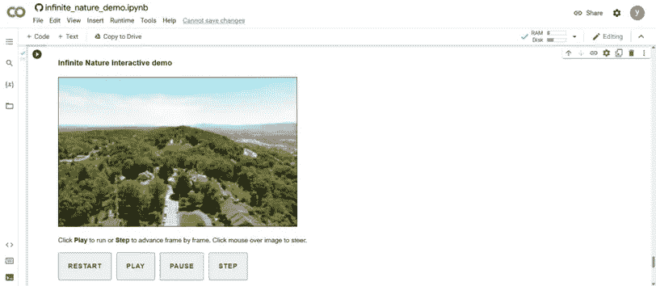
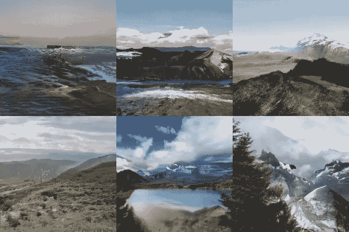
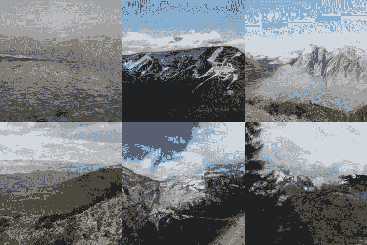
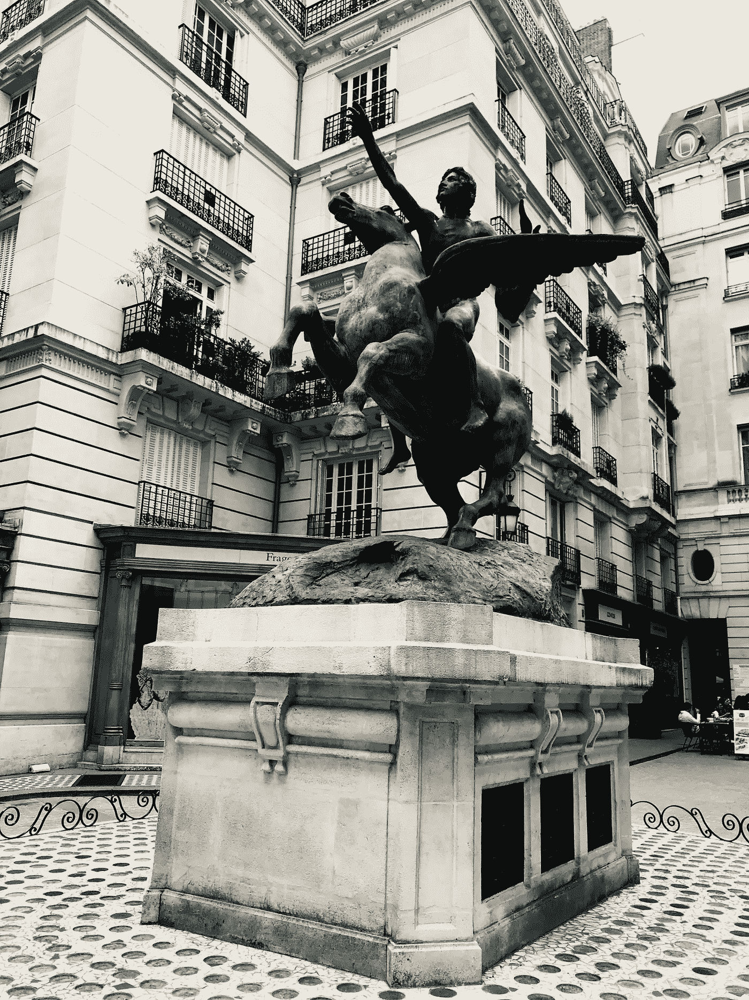

# 如何使用新的谷歌无限自然“三维图像生成器”

> 原文：<https://blog.devgenius.io/how-to-use-the-new-google-infinite-nature-3d-images-generator-ac0261f43563?source=collection_archive---------3----------------------->

## 循序渐进的 Python 指南



《创世纪》中的“LightBeUponUS”由 Philippe Bouaziz (Pele_B)制作的人造对抗 NFT [系列](https://www.redbubble.com/i/t-shirt/LightBeUponUS-by-PeleB/131378947.WFLAH)使用[中途](https://www.midjourney.com/showcase/)制作(图片由作者提供)

人工智能是一种强有力的工具，可用于许多领域，如图像识别和机器翻译。但新一代人工智能工具可以更进一步，创造出从未存在过的图像。这些“想象的”图像是由人工智能创建的，人工智能在大量真实图像上进行训练，学习创建逼真且与原始数据一致的新图像。新图像可以用于各种目的，例如创建逼真的假图像，填充图片中的空白，甚至根据文本描述生成新图像。

这项技术被称为生成对抗网络(GAN)，它是由多伦多大学的一名研究人员在 2014 年首次提出的。GAN 由两部分组成:发生器和鉴别器。生成器是创建新图像的神经网络，而鉴别器是将图像分类为真或假的神经网络。两个网络一起训练，生成器试图欺骗鉴别器，鉴别器试图捕捉假图像。在训练过程中，生成器学习创建真实的图像，而鉴别器学习变得越来越精确。结果是一个系统可以生成难以与真实图像区分的真实图像。来源:

甘已经被用来生成各种各样的图像，包括脸，风景，甚至动漫人物。它还可以用于从文本描述中生成图像，例如来自《圣经》的以下文本:

“起初，上帝创造了天地。那时，地是空虚混沌的，黑暗笼罩着深渊的表面，上帝的灵在水面上盘旋。”



《创世纪》中的天使 NFT [系列](https://www.redbubble.com/i/t-shirt/Genesis-Angel-of-G-by-PeleB/130468375.WFLAH?asc=u)由 Philippe Bouaziz (Pele_B)利用[中途](https://www.midjourney.com/showcase/)创造(图片由作者提供)

在这个名为“创世纪人工对抗网络”( GAAN)的数字展示中，我试图理解人工智能机器人(中途)是如何解释《圣经》文本的。使用深度学习技术，如生成对抗网络(GAN)和图像处理。

在本教程中，我们将讨论如何从视频 2D 图像生成 3D 人工智能图像。我们将使用新的无限自然 GAN 模型在视频 2D 图像数据集上训练该模型，并从中生成 3D 图像。python 代码可以在 [GitHub](https://infinite-nature-zero.github.io/) 上免费获得。我们将使用名为[空中海岸线影像数据集](https://infinite-nature.github.io/) (ACID)的在线视频数据集，并从中生成 3D 图像。我们将为这个 GAN 模型使用 TensorFlow 后端，这里是 collab [链接](https://colab.research.google.com/github/google-research/google-research/blob/master/infinite_nature/infinite_nature_demo.ipynb)。

更准确地说，我们将分析从视频 2D 图像生成 3D AI 图像的方法。首先，我们下载一个深度卷积神经网络来从视频 2D 图像中提取 3D 信息。接下来，我们使用生成对抗网络从提取的 3D 信息生成 3D AI 图像。最后，我们使用渲染算法来渲染 3D AI 图像。该方法可以从视频 2D 图像中生成逼真的三维人工智能图像。

首先，我们需要安装 numpy 版本 1.19.5:

```
import numpy as np
import os

if np.__version__ != '1.19.5':
  print("Installing correct numpy library...")
  os.system('pip install numpy==1.19.5')
  print("Numpy installed, please press run all again.", flush=True)
  os.kill(os.getpid(), 9)
```

之后，我们需要安装:

*   **数据集**:infinite _ nature _ public Google API
*   **依赖关系**:infinite _ nature/requirements . txt
*   **3D 网格渲染**:将图像从 2D 转换为 3D

```
%%shell
echo Fetching code from github...

apt install subversion
svn export --force https://github.com/google-research/google-research/trunk/infinite_nature

echo
echo Fetching trained model weights...
rm -f autocruise_input*.pkl
rm -f ckpt.tar.gz
rm -rf ckpt
wget https://storage.googleapis.com/gresearch/infinite_nature_public/autocruise_input1.pkl
wget https://storage.googleapis.com/gresearch/infinite_nature_public/autocruise_input2.pkl
wget https://storage.googleapis.com/gresearch/infinite_nature_public/autocruise_input3.pkl
wget https://storage.googleapis.com/gresearch/infinite_nature_public/ckpt.tar.gz
tar -xf ckpt.tar.gz

echo
echo Installing required dependencies...
pip install -r infinite_nature/requirements.txt

echo
echo Fetching tf_mesh_renderer and compiling kernels...
cd infinite_nature
rm -rf tf_mesh_renderer
source download_tf_mesh_renderer.sh

echo Done.
```



在下一步中，我们需要通过安装以下组件来激活神经网络模型:

*   **Tensorflow 库**:创建张量(将彩色图像转换为灰度 0/1 矢量)
*   **Numpy 库**:使用矩阵
*   **ImageIO 库**:用滤镜变换 2D 图像
*   **火车模型**:来自谷歌网站名称“ckpt/model.ckpt-6935893”
*   定义 **RGBD 颜色**的功能 01:“input _ RGBD”
*   函数 02 将 **RGBD 图像定义为矩阵** : "current_image_as_png "
*   函数 03 到**将图像**的高/重比调整为【160，256】，函数名为:“reset(rgbd=None)”。此外，这个函数定义了人工智能无人机图像集:方向 _ 偏移，下一个 _ 姿态 _ 功能，姿态，转弯 _ 功能
*   功能 04 至**定义下一个图像视图**:步骤(offsetx，offsety)
*   **MiDaS V2 模型** **获取 fom 2D 图像估计 3D 渲染**:“预测=(预测—显示 _ 最小)/(显示 _ 最大—显示 _ 最小)”
*   功能 05 至**加载 2D 图像**

你可以看到下面的代码:

```
import tensorflow as tf
import os
import sys

# Make sure dynamic linking can find tensorflow libraries.
os.system('ldconfig ' + tf.sysconfig.get_lib())

# Make sure python can find our libraries.
sys.path.append('infinite_nature')
sys.path.append('infinite_nature/tf_mesh_renderer/mesh_renderer')

# Make sure the mesh renderer library knows where to load its .so file from.
os.environ['TEST_SRCDIR'] = 'infinite_nature'
```

```
import imageio
import IPython
import numpy as np
import pickle
import tensorflow as tf
import tensorflow_hub as hub

import config
import fly_camera
import infinite_nature_lib

# Build model and restore checkpoint.
config.set_training(False)
model_path = "ckpt/model.ckpt-6935893"
render_refine, style_encoding = infinite_nature_lib.load_model(model_path)
initial_rgbds = [
    pickle.load(open("autocruise_input1.pkl", "rb"))['input_rgbd'],
    pickle.load(open("autocruise_input2.pkl", "rb"))['input_rgbd'],
    pickle.load(open("autocruise_input3.pkl", "rb"))['input_rgbd']]

# Code for an autopilot demo. We expose two functions that will be invoked
# from an HTML/JS frontend: reset and step.

# The state that we need to remember while flying:
state = {
  'intrinsics': None,
  'pose': None,
  'rgbd': None,
  'start_rgbd': None,
  'style_noise': None,
  'next_pose_function': None,
  'direction_offset': None,  # Direction controlled by user's mouse clicks.
}

def current_image_as_png():
  imgdata = tf.image.encode_png(
      tf.image.convert_image_dtype(state['rgbd'][..., :3], dtype=tf.uint8))
  return IPython.display.Image(data=imgdata.numpy())

def reset(rgbd=None):
  if rgbd is None:
    rgbd = state['start_rgbd']

  height, width, _ = rgbd.shape
  aspect_ratio = width / float(height)

  rgbd = tf.image.resize(rgbd, [160, 256])
  state['rgbd'] = rgbd
  state['start_rgbd'] = rgbd
  state['pose'] = np.array(
      [[1.0, 0.0, 0.0, 0.0],
       [0.0, 1.0, 0.0, 0.0],
       [0.0, 0.0, 1.0, 0.0]],
      dtype=np.float32)
  # 0.8 focal_x corresponds to a FOV of ~64 degrees.
  state['intrinsics'] = np.array(
      [0.8, 0.8 * aspect_ratio, .5, .5],
      dtype=np.float32)
  state['direction_offset'] = (0.0, 0.0)
  state['style_noise'] = style_encoding(rgbd)
  state['next_pose_function'] = fly_camera.fly_dynamic(
    state['intrinsics'],
    state['pose'],
    turn_function=(lambda _: state['direction_offset']))
  return current_image_as_png()

def step(offsetx, offsety):
  state['direction_offset'] = (offsetx, offsety)
  next_pose = state['next_pose_function'](state['rgbd'])
  next_rgbd = render_refine(
       state['rgbd'], state['style_noise'],
       state['pose'], state['intrinsics'],
       next_pose, state['intrinsics'])
  state['pose'] = next_pose
  state['rgbd'] = next_rgbd
  return current_image_as_png()

# To run on user-supplied images, we use MiDaS V2 to obtain initial disparity.
midas_model = hub.load('https://tfhub.dev/intel/midas/v2/2', tags=['serve'])

def midas_disparity(rgb):
  """Computes MiDaS v2 disparity on an RGB input image.

  Args:
    rgb: [H, W, 3] Range [0.0, 1.0].
  Returns:
    [H, W, 1] MiDaS disparity resized to the input size and in the range
    [0.0, 1.0]
  """
  size = rgb.shape[:2]
  resized = tf.image.resize(rgb, [384, 384], tf.image.ResizeMethod.BICUBIC)
  # MiDaS networks wants [1, C, H, W]
  midas_input = tf.transpose(resized, [2, 0, 1])[tf.newaxis]
  prediction = midas_model.signatures['serving_default'](midas_input)['default'][0]
  disp_min = tf.reduce_min(prediction)
  disp_max = tf.reduce_max(prediction)
  prediction = (prediction - disp_min) / (disp_max - disp_min)
  return tf.image.resize(
      prediction[..., tf.newaxis], size,  method=tf.image.ResizeMethod.AREA)

def load_initial(i):
  return reset(rgbd=initial_rgbds[i])

def load_image(data):
  # Data converted from JS ends up as a string, needs to be converted to
  # bytes using Latin-1 encoding (which just maps 0-255 to 0-255).
  data = data.encode('Latin-1')
  rgb = tf.image.decode_image(data, channels=3, dtype=tf.float32)
  resized = tf.image.resize(rgb, [160, 256], tf.image.ResizeMethod.AREA)
  rgbd = tf.concat([resized, midas_disparity(resized)], axis=-1)
  return reset(rgbd=rgbd)
```



最后，我们需要运行一个 html 代码来玩**交互演示**。

```
import IPython
from google.colab import output

# The front-end for our interactive demo.

html='''
<style>
#view {
  width: 512px;
  height: 320px;
  background-color: #aaa;
  background-size: 100% 100%;
  border: 1px solid #000;
  margin: 20px;
  position: relative;
}
#rgb {
  height: 100%;
}
#cursor {
  position: absolute;
  height: 0; width: 0;
  left: 50%; top: 50%;
  opacity: .5;
}
#cursor::before, #cursor::after {
  content: '';
  position: absolute;
  background: #f04;
  pointer-events: none;
}
#cursor::before {
  left: -10px; top: -1px; width: 20px; height: 2px;
}
#cursor::after {
  left: -1px; top: -10px; width: 2px; height: 20px;
}
.buttons {
  margin: 20px;
}
.buttons div {
  display: inline-block;
  cursor: pointer;
  padding: 20px;
  background: #eee;
  border: 2px solid #aaa;
  border-radius: 3px;
  margin-right: 10px;
  font-weight: bold;
  text-transform: uppercase;
  letter-spacing: 1px;
  color: #444;
}
.buttons div:active {
  background: #444;
  color: #fff;
}
h3 {
  margin-left: 20px;
}
</style>
<h3>Infinite Nature interactive demo</h3>
<div id=view><div id=cursor></div></div>
<div class=buttons>
Click <b>Play</b> to run or <b>Step</b> to advance frame by frame.
Click mouse over image to steer.<br><br>
<div id=restart>Restart</div><div id=play>Play</div><div id=pause>Pause</div><div id=step>Step</div>
<br><br>
Select starting image (be patient…):<br><br>
<div id=image1>Image 1</div><div id=image2>Image 2</div><div id=image3>Image 3</div><div id=upload>Upload…</div><br>
<input style="display:none" type=file id=chooser accept=".png,.jpg">
</div>
<script>
let playing = true;
let pending = false;
let x = 0.5;
let y = 0.5;
let cursor_count = 0;

async function call(name, ...parms) {
  pending = true;
  const result = await google.colab.kernel.invokeFunction(name, parms, {});
  pending = false;
  const url = `data:image/png;base64,${result.data['image/png']}`;
  document.querySelector('#rgb').src = url;
  if (!playing) { return; }
  step();
}

async function reset() {
  playing = false;
  await call('reset');
}

async function selectImage(i) {
  playing = false;
  await call('load_initial', i);
}

function upload() {
  playing = false;
  document.querySelector('#chooser').click();
}

function uploadFile(file) {
  if (file.type != 'image/png' && file.type != 'image/jpeg') {
    error('Only PNG or JPEG files accepted.');
    return;
  }
  console.log(file);
  const reader = new FileReader();
  reader.onload = (e) => {
    const imagebytes = e.target.result;
    call('load_image', imagebytes);
  }
  document.querySelector('#rgb').src = '';
  reader.readAsBinaryString(file);
}

async function step() {
  if (pending) { return; }
  await call('step', 2*x - 1, 2*y - 1);
  // Cursor moves back towards center.
  if (cursor_count) {
    cursor_count--;
  } else {
    x = 0.5 + (x - 0.5) * .9;
    y = 0.5 + (y - 0.5) * .9;
    update_cursor();
  }
}

async function play() {
  playing = true;
  await step();
}

async function pause() {
  playing = false;
}

function update_cursor() {
  let cursor = document.querySelector('#cursor');
  cursor.style.left = `${(100 * x).toFixed(2)}%`;
  cursor.style.top = `${(100 * y).toFixed(2)}%`;
}

function cursor(e) {
  console.log(e);
  x = e.offsetX / e.target.clientWidth;
  y = e.offsetY / e.target.clientHeight;
  cursor_count = 1;
  update_cursor();
}

document.querySelector('#restart').addEventListener('click', reset);
document.querySelector('#image1').addEventListener('click', () => selectImage(0));
document.querySelector('#image2').addEventListener('click', () => selectImage(1));
document.querySelector('#image3').addEventListener('click', () => selectImage(2));
document.querySelector('#upload').addEventListener('click', upload);
document.querySelector('#play').addEventListener('click', play);
document.querySelector('#pause').addEventListener('click', pause);
document.querySelector('#step').addEventListener('click', () => { playing = false; step(); });
document.querySelector('#view').addEventListener('click', cursor);
document.querySelector('#chooser').addEventListener('change', (e) => {
  if (e.target.files.length > 0) {
    uploadFile(e.target.files[0]);
  }
});
selectImage(0);
</script>
'''

display(IPython.display.HTML(html))

output.register_callback('load_initial', load_initial)
output.register_callback('load_image', load_image)
output.register_callback('reset', reset)
output.register_callback('step', step)
```



你也可以在他们的官方网站上找到完整的 2D 影像 3D 电影:

[https://infinite-nature-zero . github . io/static/videos/infnatzeroresults . MP4](https://infinite-nature-zero.github.io/static/videos/InfNatZeroResults.mp4)

这里有一个分两步走的例子:

*   **一帧**



*   **第二帧**



**总结**

新的 2022 谷歌研究甘图像生成器是一个伟大的工具，创造现实的三维图像。它也是一个强大的工具，用于创建用传统方法无法创建的图像。在不久的将来，这种工具可以用来为娱乐或广告制作逼真的图像或视频。此外，它可以用于生成新的数据来训练机器学习模型，这可以提高这些模型的准确性。

如有任何问题，欢迎在下方留言，继续探索:-)



Philippe Bouaziz 设计的巴黎“la madeleine”街