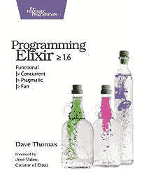

# 如何在 Elixir 中使用管道运算符

> 原文：<https://blog.devgenius.io/how-to-use-the-pipe-operator-in-elixir-d36ad1b5a4e?source=collection_archive---------24----------------------->

## 一个简单而强大的 Elixir 操作符有助于转换您的代码


[仙丹语言](http://elixir-lang.org)最酷的特点之一也是最简单的。不起眼的 [*管道*操作符](https://elixir-lang.org/getting-started/enumerables-and-streams.html#the-pipe-operator) `[|>](https://elixir-lang.org/getting-started/enumerables-and-streams.html#the-pipe-operator)`实现了一种语法上的变化，这种变化可以改变代码的结构，使代码的编写和理解变得简单得多。

在本帖中，我们将看看 Elixir 中的*管道*操作符，如何使用它，并了解它为什么如此强大。



[编程灵丹妙药≥ 1.6:功能| >并发| >实用| >乐趣](https://amzn.to/3VPhikh)作者:戴夫·托马斯·⭐️⭐️⭐️⭐️

# 什么是管道操作员？

管道运算符看似简单:它接受左边的表达式，并将其作为第一个参数传递给右边的表达式:

```
# these two expressions are the same 

function(value) 

value |> function()
```

如果函数调用需要额外的参数，我们也可以添加:

```
# again, these two expressions are the same 

function(value, arg1, arg2) 

value |> function(arg1, arg2)
```

到目前为止，管道操作符看起来像是一种重构代码的简单方法，但除此之外并没有给人留下深刻的印象。管道操作符的真正力量来自于将它与多个调用链接在一起，也称为*管道*:

```
# A nested expression without the pipeline operator 

function_e(function_d(function_c(function_b(function_a(input))))) 

# The same expression using the pipeline operator 
input 
|> function_a 
|> function_b 
|> function_c 
|> function_d 
|> function_e
```

这个例子显示了管道操作员的能力。一旦您熟悉了语法，这段代码的管道版本就更容易理解了:初始值(本例中为`input`)在管道中排在*前面*，而不是深深地嵌套在一组函数调用中。

# 为什么我们需要管道操作员？

管道操作符对于任何编程语言来说都是一个很好的补充，但是对于像 Elixir 这样的函数式语言来说尤其有用。

这是为什么呢？因为函数式语言使用*不可变的*值。例如，我们不需要调用来修改对象或结构的状态，而是需要制作值的更新副本，通常是通过将它传递给函数。这意味着要对一个值应用多个转换，我们最终会得到深度嵌套的函数调用。如果你听说过像 Lisp 这样的语言中的*括号地狱*，这就是他们所说的:`g(f(e(d(c(b(a(value)))))))`。

举一个更现实的例子，让我们考虑一个完全假设的 API，用面向对象语言(如 Ruby)和函数式语言(如 Elixir)来管理“小部件”:

```
# hypothetical API in a language with object orientation (Ruby): 

w = Widget.new 
w.setColor("#00f") 
w.setSize(:large)
w.setShape(:circle) 
w.setMaterial(:plastic) 

# hypothetical API in Elixir, without a pipeline: 

Widget.with_material( 
  Widget.with_shape( 
    Widget.with_size( 
      Widget.with_color(
        %Widget{}, "#00f"
      ), 
      :large), 
    :circle), 
  :plastic
)
```

面向对象的例子相对简单:我们创建一个实例，并根据需要进行修改。不过，函数示例有点难以理解:小部件结构是作为最内部的表达式创建的，然后我们需要围绕它包装越来越多的函数，以便应用我们的转换。向 OO 示例中添加额外的转换将是简单明了的，但是在 Elixir 示例中有点麻烦。

考虑到这一点，让我们重写我们的 Elixir 示例来使用管道操作符。注意，我们没有改变上面使用的 API 的函数定义，只是改变了我们如何使用管道来构造代码:

```
%Widget{} 
|> with_color("#00f") 
|> with_size(:large) 
|> with_shape(:circle) 
|> with_material(:plastic)
```

因此，尽管管道操作符对于许多语言来说是一个受欢迎的补充，但是对于你在函数式语言中遇到的代码类型，比如 Elixir，它是特别有用的 T2。

# 建造管道的技巧

虽然管道操作符很容易学习，但有几个技巧可以帮助您更有效地使用它，并在 Elixir 中掌握管道。

## 构建管道兼容的 API

管道操作符使用第一个参数来传递上一步中的数据，因此根据 Elixir 中的约定，转换数据的模块函数应该将该数据作为第一个参数，并返回相同的数据类型。

在我们前面的例子中，假设我们正在实现一个函数来转换现有小部件的颜色。虽然理论上函数的参数可以是任意顺序，但是首先放置*小部件*参数使得函数与管道兼容:

```
# 🚫 

def set_color(color, widget), do: %{widget | color: color} 

# ✅ 

def set_color(widget, color), do: %{widget | color: color}
```

如果您浏览 Elixir 标准库或其他流行的项目，您将会看到这种模式是如何使用的——您应该以同样的方式构造您的 API。

# 不要太聪明

虽然管道通常会使代码更简单、更容易理解，但是*也有可能*以实际上使代码更难阅读的方式使用管道。使用管道时，有几个最佳实践可以遵循。

首先，尽管管道可以以任何表达式开始，但通常最好从一个简单的值开始，而不是像控制结构这样的结果。以下代码可以工作，但可读性不强:

```
# 🚫 don't do this - pipelines should start with a simple value 

if value do 
  f1() 
else 
  f2() 
end 
|> f3()
```

类似地，因为 Elixir 控件结构是用宏构建的，所以也可以将数据通过管道传输到控件结构中——但是这会极大地牺牲可读性！同样，这段代码有效，但是(在我看来)不是最好的模式:

```
# 🚫 don't do this - don't pipe into control structures 

value 
|> if do: f1(), else: f2() 
|> f3()

value 
|> case do 
  :ok -> f1() 
  _ -> f2() 
end
|> f3()
```

我承认这有点个人偏好和风格:这种模式出奇地普遍，许多 Elixir 开发人员认为插入 case 语句就可以了。也就是说，在一个简单的助手函数的帮助下，它通常可以变得更干净，如下所示。

# 使用助手函数解决控制流问题

上面我们看到了在复杂的起始表达式或控制结构中使用管道操作符是如何损害可读性的。但这并不意味着我们不能实现使用控制结构的管道。

在这两种情况下，简单的助手函数(在适当的情况下使用模式匹配)有助于使代码更容易理解:

```
# 🚫 complicated use of the pipe operator:

def process_action(action) do 
  if action == :update do 
    update_data() 
  else 
    generate_data() 
  end 
  |> process_data() 
  |> case do 
    {:ok, data} -> save(data) 
    error -> log_error(error) 
  end 
end 

# ✅ better use of the pipe operator with helper functions: 

def process_action(action) do 
  action 
  |> produce_data() 
  |> process_data() 
  |> process_result() 
end 

def produce_data(:update), do: update_data() 
def product_data(_), do: generate_data() 

def process_result({:ok, data}), do: save(data)
def process_result(error), do: log_error(error)
```

使用助手函数对于简单的逻辑来说是很好的，但是和以前一样，如果它们变得太复杂，代码的可读性会受到影响。尽管管道操作符强大而优雅，但不要过度使用它:如果一条长管道开始变得粗糙，将它分成小管道并在中间加入其他逻辑也没什么不好。

# 了解更多关于药剂和管道的信息

Elixir 中管道操作符的伟大之处不仅在于它如何转换您的代码，还在于它如何转换您的思维。这听起来像是夸大其词，但这是真的:我很惊讶我经常通过布置高级管道来开始编写算法，即使单个部分还没有编写出来。

这个烟斗只是*一号*仙丹语言的一大特色。如果您对了解 Elixir 如何帮助编写高性能、无错误代码的其他方法感兴趣，这里有一些其他资源可供参考:

*   看看[仙丹文档](http://elixir-lang.org/)
*   [直接进入 REPL 在线仙丹](https://replit.com/languages/elixir)开始学习这门语言
*   查看亚马逊上的实用程序员书籍[编程灵药≥ 1.6](https://amzn.to/3PyP0bv)

*原载于 2022 年 12 月 12 日 https://blixtdev.com*[](https://blixtdev.com/how-to-use-the-pipeline-operator-in-elixir/)**。这个故事可能包含附属链接。**