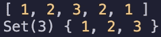

# 如何在 JavaScript 中使用 Set 对象

> 原文：<https://blog.devgenius.io/how-to-use-the-set-object-in-javascript-745b10a64e16?source=collection_archive---------1----------------------->

## 设置的对象是什么，如何使用？


雅各布·欧文斯在 [Unsplash](https://unsplash.com?utm_source=medium&utm_medium=referral) 上的照片

当我刚开始学习 JavaScript 时，我浏览了许多不同的教程。我从未在任何初学者教程中遇到过的一件事是`Set`对象。

`Set`对象不是一个你必须立即了解的基本概念。然而，知道它的存在是件好事，因为你会需要它。

想象一下这种情况:您有一个项目数组，并希望从数组中删除重复的项目。您可能会开始考虑可以映射或过滤数组。但是，快速的谷歌搜索会告诉你最简单的方法是使用`Set`对象。

在本文中，我们将探索`Set`对象，并通过 JavaScript 中的一些例子来了解如何使用它。在本文结束时，您应该对以下内容有所了解:

*   `Set`是什么对象？
*   `Set`对象的属性和方法
*   数组和数组的区别`Set`

# 设定的对象是什么？

> "对象允许你存储任何类型的唯一值，无论是原始值还是对象引用."

换句话说，`Set`对象类似于数组。您可以存储任何类型的项目。但是，您不能存储重复的值。

例如，这里我有一个数字数组。

```
const numbers = [1, 2, 3, 2, 1];
```

我可以通过将数组作为参数传递来创建一个新的`Set`。

```
const uniqueNumbers = new Set(numbers);
```

如果我将这两个变量都记录到控制台，我们将看到以下输出。

```
console.log(numbers);
console.log(uniqueNumbers);
```



如您所见，`Set`只有值`1, 2, 3`，因为最后的`2, 1`是重复的。

如果你有一个`Set`并想把它变回一个数组，你可以简单地把`Set`对象放到一个数组中。

```
const uniqueNumbersArray = [**...**uniqueNumbers];
```

如果我将`uniqueNumbersArray`数组记录到控制台，我们将看到以下内容。


# Set 对象的属性和方法

`Set`对象具有以下属性和方法:

*   **set . size**—`size`属性返回`Set`对象中值的个数。

```
const numbers = [1, 2, 3, 2, 1];
const uniqueNumbers = new Set(numbers);**uniqueNumbers.size // returns 3**
```

*   **set . add(*value*)**—向`Set`对象添加一个值，并返回带有添加值的`Set`对象。

```
const numbers = [1, 2, 3, 2, 1];
const uniqueNumbers = new Set(numbers);**uniqueNumbers.add(4) // returns Set(4) { 1, 2, 3, 4 }**
```

*   **set . delete(*value*)**—删除与值相关联的元素，并返回一个布尔值，无论元素是否被删除。

```
const numbers = [1, 2, 3, 2, 1];
const uniqueNumbers = new Set(numbers);**uniqueNumbers.delete(2) // returns true
uniqueNumbers.size // returns 2**
```

*   **Set.clear()** —从`Set`对象中删除所有元素并返回 undefined。

```
const numbers = [1, 2, 3, 2, 1];
const uniqueNumbers = new Set(numbers);**uniqueNumbers.clear() // returns undefined
uniqueNumbers.size // returns 0**
```

*   **set . has(*value*)**—返回一个布尔值，无论具有该值的元素是否存在于`Set`对象中。

```
const numbers = [1, 2, 3, 2, 1];
const uniqueNumbers = new Set(numbers);**uniqueNumbers.has(2) // returns true
uniqueNumbers.has(4) // returns false**
```

# 数组和集合的区别？

在大多数情况下，您可以使用数组。但是，当您只需要唯一的值并希望避免重复时，您会希望使用`Set`。

数组和`Set`的另一个主要区别是数组是一个有序的对象列表。您可以通过引用列表中的整数索引来访问数组的元素。一个`Set`是唯一元素的无序池。因为它是无序的，所以没有可以用来访问特定元素的整数索引。

# 结论

感谢阅读！我希望这篇文章有助于您理解 JavaScript 中的`Set`对象。

在学习了将近 6 个月的 JavaScript 之后，我第一次接触到了`Set`对象。我不认为这是第一次学习 JavaScript 时必不可少的一个基本概念，但知道它的存在对于你需要使用它的时候肯定是有好处的！

如果您想继续学习 JavaScript，请查看下面的文章。

[](https://javascript.plainenglish.io/javascript-tip-remove-an-item-from-an-array-using-the-filter-method-249b2c720e02) [## JavaScript 提示:使用 Filter 方法从数组中移除一个项

### 探究 JavaScript 中过滤方法和拼接方法的区别。

javascript.plainenglish.io](https://javascript.plainenglish.io/javascript-tip-remove-an-item-from-an-array-using-the-filter-method-249b2c720e02) [](https://javascript.plainenglish.io/javascript-tip-conditionally-add-an-item-to-an-array-5877a9d7c88b) [## JavaScript 提示:有条件地向数组中添加一个项目

### 使用扩展语法和条件三元运算符

javascript.plainenglish.io](https://javascript.plainenglish.io/javascript-tip-conditionally-add-an-item-to-an-array-5877a9d7c88b)