# 如何在 MUI v5 中使用 sx 道具

> 原文：<https://blog.devgenius.io/how-to-use-the-sx-prop-in-mui-v5-4ccfd588836?source=collection_archive---------0----------------------->

## 还在用 makeStyles？

构建我的开发人员项目组合附带了相当多的学习内容，当涉及到实现基本的 React 组件(如表单输入、按钮和导航栏)时，我转向 Google 的 MUI 库，寻找看起来专业且易于实现的可重用组件。

在搜索帮助我理解如何使用和设计 MUI 组件的资源时，我遇到了几个最近的教程，它们很快导致了我的语法错误。

这是因为 MUI v5 于 2021 年 9 月发布，它经历了一次重大的品牌重塑，[将库名从 Material UI 更改为 MUI](https://mui.com/blog/material-ui-is-now-mui/) ，并发布了用于设计 MUI 组件样式的新方法。因此，2021 年 9 月之前的 MUI 造型教程已经过时。

用于设计 MUI 组件样式的两个新 API 是:

1.  使用*风格的()* API
2.  使用 *sx* prop API

使用 *sx* prop 来内联样式的 MUI 组件实际上比基于 v4 hook 的语法更容易，即使我花了一点时间才明白过来！

## 本文将涵盖:

*   实现 *sx* prop 的基础
*   MUI 的自定义样式属性
*   如何在 *sx* 道具中嵌套 CSS 选择器
*   使用 *sx* 道具进行响应式设计

# 示例演示:简单表单

让我们从一个简单的小表单页面的例子开始。

我按照 MUI 网站上的 NPM 安装说明安装了他们的 v5 软件包:

```
npm install @mui/material @emotion/react @emotion/styled
```

并创建了一个非常简单的带有标题和表单的页面，但没有提交功能。

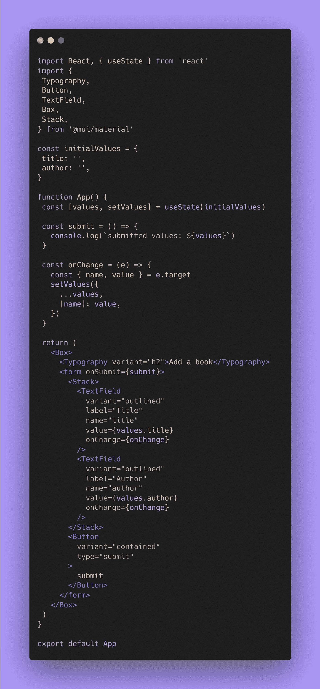

该表单使用一个 MUI Box 组件作为容器，并使用一个 MUI Stack 组件来包含两个表单输入，并保持它们垂直堆叠。

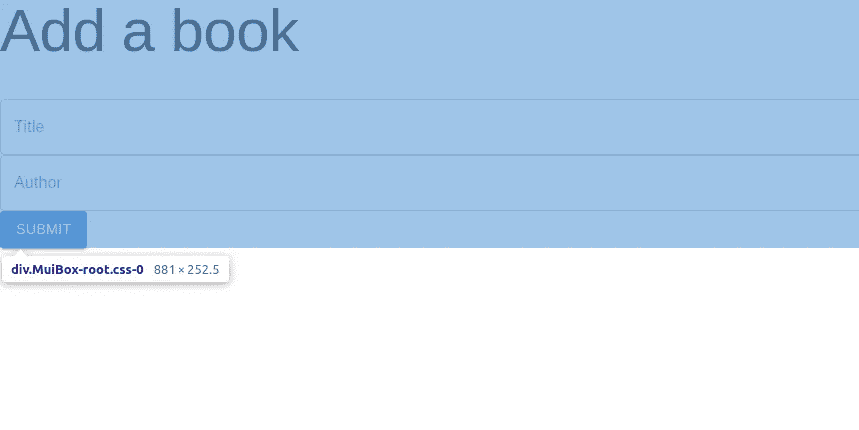

没有自定义样式的窗体。

没有 MUI 默认组件之外的样式的页面看起来有点不稳定。默认版式、按钮和文本字段样式显示正常，但是文本字段占据了它们所在的容器框组件的整个宽度，并且框组件没有占据页面的整个高度，将元素挤压到页面的顶部。我们如何使用 MUI 样式来解决这个问题？

# v4 中的 makeStyles 和 useStyles 挂钩

材质 UI v4 有[多种方式来设计组件](https://mui.com/system/styles/basics/)的样式，它们都依赖于相同的概念，即使用在父组件之外定义的类，并将它们应用到子组件。一种常见的方法是使用钩子 API，它使用两个钩子: *makeStyles* 和 *useStyles* 来创建类并实现它们。

在 v4 中，使容器框组件占据页面高度的 100%可能如下所示:

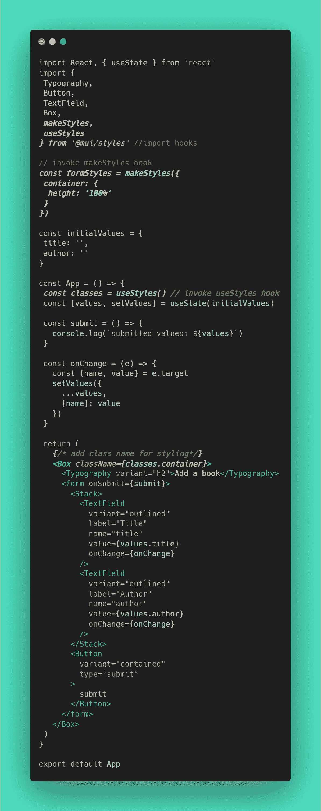

这种方法依赖于:

1.  从 mui/styles 包中导入 *makeStyles* 和 *useStyles* 钩子
2.  使用 *makeStyles* 钩子创建样式
3.  用 *useStyles* 钩子在组件内调用它
4.  将它作为一个类应用于“Box”组件

有很多样板代码，如果你设计了不止一个元素，makeStyles 钩子语法的结构会变得更加复杂。

还是用 v5 里的 *sx* 道具吧。

# v5 中 sx 道具的基础

*sx* 道具的使用方式与标准 react 内嵌样式中的*样式*道具类似。它可以应用于 MUI 组件来设置样式。让我们使用简单的表单示例，让我们的容器框组件占据页面高度的 100%,并使内容在页面上居中。

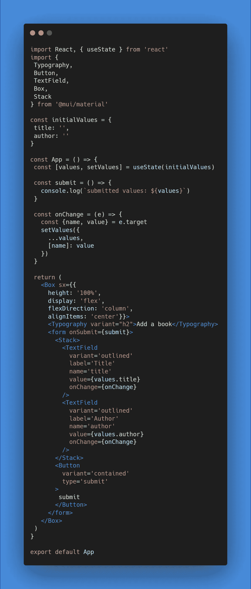

将 *sx* prop 应用到容器‘Box’组件，然后我们可以设置包装在对象内部的组件的样式。应用样式与使用 JSS 语法在基本 React 组件中应用内联样式是一样的。为了应用有多个单词的 CSS 属性，比如 *flex-direction* ，我们使用 camel case 格式。

```
flexDirection: ‘column’
```

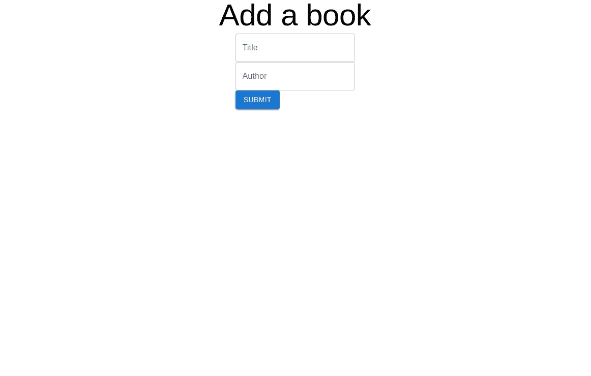

带有样式化的框组件的窗体

有用！表单居中，并且 Box 容器元素占据页面宽度的 100%。

# MUI 自定义属性

MUI 支持所有常规的 CSS 属性和选择器，但是它也有一些自定义/简写的属性和选择器,它支持它的组件。这些可以对应于你设置的主题属性。主题的主要和次要颜色或主题间距属性。

如果我们想在标题和表单元素之间增加一些间距，我们可以使用 MUI 属性 *mb* 来为排版组件添加 margin-bottom。MUI 应用的默认主题间距是 8px，所以在没有定制的情况下，我们可以将 margin-bottom 4 添加到排版元素中，并看到它已经将 margin-bottom 32px(8px×4)添加到我们的标题中。

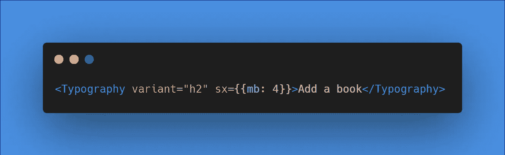

使用自定义 mb 属性为标题添加下边距

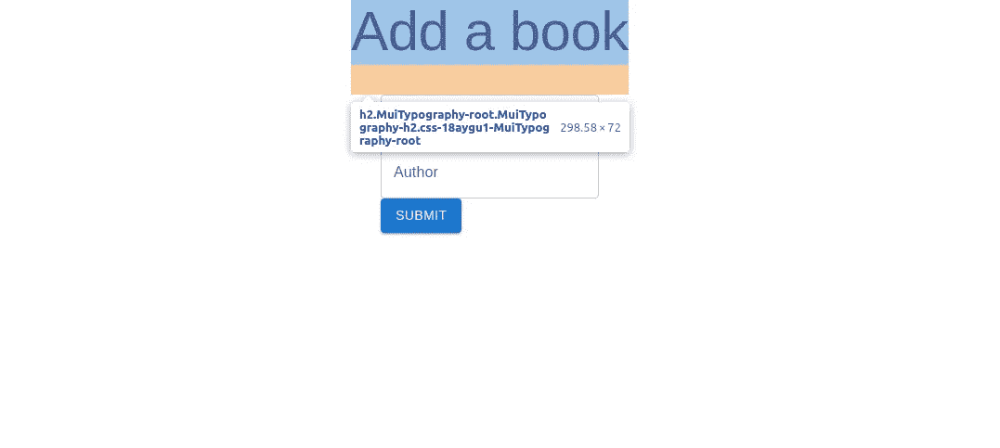

底部有页边空白的标题

# 嵌套 CSS 选择器

现在，假设我们想在“标题”和“作者”这两个表单输入之间增加间距，这样它们就不会在页面上挤在一起。我们如何将边距应用到堆栈父组件中的每个 TextField 组件？而我们可以应用值为 *m:2* 的 *sx* 道具(即。主题间距值×2)如果我们有许多表单输入，这可能是重复的，不符合干净代码的概念。

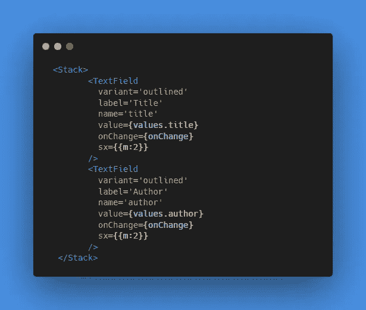

将 sx 属性添加到每个 TextField 并不理想

为了选择父元素 Stack 组件中的所有输入，我们可以使用嵌套选择器语法(类似于 Sass 库的语法)。

在 MUI 中，CSS 选择器可以以引用父元素的 *&* 符号开始，然后选择带有类的子元素(以*开始)*与普通 CSS 类选择一样)。然后从父元素向下应用样式。

为了选择每个输入，我们将使用类名 *MuiFormControl-root* 来访问它们，在堆栈的 *sx* prop 中有一个嵌套的 CSS 选择器。

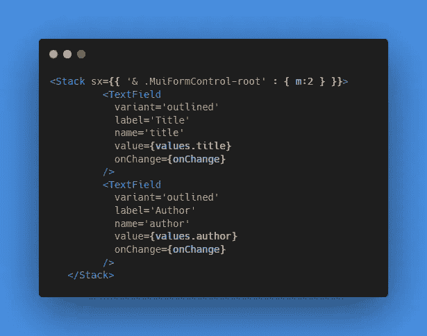

使用嵌套选择器要高效得多

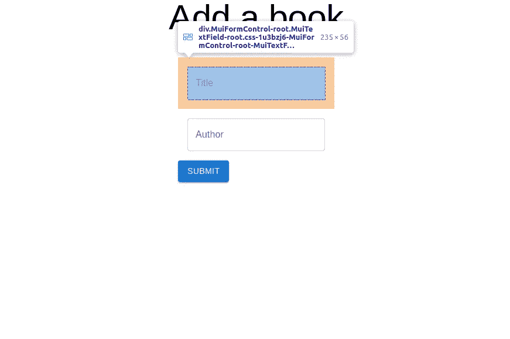

边距正确应用于每个文本字段

现在我们可以看到，16px 的边距应用正确，并且在 Stack 组件中输入之间有空间！

# sx prop 和响应式设计

借助于 [MUI 的自定义断点属性，sx prop 还可以用于创建响应式设计。](https://mui.com/material-ui/customization/breakpoints/)这允许灵活响应的内嵌样式。每个断点对应一个特定的屏幕宽度。直接从 MUI 的页面断点是:

*   **xs** ，超小型:0px
*   **sm** ，小:600px
*   **md** ，中等:900 像素
*   **lg** ，大:1200px
*   **xl** ，特大号:1536px

比方说，当屏幕尺寸较小时，我们希望将窗体的对齐方式改为垂直居中。我们可以根据屏幕的大小设置不同的 CSS 属性。从 **xs** (0px)到 **md** (900px)我们希望内容垂直居中，在 **md** (900px)点之后，我们希望内容垂直出现在顶部。我们将在 Box 组件的 *sx* 属性中进行设置，并确保我们专门为 *justifyContent* 属性设置了断点。

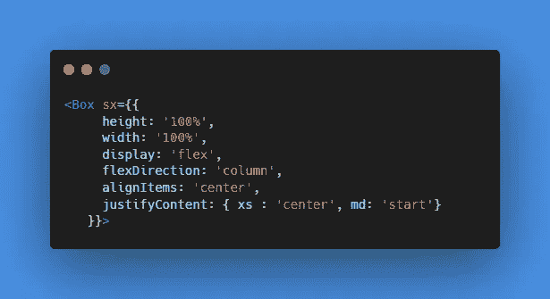

将自定义断点应用于 Box 组件的 justifyContent 属性

现在我们可以看到，根据屏幕大小，内容的垂直对齐方式会发生变化！

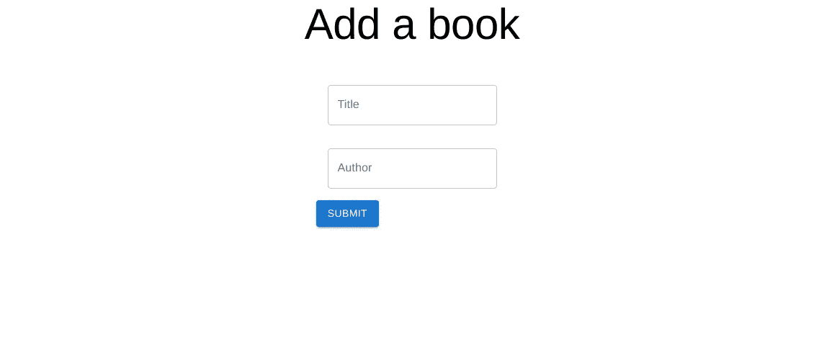

在更大的屏幕上，表单内容垂直显示在顶部

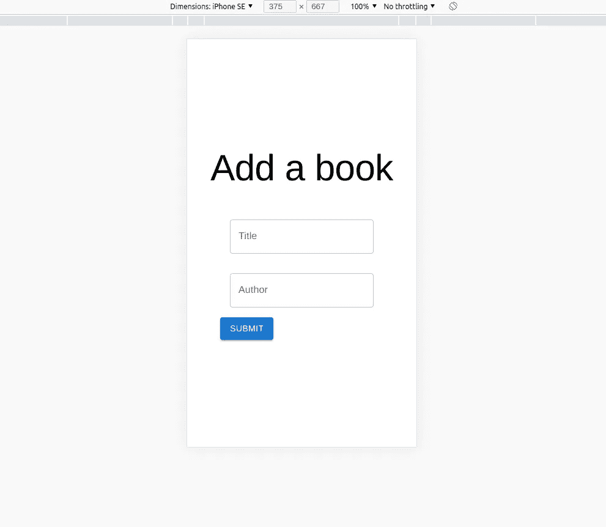

在较小的屏幕尺寸下，表单内容垂直居中显示

这篇文章演示了:

*   实现 *sx* 道具的基础
*   MUI 的自定义样式属性
*   如何在 *sx* 道具中嵌套 CSS 选择器
*   使用 *sx* 道具进行响应式设计

希望现在对于你看的任何过时的 MUI 教程来说，使用 *sx* prop 修改和应用内联样式应该更加容易和灵活！

*感谢* [*聪明的 Dev 的*](https://www.youtube.com/watch?v=zV-jDJx6XjI) *神奇的梅资源启发了这篇帖子！*