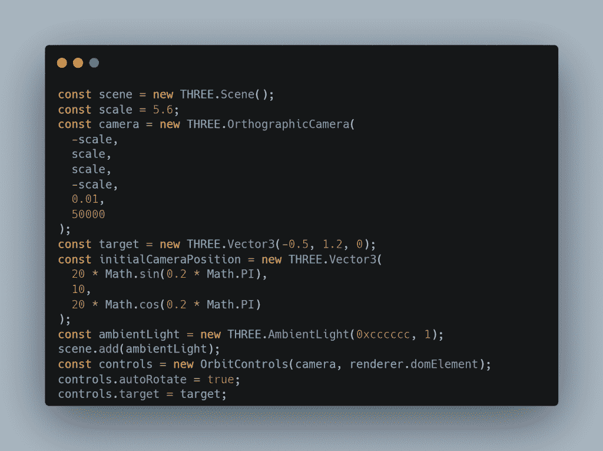

# 如何在 React 应用程序中使用 three.js 渲染 3D 模型

> 原文：<https://blog.devgenius.io/how-to-use-three-js-in-a-react-app-to-render-a-3d-model-4a1d31ead00c?source=collection_archive---------1----------------------->


Mehmet Turgut Kirkgoz 在 [Unsplash](https://unsplash.com/s/photos/dinosaur?utm_source=unsplash&utm_medium=referral&utm_content=creditCopyText) 上拍摄的照片

在浏览 YouTube 时，我看到了下面的[视频](https://www.youtube.com/watch?v=bSMZgXzC9AA)，这是一个相当简洁的教程，讲述了如何建立一个整洁的作品集页面。但是使用的一项技术是 three.js，它可以用相机控件来渲染一个看起来很酷的 3D 模型！

我想了解这项技术是如何工作的，并使用相同的技术堆栈快速创建一个独立的沙盒。我将解释编码的过程以及它是如何工作的！

# 建立

```
npm i three
```

首先，让我们继续安装必要的软件包:

让我们将它导入到我们想要使用它的文件中:

```
import * Three from "three"; 
import { GLTFLoader } from "three/examples/jsm/loaders/GLTFLoader";
```

# 加载程序功能

three.js 库有一个 glTF 2.0 资源的加载器(GL 传输格式)。这是我们将用于将模型加载到应用程序中的主要函数！这应该用一个承诺来包装，因为它是一个异步过程。让我们把这个分开:


这个函数接受一个场景，就是我们如何设置我们的模型将要被渲染的内容和位置。有了这个，我们可以决定如何放置内部物体，相机控制和不同的灯光效果。第二个参数是 glbPath，它是我们模型的资源，稍后会详细介绍，最后是任何第二个选项。

我们创建了一个 GLTFLoader 的新实例，并用内部 load 函数设置了所有的加载常量。本例中的 Traverse 是一个回调函数，用于维护 castShadow 和 receiveShadow 的值。

# 反应组分

接下来，让我们创建组件，这只需要一个链接到 useRef 钩子的 ref:


让我们了解一些基本的状态管理。我们需要在应用程序中实时构建一个渲染器，所以我们将使用 useState 钩子。由于这是实时的，我们还将在初始挂载后使用 useEffect 挂钩来构建它:


我们必须确保渲染器还不存在，并检查组件是否正确安装了 ref。现在我们可以进入构建渲染器的本质细节。

# 渲染器

我们将使用的渲染是 [WebGLRenderer](https://threejs.org/docs/#api/en/renderers/WebGLRenderer) 。让我们创建它并设置默认值(全部在 useEffect 内部 if 中):


这里没有什么太疯狂的事要说，我建议查看文档，了解关于每个已设置属性的更深入的信息。

# 控件和场景

这些非常简单，不需要疯狂的配置:



增加了一些任意缩放和相机定位。如果你愿意，你可以玩玩这个！和一些灯光来看模型本身。

最后，我们可以继续制作模型的动画，并确保它能与控件一起正常工作！


一些数学来帮助旋转，并在必要时更新控制。我们用所有属性调用渲染器的渲染函数。

渲染部分的最后一步是调用我们在最开始制作的函数！


您可能已经注意到了 setLoading 状态。由于我们的加载函数是异步的，我们需要考虑模型渲染的延迟。唯一值得一提的是在正确加载模型后调用 animate 函数。

# 边注

我从以下站点免费获得了该模型:

jeilocreativedesignworld 的“恐龙”([https://skfb.ly/6ZBXA](https://skfb.ly/6ZBXA))在知识共享署名(【http://creativecommons.org/licenses/by/4.0/】T2)下获得许可。

# 结论

就是这样！这是完整的代码和最终结果，一切都连接起来。任何型号都可以。我鼓励其他人去尝试它，去体验它的价值！

【https://codesandbox.io/embed/react-three-render3d-qobqy? font size = 14&hide navigation = 1&theme = dark

更多内容在[相关代码](https://relatablecode.com)

*原载于 2022 年 2 月 6 日 https://relatablecode.com**的* [*。*](https://relatablecode.com/how-to-use-three-js-in-a-react-app-to-render-a-3d-model/)