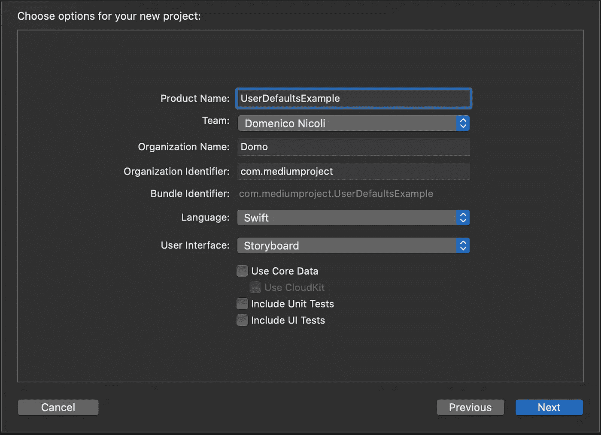
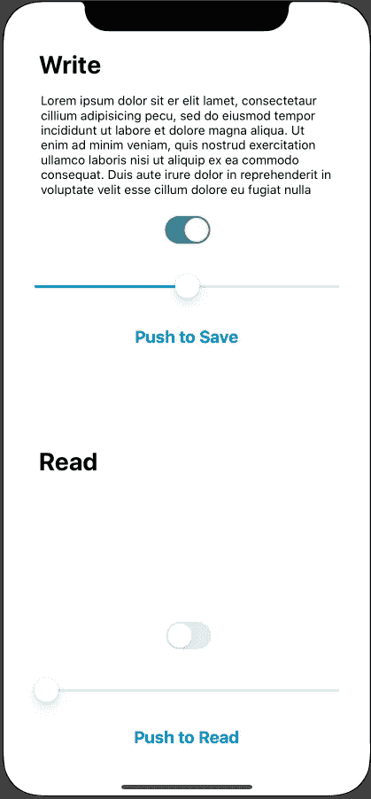
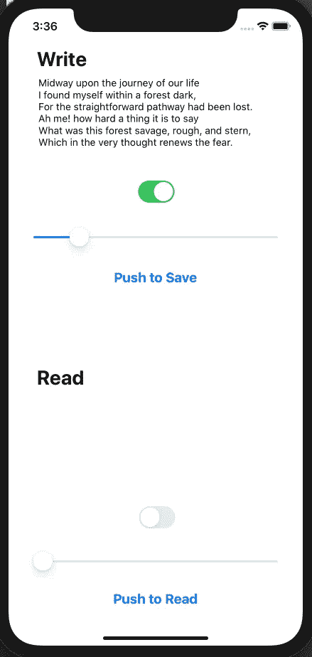
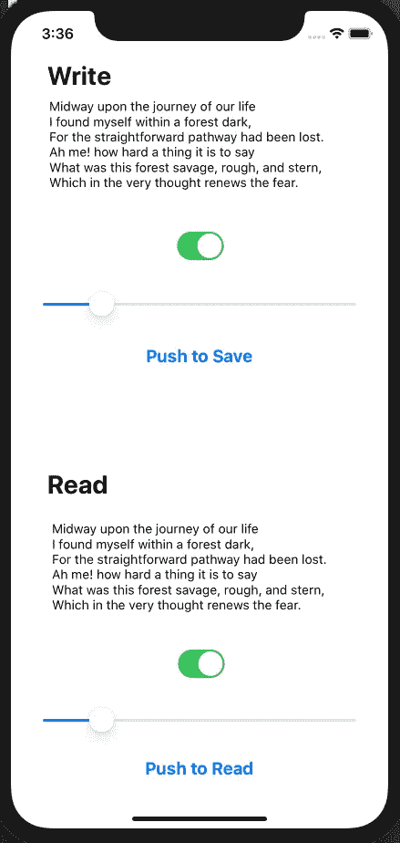

# 如何在 Swift 中使用用户默认值

> 原文：<https://blog.devgenius.io/how-to-use-userdefaults-in-swift-297898443165?source=collection_archive---------1----------------------->

## 用几行代码轻松保存用户设置


[法比安·格罗斯](https://unsplash.com/@grohsfabian?utm_source=medium&utm_medium=referral)在 [Unsplash](https://unsplash.com?utm_source=medium&utm_medium=referral) 上拍摄的照片

从 iOS 2.0 开始提供的`UserDefaults`，只要安装了 app，就提供了存储持久化值的接口。`UserDefaults`类似于一个数据库。它可以作为一种方便的方式来保存少量的可用数据，即使你关闭应用程序并重新启动它。如果您需要存储大数据或通过复杂的查询访问它，您可能需要使用 SQLite 或核心数据。

像所有在封闭沙盒中运行的 iOS 应用一样，一个应用不能从任何其他应用修改`UserDefaults`——除非通过应用扩展。

你可以在[官方文件](https://developer.apple.com/documentation/foundation/userdefaults)中找到更多信息。

# 入门指南

首先打开 [Xcode，](https://developer.apple.com/xcode/)新建一个项目。选择单视图应用程序。



转到`Main.Storyboard`文件，创建两个不同的部分:`Write`和`Read`。这里，添加三个控件:一个`textbox`、一个`switch`和一个`slider`。我们将使用这个接口来测试我们的`UserDefaults`实现。



# 履行

首先，进入你的`ViewController.swift`，为所有控件创建`IBOutlet`。然后，添加以下代码:

```
class ViewController: UIViewController {

    @IBOutlet weak var writeTextView: UITextView!
    @IBOutlet weak var writeSwitch: UISwitch!
    @IBOutlet weak var writeSlider: UISlider!

    @IBOutlet weak var readTextView: UITextView!
    @IBOutlet weak var readSwitch: UISwitch!
    @IBOutlet weak var readSlider: UISlider!

    let defaults = UserDefaults.standard

    override func viewDidLoad() {
        super.viewDidLoad()
        // Do any additional setup after loading the view.
    }

    func textFieldShouldReturn(_ textField: UITextField) -> Bool {
        self.view.endEditing(true)
        return false
    }

    override func touchesBegan(_ touches: Set<UITouch>, with event: UIEvent?) {
        self.view.endEditing(true)
    }

    @objc func keyboardWillShow(notification: NSNotification) {
        if let keyboardSize = (notification.userInfo?[UIResponder.keyboardFrameEndUserInfoKey] as? NSValue)?.cgRectValue {

            if self.view.frame.origin.y == 0 {

                self.view.frame.origin.y -= keyboardSize.height - 85

            }
        }
    }

    @objc func keyboardWillHide(notification: NSNotification) {
        self.view.frame.origin.y = 0
    }

    @IBAction func saveButtonTapped(_ sender: Any) {
        defaults.set(writeTextView.text, forKey: "writeTextViewValue")
        defaults.set(writeSwitch.isOn, forKey: "writeSwitchValue")
        defaults.set(writeSlider.value, forKey: "writeSliderValue")
    }

    @IBAction func readButtonTapped(_ sender: Any) {
        readTextView.text = defaults.string(forKey: "writeTextViewValue")
        readSwitch.isOn = defaults.bool(forKey: "writeSwitchValue")
        readSlider.value = defaults.float(forKey: "writeSliderValue")
    }

}
```

当我们从`UserDefaults`中读取数据时，我们可以使用不同的方法来获取为特定键存储的数据。这是因为如果找不到数据，返回值是。下面是支持的数据类型:

*   `object(forKey:)`返回与指定键相关联的对象，如果找不到则返回 nil
*   `url(forKey:)`返回与指定键相关联的 URL，如果找不到则返回 nil
*   `array(forKey:)`返回与指定键相关的数组，如果找不到则返回 nil
*   `dictionary(forKey:)`返回与指定键相关联的字典；如果找不到或其值不是有效的字典，则为空
*   `string(forKey:)`返回与指定键相关的字符串；如果找不到或者不是有效的字符串或有效的数值，则为 nil
*   `stringArray(forKey:)`返回与指定键相关的字符串数组；如果找不到或数组不包含字符串，则为空
*   `data(forKey:)`返回与指定键相关的数据对象；如果找不到或其值不是数据对象，则为空
*   `bool(forKey:)`返回与指定键相关联的布尔值，如果未找到，则返回 false。该方法将“是”、“1”和“真”等字符串强制转换为真值。对于假值也是如此。
*   `integer(forKey:)`返回与指定键相关的整数，如果没有找到则返回 0
*   `float(forKey:)`返回与指定键相关的浮点数，如果没有找到则返回 0
*   `double(forKey:)`返回与指定键相关的双精度值，如果没有找到则返回 0
*   `dictionaryRepresentation(forKey:)`返回包含与指定键关联的所有键-值对的并集的字典

# 试验

最后，我们准备测试应用程序。

运行模拟器，在第一个`text box`中写入一些文本，更改`switch`状态，更改`slider`值，然后点击“按下保存”按钮。

现在，如果您点击屏幕底部的“Push to Read”按钮，您会看到之前保存的值将被加载到 Read 部分的三个控件中。

你也可以尝试关闭应用程序，重新启动它，然后读取数据。您将看到先前保存的数据将被加载到读取部分。

[](https://www.buymeacoffee.com/nicolidomenico)

# 完整代码

你可以在 [GitHub](https://github.com/domeniconicoli/UserDefaultsExample) 上找到完整的代码。

感谢您的阅读。