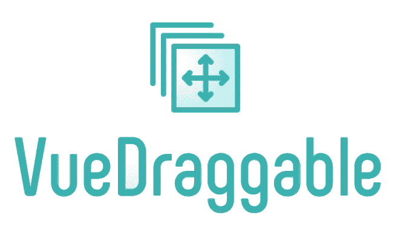
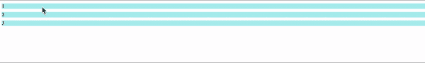
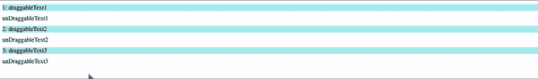

# 如何通过组合 api 使用 vue-draggable.next

> 原文：<https://blog.devgenius.io/how-to-use-vue-draggable-next-with-composition-api-2900024cb3b7?source=collection_archive---------3----------------------->



图片来自[https://www.npmjs.com/package/vue-draggable](https://www.npmjs.com/package/vue-draggable)

# 目的

当我在一个当前项目中使用 [vue-draggable.next](http://vue-draggable.next) 和组合 api 时，我被分配到这个库，我正在努力实现这个项目的要求。

我猜网上有使用这个库的有用资源和文章，但是没有很多具体的例子。所以，我将与你分享这些知识。

# 什么是 [vue-draggable.next](http://vue-draggable.next) ？

正如我已经提到的，这是一个实现拖放功能的库。从 vue3 开始，名称略有变化，新版本命名为. next。

这个库为什么有用？因为你可以实现拖放更少的代码，并用 props 添加一些特性(例如。何时开始拖放以及何时结束拖放)

下面是一个带有组合 api 脚本设置的示例。安装非常简单，只需用“npm i vuedraggable @ next”安装包，照常导入库即可。

在 vue3 中，您需要添加模板标签和#item={element}而不是 v-for，然后您可以访问这些元素，如{ {[element . name](http://element.name)} }

如果将组属性添加到 draggable 标记，则可以创建多个区域并将元素转移到不同的区域。而且如果加上手柄道具，可以用一个元素作为手柄来拖动。

因为有非常有用的道具我不能展示，如果你感兴趣，请参考官方文件。

```
<script setup>
import { ref } from "vue";
import draggable from "vuedraggable";

const data = ref([
  {
    id: 1,
    content: "test1",
  },
  {
    id: 2,
    content: "test2",
  },
  {
    id: 3,
    content: "teat3",
  },
]);
</script>

<template>
  <div class="hello">
    <draggable v-model="data" item-key="id">
      <template #item="{ element }">
        <div class="drag-item">
          {{ element.id }}
        </div>
      </template>
    </draggable>
  </div>
</template>

<style scoped>
.drag-item {
  background: blue;
  margin: 10px 0;
}
</style>
```

这是我的屏幕。您可以看到通过拖放改变了顺序



以上是非常基本的用法，但如果你还有其他要求，我们该如何实现呢？

# 需求 1:拖拽后保存订单。

这是最常见的要求之一，因为如果你想在你的应用程序中使用拖放功能，你需要保存这些订单。你基本上可以选择两个选项，保存在本地存储或你的后端。然而，你可能知道本地存储有时是危险的，因为黑客可以看到你的本地存储。所以最常见的方法是发送您的后端。所以，我就用这种方式来解释。

解决方案很简单，所有我们需要实现的是“拖动元素后，保存新订单到您的后端”。如果给 draggable 加上@end 道具，就可以了。

下面是一个示例代码。在真实的情况下，你需要创建你的后端，但我会告诉你只是一个前端部分。我想强调这种方式是一个例子，但我想基本思想是相同的，即使代码是不同的。

```
<script setup>
import { ref } from "vue";
import draggable from "vuedraggable";

const data = ref([
  {
    id: 1,
    order: 1,
    content: "test1",
  },
  {
    id: 2,
    order: 2,
    content: "test2",
  },
  {
    id: 3,
    order: 3, 
    content: "teat3",
  },
]);

const onDragEnd = async () => {
// THIS CODE IS JUST AN IDEA
 for (let i = 0; i < data.length; i++) {
    try {
      const res = await axios.put("YOUR BACKEND PATH", {
        id: data[i].id,
      });
      console.log(res.data);
      return;
    } catch (err) {
      console.log(err);
      return;
    }
  }
};

</script>

<template>
  <div class="hello">
    <draggable v-model="data" item-key="id" @end="onDragEnd">
      <template #item="{ element }">
        <div class="drag-item">
          {{ element.id }}
        </div>
      </template>
    </draggable>
  </div>
</template>

<style scoped>
.drag-item {
  background: blue;
  margin: 10px 0;
} 
```

# 需求 2:用一些不可拖动的元素创建不同的可拖动区域。

我被分配的一个项目的要求有点复杂，因为我需要创建一些可拖动和不可拖动的元素，如下所示。



我的解决方法如下。这个解决方案并不难，但你需要有一些想法。

首先，你需要创建一个可拖动的元素作为数组中的一个对象，因为如果你想创建不同的区域，你需要创建你的每个元素作为数组。而且有必要为不可拖动内容创建不同的数组。

其次，您需要添加“v-for”元素来创建多个可拖动区域。然后，您可以插入不可拖动的内容，以使用“v-for”元素的索引。

第三，你需要创建一个可拖动的元素，不是“v-model ”,而是“:list ”,因为如果你使用 v-model，这个函数不起作用(如果你添加 v-model，你会得到这样一个错误。内部服务器错误:v-model 不能用于 v-for 或 v-slot 范围变量，因为它们不可写。).

```
<script setup>
import { ref } from "vue";
import draggable from "vuedraggable";

const dataList = ref({
  draggable: [
    [
      {
        id: 1,
        content: "draggableText1",
      },
    ],
    [
      {
        id: 2,
        content: "draggableText2",
      },
    ],
    [
      {
        id: 3,
        content: "draggableText3",
      },
    ],
  ],
  unDraggable: [
    {
      id: 1,
      content: "unDraggableText1",
    },
    {
      id: 2,
      content: "unDraggableText2",
    },
    {
      id: 3,
      content: "unDraggableText3",
    },
  ],
});
</script>

<template>
  <div v-for="(draggableData, index) in dataList.draggable" class="hello">
    <draggable :list="draggableData" group="test" :key="draggableData">
      <template #item="{ element }">
        <div class="drag-item">{{ element.id }}: {{ element.content }}</div>
      </template>
    </draggable>
    {{ dataList.unDraggable[index].content }}
  </div>
</template>

<style scoped>
.drag-item {
  background: paleturquoise;
  margin: 10px 0;
}
</style> 
```

# 结论

[Vue-draggable.next](http://Vue-draggable.next) 是一个有用的实现拖放功能的库，但是有时候你需要一些想法来实现你需要的东西。希望这篇文章对你有帮助。

# 参考

官方指南:【https://github.com/SortableJS/vue.draggable.next 

感谢您的阅读！！