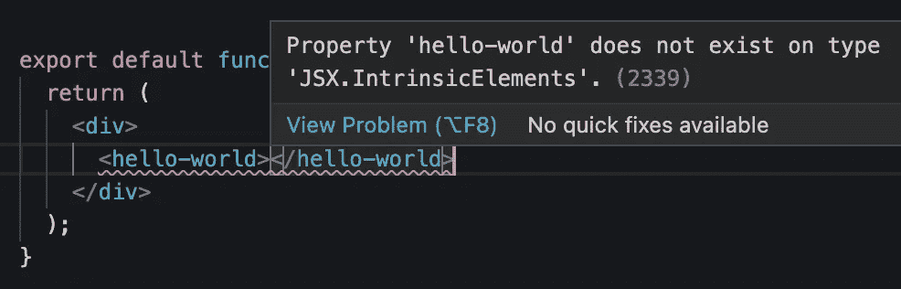
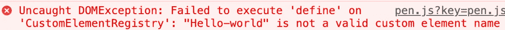

# 如何在 React 中使用 Web 组件

> 原文：<https://blog.devgenius.io/how-to-use-web-components-in-react-54c951399bfd?source=collection_archive---------2----------------------->

## Web 组件使我们能够完全独立于前端框架进行开发。

原照片由 [Cytonn 摄影](https://www.pexels.com/de-de/@cytonn?utm_content=attributionCopyText&utm_medium=referral&utm_source=pexels)发自 [Pexels](https://www.pexels.com/de-de/foto/zwei-personen-im-langarmeligen-hemd-shakehand-955395/?utm_content=attributionCopyText&utm_medium=referral&utm_source=pexels)

许多开发人员对 Web 组件清除前端框架和库的想法感到威胁。这种情况不会发生，因为两种技术解决的是不同的问题。但是，将它们结合起来才是成功的真正秘诀。

> *“大多数使用 React 的人都不使用 Web 组件，但是你可能想[……]”——*[*https://reactjs.org*](https://reactjs.org/docs/web-components.html)

在深入我们的例子之前，让我们看看 Web 组件和 React 的用途。

# Web 组件的用途

Web 组件是基于官方 web 标准的可重用客户端组件，受所有主流浏览器支持。它们是将**的**功能从我们其余的代码中封装出来的绝佳方式。不仅如此，你还可以在每个网络应用程序和网页中重用它们。

他们的目的是编写在任何地方都可以使用的封装强大的定制元素。Web 组件使我们能够完全独立于前端框架进行开发。

> Web 组件的主要好处是我们可以在任何地方使用它们。有任何框架，甚至没有框架。——[*vuejs.org*](https://v3.vuejs.org/guide/web-components.html)

# 反应的目的

虽然 Web 组件为可重用组件提供了强大的封装，但 React 提供了一个声明性库，使 DOM 与数据保持同步。

> 作为开发者，你可以自由地在你的 Web 组件中使用 React，或者在 React 中使用 Web 组件，或者两者都用。——[*https://reactjs.org*](https://reactjs.org/docs/web-components.html)

与 Web 组件的主要区别在于，我们只能在 React 应用程序中使用 React 组件。另一方面，Web 组件可以在任何地方使用。我们可以在 React、Vue、Angular 或任何其他 web 应用程序中使用它。

当您的组件需要处理大量需要传递给子组件的数据时，React 是一个不错的选择。

 [## Web 组件会取代前端框架吗？

### 它们是为解决不同的问题而构建的。

medium.com](https://medium.com/@mariusbongarts11/will-web-components-replace-frontend-frameworks-535891d779ba) 

# 构建 Web 组件

让我们继续构建我们的第一个 Web 组件，我们将把它集成到 React 应用程序中。

我们将保持事情简单，并创建一个轻松的自定义元素。如果您对构建更复杂的 Web 组件感兴趣，请阅读我的系列文章:[完整的 Web 组件指南](https://medium.com/@mariusbongarts11/the-complete-web-component-guide-part-1-custom-elements-a627af805df8)。

下面是我们的`hello-world`定制元素的 JavaScript 代码:

将这段 JavaScript 代码加载到我们的 HTML 中，我们可以像这样轻松地包含我们的组件:

`<hello-world></hello-world>`

那将显示我们的"**你好世界！"**头条。你自己试试。这里是[码笔](https://codepen.io/marius2502/pen/ZErXXLL)。

# 在 React 中集成一个 Web 组件

让我们将 Web 组件包含在一个正在运行的 React 应用程序中。为了简单起见，我们将在 [Stackblitz](https://stackblitz.com/edit/react-ts) 上进行一个 React starter 项目。之后，我们创建文件`hello-world.js`,并将上面的 Web 组件代码放入其中。

 [## 你不需要 React 来创建一个可重用的按钮！

### 请改用 Web 组件！

javascript.plainenglish.io](https://javascript.plainenglish.io/you-dont-need-react-to-create-a-reusable-button-2108cfeac38c) 

接下来，我们进入 React 组件，导入包含 Web 组件代码的 Javascript 文件:

`import ./hello-world`

瞧啊。预览显示我们的 Web 组件。我们成功地将一个定制元素集成到 React 中。

尽管如此，编辑器中还是有一个错误:

属性不存在错误

它说"*属性' hello-world '在类型' JSX '上不存在。“*。发生该错误是因为 React 组件应该总是以大写字母开头。我们的组件名称以小写字母开头。那么，我们应该改变我们的自定义标签，以大写字母开始吗？

让我们试试:

不是有效的自定义元素名称

正如你所看到的，我把我们的定制标签改成了`Hello-world`。但是，当调用`customElements.define("Hello-world")`时，浏览器会抛出一个异常，因为我们违反了元素标签名称所遵循的两条规则之一:

*   *名称已经以* ***小写 ASCII 字符*** *开头。它不能有大写的 ASCII 字符。*
*   ***名称必须包含破折号*** *—字符。这个破折号字符帮助浏览器区分自定义元素和常规元素。*

我们只允许使用小写字符，并且组件需要包含至少一个破折号。那么，如何修复错误呢？Typescript 给了我们声明自己类型的可能性。要修复这个错误，我们可以通过扩展 React 的`IntrinsicElements`接口来定义我们的自定义元素类型，如下所示:

最后，我们成功地集成了我们的定制元素，没有任何错误地做出反应。下面是这个例子的最后一个栈:

# 最后的想法

在 React 中使用 Web 组件很容易。构建可在整个前端框架中使用的可重用组件有很多好处。我们已经知道，在创建可重用的组件以便在任何地方使用时，我们应该使用 Web 组件。在处理大量数据时，React 是最佳选择。

我希望你喜欢阅读这篇文章。我总是很乐意回答问题，也乐于接受批评。请随时联系我😊

***如果想支持我写作，*** [***成为中等会员***](https://medium.com/@mariusbongarts/membership) ***。如果你这样做，我会得到一小笔佣金。谢谢！***

 [## 通过我的推荐链接加入 Medium-Marius bong arts

### 作为一个媒体会员，你的会员费的一部分会给你阅读的作家，你可以完全接触到每一个故事…

medium.com](https://medium.com/@mariusbongarts/membership) 

关注我，不要错过我的下一篇文章。我写了关于 Typescript、Web 组件、前端框架、软件设计模式、Chrome 扩展以及更多的主题！🙏

# 关于我

我是埃森哲互动公司的软件工程分析师。最驱动我的是我想创造一些可能对他人有帮助并改变他人生活的东西的冲动。例如，[**Web Highlights Chrome Extension**](https://chrome.google.com/webstore/detail/web-highlights-%20-bookmark/hldjnlbobkdkghfidgoecgmklcemanhm)使您能够高亮显示您在浏览器中访问的每个页面或 PDF 上的文本。您可以提供标签来对您的研究进行分组，并非常容易地重新找到它。你所有的精彩瞬间都会同步到 web-highlights.com[的相应网络应用程序上。看看吧！](https://web-highlights.com/)

通过**[**LinkedIn**](https://www.linkedin.com/in/marius-bongarts-6b3638171/)**与我取得联系或者在 [**Twitter**](https://twitter.com/MariusBongarts) 上关注我。****

**** [## 网络亮点- PDF 和网络荧光笔

### 在每个网站或 PDF 上创建亮点、书签、标签和文件夹。以结构化的方式组织您的想法和研究…

chrome.google.com](https://chrome.google.com/webstore/detail/web-highlights-pdf-web-hi/hldjnlbobkdkghfidgoecgmklcemanhm)**** 

# ****进一步阅读****

**** [## 用 Web 组件构建自己的博客组合:基础

### 第 1 部分—定制元素、阴影 DOM 和 HTML 模板

medium.com](https://medium.com/@mariusbongarts11/showcase-your-medium-articles-with-web-components-part-1-basics-d2c6618e9482)  [## 如何用 Web 组件构建一个中型文本荧光笔作为 Chrome 扩展

### 我一直喜欢中型荧光笔，它出现在选择文章中的文本时。我认为这将是很好的…

medium.com](https://medium.com/@mariusbongarts11/how-to-build-the-medium-text-highlighter-as-a-chrome-extension-with-web-components-b3feccddcd01)  [## 完整的 Web 组件指南:自定义元素

### 成为 Web 开发未来的专家(第 1 部分)

medium.com](https://medium.com/@mariusbongarts11/the-complete-web-component-guide-part-1-custom-elements-a627af805df8)  [## 具有代码挑战的高级类型脚本:类型保护

### 学习高级的 TypeScript 特性，并将它们应用到实际的代码练习中。

medium.com](https://medium.com/@mariusbongarts11/advanced-typescript-with-code-challenges-type-guards-a5b24bb6d46b)****