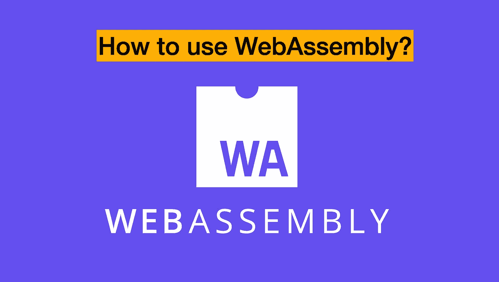
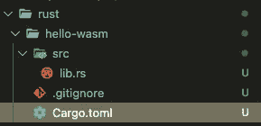
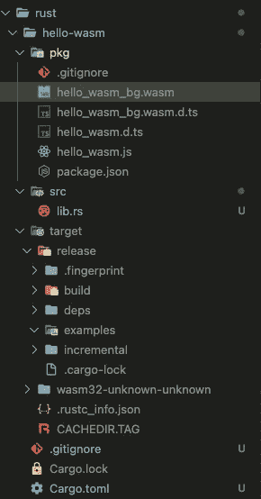
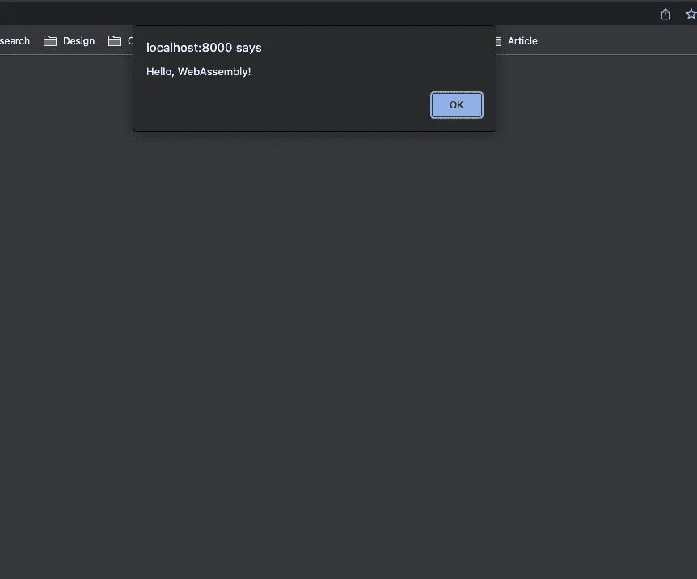

# 如何使用 WebAssembly

> 原文：<https://blog.devgenius.io/how-to-use-webassembly-c021184c6834?source=collection_archive---------2----------------------->



# 目的

当我读了几篇关于 WebAssembly 可以取代 JavaScript 作为浏览器语言的文章时，我对这项技术很感兴趣，我将与您分享。

# 什么是 WebAssembly？为什么这很有用？

```
WebAssembly (abbreviated Wasm) is a binary instruction format for a stack-based virtual machine. Wasm is designed as a portable target for compilation of high-level languages like C/C++/Rust, enabling deployment on the web for client and server applications.
```

以上句子摘自官方指南。基本上这不是一种编程语言，而是一种二进制指令格式。正如这个定义所提到的，我们也可以在服务器应用程序上使用 Wasm，但是为了简单起见，我将重点放在客户端，尤其是浏览器上。

JavaScript 在浏览器上非常有用，但如今 web 开发变得越来越复杂，所以 Wasm 来了。例如，我们需要专注于视频、3d 游戏、浏览器上的图像识别。当然，JavaScript 也变得更快了，比如引入了即时方法，但是它们在处理编译类型方面也有一些缺点。从 2013 年开始，asm.js 作为 JavaScript 子集被 Mozilla 发明。该子集允许在调用本机代码之前编译本机代码，以便在浏览器上更快地运行本机代码。听起来很好，但 asm.js 使文件大小变得更大，这就是为什么 Wasm 是从 2015 年发明的。

由于 Wasm 被定义为一个低级模块，这就不受 JavaScript 函数的限制并充分利用 CPU 的能力。此外，这种格式不依赖于操作系统，所以这是工作在 Windows，Mac，Linux，以及移动正确。特别是在移动设备上，因为与 PC 相比，移动设备通常没有很好的 CPU 能力，如果您需要复杂但需要的 CPU 能力，Wasm 是一个很好的解决方案。这种格式的主要缺点是他们不能直接管理 DOM，尽管这种格式允许我们导入和使用它(在未来，这种情况是无法改变的)。

那么，Wasm 会取代 JavaScript 吗？实际上不是，因为这种格式是为了赞美 JavaScript 而发明的，而不是为了取代它。一些公司试图用 Rust 替代 Wasm 中的 JavaScript，这并不是预期的结果，它比 JavaScript 快 10 倍。换句话说，JavaScript 对于基本、简单、普通的应用程序来说已经足够快了，因为 Wasm 不直接管理 DOM，所以 Wasm 应该多次接触 JavaScript，这需要很多时间。那么，Wasm 的用例是什么？例如，您需要相当丰富但必要的 CPU 能力，或者您需要通过浏览器上的机器学习来实现图像识别，或者您需要高性能来在浏览器上运行游戏代码。在谷歌，Wasm 用于谷歌地球和谷歌会议模糊背景。

好了，这就足够解释 Wasm 的基本了。让我们深入一个例子来编译 Rust 的一些代码。如果你想了解 Rust 本身，我推荐你看《官方指南》(因为这是易读的好内容)。在安装和基础方面，你可以参考我过去关于 Rust 的文章，因为我简要解释了如何使用 Rust(包括如何设置路径)。

# 示例(如何将现有 Rust app 编译成 Wasm)。

## 步伐

1.  准备一个 Rust app(通过官方指南或者我过去的文章或者任何其他的)。
2.  使用 cargo 安装 wasm-pack 作为附加工具

```
> cargo install wasm-pack
```

3.按货物创建新项目

```
> cargo new --lib hello-wasm // this name is up to you
     Created library `hello-wasm` package
```

下面是项目的结构，你可以看到配置一的 lib.rs 和 Cargo.toml 文件。



4.将您的 lib.rs 代码更改为下面的代码。导入 wasm_binden 模块，提供 JavaScript 和 Rust 之间的桥梁，并使用它。

```
use wasm_bindgen::prelude::*; #[wasm_bindgen]
extern {
    pub fn alert(s: &str);
} #[wasm_bindgen]
pub fn greet(name: &str) {
    alert(&format!("Hello, {}!", name));
```

5.将您的 Cargo.toml 代码更改为以下代码。您也可以添加作者和 github 库，但这不是强制性的。

```
[package]
name = "hello-wasm"
version = "0.1.0"
description = "A sample project with wasm-pack"
license = "MIT/Apache-2.0"
edition = "2018" [lib]
crate-type = ["cdylib"] [dependencies]
wasm-bindgen = "0.2
```

6.使用下面的命令构建您的项目。将你的 Rust 文件编译成 Wasm 并生成一些文件。不要忘记移动您的项目(cd 您的项目名称)

```
wasm-pack build --target web
```

构建之后，您可以看到文件结构发生了变化。有很多像下面这样的文件。



7.在根目录下创建 index.html 文件。您可以在任何地方创建这个文件，但是您需要更改文件路径。

```
<!DOCTYPE html>
<html>
  <head>
    <meta charset="utf-8" />
    <title>hello-wasm example</title>
  </head>
  <body>
    <script type="module">
      import init, { greet } from "./pkg/hello_wasm.js";
      init().then(() => {
        greet("WebAssembly");
      });
    </script>
  </body>
</html>
```

8.在本地服务器上运行这个 index.html 文件。如果使用 VS 代码，可以使用 Live 服务器扩展。或者，您可以使用 python 服务器执行以下命令。

```
> python3 -m http.server
Serving HTTP on :: port 8000 (http://[::]:8000/) ...
```

9.如果使用 python 服务器，需要访问“localhost:8000”。您无需自己编写任何 JavaScript 代码就可以看到警报代码。厉害！



# 结论

正如我提到的，WebAssembly 是在浏览器上编译本机代码的一种非常有用的格式。您不需要自己编写任何 JavaScript 代码，而且基本上比 JavaScript 快(这取决于您的环境和代码)。如果你想创建一些功能或应用程序，需要大量的 CPU 能力，如丰富的动画或浏览器上的图像识别，Wasm 会帮助你。

# 参考

*   官方网站:[https://webassembly.org/](https://webassembly.org/)
*   https://developer.mozilla.org/en-US/docs/WebAssembly
*   将 Rust 编译成 web assembly:[https://developer . Mozilla . org/en-US/docs/web assembly/Rust _ to _ wasm](https://developer.mozilla.org/en-US/docs/WebAssembly/Rust_to_wasm)
*   什么是 WebAssembly？下一代网络平台讲解:[https://www . infoworld . com/article/3291780/what-is-web assembly-the-next-generation-we B- platform-explained . html](https://www.infoworld.com/article/3291780/what-is-webassembly-the-next-generation-web-platform-explained.html)
*   https://qiita.com/ShuntaShirai/items/3ac92412720789576f22[webassemblyとは:](https://qiita.com/ShuntaShirai/items/3ac92412720789576f22)
*   出来ることは計算だけ？ 「WebAssembly」は一体何が新しいのか？: [https://mixil.mixi.co.jp/people/12242](https://mixil.mixi.co.jp/people/12242)

感谢您的阅读！！