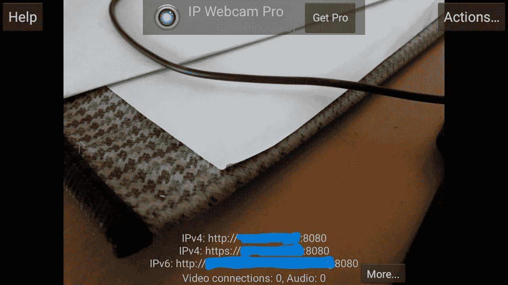
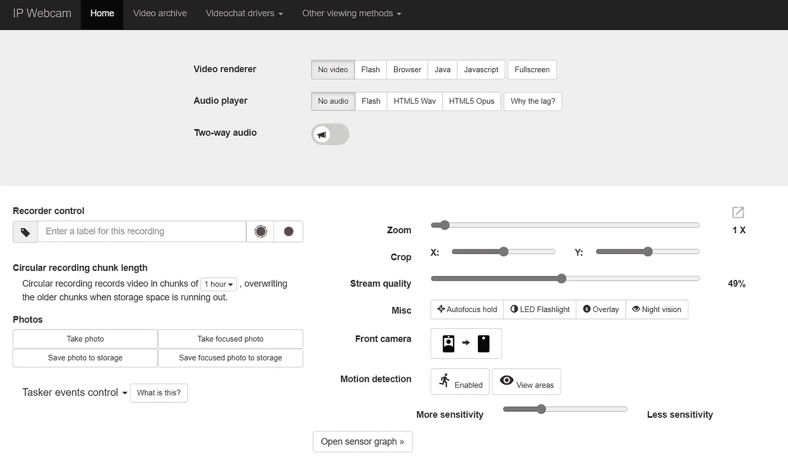
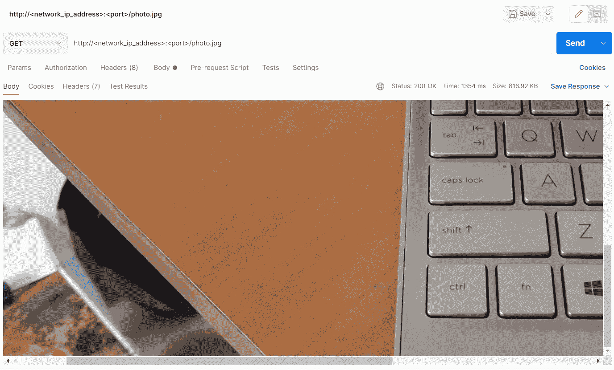
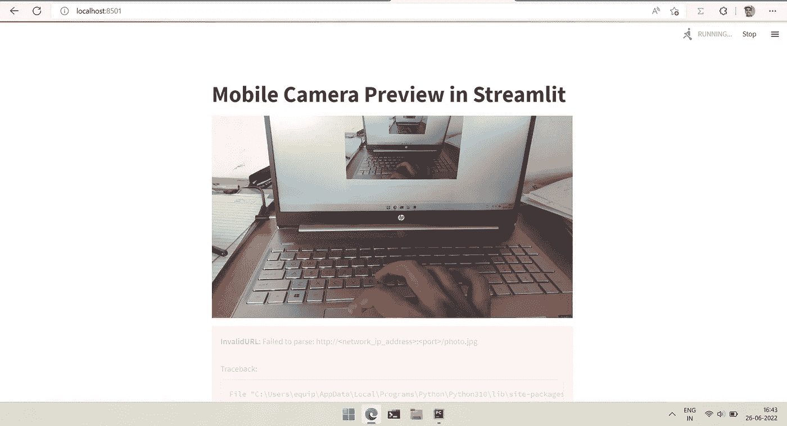
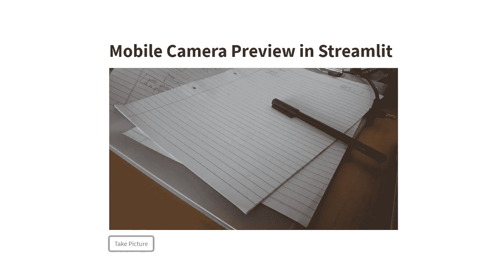
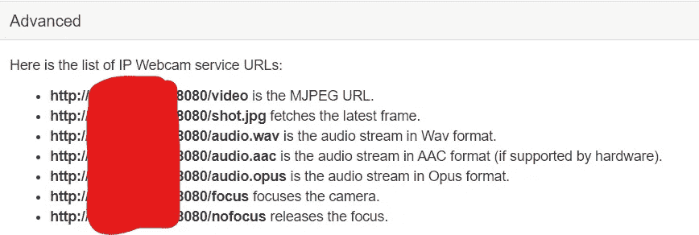

# 如何通过 Streamlit 使用您的手机摄像头

> 原文：<https://blog.devgenius.io/how-to-use-your-mobile-camera-with-streamlit-546b8de35404?source=collection_archive---------7----------------------->

## 一个专业黑客为您的 ML 演示


照片由 [Rodion Kutsaev](https://unsplash.com/@frostroomhead?utm_source=medium&utm_medium=referral) 在 [Unsplash](https://unsplash.com?utm_source=medium&utm_medium=referral) 上拍摄

> 与培训和优化相比，制作 ML 演示很无聊。

在我的一个简历项目中，我不得不使用便携式 USB 网络摄像头，而不是笔记本电脑的内置摄像头。我用`cv2.VideoCapture`从笔记本电脑的摄像头中获取画面，工作得非常好。当我尝试使用 OpenCV 的 USB 摄像头时，即使在`cv2.VideoCapture( <index> )`中更改索引后，它也无法检测到摄像头。

在分析了一些 SO 的问题和答案后，我觉得没有一种“干净”的方式将 USB 摄像头与 OpenCV 连接起来。接下来，我试图寻找一些方法，将我的手机用作便携式相机，并以某种方式(可能使用 WIFI 或蓝牙)将图像传输到我的笔记本电脑上，我在 Quora 上找到了这个极好的答案。

[](https://www.quora.com/How-can-I-connect-my-phone-camera-or-USB-camera-in-OpenCV-Python) [## 如何在 OpenCV Python 中连接手机摄像头或 USB 摄像头？

### 回答(第 1 题，共 3 题):我使用下面的代码和 ipwebcam 应用程序将 adroid 与 opencv python 连接起来

www.quora.com](https://www.quora.com/How-can-I-connect-my-phone-camera-or-USB-camera-in-OpenCV-Python) 

# 黑客 1

破解很简单，

> 使用 IP 网络摄像头应用程序将图像流式传输到本地服务器(由应用程序启动)，然后 Python 脚本从本地服务器获取图像并在 Streamlit 应用程序中显示。

首先，从谷歌 Play 商店安装 [IP 网络摄像头应用程序，并选择视频流所需的设置(分辨率、摄像头、FPS 等。).在右上角，点击菜单并选择“启动服务器”。](https://play.google.com/store/apps/details?id=com.pas.webcam)



该应用程序将在给定的地址启动一个服务器，

```
http:<network_ip_address>:<port>
```

一旦你在你的计算机浏览器中导航到上述 URL，你会发现这个页面，



点击拍照或对焦拍照按钮，它将从手机的相机中捕捉当前帧并存储在`http:<network_ip_address>:<port>/photo.jpg`中。我们可以向这个 URL 发出一个`GET`请求，并获取那个相机帧。在下图中，我们使用 Postman 来发出这样的请求。



## Streamlit 应用

由于我们现在有了获取相机帧的方法，我们将专注于构建 Streamlit 应用程序。Streamlit 是一个超级有用的框架，可以帮助你用 Python 构建 UI 应用，可以用来制作快速演示或界面。

我们首先创建一个空的图像容器来保存从服务器获取的帧，

接下来，我们将创建一个从服务器请求帧并在`frame_window`中显示它的循环。

我们可以使用`streamlit run main.py`运行这个应用程序，其中`main.py`是您的脚本的名称。



我们还可以添加一个“拍照”按钮来冻结相机和存储帧。



# 黑客 2

第二次攻击类似于第一次攻击，但我们使用了 IP 网络摄像头提供的另一个功能。前往`http:<network_ip_address>:<port>`并进入*其他观看方法>高级*并向下滚动到*高级*部分。



观察映射到一个 [MJPEG 相机](https://en.wikipedia.org/wiki/Motion_JPEG)的第一个 URL。快速的谷歌搜索告诉我们，

> MJPEG URL-> URL 由摄像机的 IP 地址组成，后面是摄像机供应商定义的资源名称，如 video.mjpeg 或 mjpg.cgi。

接下来，我们需要从这个 URL 读取视频流。这个关于 SO 的答案给了我们一个清晰的方法，

[](https://stackoverflow.com/a/36675148/13546426) [## 如何从 ip 摄像头解析 mjpeg http 流？

### import cv2 import urllib import numpy as NP stream = urllib . urlopen(' http://localhost:8080/frame . mjpg ')bytes = ' '…

stackoverflow.com](https://stackoverflow.com/a/36675148/13546426) 

在代码中，

运行代码，您会注意到不同之处！

# 仅此而已！

这是一个简短的周日阅读，可以帮助 Streamlit 带来一些新的东西。希望你喜欢黑客！祝你有美好的一天。