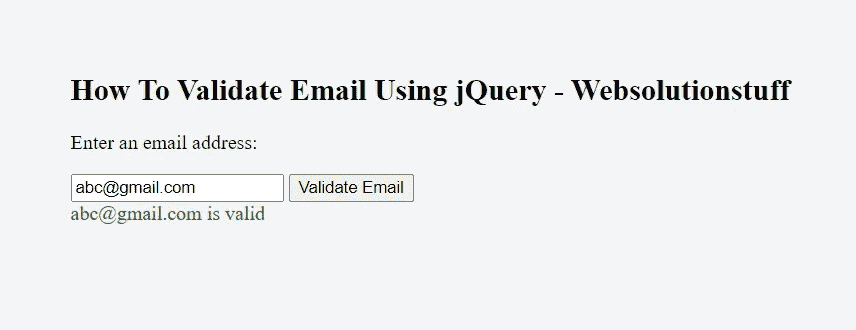

# 如何使用 jQuery 验证电子邮件

> 原文：<https://blog.devgenius.io/how-to-validate-email-using-jquery-5132d63cee0d?source=collection_archive---------12----------------------->

在本文中，我们将看到如何使用 jquery 验证电子邮件。我们将在 jquery 中使用正则表达式(regex)进行电子邮件验证。

Javascript 用于在客户端服务器或 web 浏览器上验证表单数据。客户端验证比服务器端验证快。

因此，我们将学习如何在 javascript 中验证电子邮件地址。

与其他表单验证相比，电子邮件地址验证有点困难。因此，我们将为电子邮件验证创建一个正则表达式。

使用 regex，我们将检查电子邮件地址的三个部分，第一部分是@符号后的用户名，第三部分是域名。

因此，让我们看看如何使用 javascript 验证电子邮件，使用 jquery 验证电子邮件地址，以及使用 regex 验证电子邮件。

电子邮件地址的第一部分包含字符。

*   大写和小写字母(a-z 和 A-Z)
*   数字字符(0–9)
*   不允许特殊字符--！# $ % & ' * + — / = ?^ _ ` { | } ~

域名包含。

*   信
*   数字
*   连字符
*   点

**举例:**

在这个例子中，我们将通过点击一个按钮来使用 regex 验证电子邮件。

```
<!DOCTYPE html>
<html>
  <head>
    <title>How To Validate Email Using jQuery - Websolutionstuff</title>
    <script src="https://code.jquery.com/jquery-3.5.0.min.js">
    </script>
  </head>
  <body>
    <form>
      <p>Enter an email address:</p>
      <input id='email'>
      <button type='submit' id='validate'>Validate Email</button>
    </form>
    <div id='result'></div>
    <script>
      function validateEmail(email) {
        let res = /^\w+([\.-]?\w+)*@\w+([\.-]?\w+)*(\.\w{2,3})+$/;
        return res.test(email);
      }
      function validate() {
        let result = $("#result");
        let email = $("#email").val();
        result.text("");
        if(validateEmail(email)) {
          result.text(email + " is valid");
          result.css("color", "green");
        } else {
          result.text(email + " is not valid");
          result.css("color", "red");
        }
        return false;
      }
      $("#validate").on("click", validate);
    </script>
  </body>
</html>
```

**输出:**



如何使用 jQuery 验证电子邮件

**阅读另:** [**如何使用 jQuery**](https://websolutionstuff.com/post/how-to-create-pagination-using-jquery) 创建分页

**示例:**

在本例中，我们将验证输入的电子邮件地址。

```
<!DOCTYPE html>
<html>
    <head>
        <title>How To Validate Email Using jQuery - Websolutionstuff</title>
        <script src="https://code.jquery.com/jquery-3.5.0.min.js"></script>
    </head>
    <body>
        <h2>How To Validate Email Using jQuery - Websolutionstuff</h2>
        <form>
            <p>Enter an email address:</p>
            <input id='email'>
            <button type='submit' id='validate'>Validate Email</button>
        </form>
        <div id='result'></div>
        <script>
            const validateEmail = (email) => {
                return email.match(/^((?!\.)[\w\-_.]*[^.])(@\w+)(\.\w+(\.\w+)?[^.\W])$/);
            };
            const validate = () => {
            const $result = $('#result');
            const email = $('#email').val();
            $result.text('');
            if (validateEmail(email)) {
                $result.text(email + ' is valid :)');
                $result.css('color', 'green');
            } else {
                $result.text(email + ' is not valid :(');
                $result.css('color', 'red');
            }
            return false;
            }
            $('#email').on('input', validate);
        </script>
    </body>
</html> 
```

**示例:**

检查下面的正则表达式示例列表。

```
/^\S+@\S+\.\S+$/
/^[a-z0-9]+@[a-z]+\.[a-z]{2,3}$/
/^([a-zA-Z0-9_\.\-])+\@(([a-zA-Z0-9\-])+\.)+([a-zA-Z0-9]{2,4})+$/
/^(([^<>()[\]\\.,;:\s@"]+(\.[^<>()[\]\\.,;:\s@"]+)*)|(".+"))@((\[[0-9]{1,3}\.[0-9]{1,3}\.[0-9]{1,3}\.[0-9]{1,3}\])|(([a-zA-Z\-0-9]+\.)+[a-zA-Z]{2,}))$/
/^[!#-'*+/-9=?A-Z^-~-]+(\.[!#-'*+/-9=?A-Z^-~-]+)*|\"\(\[\]!#-[^-~ \t]|(\\[\t -~]))+\")@([!#-'*+/-9=?A-Z^-~-]+(\.[!#-'*+/-9=?A-Z^-~-]+)*|\[[\t -Z^-~]*])$/
```

**你可能也会喜欢:**

*   **阅读也:** [**Laravel 8 自定义邮件验证教程**](https://websolutionstuff.com/post/laravel-8-custom-email-verification-tutorial)
*   **阅读另:** [**如何在 Laravel 8**](https://websolutionstuff.com/post/how-to-send-email-with-attachment-in-laravel-8) 中发送带附件的邮件
*   **阅读另:** [**如何查看电子邮件在 Laravel**](https://websolutionstuff.com/post/how-to-check-email-already-exist-or-not-in-laravel) 中是否已经存在

如果这篇帖子有帮助，请点赞，分享和 comment✌️.