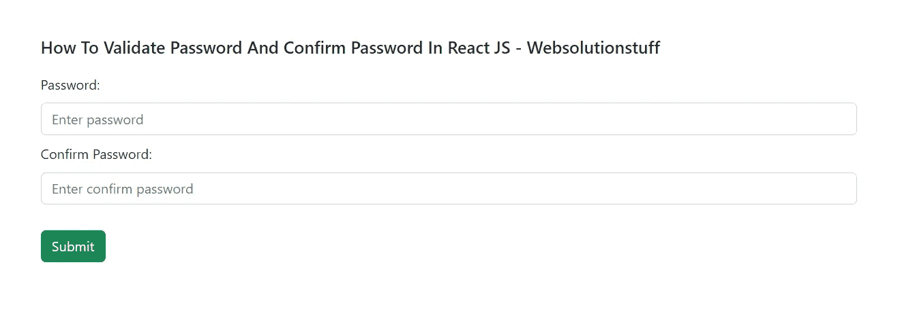

# 如何在 React JS 中验证密码和确认密码

> 原文：<https://blog.devgenius.io/how-to-validate-password-and-confirm-password-in-react-js-ec7ef6fbf42f?source=collection_archive---------6----------------------->

在本文中，我们将看到如何在 react js 中验证密码和确认密码。有时我们需要在 react js 表单中添加密码并确认密码字段。因此，我们将一步一步地向您展示如何验证密码和确认密码。对于密码验证，我们将使用正则表达式，并在 react js 中匹配密码和确认密码。

所以，让我们看看 react js 中使用 regex 的密码验证。

**第一步:安装 React App**

在这一步中，我们将使用以下命令创建 react 应用程序。

```
npx create-react-app my-app
```

**阅读还:** [**如何在 React JS**](https://websolutionstuff.com/post/how-to-validate-username-and-password-in-react-js) 中验证用户名和密码

**第二步:创建 PasswordValidationForm 组件**

现在，我们将创建一个 **App.js** 组件文件。在这个文件中，我们将编写验证密码和确认密码。

**src/App.js**

```
import React from "react";
import "./styles.css";class PasswordValidationForm extends React.Component {
  constructor() {
    super();
    this.state = {
      input: {},
      errors: {}
    }; this.handleChange = this.handleChange.bind(this);
    this.handleSubmit = this.handleSubmit.bind(this);
  } handleChange(event) {
    let input = this.state.input;
    input[event.target.name] = event.target.value; this.setState({
      input
    });
  } handleSubmit(event) {
    event.preventDefault(); if (this.validate()) {
      console.log(this.state); let input = {};

      input["password"] = "";
      input["confirm_password"] = "";
      this.setState({ input: input }); alert("Form is submitted");
    }
  } validate() {
    let input = this.state.input;
    let errors = {};
    let isValid = true;    if (!input["password"]) {
      isValid = false;
      errors["password"] = "Please enter your password.";
    } if (!input["confirm_password"]) {
      isValid = false;
      errors["confirm_password"] = "Please enter your confirm password.";
    } if (typeof input["password"] !== "undefined") {
      if (input["password"].length < 6) {
        isValid = false;
        errors["password"] = "Please add at least 6 charachter.";
      }
    } if (
      typeof input["password"] !== "undefined" &&
      typeof input["confirm_password"] !== "undefined"
    ) {
      if (input["password"] != input["confirm_password"]) {
        isValid = false;
        errors["confirm_password"] = "Passwords don't match.";
      }
    } this.setState({
      errors: errors
    }); return isValid;
  } render() {
    return (
      <div class="main-div">
        <h5>
          How To Validate Password And Confirm Password In React JS - Websolutionstuff
        </h5>
        <form onSubmit={this.handleSubmit}>          <div class="form-group">
            <label for="password">Password:</label>
            <input
              type="password"
              name="password"
              value={this.state.input.password}
              onChange={this.handleChange}
              class="form-control"
              placeholder="Enter password"
              id="password"
            /> <div className="text-danger">{this.state.errors.password}</div>
          </div> <div class="form-group">
            <label for="password">Confirm Password:</label>
            <input
              type="password"
              name="confirm_password"
              value={this.state.input.confirm_password}
              onChange={this.handleChange}
              class="form-control"
              placeholder="Enter confirm password"
              id="confirm_password"
            /> <div className="text-danger">
              {this.state.errors.confirm_password}
            </div>
          </div> <input
            type="submit"
            value="Submit"
            class="btn btn-success submit_btn"
          />
        </form>
      </div>
    );
  }
}export default PasswordValidationForm;
```

**阅读也:** [**如何在 React JS 中使用 CSS**](https://websolutionstuff.com/post/how-to-use-css-in-react-js)

**第三步:进口组件**

在这一步，我们将把组件导入到 **index.js** 文件中。此外，我们将导入引导程序。

**src/index.js**

```
import { StrictMode } from "react";
import { createRoot } from "react-dom/client";import App from "./App";
import "bootstrap/dist/css/bootstrap.css";const rootElement = document.getElementById("root");
const root = createRoot(rootElement);root.render(
  <StrictMode>
    <App />
  </StrictMode>
);
```

**阅读也:** [**如何在 React JS**](https://websolutionstuff.com/post/how-to-install-bootstrap-in-react-js) 中安装自举

**第四步:添加 CSS**

现在，我们将 CSS 添加到 styles.css 文件中。

**src/styles.css**

```
.App {
  font-family: sans-serif;
  text-align: center;
}.main-div {
  margin: 50px;
}.submit_btn {
  margin-top: 20px;
}h5 {
  margin-bottom: 20px;
}input {
  margin: 10px 0 10px;
}
```

**第五步:运行服务器**

现在，我们将使用以下命令运行服务器。

```
npm start
```

**输出:**



**你可能也会喜欢:**

*   **阅读也:** [**如何一步步安装 React JS**](https://websolutionstuff.com/post/how-to-install-react-js-step-by-step)
*   **阅读另:** [**如何使用 JQuery**](https://websolutionstuff.com/post/how-to-check-password-strength-using-jquery) 检查密码强度
*   **阅读另:** [**如何使用 Javascript**](https://websolutionstuff.com/post/how-to-validate-upload-file-type-using-javascript) 验证上传文件类型
*   **阅读另:** [**如何使用 JQuery**](https://websolutionstuff.com/post/how-to-validate-password-and-confirm-password-using-jquery) 验证密码和确认密码