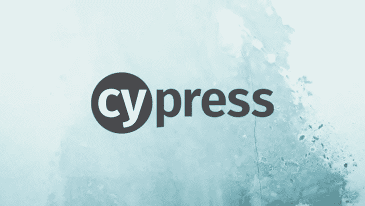

# Cypress:如何验证你的测试？

> 原文：<https://blog.devgenius.io/how-to-validate-using-cypress-io-77c419a4b361?source=collection_archive---------7----------------------->



您真的应该尝试使用 cypress 进行 web 自动化测试。令人惊讶的是它是如此的流畅，代码是如此的容易编写。

今天，我将稍微谈一下验证和断言。

当您试图测试和验证某个字段，或者断言某个文本可见并且格式正确时，您就知道了。

因此，让我们举一些例子，并从那里开始…

```
// assert the element's text content is exactly the given text
cy.get('#text-field').should('have.text', 'Hello there')
```

这样，您应该能够断言或确认在您设置元素中有一个文本“Hello there”。

你知道**柏树**使用**柴**断言库吗？

与**柴**库一样，对 Sinon & jQuery 也使用了多个扩展。

对于**柴**库，可以通过下面的链接查看其 Github

[](https://github.com/chaijs/chai) [## GitHub-chai js/chai:node . js 的 BDD / TDD 断言框架和可以配对的浏览器…

### node.js 的 BDD / TDD 断言框架和可以与任何测试框架配对的浏览器。- GitHub …

github.com](https://github.com/chaijs/chai) 

我们有两种类型的断言:

## **1。BDD** 断言

这些链接器可用于 ***BDD*** 断言(expect/should)。列出的别名可以与其原始链接器互换使用。您可以看到可用的 ***BDD*** 柴断言的完整列表。

 [## 期望/应该-柴

### BDD 样式是和。两者都使用相同的可链接语言来构造断言，但是它们在方式上有所不同

www.chaijs.com](https://www.chaijs.com/api/bdd/) 

## **2。TDD** 断言

这些断言可用于**T21TDD**断言(assert)。您可以看到可用的 Chai 断言的完整列表。

 [## 维护

### Chai 是一个用于[node](http://nodejs.org)和浏览器的 BDD / TDD 断言库，可以愉快地配对…

www.chaijs.com](https://www.chaijs.com/api/assert/) 

你知道，当你做验证或断言时，你会做多个公共元素断言，尤其是当你做标准字段断言时。

请注意如何使用下面列出的这些断言。应该():

## 长度

```
// retry until we find 3 matching <li.selected>
cy.get('li.selected').should('have.length', 3)
```

## 班级

```
// retry until this input does not have class disabled
cy.get('form').find('input').should('not.have.class', 'disabled')
```

## 价值

```
// retry until this textarea has the correct value
cy.get('textarea').should('have.value', 'foo bar baz')
```

## 文本内容

```
// assert the element's text content is exactly the given text
cy.get('#user-name').should('have.text', 'Joe Smith')// assert the element's text includes the given substring
cy.get('#address').should('include.text', 'Atlanta')// retry until this span does not contain 'click me'
cy.get('a').parent('span.help').should('not.contain', 'click me')// the element's text should start with "Hello"
cy.get('#greeting')
  .invoke('text')
  .should('match', /^Hello/)// tip: use cy.contains to find element with its text
// matching the given regular expression
cy.contains('#a-greeting', /^Hello/)
```

断言有两种方式，一种是肯定的断言，另一种是否定的断言，了解两者之间的区别有助于使用 cypress 实现更好的测试质量。

## 积极的主张

```
cy.get('li.todo').should('have.length', 2)
cy.get('input#new-todo').type('Write tests{enter}')

// using a positive assertion to check the exact number of items
cy.get('li.todo').should('have.length', 3)
```

如果应用程序的行为出乎意料，比如添加一个空白的 Todo，而不是添加带有文本“Write tests”的新 Todo，下面的测试仍然可能错误地通过。

## 否定断言

```
cy.get('li.todo').should('have.length', 2)
cy.get('input#new-todo').type('Write tests{enter}')

// using negative assertion to check it's not a number of items
cy.get('li.todo').should('not.have.length', 2)
```

但是在下面的测试中使用否定断言时，当应用程序以多种意想不到的方式运行时，测试可能会错误地通过:

*   应用程序会删除整个待办事项列表，而不是插入第三个待办事项
*   应用程序会删除待办事项，而不是添加新的待办事项
*   应用程序会添加一个空白待办事项
*   各种各样可能的应用错误

有时，你想为一些字段做多个断言，如何做很简单，如下所示…

以下是我实地考察时展示的元素

```
<a class="assertions-link active" href="https://on.cypress.io" target="_blank"
  >Cypress Docs</a
```

这里是你如何做多重断言

```
cy.get('.assertions-link')
  .should('have.class', 'active')
  .and('have.attr', 'href')
  .and('include', 'cypress.io')
```

您首先要学习如何定位您的元素，利用这里提供的知识，您还可以通过 Chai 使用断言库进行验证。接下来，我将尝试给你一些方法，让你更容易地使用 Cypress.io 中的记录和播放功能找到元素，以及如何生成随机数据。

现在，我将把这些信息留给你，这里是一个附加的

[](https://docs.cypress.io/guides/references/assertions#Chai) [## 断言| Cypress 文档

### Cypress 捆绑了流行的 Chai 断言库，以及对 Sinon 和 jQuery 有用的扩展，为您带来…

docs.cypress.io](https://docs.cypress.io/guides/references/assertions#Chai) 

所以在上面的链接中，你将会了解断言&应该如何工作，配置，以及 Cypress 中的所有东西，让你从端到端的自动化测试中获得乐趣。

> 设计测试的行为是已知的最好的错误预防措施之一，而不仅仅是测试的行为。创建一个有用的测试所必须进行的思考可以在错误被编码之前发现并消除它们——事实上，测试设计思考可以在软件创建的每个阶段发现并消除错误，从概念到规范，到设计、编码等等。”—鲍里斯·贝泽尔

本系列的下一个故事将是我在 Cypress 实践中做自动化测试时学到的一些东西，也是关于如何编写某些代码和验证的

[](https://husseinbaashen.medium.com/membership) [## 通过我的推荐链接加入媒体-侯赛因巴申

### 作为一个媒体会员，你的会员费的一部分会给你阅读的作家，你可以完全接触到每一个故事…

husseinbaashen.medium.com](https://husseinbaashen.medium.com/membership)