# 如何使用自动化契约测试验证 API 接口？

> 原文：<https://blog.devgenius.io/how-to-verify-api-interfaces-using-automated-contract-test-7002cce5a306?source=collection_archive---------9----------------------->

## 关于如何为 Spring Boot 应用程序自动化 API 合同验证的简单指南


Ashkan Forouzani 在 [Unsplash](https://unsplash.com/s/photos/puzzle?utm_source=unsplash&utm_medium=referral&utm_content=creditCopyText) 上的照片

基于服务的架构是现代软件行业中流行的系统设计方法。健壮性和灵活性是这种架构模式无可比拟的优势。系统逻辑不再与特定的应用程序紧密耦合。相反，独立的服务组件实现系统逻辑的域。因此，业务功能是通过集成网状服务网络来实现的。

服务组件是高度可重用的；对于不同的业务用例，它们可以由多个应用程序共享。由于业务功能将涉及多个服务的集成，服务之间的交互对于业务功能的交付至关重要。

服务之间的交互基于一个约定的契约，该契约定义了请求和响应的数据格式。如果服务合同中引入了重大变更，该怎么办？例如，负责管理客户记录的服务将出生日期字段从“date of birth”重命名为“dob”？所有依赖于与客户记录相关的接口的服务都将失败，因为它们无法正确地反序列化客户服务提供的客户记录。

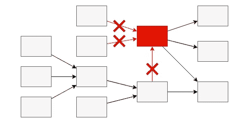

更糟糕的是，依赖这些受影响服务的所有下游服务都将无法正常运行，从而导致严重的系统中断。

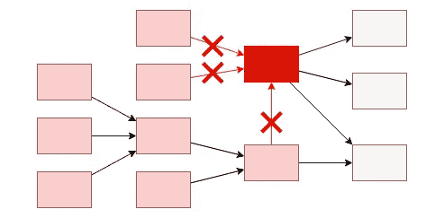

## 如何预防？

发现生产环境的重大变化为时已晚。在生产部署之前，您可以在作为 QA 流程一部分的端到端集成测试中检测可能的接口问题。服务之间的交互在类似生产的环境中进行测试。然而，集成测试通常在系统开发完成后进行。解决问题的成本就越高。更有可能重新构建系统逻辑，或者更多组件可能会受到影响，以便在后期修复问题。

## 作为单元测试执行的一部分，验证服务契约

最佳解决方案是在测试的早期阶段，作为单元测试的一部分，验证接口的变化。因为测试集中在与合同相关的某些系统组件上，所以与端到端集成测试相比，测试是轻量级的和快速的。

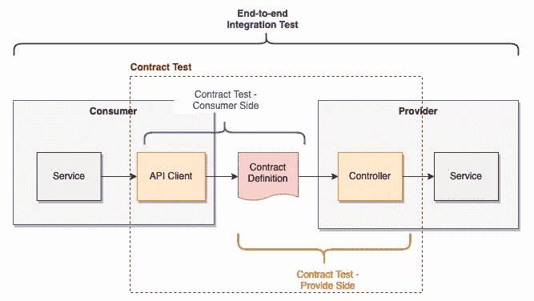

端到端集成测试与合同测试

为了实现合同验证的自动化测试，PACT 和 Spring Contract 是业界流行的框架。在本文中，我将通过为外汇交易的样本 API 构建测试，向您展示如何使用 PACT 框架构建自动化合约测试。

# 简单地说，PACT 测试

PACT 测试是消费者驱动的，这意味着整个过程从消费者开始，消费者首先提供带有预期请求和响应的契约定义，然后与提供者共享契约定义以供验证。每当对提供者应用任何更改时，它都会运行测试，以检查对其使用者的任何影响。

在破坏合同变更的情况下，提供方的开发团队可以通过使接口向后兼容来解决问题，也可以与消费方合作进行进一步的安排。

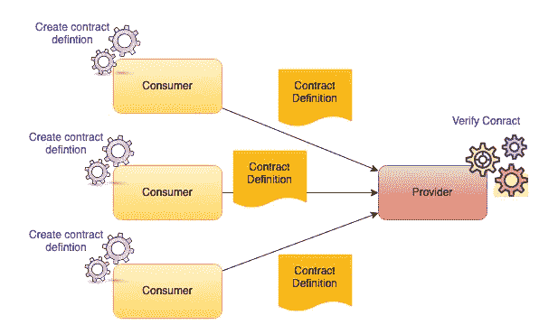

客户驱动的合同测试

# 关于样例 API —外币交易 API

假设我们有一个投资服务，提供各种基金投资选择。其中一项服务是外汇交易。它依靠 forex APIs 进行外币汇率检索、汇率预订和交易提交。

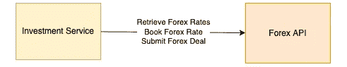

示例应用程序—外汇货币交易 API

# 消费者方面的合同测试

在消费者方面，契约测试的结果是生成 JSON 格式的契约定义。以下是合同测试的流程:

1.  **定义契约定义** —框架提供的 DSL 方法调用
2.  **发送测试请求** —运行单元测试，调用消费者的 API 客户端向框架中的模拟服务器发送请求
3.  **验证请求并生成响应** —模拟服务器验证请求并基于契约定义生成响应
4.  **断言响应** —验证单元测试代码中的响应
5.  **输出契约定义** —如果单元测试通过，框架输出 JSON 格式的契约定义

参考[这个 GitHub 库](https://github.com/gavinklfong/spring-investment-platform)获取消费者端契约测试的示例源代码

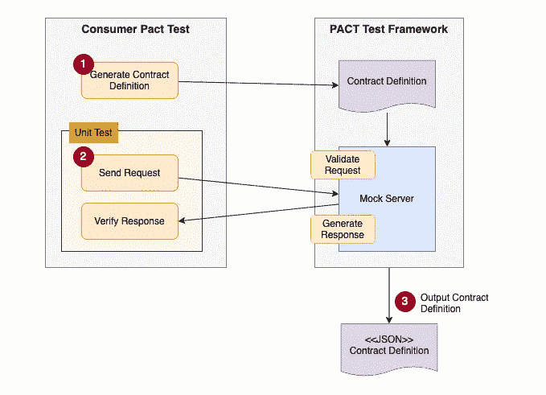

用户方合同测试—流程

## 合同测试设置

要将契约测试构建为单元测试执行的一部分，请添加以下 maven 依赖项:

```
***<*dependency*>
  <*groupId*>***au.com.dius.pact.consumer***</*groupId*>
  <*artifactId*>***junit5***</*artifactId*> 
  <*version*>***4.3.4***</*version*>
  <*scope*>***test***</*scope*>
</*dependency*>***
```

下面的示例代码展示了契约测试中注释的使用。`@ExtendWith(PactConsumerTestExt.class)`是为消费者契约测试的单元测试集成而定义的。另一个注释`@PactTestFor` 定义了模拟服务器的目标提供者名称和端口号。如果没有指定端口号，模拟服务器将用一个随机的可用端口启动。

`@SpringBootTest` 和`@ActivePorfiles` 将使用特定的 spring 概要文件启动整个应用程序上下文。

## 定义合同

预计外汇 API 将提供一个使用特定基础货币和计数器货币进行外币汇率检索的 API。货币代码的格式为 3 个字符。请求应该在基本身份验证的报头中指定 UUID 格式的 API 密钥。

*   **网址:**/汇率/最新/ `<baseCurrency>` / `<counterCurrency>`
*   方法:获取
*   **表头:** X-API-KEY (UUID)

Forex API 应该用 http status 200 和 JSON 格式的汇率进行回复。响应应包含以下字段

*   **基础货币:**字符串
*   **逆流:**字符串
*   **买入价:**数量
*   **卖出价:**数量
*   **时间戳:**日期时间

然后，契约定义看起来类似于下面的示例代码。注释`@Pact` 被自动识别为生成合同定义的方法。

契约定义分为请求和响应两部分。使用以下匹配器之一定义协定中的数据字段:

*   按固定值匹配
*   通过正则表达式匹配
*   按数据类型匹配

**正则表达式匹配器**

例如，请求 url 路径是用正则表达式中的货币代码定义的:

```
matchPath***(****format****(*“/rates/latest/%s/%s”**, ***CURRENCY_REGEX***, ***CURRENCY_REGEX))***
```

此外，响应正文中的货币字段:

```
body***(*new** PactDslJsonBody***()*** .stringMatcher***(*"baseCurrency"**, ***CURRENCY_REGEX***, **"GBP"*)*** .stringMatcher***(*"counterCurrency"**, ***CURRENCY_REGEX***, **"USD"*)***
```

使用此货币代码的正则表达式:

```
String ***CURRENCY_REGEX*** = **"([A-Z]){3}"**
```

**定值匹配器**

显然，响应状态代码由一个固定值匹配

```
status***(***HttpStatus.***OK***.value***())***
```

**数据类型匹配器**

对于响应体中的数据字段，按数据类型进行匹配是很常见的。以下外汇汇率被定义为具有样本值的数字类型。

```
.numberType***(*"buyRate"**, 1.25***)*** .numberType***(*"sellRate"**, 1.5***)***
```

## 验证 API 客户端

PACT 框架要求在生成 JSON 格式的契约定义之前验证 API 客户机。这是一个有用的方法，因为我们可以确保定义的契约与 API 客户端相匹配。

测试可以简单地通过调用 API 客户机发送请求来完成。然后，相应地断言响应。如果使用非空字段值成功反序列化响应，则测试通过。

## 测试执行

如果出现问题，比如合同定义问题，框架提供的默认系统日志不够详细，不足以查明错误。因此，强烈建议启用测试框架的调试日志:

```
**logging**:
  **level**:
    **au.com.dius.pact**: DEBUG
```

## 输出合同定义

然后将在目标/pacts 中生成一个 JSON 文件。文件名遵循惯例`<consumer name>-<provider name>.json`

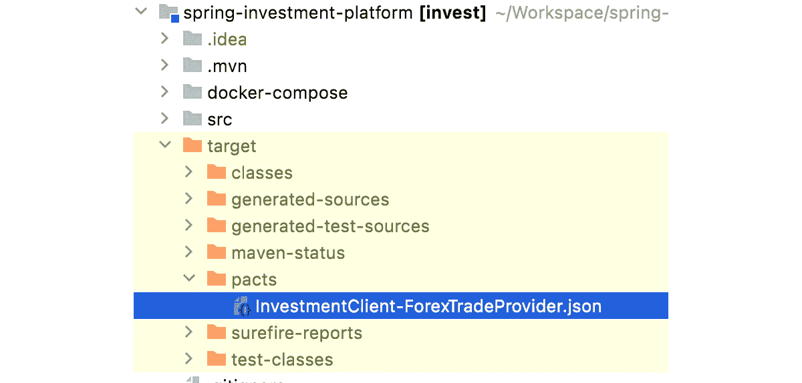

# 提供方的合同测试

提供者端的契约测试比消费者端的测试简单。目的是验证提供者 API 是否符合消费者提供的契约。以下是合同测试的流程:

1.  **加载合同定义**—PACT 测试框架将合同定义加载到它的模拟服务器中
2.  **向提供者 API 提交请求** —基于契约定义，模拟服务器生成请求并提交给提供者 API
3.  **验证来自提供者 API** 的响应——模拟服务器检查收到的响应是否符合合同定义

对于 API 契约的验证来说，在提供者端测试端到端的逻辑流是不必要的。因此，提供者端的后端服务可能会被测试设置模仿。

参考[这个 GitHub 库](https://github.com/gavinklfong/servlet-spring-forex-trade)获取提供者端契约测试的示例源代码

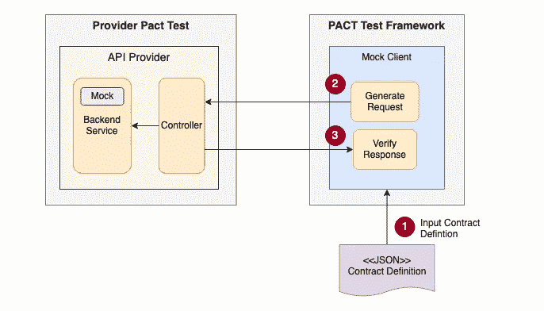

提供商方合同测试—流程

## 合同测试设置

在提供者端，为 Pact 框架与 JUnit 5 和 Spring 框架的集成添加 maven 依赖性:

```
***<*dependency*>
  <*groupId*>***au.com.dius.pact.provider***</*groupId
  *<*artifactId*>***junit5spring***</*artifactId*>
  <*version*>***4.3.4***</*version*>
  <*scope*>***test***</*scope*>
</*dependency*>***
```

根据流程，下面的示例代码启动模拟客户机和提供者 API。注释`@WebMvcTest` 和`@ActiveProfiles`是 Spring 框架的注释，用于在应用程序上下文中创建提供者 API 的 MVC 层。Spring 框架将参考`application-pacts.yml`进行应用程序配置。接下来，`@Provider`将在`@PactFolder`指定的资源文件夹中指定合同定义查找的提供者名称。

与传统的单元测试不同，不需要 annotation @Test，因为它由`@TestTemplate`处理，它指示 PACT 测试框架为每个契约交互自动创建一个单元测试场景。由于为每个测试场景创建了一个新的测试上下文，`@BeforeEach`就是配置测试上下文，以便模拟客户端可以连接到 Spring 的模拟 MVC。

根据`@PactFolder`上的配置，将生成的合同定义文件从消费端复制到资源文件夹“pacts”

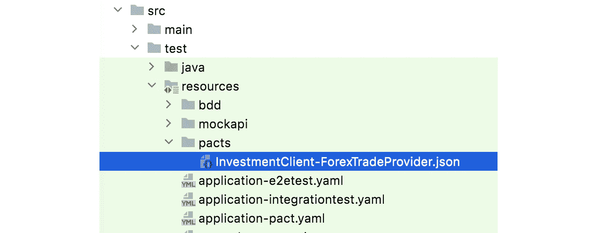

## 后端服务的设置存根

外汇汇率的提供者 API 依赖其内部组件外汇汇率服务来执行业务逻辑。由于测试范围集中在 API 契约上，我们为每个契约交互创建一个后端服务的模拟。

## 测试执行

测试执行完成后，测试结果将显示每个合同定义的状态。

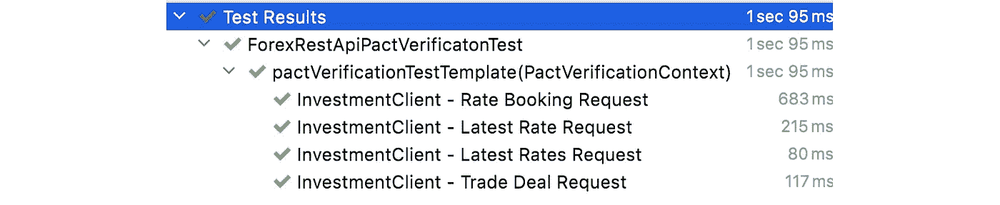

提供商合同测试结果

# 契约经纪人

上面的例子将契约定义文件从消费者手动复制到提供者，然后提供者可以利用@PactFolder 从资源文件夹中获取定义文件。

每当消费者端的合同定义发生变化时，手动复制文件是很麻烦的。因此，PACT 框架提供了一个名为 Pact Broker 的解决方案。它充当合同定义的存储库。消费者将新生成的定义发布给代理，而提供者获取最新版本用于测试执行。

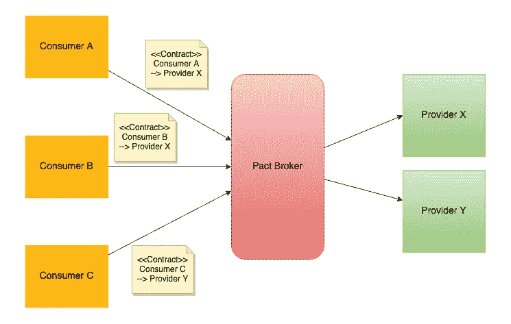

契约经纪人

运行 docker compose 是启动 Pact Broker 的便捷方式，请参考 Pact 框架 GitHub 库中的[docker compose 定义](https://github.com/gavinklfong/spring-investment-platform/blob/main/docker-compose/docker-compose.yml)。docker 栈启动一个 Postgres 数据库作为 Post Broker 的内部数据库。docker compose 仅用于演示目的，因为没有应用安全保护。

要启动 docker compose 服务器堆栈，请将定义文件复制到一个文件夹中，然后运行以下命令:

```
docker compose up
```

进入 [http://localhost:9292](http://localhost:9292) ，你会看到一个表格，里面有合同定义的列表。如果您尚未发布任何合同定义，您将只能找到一个示例应用程序条目。

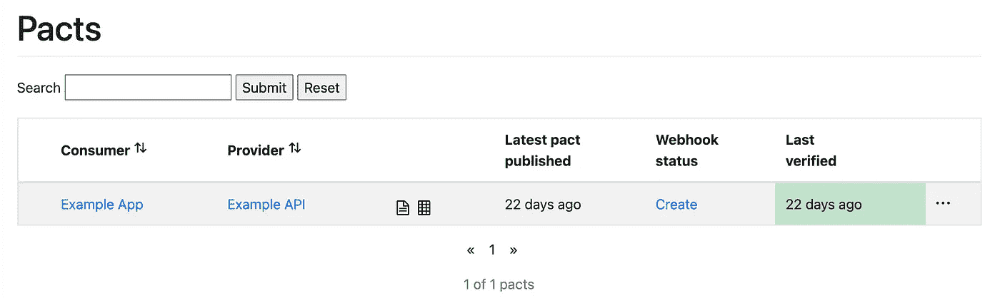

契约经纪人门户

现在，让我们发布外汇 API 的契约定义。Pact 框架提供了一个 maven 插件，它为发布提供了一个 maven 目标。在消费者端将这个插件添加到您的 maven pom.xml 中。

Pact broker 的 URL 作为 maven 插件的一部分在`<pactBrokerUrl>`标记中配置。这个例子指向运行在本地机器端口 9292 上的 Pact Broker。如果您已经运行了自己的 Pact Broker，则可以指定不同的 URL。

```
<build>
  <plugins>
    ***<*plugin*>
      <*groupId*>***au.com.dius.pact.provider***</*groupId
      *<*artifactId*>***maven***</*artifactId*>
      <*version*>***4.1.11***</*version*>
      <*configuration>
        *<*pactBrokerUrl*>***http://localhost:9292***</*pactBrokerUrl
      *</*configuration*>
    </*plugin*>*** </plugins>
</build>
```

确保您已经完成了契约测试的执行，运行以下命令来运行测试:

```
mvn test
```

然后，运行以下命令发布生成的契约定义 JSON 文件:

```
mvn pact:publish
```

发布完成后，您将在 Pact Broker 上找到新发布的合同定义。

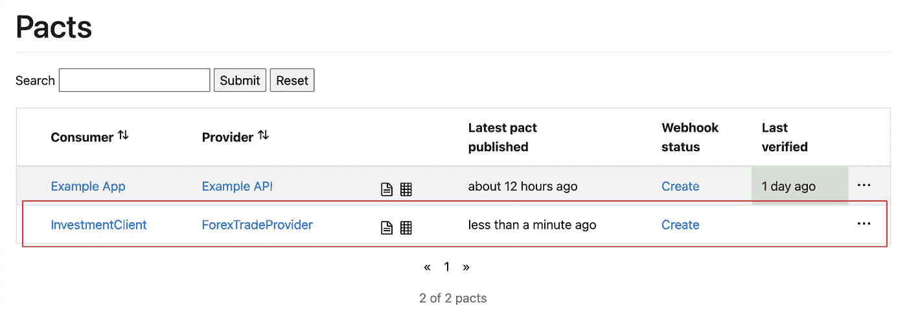

Pact Broker 门户—新发布的合同

在提供者端，我们在测试代码中将@PactFolder 替换为@PactBroker，然后将 PactBroker 的 URL 添加到`application-pacts.yml`

```
**pactbroker**:
  **host**: localhost
  **scheme**: http
  **port**: 9292
```

这个设置使测试代码能够从 Pact Broker 中查找和获取契约定义，而不是从资源文件夹中读取。

此外，Pact Broker 还提供其他功能，如跟踪验证结果，为其他自动化任务设置 webhook。探索官方信息了解更多详情。

# 最后的想法

引入合同测试无疑对你的系统有益。测试有助于我们在系统开发的早期阶段检测现有服务接口上的突破性变化。消费者驱动的方法确保 API 提供者不会引入任何可能影响其消费者的变化。否则，提供方应与其消费者联系，以最大限度地减少影响。这对于面向服务的系统至关重要，因为业务功能严重依赖于服务之间的集成。然而，Pact 测试框架是有用的，它通过 DSL 方法调用、内置的模拟服务器和客户端以及 PACT 代理来加速契约测试设置。

## GitHub 仓库

**消费者端**

[](https://github.com/gavinklfong/spring-investment-platform) [## GitHub-gavinklfong/spring-投资-平台

### 这个项目带有一个 API 客户端 ForexClient，它与 Forex API 集成，用于外汇汇率检索和…

github.com](https://github.com/gavinklfong/spring-investment-platform) 

**提供商方**

[](https://github.com/gavinklfong/servlet-spring-forex-trade) [## GitHub-gavinklfong/servlet-spring-forex-trade

### 这个库是一个克隆的反应春季外汇交易[https://github.com/gavinklfong/reactive-spring-forex-trade…

github.com](https://github.com/gavinklfong/servlet-spring-forex-trade)