# 如何用 4 个简单的步骤来可视化 Twitter 趋势

> 原文：<https://blog.devgenius.io/how-to-visualize-twitter-trends-in-4-simple-steps-453b4d772734?source=collection_archive---------9----------------------->

## 在 10 分钟内发现热门话题的快速方法

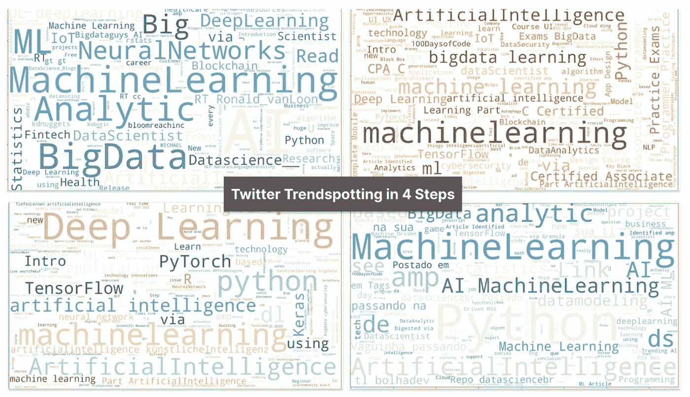

Twitter 趋势识别的 4 个步骤(图片由[作者](/www.visual-design.net)提供)

## 1.安装 Twint 并导入库

Twint 是一个强大而简单的 Python 包，允许抓取 Twitter 帖子。

[](https://github.com/twintproject/twint) [## GitHub — twintproject/twint:一个用 Python 编写的高级 Twitter 抓取工具，它…

### 一个用 Python 写的高级 Twitter 抓取工具，不使用 Twitter 的 API，允许你抓取一个…

github.com](https://github.com/twintproject/twint) 

```
!pip3 install --user --upgrade git+[https://github.com/twintproject/twint.git@origin/master#egg=twint](https://github.com/twintproject/twint.git@origin/master#egg=twint)
!pip install nest-asyncioimport twint
import nest_asyncio
nest_asyncio.apply()
```

## 2.配置您的 Twitter 请求

*   `config.Search`:指定您感兴趣的任何主题
*   `config.Limit`:抓取多少条推文
*   `config.Since`和`config.Until`:控制推文发布日期的时间范围
*   `config.Output`:指定输出位置。Twint 支持 csv、JSON、SQLite 和 ElasticSearch 格式

```
config = twint.Config()
config.Search = "data science" #replace the topic as you like
config.Limit = 1000
config.Lang = "en"
config.Store_csv = True
config.Since = '2022-06-04'
config.Until = '2022-06-06'
config.Output = "twitter.csv"
twint.run.Search(config)
```

## 3.使用 WordCloud 可视化

现在信息存储在文件“twitter.csv”中，我们可以将其作为 Pandas dataframe 导入，并使用 *WordCloud* 库通过传递内容`df.tweet`生成 WordCloud。WordCloud 是一款基于单词在文本中的出现频率将单词可视化的快捷工具。

```
from wordcloud import WordCloud
import matplotlib.pyplot as plt
from nltk.corpus import stopwords
import pandas as pd# read csv as pandas dataframe
df = pd.read_csv("twitter.csv")# optional - remove stopwords from the tweets 
stopwords = stopwords.words('english')
stopwords.extend(['data science', 'data', 'science', 'Data Science', 'DataScience'])
# optional - remove urls from the tweets
tweet = df.tweet.replace('[https://t.co/|https://'](https://t.co/|https://'), '', regex = True)# generate wordcloud
wordcloud = WordCloud (
                    stopwords = stopwords,
                    background_color = 'white',
                    width = 1920,
                    height = 1080,
                    colormap = "GnBu"
            ).generate(' '.join(tweet))
plt.subplots(figsize = (16,16))
plt.imshow(wordcloud)
```

我们可以运行一些数据清理，使结果更相关。

*   使用停用词库移除停用词并将您自己的停用词添加到列表中，例如，主题关键词的变化不会带来额外的价值
*   **删除文本中的超链接/URL**，例如`df.tweet.replace(https://, '', regex = True)`

你可以随意使用 WordCloud 的几个参数，比如`background_color`、`width`、`height`、`colormap`。最重要的是，传递`tweet`数据集生成单词云。

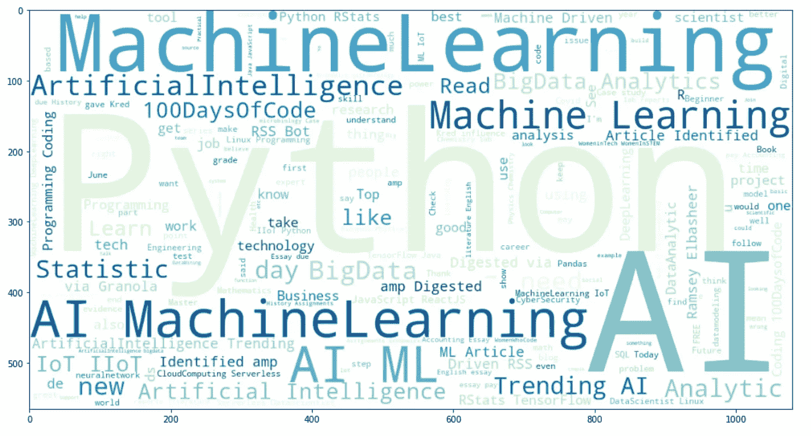

Twitter 上的数据科学话题(图片由作者提供)

与那些很少被提及的小主题相比，被提及最多的主题会显得更大——毫不奇怪，“Python”和“AI”脱颖而出。

## 4.发现趋势

是时候自己实施了。您可以尝试不同的主题、时间范围或样本量设置，看看趋势是如何演变的。

*   探索不同的主题— **机器学习与深度学习**

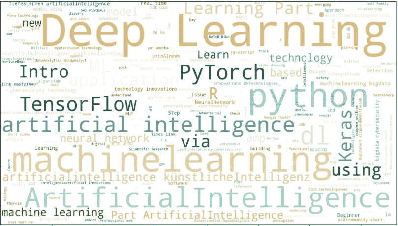

深度学习主题(图片由作者提供)

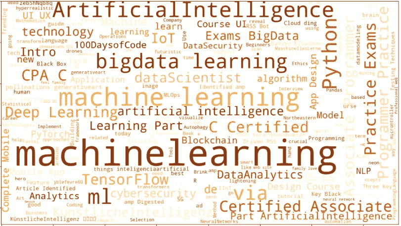

机器学习主题(图片由作者提供)

*   比较不同时间段的数据科学趋势—2020 年 6 月 5 日**，2018 年 6 月 5 日，2012 年 6 月 5 日**

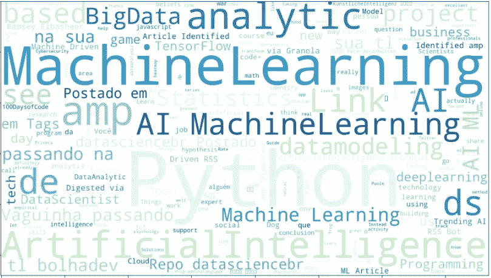

2022 年 6 月 5 日数据科学专题

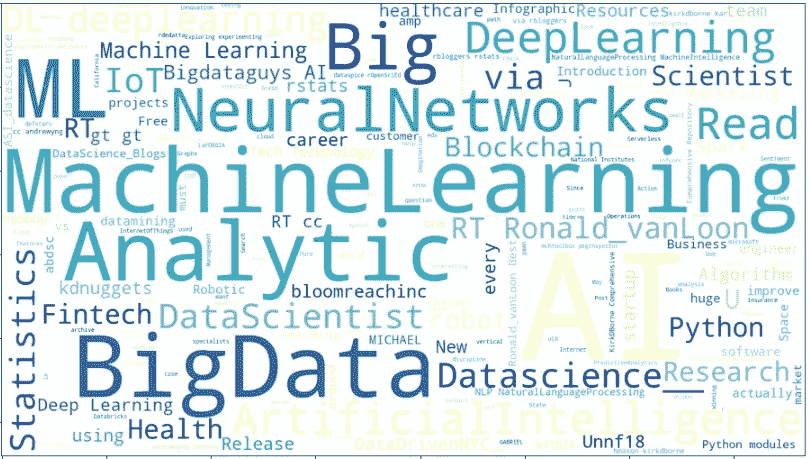

2018 年 6 月 5 日数据科学专题

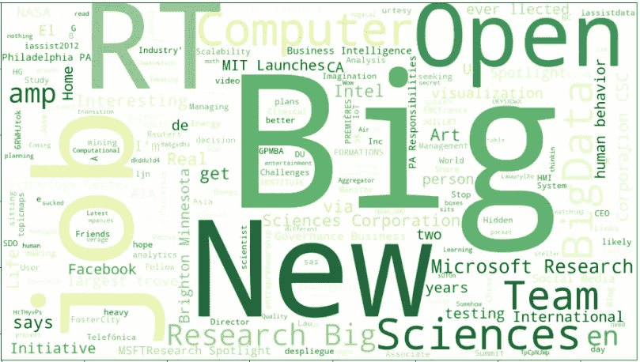

2012 年 6 月 5 日数据科学专题

## 带回家的信息

这篇文章提供了一个使用 Twint 抓取 Twitter 数据的快速而简单的指南。此外，只需几行代码就可以使用 WordCloud 实现可视化。请随意使用代码片段，以自己的方式探索并可视化您感兴趣的主题。

**希望这篇文章对你有帮助。如果你想阅读更多我关于媒介的文章，我将非常感谢你的支持，注册成为** [**媒介会员**](https://destingong.medium.com/membership) **☕️**

## 更多这样的文章


[德斯坦贡](https://destingong.medium.com/?source=post_page-----453b4d772734--------------------------------)

## 开始学习数据科学

[View list](https://destingong.medium.com/list/get-started-in-data-science-8006bb4ba3ad?source=post_page-----453b4d772734--------------------------------)8 stories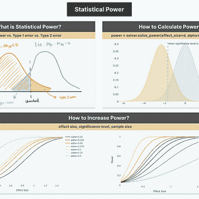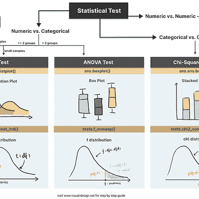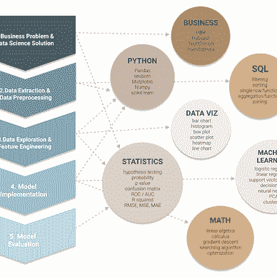[](https://towardsdatascience.com/how-to-self-learn-data-science-in-2022-a537a76d138e) [## 2022 年如何自学数据科学

### 基于项目的数据科学入门方法

towardsdatascience.com](https://towardsdatascience.com/how-to-self-learn-data-science-in-2022-a537a76d138e) 

[德斯坦贡](https://destingong.medium.com/?source=post_page-----453b4d772734--------------------------------)

## EDA 和特征工程技术

[View list](https://destingong.medium.com/list/eda-and-feature-engineering-techniques-e0696974ed54?source=post_page-----453b4d772734--------------------------------)9 stories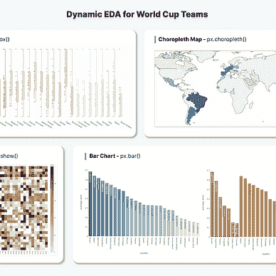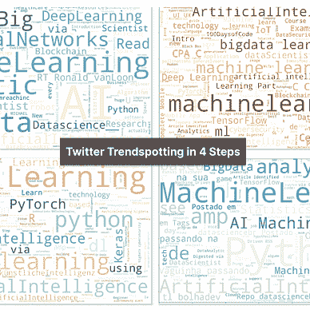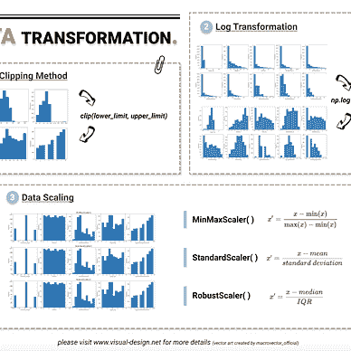

*原载于 2022 年 6 月 6 日 https://www.visual-design.net*[](https://www.visual-design.net/post/semi-automated-exploratory-data-analysis-process-in-python)**。* 1。安装 Twint 并导入库*