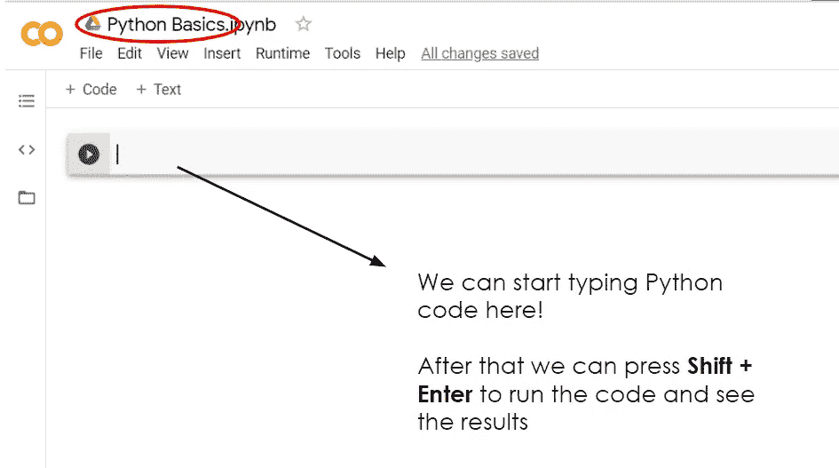
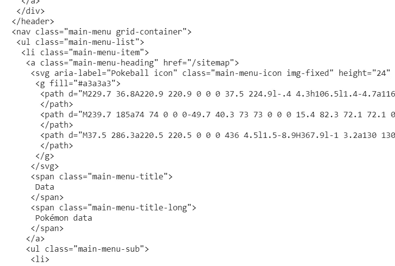
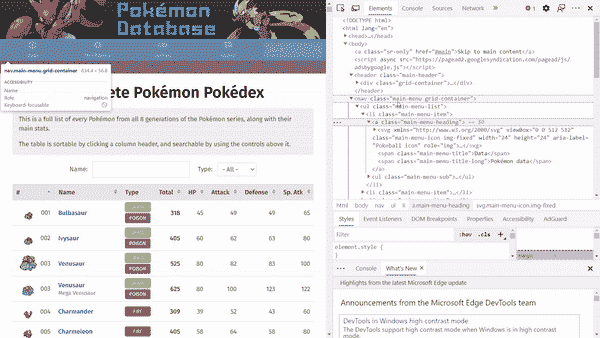
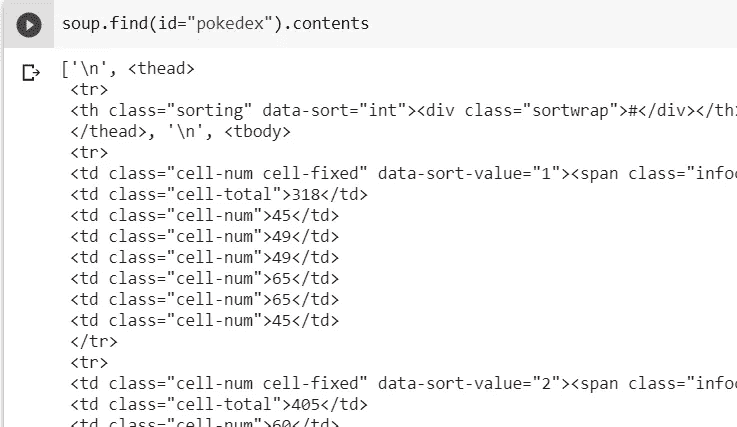
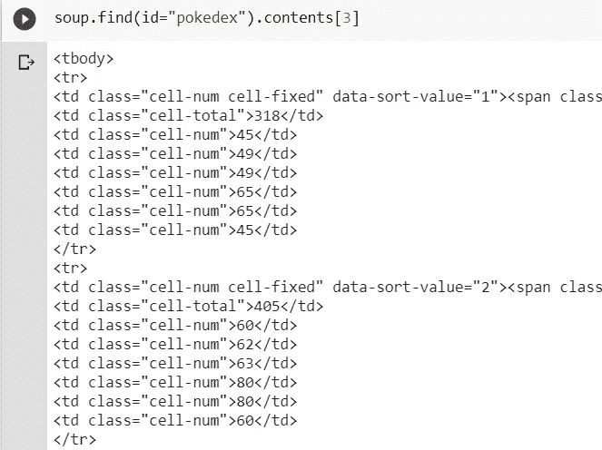
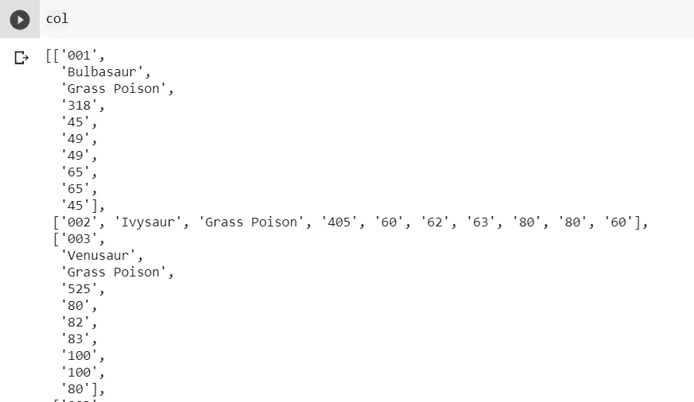
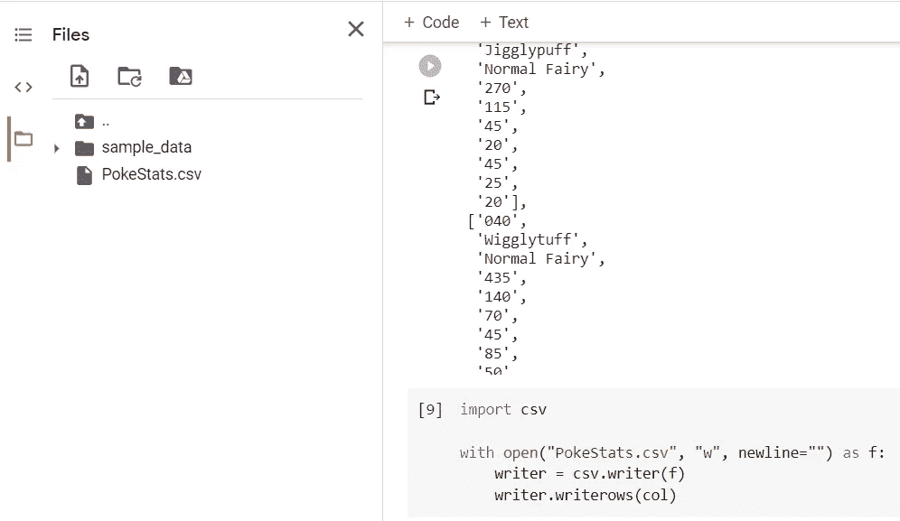
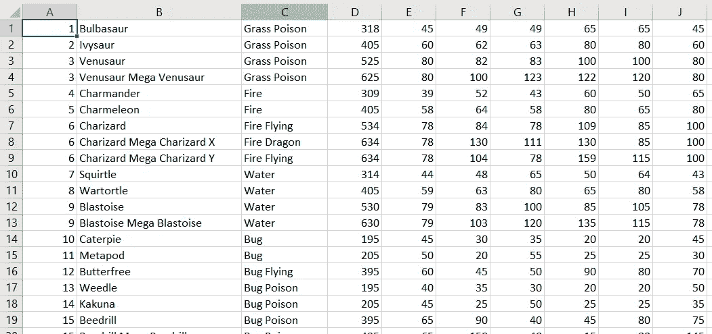

# 如何用 Python 进行网络抓取

> 原文：<https://blog.devgenius.io/how-to-web-scrape-with-python-3a4e38e7a427?source=collection_archive---------0----------------------->

Python web 抓取入门分步指南


在 [Unsplash](https://unsplash.com?utm_source=medium&utm_medium=referral) 上由 [Carlos Muza](https://unsplash.com/@kmuza?utm_source=medium&utm_medium=referral) 拍摄的照片

# 先决条件

虽然本指南将主要使用基本的 Python 和 HTML，因为它们是非常初学者友好的语言，类似于英语，但确实没有必要了解这些语言。然而，对于最后一部分，您确实需要理解基本的 CSS，如果您不理解，可以跳过它。不管怎样，事不宜迟，让我们开始吧！

# 什么是网页抓取？

顾名思义，网络抓取是一种从网站中提取数据的方法，抓取的数据将被保存为表格格式，通常用于进一步的工作。网站数据通常包含有价值的信息，我认为让每个人都至少知道网络抓取的基本知识并从中受益是很好的。

# 入门指南

立即开始网络抓取的一个好方法是使用[谷歌实验室](https://colab.research.google.com/)作为我们的环境。你所需要的只是一个谷歌账户，你可以登录进去创建一个新的 Colab 笔记本。笔记本打开后，我们就可以开始编写和执行 Python 代码了。



# 安装美丽的汤

使用 Python 抓取数据的一个简单方法是使用一个名为 Beautiful Soup 的包或库。让我们做一个 pip 安装并像这样导入它:

```
!pip install beautifulsoup4
from bs4 import BeautifulSoup as bs
```

注意:在 Google Colab 中，我们可以运行一个控制台命令，以！接下来是命令。

现在，我们需要选择一个网站来收集数据。出于举例说明的目的，我会选择这个网站:[pokemondb.net/pokedex/all](https://pokemondb.net/pokedex/all)，只是因为我喜欢神奇宝贝，它似乎是一个理想的数据收集平台。此时，我们想要获取这个网站的 HTML，我们可以使用请求库通过一个简单的 get 请求来完成。同样，让我们进行 pip 安装并导入它。

```
!pip install requests
import requests
res = requests.get("https://pokemondb.net/pokedex/all")
```

然后，简单地将我们的 HTML 内容转换成一个漂亮的 soup 对象。

```
soup = bs(res.content)
```

我们可以像这样打印出整个 HTML 文档:

```
# prettify is a function that returns a nicely formatted HTML with newlines and indent
# that makes it easier to read
print(soup.prettify())
```

看看我们的 HTML，我们可以看到许多 HTML 元素(即，用尖括号括起来的单词，其中第一个单词是元素名)。例如，在下面的 HTML 代码片段中，我们有一个 nav、ul、li、a、svg 和 span 元素。



要查看每个 HTML 元素在网站上的外观，请导航到网站，右键单击，然后单击检查。将鼠标悬停在每个元素上，我们可以看到网站的部分内容被突出显示。



# 寻找汤

要搜索我们想要从中提取数据的特定 HTML 元素，主要有两个函数可供选择:find()和 find_all()。这两个函数都接受一个筛选参数，该参数确定了您正在寻找的元素。filter 参数可以是下列类型之一:

# 1.线

从我们的 HTML 代码片段来看，我们想要获取第一个 span 元素，我们可以像这样使用 find 方法:

```
soup.find('span')
# Output: <span class="main-menu-title">Data</span>
```

或者，如果我们想要获得所有的 span 元素，我们可以像这样使用 find_all 方法:

```
soup.find_all('span')
# Returns a list of all span elements
```

然而，这并不是您真正想要的抓取数据的方式，因为 span 元素是 HTML 元素，本质上没有任何意义。你可以在这里看到每个 HTML 元素代表什么的简短描述

> HTML 元素是一个用于表达内容的通用内联容器，它本身并不代表任何东西。它可以用于对元素进行分组，以便进行样式设置(使用 class 或 id 属性)，或者因为它们共享属性值，如 lang。

# 2.正则表达式

我们也可以传入一个正则表达式来搜索我们想要的 HTML 元素。下面的例子展示了如何找到字符串中包含“sceptile”或“Sceptile”的元素。

```
import re  # import regex
soup.find_all("a", string=re.compile("(s|S)ceptile"))
```

# 3.目录

通常，我们希望找到不止一种类型的 HTML 元素。好吧，它就像传递一个字符串列表一样简单:

```
soup.find_all(['a', 'li'])
```

# 4.一项功能

为了比上述三种方法更灵活，我们可以传递一个自定义函数，该函数根据元素是否匹配我们的搜索标准返回一个布尔值。

```
def has_class_but_no_id(tag):
    return tag.has_attr('class') and not tag.has_attr('id')soup.find_all(has_class_but_no_id)
```

# 5.属性

比方说，我们希望通过具有特定属性(如 href)的 HTML 元素进行过滤(例如，有一个链接)。我们可以通过传递 href 关键字参数来做到这一点:

```
# find elements that has a href attribute
soup.find_all(href=True)# find elements with a href attribute and the link contains the string "sceptile"
soup.find_all(href=re.compile("sceptile"))
```

# 在汤里导航

我们已经看到了如何根据我们正在寻找的某些标准挑选元素，但是有时，您只想以某种有序的方式导航 soup 对象，并且基本上有 3 个不同的方向:自上而下(即，父到子、后代)、自下而上(子到父)、侧到侧(即，在兄弟和元素内)。

## 父母对子女

。内容

*   返回元素的直接子元素列表

。儿童

*   返回所有直接子元素的列表迭代器，可以使用 for 循环进行迭代

## 后代

。后代

*   返回该元素所有后代的生成器对象，可以使用 for 循环对其进行迭代

## 子对父

。父母

*   返回元素的直接父级

。双亲

*   返回该元素所有祖先的生成器对象，可以使用 for 循环对其进行迭代

## 兄弟姐妹内部

同级是嵌套在同一级别内的元素。

。下一个兄弟姐妹

*   返回与当前元素处于同一级别的下一个元素(即其下的元素)

。上一个 _ 兄弟姐妹

*   返回与当前元素处于同一级别的上一个元素(即上面的元素)

。下一个 _ 兄弟姐妹

*   返回所有下一个同级(即元素下的同级)的生成器对象，可以使用 for 循环对其进行迭代

。上一个 _ 兄弟姐妹

*   返回所有先前同级(即元素之上的同级)的生成器对象，可以使用 for 循环对其进行迭代

## 元素内

。下一个元素

*   返回随后立即解析的内容

示例:

```
soup.find('span')
# Output: <span class="main-menu-title">Data</span>soup.find('span').next
# Output: 'Data'
```

。前一个元素

*   返回紧接在元素之前分析的任何内容

。下一个元素

*   返回包含后续元素的生成器对象，可以使用 for 循环对其进行迭代

。前 _ 个元素

*   返回包含先前元素的生成器对象，可以使用 for 循环对其进行迭代

注意:迭代器和生成器可以使用 Python 中的 list()函数转换成列表

# 使用 CSS 选择器

最后，Beautiful Soup 支持使用 select()方法搜索 HTML 元素，该方法接受 CSS 选择器作为参数，并返回所有匹配的元素。几个例子:

```
# find a's that are inside div's
soup.select("div a")# get direct descendants of div's that are a's
soup.select("div > a")# get the element with id = pokedex
soup.select("#pokedex")
```

现在我们已经知道了如何挑选和浏览汤的基本知识，让我们尝试对网站上的数据表进行一次全面的搜索。如果我们检查它，我们可以看到它有一个 id = pokedex，忽略标题行，我们要提取的数据行是第 4 个子行(即 tbody)。请注意分隔每个元素的换行符是如何被视为子元素的。



打印出第四个孩子，我们可以看到我们已经检索到我们想要的表。



现在，我们想要遍历它的直接子表，对于每个直接子表，我们想要它们的子表，但是只需要它们中的字符串，我们可以用 Python 中的 2D 列表来表示这个表。直接孩子是外部列表(即，列)，直接孩子的孩子是内部列表(即，行)。要获取 HTML 元素下的字符串，我们可以使用 get_text()方法。

```
col = []
for direct_children in list(table.contents):
  row = []
  if direct_children != '\n':
    for child in direct_children.find_all("td"):
      row.append(child.get_text())
    col.append(row)
```

打印变量 col，out，我们可以看到我们已经成功地提取了数据表！



现在，让我们将其保存到一个名为 PokeStats 的 csv 文件中:

```
import csvwith open("PokeStats.csv", "w", newline="") as f:
    writer = csv.writer(f)
    writer.writerows(col)
```

在 Google Colab 中，如果你导航到左边抽屉中的“文件”,你会看到新创建的 csv 文件。



只需下载它，我们就会在 excel 中看到我们很好地提取的数据！



希望这是有帮助的。感谢阅读！