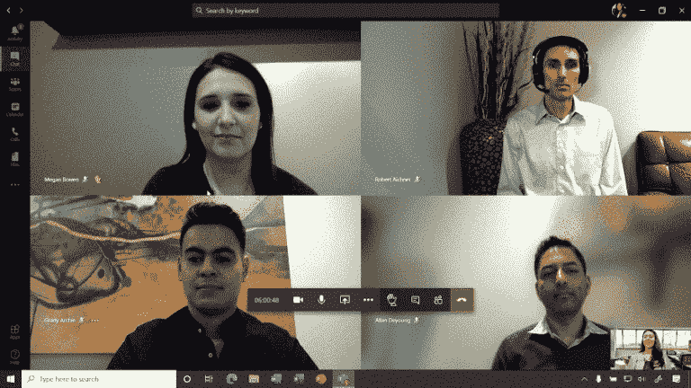
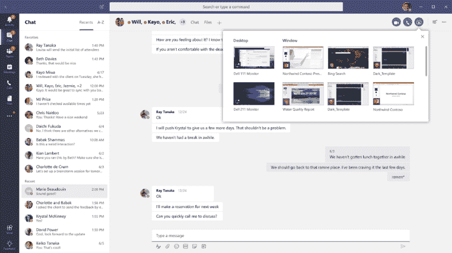
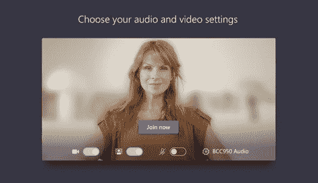

# 如何:与 Microsoft 团队一起赢得远程工作

> 原文：<https://blog.devgenius.io/how-to-win-at-remote-work-with-microsoft-teams-2c14ab5786d7?source=collection_archive---------3----------------------->

## 作为软件开发和团队领导，我如何有效地利用团队

快乐的小团队工作者！*图片由 Alexandra_Koch 来自* [*Pixabay*](https://pixabay.com/users/alexandra_koch-621802)

我们在一个勇敢的新世界…在家工作…穿着睡衣。不幸的是，我们没有得到足够的警告来开发勇敢的新工具和业务实践。社交距离和办公室封锁似乎是在一夜之间实施的。即使是那些以前已经引入了一些远程工作的组织也没有为转移到全虚拟工作环境的困难做好准备。突然之间，原本可以通过快速访问同事的办公桌或在会议室召开团队白板会议来解决的问题现在仍然没有解决，从而使项目进度停止几天或几周。

微软团队视频聊天(允许重复使用微软宣传图片)

我是一名软件开发人员，但我也是一个质量保证和工程师团队的领导，团队成员遍布世界各地。我在这两个职位上都使用过微软团队，在过去的几个月里，它已经成为完成工作的重要工具。我也使用过其他协作工具，但是 Teams 一直是我坚持使用的工具。甚至在疫情之前，我们的团队就发现利用团队往往比拜访某人的工作场所更容易。

大多数办公室无人机熟悉常见的应用程序，如 Word、Excel 和 Outlook。我们也都习惯于个人短信或聊天程序，但视频协作直到现在才成为一种主流的交流方式。有许多工具可供您的团队使用，但是如果您已经有了 Microsoft Office 套件，您可能有 Microsoft 团队可用。在过去的几年里，Teams 已经超越了作为其起源的简单聊天软件，成为一个内置了日程安排和视频会议的强大协作工具。

下面，我分享我们如何从团队中获得最大价值，以及为什么这是一个很好的选择。我关于如何最好地在团队中协作的许多建议也适用于其他协作工具，但是对于本文，我将集中讨论微软团队的优势以及如何克服它的弱点。

# 它已经集成了 Microsoft Office

我们大多数人都在使用 Microsoft Office 发送电子邮件、组织日历、编写文档、创建演示文稿和制作电子表格。作为微软套件的一部分，Teams 直接集成到您已经在使用的所有这些核心工具中。

***Active Directory &日历集成:团队的一大优势。***

Teams 与 Active Directory 连接，Active Directory 是您组织中人员和会议空间的目录，使设置和查找您公司中的其他用户变得简单。连接后，你可以开始输入名字、姓氏或电子邮件地址，然后点击你要找的名字(如果你的公司设置了照片，还可以加上照片)。简单。

它还使用 Outlook 的内置日历来组织会议。在日历中，微软的日程助手是最好的日历助手之一。查找和安排会议，甚至预订会议室(它们也与自己的时间表一起输入到 Active Directory 中)，就像查看日程安排表并选择可用时间一样简单。

看起来我们可以在每个人的时间表中挤出一个上午 10 点或 11 点 15 分(微软的宣传图片允许重复使用)

# 作为一个聊天程序

聊天不是什么新鲜事。事实上，团队(和其他聊天程序)中的大多数功能对于 90 年代的互联网中继聊天用户来说都是熟悉的。您可以与组织中的任何人一对一聊天，创建聊天群，并创建聊天频道。

这里有一些最佳实践来充分利用团队聊天:

***把聊天当成发短信***

如果你需要进行实时对话，你*可以*在聊天窗口中进行，如果对方能立即联系上，这可能会很好。然而，聊天的闪光点在于它能让你走开。

简而言之，把你的信息或要求发送给你的目标受众，然后就不管它了。鼓励团队成员专注于他们的任务，而不是被信息分散注意力。当他们有时间的时候，他们可以回复聊天。

此外，避免发送多条消息。它可能看起来像要消化的小块信息，但它会多次提醒您的团队成员，并且非常分散注意力。

***鼓励你的组织保存聊天记录***

企业必须遵守法律要求来保存电子通信记录。应该鼓励组织保留至少三个月的聊天记录。超过六个月可能不切实际，因为团队不擅长搜索旧消息。然而，当一位同事与你联系时，手头有一些历史记录是非常有用的。

***选择一个头像并保存***

团队会添加彩色首字母作为你的默认头像，但我们作为人不擅长把别人想成一对字母。彩色头像或个人照片很容易识别谁在说话。经理们肯定应该使用个人照片作为他们的头像，但是对团队成员的规定可能会有些宽松。管理层和那些通过这个工具与客户打交道的人应该表现出专业的外表。其他团队成员可以通过更有创意的头像来表达自己的个性。

图片积分:200 度在[像素点](https://pixabay.com/th/vectors/avatar-%E0%B8%AB%E0%B8%8D%E0%B8%B4%E0%B8%87-%E0%B8%AA%E0%B8%B2%E0%B8%A7-%E0%B8%AE%E0%B8%B4%E0%B8%8D%E0%B8%B2%E0%B8%9A-%E0%B8%AB%E0%B8%99%E0%B8%B8%E0%B9%88%E0%B8%A1%E0%B8%AA%E0%B8%B2%E0%B8%A7-1606914/)

无论你选择什么样的头像，尽可能长时间地坚持。更换头像可能很有趣，但人们会习惯于每次都以同样的方式看到识别信息。每当这种情况发生变化，就需要额外的时间和脑力来将这些点联系起来。

***添加人到对话中***

团队聊天中使用最少的功能之一是“加入对话”功能。当与一个人或一群人聊天时，一个人经常需要让另一个人参与进来。您可以将他们添加到现有的聊天中，甚至选择共享对话的历史记录。这是一个很有用的功能，只需点击一下就能让他们快速上手。

***给聊天添加截图***

团队将允许你拖放图像文件到聊天中。这是一种分享你所做工作的有效方式。要获取屏幕某一部分的屏幕截图:

Windows: Windows 键+ Shift + S

OSX: Shift + Command + 4

Linux (most): Alt + PrtSc

Teams 目前确实要求你共享一个照片文件(一般来说)，所以根据你的操作系统，你可能需要将你的截图粘贴到一个照片程序中，然后先保存(Mac 会自动将截图保存到桌面)。这有点烦人，因为许多其他程序让你直接从剪贴板/缓冲区粘贴，但是通过一些练习，这是一个简单的步骤。一旦你有了一张照片，你可以把它拖放到团队聊天中。

用这个。这比试图向别人描述你所看到的要有效得多。

# 用于屏幕共享

对于实时支持和协作，团队还具有屏幕共享功能。它甚至可以在低带宽的情况下工作。虽然它不应该在每个会议上使用，但当分享截图无法完成工作时，它是实时故障排除的一个很好的选择

当共享您的屏幕时，团队将让您选择桌面或现有窗口(单个程序)。如果可以，总是选择一个窗口。这个区域比你的整个桌面要小，可以让你集中注意力，防止你不小心共享了你桌面的其他部分(你在开会的时候在浏览脸书吗？).

微软团队聊天界面(允许重复使用微软宣传图片)

说到浏览脸书，如果你需要分享你的网页浏览器的视图，打开一个新的浏览器窗口并分享它。同样，它更加集中，即使你打开的 20 个标签中没有任何令人尴尬的东西，它也会让你的观众不分心。

# 作为虚拟会议环境

我们大多数人仍在想办法让群组视频聊天发挥作用。这是一种艺术，我们都在制定社会习俗。团队给了你一些工具，但是你必须在上面强加你自己的规则来让事情运转起来。

***提前通知开会***

使用伟大的调度助手找到一个适合每个人的时间段。团队将像 Outlook 一样通知每个人即将召开的会议，并允许他们在会议开始后单击一个按钮就可以加入。给人们提前通知可以让他们准备好向你展示自己(和他们的背景)，而不是疯狂地试图打扮自己和他们的家庭办公空间。偶尔召开临时会议是好的，但不要让这成为常态。

***收好你的散兵游勇***

缺少关键参与者？您可以通过快速聊天消息 ping 缺席的团队成员。如果他们错过了会议开始的通知，这通常就够了。如果没有，您可以在会议中呼叫他们，方法是从菜单中打开参与者列表，单击他们姓名旁边的，然后单击“请求加入”。这可能有点咄咄逼人，但它快速而中肯。

***何时使用视频***

如果你的会议不是交互式的，最好让与会者关掉他们的视频。这有助于降低注意力分散的程度。老实说，不是每个人都需要关注演示文稿的每个部分，他们可以在后台完成一些工作。如果你正在演示，你的视频应该是开着的。关注一个移动的图像比关注一个头像要容易得多。

对于交互式会议，参与者视频反馈更重要，因为我们仍然需要视觉线索来告诉我们何时开始讲话，何时停止，以及何时有人有问题。团队“举手”可以起作用，但如果参与者开着视频，就没有必要了。如果你注意到人们没有在视觉上参与进来，或者不想让他们的视频打开，把这当作一个暗示，这个会议可能不是最好的利用每个人的时间。

***如何使用参与者列表***

如果您有一个循环会议，使用参与者列表(菜单栏的一个按钮)可以轻松地“走遍整个房间”，而不会错过任何人。这样就很容易搞清楚谁是“下一个”。团队不需要在 feed 中向每个参与者显示相同的个人，而是频繁地移动他们。参与者列表是一个可靠的参考点。

***保持参与者人数少***

团队目前一次显示多达九个视频，尽管他们计划在未来增加这个数字。事实上，九个人对于一个互动会议来说是一个很好的规模，因为任何更多的人经常会踩到对方的话。尽量将交互式会议控制在 9 人或更少，这样每个人都可以同时出现在屏幕上。

***利用会议聊天***

许多人没有意识到会议中有一个单独的聊天频道。从会议菜单栏中选择聊天功能，会在会议视频的一侧打开一个小窗口。这是一个添加额外评论而不打断演示、提出问题或共享截图的好地方。

***注意你的背景***

最近，团队增加了利用自定义背景图像的能力。您可以从几个默认选项中进行选择，也可以导入自己的选项，或者使用背景模糊。

所有这些的问题是，算法有时很难确定视频馈送的哪些部分是重要的，哪些是不重要的。有时你的手可能会消失，有时你的头发或衣服的一部分，有时你的真实背景会清晰地显现出来！

模糊的背景来保持焦点在你身上。(允许重复使用的 Microsoft 促销图片)

一个更好的选择是优化你的家庭办公空间，让你的背景有一个简单、整洁的环境。你不想让你身后的墙上或架子上的东西分散别人的注意力。

***注意你的相机位置和光线***

有无数关于优化相机和照明的技巧，但你可以用很少的东西做得很好。简而言之:你的相机应该在你下巴和额头之间的某个高度，光线应该在你前面比在你后面更亮。

# 作为通知系统

如果你在团队中建立了一个通道，你可以将他们与各种通知联系起来，并以此作为一种方式让团队了解任何数量的事情。这是通过团队称之为“连接器”的东西来完成的该功能在频道菜单中可用，并且有一个用于各种服务的“连接器”。

也许你有一个博客，随时更新重要的事情。您可以使用 RSS 连接器将其发送到频道。也许你有一个自动发送电子邮件或警报的系统。这些电子邮件可以发送到团队频道。也许你是一个有持续集成设置或一些 webhook 的开发人员。这些可以向团队通道发送通知。

有许多东西可以发送到频道，频道的伟大之处在于，人们可以一站式订阅那些对他们来说很重要的频道。

# 包扎

有几个工具可用于协作:Slack、Asana、Zoom、GoToMeeting 和其他工具都提供了很好的功能。有的功能更好。对于任何已经在使用微软 Office 应用程序、电子邮件或目录的组织，我仍然需要让微软团队拥有优势。与那些工具的无缝集成，以及团队 T2 是一个可靠的协作工具的事实，造就了一个成功的组合。团队是如何为你工作的？在疫情期间，你还发现了哪些有用或无用的合作平台？欢迎下方评论。

[Citizen Upgrade](https://medium.com/@citizenupgrade) 是一个涵盖技术、社会和个人发展的专家社区。请访问我们的[网站](https://citizenupgrade.com)，访问[脸书](https://www.facebook.com/citizenupgrade)，或者访问[推特](https://twitter.com/CitizenUpgrade)。