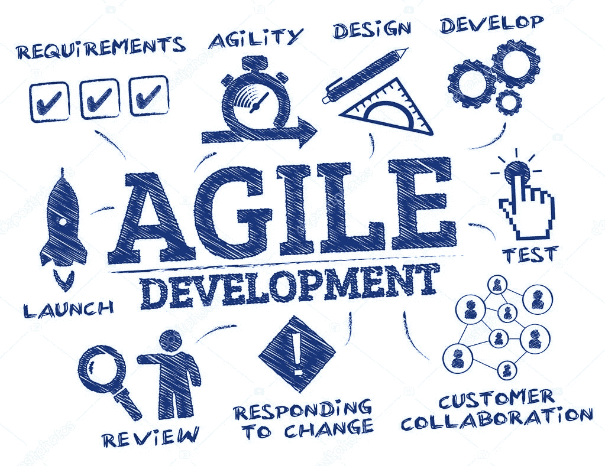
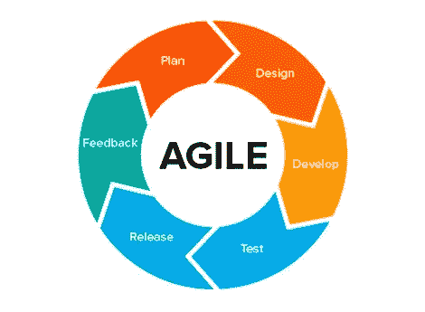
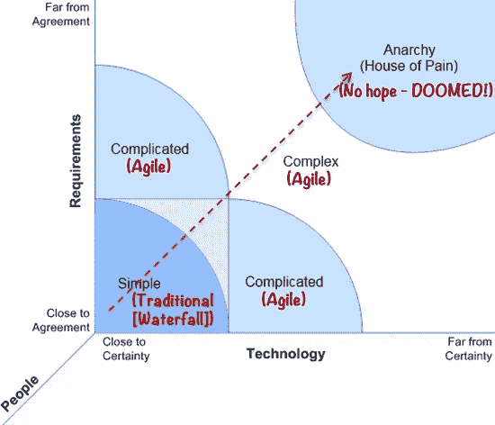
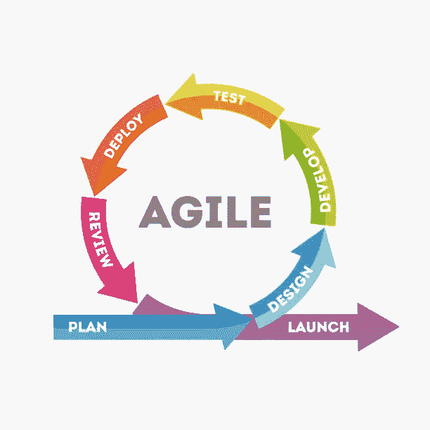

# 如何进行敏捷开发创新

> 原文：<https://blog.devgenius.io/how-to-work-with-agile-development-innovation-cd8aeab0abda?source=collection_archive---------15----------------------->

来源:Depositphotos

***敏捷开发方法*** 是基于相同原则的软件开发方法，或者是短期系统开发，需要开发者快速适应任何形式的变化。

# 敏捷方法的核心价值

*敏捷开发方法*定义了四个价值观，通常称为敏捷联盟的宣言，例如:

1.  **个人和交互胜过流程和工具**
    人际交互比流程和工具更重要。在敏捷方法中，团队成员之间的交互非常重要，因为没有良好的交互，软件制造过程就不会按计划进行。
2.  工作原型比全面的文档更重要。当与客户进行演示过程时，运行良好的软件将比完整的文档更有用。
3.  **客户协作胜过刚性谈判**
    与客户的协作比合同谈判更重要，敏捷方法的特点之一是客户成为软件开发团队的一部分。当使用敏捷方法时，在软件制造过程中与客户的良好合作是非常重要的。因为所开发的软件的功能必须根据客户的意愿不断地讨论和即兴创作。
4.  **响应变更而不是遵循计划**
    响应变更比遵循计划更重要，*敏捷开发方法*关注当客户在软件制造过程中想要变更时团队的响应速度。

# 敏捷方法的目的

资料来源:masyudit.com

1.  **高价值&工作 App 系统**，可以生产出有很高销售价值的软件，制造成本可以压下来，软件运行良好。
2.  **迭代、增量、进化**，敏捷是一种迭代的、不断变化的、进化的软件开发方法。团队必须在短时间内工作(通常 1-3 周),并且总是根据客户需求从软件中添加功能。
3.  **成本控制&价值驱动开发**，开发适合用户需求且团队能快速响应用户需求的软件，以便控制制作软件的时间和成本。
4.  高质量的产品，即使花费更少的时间和成本，也能保持软件的质量。通过在完成后测试每一个软件功能，这意味着敏捷也适应了这种需求。
5.  **灵活的&风险管理**，经常与客户会面进行软件测试，这样软件功能很容易更改，最终软件故障可以降到最低。
6.  **协作**，开发团队需要经常开会，讨论项目的进展和客户的反馈，并添加到软件中，这样团队可以最大限度的协作。
7.  **自组织、自管理的团队**，使用敏捷方法，开发人员可以管理自己，而团队经理的任务只是将软件开发人员与客户协作。从而创建一个稳固的团队。

# 敏捷方法的好处

1.  **降低项目风险**
    软件的检查和测试是在开发过程中定期进行的，因此可以知道失败和中断的风险。
2.  **更快的上市时间**
    敏捷方法将团队中每个人的项目工作基于其组成部分一起应用，以便软件可以完成并上市。
3.  **提升团队士气和动力**
    清晰而结构化的目标和工作规则的存在，让团队中的人更有动力和工作热情。
4.  **提高团队生产力**
    在开发过程开始时设定的持续时间和目标使团队工作更加集中，从而提高团队生产力。
5.  **管理不断变化的优先级的能力**
    检查开发进度使团队意识到开发过程中发生的所有变化，以便所有团队成员能够了解项目工作优先级的任何变化。

# 敏捷方法原则

1.  业务人员和开发人员之间密切的日常合作
2.  项目是围绕值得信任的有积极性的个人构建的
3.  面对面的交谈是最好的沟通方式(共处一地)
4.  持续关注技术优势和优秀设计
5.  最好的架构、需求和设计来自自组织团队
6.  团队定期反思如何变得更有效，并做出相应的调整

# 成功实施敏捷方法的关键

1.  **忠于敏捷原则**
    遵循敏捷原则——敏捷原则 selama 流程实施项目。
2.  **让实践进化**
    在项目实施中直接实践材料，由于有真实的学习案例支持，会使对所学材料的理解逐步加深
3.  **了解哪些地方敏捷不行**
    了解哪些可以用敏捷方法或瀑布方法实现。不要使用错误的方法，因为它会影响项目开发过程。
4.  **从小处着手，然后扩大**
    与直接开发大规模项目相比，先从小事做起，然后发展成为大项目是正确的做法
5.  **加强敏捷架构**
    加强对架构敏捷的理解将有助于在项目开发过程中使用敏捷概念，因为它可以提供方向——执行项目实施的步骤

# 敏捷方法的步骤

1.  **选对问题**

Stacey 矩阵敏捷方法，来源:pinterest

上面的 stacey 矩阵是什么意思？

竖线表示你想要实现什么的需求，所以在这个过程中提出“什么”这个词，它表示在这个项目中将会实现什么。而横线表示用于实现需求的技术，因此在该过程中，单词“HOW”表示将用于实现项目最终目标的方法和技术。

**2。组建团队**

在选择人员加入应用敏捷方法的团队时，团队安排需要如下:
a .代表业务和技术部门
b .填充技术部门的团队包含 3-9 人
c .选择具有与要解决的问题相关的动机和技术能力的人员

以便产生理想的团队组成，包括:

*   *业主* /客户，以开发人员作为项目最重要的部分，客户的任务决定了要做的软件的功能，测试并提供反馈。
*   经理/ *Scrum Master* ，bertugas 与 klien 一起合作开发，并对目标进行评估。
*   系统分析，制定软件的系统架构。
*   开发人员是团队中至关重要的一点，没有软件开发人员就无法实现。

**敏捷方法规划**

在这一步中，开发人员和客户制定一个关于软件需求的计划。

1.  制定一个项目并冲刺持续时间
2.  确定项目和 sprint 的成果
3.  为每日会议和冲刺评审制定一个时间表

**敏捷方法实施**

程序员对软件进行编码的过程的一部分。

**软件测试**

在这一步，质量控制部门已经对软件进行了测试，因此可以立即修复发现的错误，并保持软件质量。

**多库门塔斯**

软件测试完成后，下一步是软件文档化过程，以简化未来的维护过程。

**部署**

由质量保证部门执行的测试系统质量的过程。系统满足要求后，软件就可以部署了。

**维护**

最后一步是维护。没有 100%没有错误的软件，所以定期维护软件是非常重要的。

参考:

维基百科和网络研讨会材料