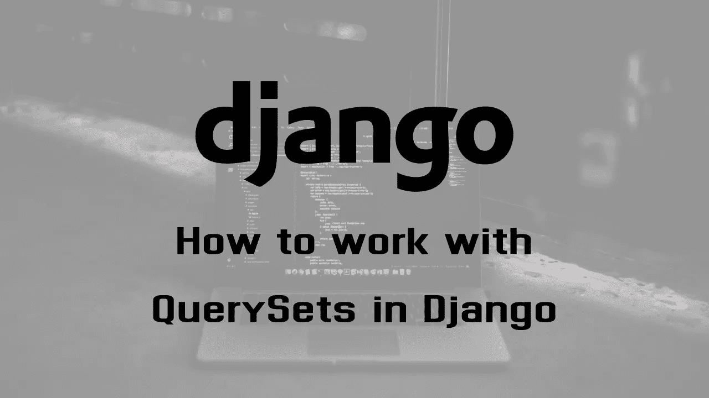
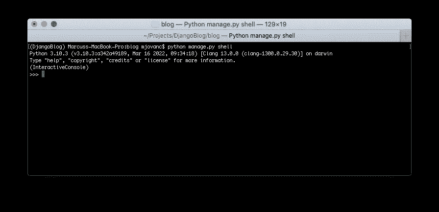
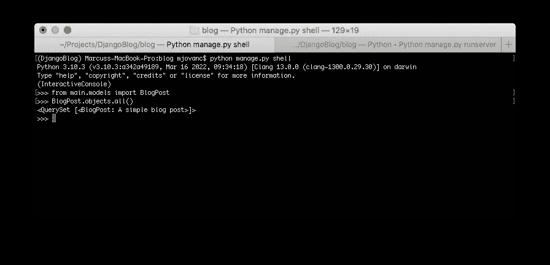
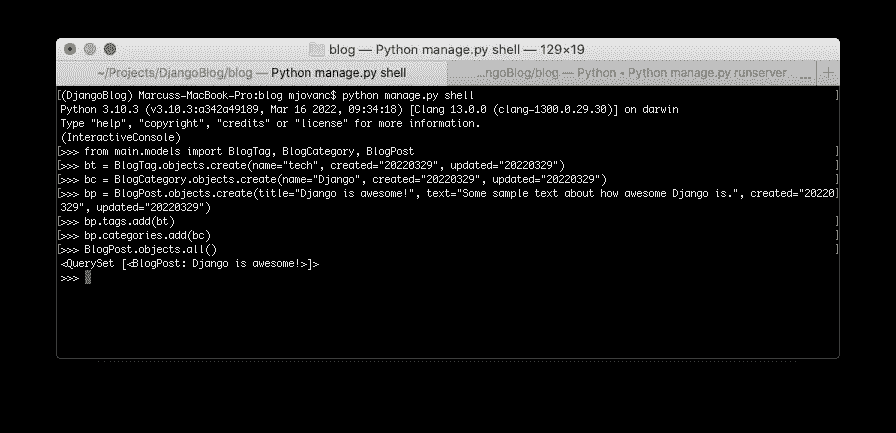

# 如何在 Django 中使用 QuerySets

> 原文：<https://blog.devgenius.io/how-to-work-with-querysets-in-django-eb45fc9d6034?source=collection_archive---------1----------------------->



在前面的教程中，我们介绍了如何使用 admin Django 接口添加数据和修改数据。这一次，我们将介绍如何用 Python 代码和 Django QuerySet API 实现这一点。

因此，我们将做我们已经做过的事情，从上一个教程的地方继续。

一旦我们创建了数据模型，Django 会自动给我们一个数据库抽象 API，让我们创建、检索、更新和删除现有的对象。这是非常有用和节省时间的。

# 当前实施

确保项目启动并运行，让我们通过检查我们的 **views.py** 文件和主应用程序目录中的 **IndexView** 类开始:

```
**class IndexView**(TemplateView):
    template_name = 'index.html'

    **def get_context_data**(self, **kwargs):
        context = super(IndexView, self).get_context_data(**kwargs)
        context['blogposts'] = BlogPost.objects.all()
        **return** context
```

我们已经使用了 Django QuerySet API！是的，因为我们使用了 BlogPost.objects.all()，所以我们基本上是检索所有的 BlogPost 对象并将其保存到上下文中，这样我们就可以遍历模板文件中的所有对象。

我们的查询集的一个改进示例:

```
>>> **BlogPost.objects.all**().order_by("-created")[:25]
```

我们将按照创建日期获取所有 25 个降序对象。在**创造**之前的字母正使它向相反的方向排序。Django 中的 QuerySets 是懒惰的，这意味着只有当您明确要求结果时，查询才会命中数据库。在实际使用查询结果之前，您可以在不访问数据库的情况下进一步过滤。

# 姜戈壳牌公司

我们开始做一些查询吧！在 Django shell 中，我们可以测试我们的查询等等。因此，我们现在将重点使用它，同时尝试查询数据的不同选项。Django shell 基本上是 Python shell，但是我们可以访问 Django API。通过运行以下命令启动 shell:

```
python manage.py shell
```



如果您不了解 Python shell，请查看如何使用它的教程。首先，让我们导入 BlogPost 模型，并尝试获取所有对象:

```
>>> **from main.models import** BlogPost
>>> **BlogPost.objects.all**()
```



这里我们用 QuerySet 得到了 BlogPost 对象。太好了，有用。

# 创建对象

## 创建一个具有关系的对象

让我们再添加两个对象，这样我们就有一些对象可以玩了。但是我们首先需要添加两个对象 BlogCategory 和 BlogTag，这样我们就可以将它们作为一个关系添加到 BlogPost 对象中，因为它会给我们一个错误，如果不是的话，因为它是强制的。

```
>>> **from main.models import** BlogTag, BlogCategory, BlogPost
>>> bt = **BlogTag.objects.create**(name="tech", created="20220329", updated="20220329")
>>> bc = **BlogCategory.objects.create**(name="Django", created="20220329", updated="20220329")
>>> bp = **BlogPost.objects.create**(title="Django is awesome!", text="Some sample text about how awesome Django is.", created="20220329", updated="20220329")
>>> **bp.tags.add**(bt)
>>> **bp.categories.add**(bc)
```



我们现在添加了一个带有关系的博客文章对象。

## 批量创建对象

如果我们想批量创建许多对象，我们可以使用以下语法:

```
>>> bp = **BlogTag.objects.bulk_create**([
...   BlogTag(name="programming", created="20220329", updated="20220329"),
...   BlogTag(name="crypto", created="20220329", updated="20220329"),
...])
```

## 获取或创建对象

```
>>> obj, created = **BlogTag.objects.get_or_create**(
...    title="crypto",
...    created="20220329",
...    updated="20220329",
...)
```

因此，如果对象不存在，这将创建该对象，如果存在，则只获取该对象。

# 更新对象

我们可以简单地使用以下命令来更新对象:

```
>>> bp = **BlogPost.objects.get**(id=10)
>>> bp.title = "New title"
>>> **bp.save**()
```

我们还可以通过一些过滤同时更新许多不同的对象:

```
>>> bp = **BlogPost.objects.filter**(title__startswith="Django tutorial")
>>> **bp.update**(title="Django Tutorial")
```

这将更新所有以 **Django 教程**开头的博客文章，并替换为 **Django 教程**。非常整洁。

# 过滤

## 基本过滤

过滤的工作原理听起来很明显，我们可以根据发送的给定参数过滤出结果。这可以链接在一起，因此如果我们想要对结果进行排序，我们可以在过滤后进行排序，例如:

```
>>> **BlogTag.objects**.**filter**(name__startswith="Django").order_by("name", "created")
```

因此，我们可以同时进行筛选和排序，甚至将我们现在要讨论的 exclude 链接在一起。

## 排除结果

我们也可以将某些内容排除在查询集之外，这样可以避免得到不需要的结果:

```
>>> **BlogTag.objects.exclude**(title__startswith="Unwanted", title__startswith="Spring Boot")
```

# 排序

## 按一个或多个属性排序

我们可以通过 order_by()方法对查询集进行排序:

```
>>> **BlogTag.objects.order_by**("name", "created").first()
```

然后我们按名称和创建日期排序，得到第一个。

## 反转 QuerySet 的顺序

如果我们使用 reverse()方法，我们可以对查询集进行反向排序:

```
>>> **BlogTag.objects.order_by**("created").reverse()[:5]
```

在这里，我们将获得所有的博客标签，并按创建日期排序，然后我们得到最多 5 个博客标签的反向排序。

## 通过属性获取最新的对象

这将获取创建日期之前的最新对象:

```
>>> **BlogTag.objects.latest**("created")
```

我们也可以通过多个属性得到它:

```
>>> **BlogTag.objects.latest**("created", "-updated")
```

我们还有一个方法 **earliest()** ，它的工作方式和 latest 一样，只是方向变了。

# 获取对象

要获得一个对象，我们可以简单地使用:

```
>>> **BlogTag.object.get**(id=10)
```

# 删除对象

我们可以简单地删除一个对象，比如:

```
>>> **BlogTag.objects.filter**(id=id).delete()
```

删除连接到另一个对象的所有对象:

```
**>>>** b = **BlogPost.objects.get**(id=1)
**>>> BlogTag.objects.filter**(blog=b).delete()
```

我们也可以像这样删除多个对象:

```
**>>>** bt = **BlogTag.objects.all**()
**>>> bt.delete**()
```

现在，通过以下方式退出 Django Shell:

```
exit()
```

# 摘要

现在，您有望对如何在 Django 中使用 QuerySet API 有所了解。对于 Django QuerySets，我们还可以做更多的事情，但是我会做得很简短，让您浏览 Django 文档，如果您需要更具体的东西，这真的很好。

请务必在 LinkedIn 上关注我，了解更多即将推出的教程和其他相关内容:【https://www.linkedin.com/in/marcuscvjeticanin/

# 参考

*   【https://docs.djangoproject.com/en/dev/ref/models/querysets/ 
*   [https://docs.djangoproject.com/en/dev/topics/db/queries/](https://docs.djangoproject.com/en/dev/topics/db/queries/)