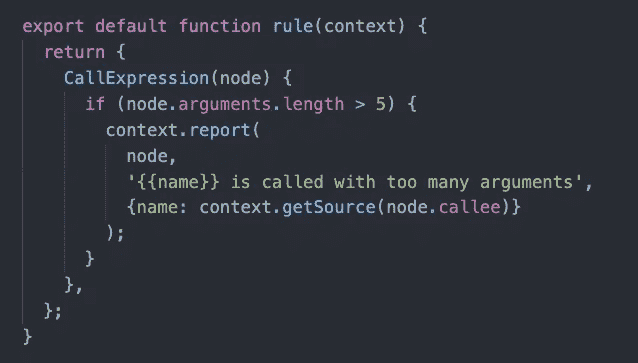
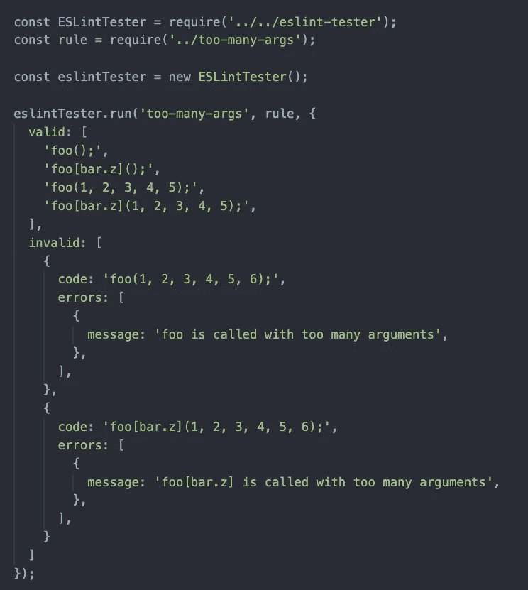

# 如何写一个 ESLint 规则？

> 原文：<https://blog.devgenius.io/how-to-write-a-es-lint-rule-2abdd9bfd327?source=collection_archive---------1----------------------->

软件工程师每天都在生产类似的代码。当我们计划更新这些重复的逻辑时，一个普通的工程师可能会将常见的逻辑提取到一个接口中。但是，一个杰出的工程师会采取额外的步骤:**替换现有的用法，并阻止以这种方式编写的新代码**。

为了实现这种预防，像 [**CodeMod**](https://github.com/facebook/codemod) 和 Linter 这样的工具开始发挥作用。在这篇文章中，我将与你分享建立一个电子邮件规则的基本步骤。

来自[对讲机](https://www.intercom.com)的 Img

# 什么是 Linter？

**“To lint”**就是对代码做静态分析，发现风格问题，潜在 bug 等。

linter 是一个执行“林挺”并报告关于这种风格问题和错误的警告的程序。

> lint 警告的一个例子是一行代码超过 80 个字符。

# ESLint 是什么？

ESLint 是 JavaScript 和[流](http://flow.org)的开源 linter。它使用一个解析器将原始代码转换成[抽象语法树(AST)](https://en.wikipedia.org/wiki/Abstract_syntax_tree) 。

## 大西洋时间

ESLint 使用的 AST 表示称为 [ESTree](https://github.com/estree/estree/) 。如果您以前从未见过 AST 是什么样子，它只是一个对象树，这些对象一起表示代码的结构。可视化和检查 AST 的最佳工具是[AST Explorer](https://astexplorer.net/)——这个工具将允许您输入任意代码并查看完整的 AST。

## ESLint 是如何工作的？

ESLint 允许通过插件系统轻松定义自定义规则。这意味着我们可以用高性能的、精确的基于 AST 的规则替换所有基于正则表达式的规则。

您的 lint 规则将简单地返回一组“**选择器**”，ESLint 将在 AST 遍历时对其进行分析和匹配。

选择器可以像 AST 节点的名称一样简单(如***variable declaration***)，也可以是类似于 CSS 选择器的无限复杂的匹配器。当选择器匹配时，ESLint 将调用回调并传入与选择器匹配的节点。

# 编写一个 ESLint 规则

在这个例子中，如果一个函数有超过 5 个参数，我们将警告开发者。

Lint 规则示例

这里我们告诉 ESLint，对于每个 **CallExpression** ，我们都要调用。节点**是一个 AST 对象。**

ESLint [为报告提供了一个上下文对象](http://eslint.org/docs/developer-guide/working-with-rules#the-context-object)，它还包含一些强大的实用函数，用于遍历令牌、评估范围和检查注释。

## 测试您的规则

一旦我们完成了规则的定义，就该使用 [eslint-tester](https://github.com/eslint/eslint-tester) 来测试有效和无效的情况了。请参见下面的示例。

之后，我们可以将这个测试集成到整体测试框架中，就像 [**jest**](http://jestjs.io) **一样。**

# 固定器

理想情况下，lint 规则应该附带一个单击修复程序，可以自动修复它报告的 lint 错误。

这使得工程师更容易遵守 lint 规则，并为将来作为自动格式化的一部分自动修复 lint 错误打开了大门。

关于实现 Fixer 的细节，我将留给你在 [ESLint 官方指南](https://eslint.org/docs/developer-guide/working-with-rules#applying-fixes)中探索。

# 结局

我们工作的本质是寻找模式，并通过编码将它们自动化。为了加速这个过程，我们需要杠杆，而 Lint 恰好是一个方便的工具。