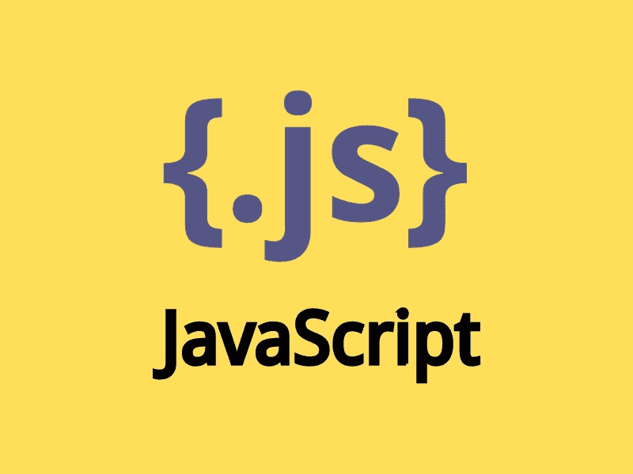
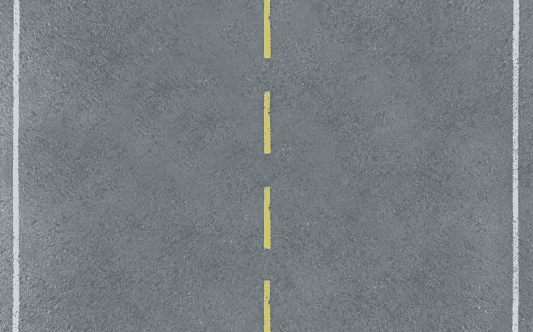
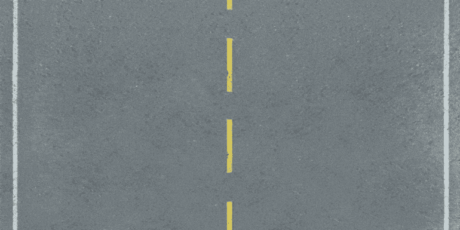
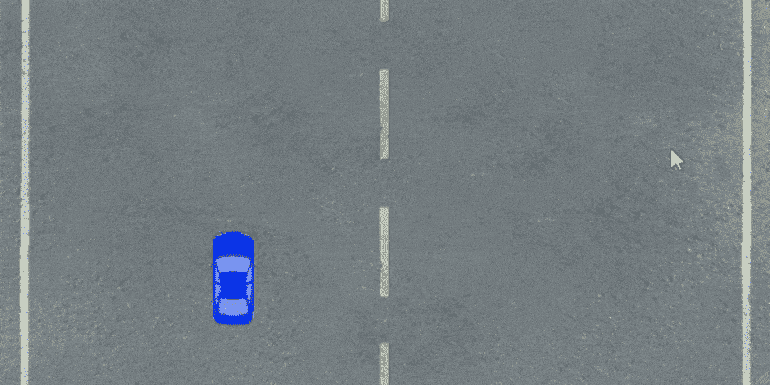
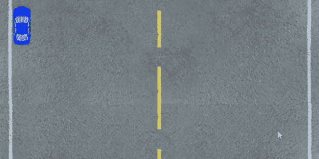

# 如何用 JavaScript 写一个游戏

> 原文：<https://blog.devgenius.io/how-to-write-a-game-in-javascript-4d1d3ba0828c?source=collection_archive---------18----------------------->



今天的浏览器允许你创建全图形的游戏。以下是如何使用 JavaScript 和 HTML5 编写简单的赛车游戏。

浏览器现在为 JavaScript 开发人员创建有趣的站点提供了很多选择。Flash 曾被用于此——它很受欢迎，无数的游戏、玩家、花哨的界面等等都是在它上面创建的。然而，它们不再在任何现代浏览器中运行。

事实上，Flash 技术是重量级的，并且充满了漏洞，所以它开始放弃。尤其是因为有 HTML5 形式的替代品。

Canvas 是可以用 JS 命令在上面绘图的画布。它可以用来创建动画背景，各种构造函数，最重要的是，游戏。

在这篇文章中，你将学习如何用 JavaScript 和 HTML5 创建一个浏览器游戏。但首先，我们建议您熟悉 JS 中的面向对象编程(只需了解什么是类、方法和对象)。这是创建游戏的最佳方式，因为它允许你处理实体而不是抽象数据。但是，有一个缺点:任何版本的 Internet Explorer 都不支持 OOP。

**游戏页面布局**

首先，您需要创建一个显示画布的页面。这需要很少的 HTML:

```
<!DOCTYPE html>
<html>
    <head>
        <title>JS Game</title>
        <link rel="stylesheet" href="style.css">
        <meta charset="utf-8">
    </head>
    <body>
        <div class="wrapper">
            <canvas width="0" height="0" class="canvas" id="canvas">Your browser does not support JavaScript и HTML5 </canvas>
        </div>
        <script src="game.js"></script>
    </body>
</html>
```

现在我们需要添加样式:

```
body, html
{
    width: 100%;
    height: 100%;
    padding: 0px;
    margin: 0px;
    overflow: hidden;
}

.wrapper
{
    width: 100%;
    height: 100%;
}

.canvas
{
    width: 100%;
    height: 100%;
    background: #000;
}
```

注意，在 HTML 中，canvas 元素的宽度和高度都是零，而 CSS 指定的是 100%。在这方面，画布表现得像一幅图像。它有实际分辨率和可见分辨率。

使用样式更改可见分辨率。然而，图片的尺寸将保持不变:它只是被拉伸或压缩。这就是为什么实际的宽度和高度将在以后通过脚本来指定。

**游戏脚本**

首先，让我们为游戏添加一个脚本蓝图:

```
var canvas = document.getElementById("canvas"); //Retrieving a canvas from the DOM
var ctx = canvas.getContext("2d"); //Obtaining a context - through it you can work with the canvas

var scale = 0.1; //Machine scale

Resize(); //When the page loads, the canvas size is set

window.addEventListener("resize", Resize); //Changing the size of the window will change the size of the canvas

window.addEventListener("keydown", function (e) { KeyDown(e); }); //Receiving keystrokes from the keyboard

var objects = []; //An array of game objects
var roads = []; //An array with backgrounds

var player = null; //The object controlled by the player - here will be the number of the object in the objects array

function Start()
{
    timer = setInterval(Update, 1000 / 60); //The game state will update 60 times per second - at this rate, the update of what is happening will seem very smooth
}

function Stop()
{
    clearInterval(timer); //Stopping the update
}

function Update() //Game update
{
    Draw();
}

function Draw() //Working with graphics
{
    ctx.clearRect(0, 0, canvas.width, canvas.height); //Clearing the canvas from the previous frame
}

function KeyDown(e)
{
    switch(e.keyCode)
    {
        case 37: //Left
            break;

        case 39: //Right
            break;

        case 38: //Up
            break;

        case 40: //Down
            break;

        case 27: //Esc
            break;
    }
}

function Resize()
{
    canvas.width = window.innerWidth;
    canvas.height = window.innerHeight;
}
```

这个脚本拥有创建游戏所需的一切:数据(数组)、更新、绘图和控制功能。只剩下用基本逻辑来补充它了。也就是说，确切地指定对象的行为方式以及它们在画布上的显示方式。

**游戏逻辑**

在 Update()函数调用期间，游戏对象的状态将会改变。之后，将使用 Draw()函数在画布上绘制它们。所以我们实际上并不移动画布上的对象，我们只画一次，然后改变它们的坐标，删除旧图像，用新坐标显示对象。这一切发生得如此之快，以至于给人以运动的错觉。

让我们看一个道路的例子。



这个图像显示在画布上，并逐渐向下移动。紧接着，会显示另一个像这样的图像，使它感觉像一条没有尽头的路。

为此，让我们创建一个 Road 类:

```
class Road
{
    constructor(image, y)
    {
        this.x = 0;
        this.y = y;

        this.image = new Image();

        this.image.src = image;
    }

    Update(road) 
    {
        this.y += speed; //The image shifts down when you refresh

        if(this.y > window.innerHeight) //If the image has gone over the edge of the canvas, change the position
        {
            this.y = road.y - this.image.height + speed; //The new position is indicated with the second background
        }
    }
}
```

Road 类的两个对象被添加到背景数组中:

```
var roads = 
[
    new Road("images/road.jpg", 0),
    new Road("images/road.jpg", 626)
]; //background array
```

您现在可以更改 *Update()* 函数，以便图像的位置随着每一帧而变化。

```
function Update() //Game Update
{
    roads[0].Update(roads[1]);
    roads[1].Update(roads[0]);

    Draw();
}
```

只剩下添加这些图像的输出:

```
function Draw() //Working with graphics
{
    ctx.clearRect(0, 0, canvas.width, canvas.height); //Clearing the canvas from the previous frame

    for(var i = 0; i < roads.length; i++)
    {
        ctx.drawImage
        (
            roads[i].image, //Render image
            0, //Initial X position in the image
            0, //Initial Y-axis position in the image
            roads[i].image.width, //Image width
            roads[i].image.height, //Image height
            roads[i].x, //X-axis position on the canvas
            roads[i].y, //Y-axis position on the canvas
            canvas.width, //The width of the image on the canvas
            canvas.width //Since the width and height of the background are the same, the width is specified as the height
        );
    }
}
```

现在你可以看到它在游戏中是如何工作的:



是时候增加一个球员和一个 NPC 了。为此，您需要编写一个汽车类。它将有一个 Move()方法，玩家用它来控制他的汽车。NPC 的移动将通过 Update()完成，它只是改变了 Y 坐标。

```
class Car
{
    constructor(image, x, y)
    {
        this.x = x;
        this.y = y;

        this.image = new Image();

        this.image.src = image;
    }

    Update()
    {
        this.y += speed;
    }

    Move(v, d) 
    {
        if(v == "x") //X-axis movement
        {
            this.x += d; //Offset

            //
            if(this.x + this.image.width * scale > canvas.width)
            {
                this.x -= d; 
            }

            if(this.x < 0)
            {
                this.x = 0;
            }
        }
        else //Y-axis movement
        {
            this.y += d;

            if(this.y + this.image.height * scale > canvas.height)
            {
                this.y -= d;
            }

            if(this.y < 0)
            {
                this.y = 0;
            }
        }

    }
}
```

让我们创建第一个要检查的对象。

```
var objects = 
[
    new Car("images/car.png", 15, 10)
]; //An array of game objects
var player = 0; //the number of the object controlled by the player
```

现在您需要向 draw()函数添加一个绘制汽车的命令。

```
for(var i = 0; i < objects.length; i++)
{
    ctx.drawImage
    (
        objects[i].image, //Render image
        0, //Initial X position in the image
        0, //Initial Y-axis position in the image
        objects[i].image.width, //Image width
        objects[i].image.height, //Image height
        objects[i].x, //X-axis position on the canvas
        objects[i].y, //Y-axis position on the canvas
        objects[i].image.width * scale, //The width of the image on the canvas multiplied by the scale
        objects[i].image.height * scale //The height of the image on the canvas multiplied by the scale
    );
}
```

在 KeyDown()函数中，当您按下键盘时会调用该函数，您需要添加对 Move()方法的调用。

```
function KeyDown(e)
{
    switch(e.keyCode)
    {
        case 37: //Left
            objects[player].Move("x", -speed);
            break;

        case 39: //Right
            objects[player].Move("x", speed);
            break;

        case 38: //Up
            objects[player].Move("y", -speed);
            break;

        case 40: //Down
            objects[player].Move("y", speed);
            break;

        case 27: //Esc
            if(timer == null)
            {
                Start();
            }
            else
            {
                Stop();
            }
            break;
    }
}
```

现在你可以检查渲染和控制。



碰撞时不会发生任何事情，但稍后会修复。首先，您需要确保从视图中丢失的对象被删除。这是为了避免堵塞闸板。

在 Car 类中，我们添加值为 false 的 dead 字段，然后在 Update()方法中更改它:

```
if(this.y > canvas.height + 50)
{
    this.dead = true;
}
```

现在您需要更改游戏的更新功能，替换与对象相关的代码:

```
var hasDead = false;

for(var i = 0; i < objects.length; i++)
{
    if(i != player)
    {
        objects[i].Update();

        if(objects[i].dead)
        {
            hasDead = true;
        }
    }
}

if(hasDead)
{
    objects.shift();
}
```

如果你不移除物体，当产生太多的汽车时，游戏将开始减慢计算机的速度。

**游戏物体的碰撞**

现在你可以开始实现碰撞了。为此，为 Car 类编写 Collide()方法，该方法将检查汽车的坐标:

```
Collide(car)
{
    var hit = false;

    if(this.y < car.y + car.image.height * scale && this.y + this.image.height * scale > car.y) //If the objects are on the same line horizontally
    {
        if(this.x + this.image.width * scale > car.x && this.x < car.x + car.image.width * scale) //If the objects are on the same line vertically
        {
            hit = true;
        }
    }

    return hit;
}
```

现在我们需要给 Update()函数添加一个冲突检查:

```
var hit = false;

for(var i = 0; i < objects.length; i++)
{
    if(i != player)
    {
        hit = objects[player].Collide(objects[i]);

        if(hit)
        {
            alert("You crashed!");
            Stop();
            break;
        }
    }
}
```

这是游戏中的内容



发生冲突时，可以添加任何逻辑:

打开动画；

添加一种效果；；

删除一个对象；

健康状况的改变，等等。

所有这些都留给开发者自己决定。

**结论**

这是一个非常简单的游戏，但它足以理解 JS 如何处理图形以及游戏是如何创建的。您可以在 GitHub 资源库中找到图片和完整的游戏代码。

使用 canvas 有利于处理图形:它提供了很好的特性，并且不会给浏览器带来太多的负载。我们现在也有一个 WebGL 库(示例和用法)，它可以为您提供大量的性能和 3D 工作(canvas 无法做到这一点)。

理解 WebGL 可能很难——也许相反，许多人对尝试 Unity 引擎更感兴趣，该引擎知道如何编译项目以在浏览器中运行它们。