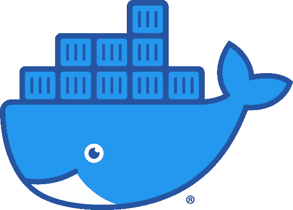

# 如何写好 Dockerfile 文件

> 原文：<https://blog.devgenius.io/how-to-write-a-good-dockerfile-2a294f04975c?source=collection_archive---------10----------------------->

## 学习最佳实践和撰写第一份 docker 文件的 11 个技巧



码头工人标志由[码头工人](https://www.docker.com/company/newsroom/media-resourc)

# 目录

*   [提示#1: 学习一些基本的 Docker 词汇](#91ea)📚
*   [技巧 2:学习如何用 Dockerfile 文件构建图像](#379a)
*   [提示 3:将 Docker 文件保存在上下文的根目录下](#2002)
*   [提示#4:从一个空目录开始](#3697)
*   [提示#5: 了解 Dockerfile 格式](#86ba)
*   [提示#6:认为指令是相互独立的](#4762)
*   [提示#7:参考 Docker Hub 页面选择合适的图像变体](#cedd)
*   技巧 8:使用。dockerignore
*   [提示 9:给你的图片起个名字，也可以加上标签](#917b)
*   [提示#10:理解 Docker 守护进程是如何工作的](#eac7)
*   [提示#11:尽可能使用构建缓存](#df45)

## 技巧 1:学习一些基本的 Docker 词汇📚

a`Dockerfile`:Docker 读取并用来构建映像的一组指令。它只是一个文本文档，你可以在其中存储所有你会在命令行上调用的命令来创建一个图像。

一个`context`目录:指定位置路径或 URL 下的**文件集。
路径是指机器上的本地目录。URL 指向一个 Git 存储库位置。注意:构建上下文是递归处理的。这意味着，给定一个路径或 URL，将处理所有子目录。**

一个`docker build`命令:用来构建一个图像的命令。它需要一只`Dockerfile`一只`context`。

## 技巧 2:学习如何用 Dockerfile 文件构建图像

要创建一个自动化的构建，您可以使用`docker build <context>`。
我们已经看到了上下文是如何成为本地路径或 git URL 的。如果您想使用您的本地当前目录作为构建上下文，您只需要使用`.`

一旦您执行了`docker build <context>`命令，它将首先把整个上下文(递归地)发送到 Docker 守护进程。实际上，在执行了 build 命令后，您将看到如下日志:

```
$ docker build .Sending build context to Docker daemon 6.51 MB
```

## 技巧 3:将 Docker 文件保存在上下文的根目录下

标准的做法是将`Dockerfile`保存在上下文的根位置。但是，如果您需要更改这个位置，您可以用`-f`标志指定新的路径。比如:`docker build -f /path/to/a/Dockerfile`。

## 技巧 4:从一个空目录开始

因为上下文的所有内容都被发送到 Docker 守护进程，所以最好从一个空目录开始，作为只有 Docker 文件的上下文。然后，您可以添加构建 Dockerfile 文件所需的文件。

⛔️从不使用根目录作为路径，因为这将整个硬盘驱动器转移到 Docker 守护进程。

## 技巧 5:理解 Dockerfile 文件格式

`Dockerfile`不区分大小写。然而，最好是将指令大写，以便更容易地将它们与参数区分开来。

一个`Dockerfile`应该以一个`FROM`指令开始。唯一可能出现在`FROM`指令之前的是:

*   注释:以`#`开头的行(除非它们是解析器指令)。
*   [解析器指令](https://docs.docker.com/engine/reference/builder/#parser-directives)。
*   [全局作用域参数](https://docs.docker.com/engine/reference/builder/#arg)(当声明的参数用于`FROM`指令时)。

`FROM`指令指定了正在构建的父映像。所有后续命令都基于该父映像。

示例:

```
FROM python:3.7
```

带有`FROM scratch`指令的 Dockerfile 不使用父映像，而是创建一个**基础映像**。

`Dockerfile`的格式应该如下:

```
# Comment
INSTRUCTION arguments
```

注释行在 Docker 指令执行前被删除。这意味着你可以写:

```
RUN echo hello \
# comment
world
```

或者

```
RUN echo hello \
world
```

是等价的。

## 技巧 6:认为指令是相互独立的

Docker 守护进程逐个运行`Dockerfile`指令。这意味着`RUN cd /tmp`对下一条指令没有任何影响。

## 技巧 7:参考 Docker Hub 页面来选择合适的图像变体

有时图像有多种风格，每一种都是为特定的用例设计的。

例如， [Python Docker 图像](https://hub.docker.com/_/python)以`python:<version>`、`python:<version>-slim`、`python:<version>-alpine`、`python:<version>-windowsservercore`的形式出现。在页面底部，您会发现所有不同标签的描述。

**如果不确定，使用标准的，如** `**python:<version>**` **。**

总的来说，你应该知道 Debian 和 Alpine 是两种 Linux 风格。Docker 图像可以基于一个或另一个。您选择哪一个取决于您的需求。

这些帖子可能会有所帮助:[基于 Alpine 和 Debian 的 Docker 映像之间的差异](https://forum.astronomer.io/t/difference-between-alpine-and-debian-based-docker-images/737)，或者[比较 Debian 和 Alpine 对于容器的差异& Docker 应用](https://www.turnkeylinux.org/blog/alpine-vs-debian)，[使用 Alpine 作为基本 Docker 映像的三大优势](https://nickjanetakis.com/blog/the-3-biggest-wins-when-using-alpine-as-a-base-docker-image)。

我也觉得这篇文章很有见地:[阿尔卑斯、苗条、舒展、巴斯特、杰西、靶心 Docker 形象有哪些不同？](https://medium.com/swlh/alpine-slim-stretch-buster-jessie-bullseye-bookworm-what-are-the-differences-in-docker-62171ed4531d#:~:text=In%20short%2C%20the%20difference%20between,is%20the%20underlying%20operating%20system)

## 技巧 8:使用。dockerignore

您可以向上下文目录添加一个`.dockerignore`文件，以排除特定的文件和目录。这将提高构建的性能，因为 Docker 将考虑给定指令中指定的所有文件/目录。例如，`COPY .`将复制当前目录的所有内容，但很可能并不需要所有文件/目录来构建 Docker 映像。

## 提示 9:给你的图片起一个名字，也可以选择一个标签

`docker build`最常用的选项之一是使用`--tag`或`-t`为格式为`name:tag`的图像添加名称和可选的标签。图像名称由斜杠分隔的名称组成。

示例:`docker build -t view/apache:2.0 .`将图像保存到带有标签`2.0`的存储库`view/apache`(这也是图像名称)。

如果不指定任何标签，Docker 会自动分配`latest`一个。

默认情况下，Docker 将图像保存在位于`registry-1.docker.io`的公共注册表中。如果你想使用一个私有注册主机名，你可以这样做，只要主机名符合标准的 DNS 规则，并且不包含下划线。此外，您还可以指定格式为`:8080`的端口号。

示例:`docker build -t myregistryhist:5000/fedora/httpd:version1.0`将私有注册表中的图像推送到带有 stage `version1.0`的`fedora`存储库中。

您还可以多次使用`-t`参数将图像标记到多个存储库中。

示例:`docker build -t shykes/myapp:1.0.2 -t shykes/myapp:latest`

## 技巧 10:理解 Docker 守护进程是如何工作的

Docker 守护进程负责运行构建(它不是 CLI)。构建过程包括 4 个主要步骤:

*   步骤 1:上下文目录的所有内容都被发送到 Docker 守护进程。
*   步骤 2:Docker 守护进程逐个运行 Docker 文件中的指令，并将每个指令的结果提交给一个新的映像。
*   步骤 Docker 守护进程输出新图像的 ID。
*   步骤 Docker 守护进程自动清理您发送的上下文。

## 技巧#11:尽可能使用构建缓存

缓存将大大加快构建过程。如果有东西被缓存，您应该在控制台输出中看到缓存消息。

默认情况下。构建缓存基于您当前正在构建的计算机上创建的先前构建的结果。如果你想要一个外部构建缓存，你可以使用`--cache-from`选项。

## 参考

*   档案参考:[https://docs.docker.com/engine/reference/builder/#run](https://docs.docker.com/engine/reference/builder/#run)