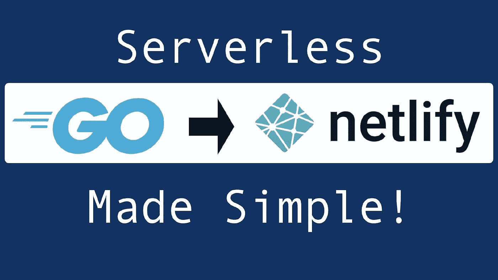
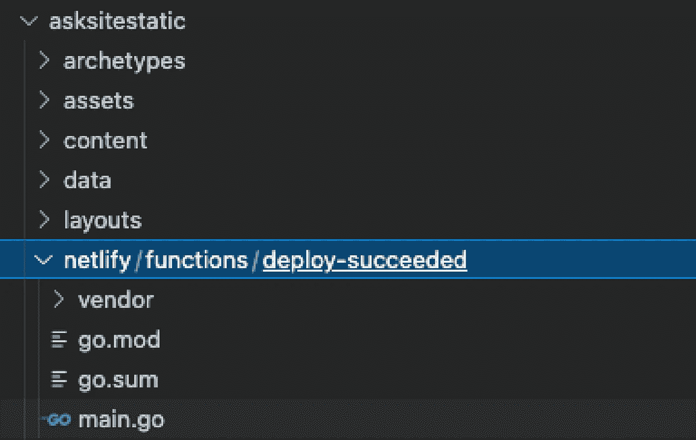

# 如何用 Golang 编写一个有效的部署后函数

> 原文：<https://blog.devgenius.io/how-to-write-a-netlify-post-deploy-function-in-golang-ba2a5cac7ec0?source=collection_archive---------15----------------------->



简化无服务器

如果你在 Netlify.com 上托管你的网站，Netlify Functions 特性有可能为你的 JAMStack 站点增加大量的功能，而不需要额外的费用。Netlify 函数是简单的无服务器函数，可以通过向站点上的某个 URL 提交数据来触发，也可以通过站点构建过程中的触发事件来触发。

最近，在 Netlify 上成功部署了 Hugo 站点后，我需要一种方法来执行一些额外的功能。为了做到这一点，我使用了部署后网络功能，它工作得非常好！

## 我的使用案例

我一直在开发一个工具，它会自动将我在网站上写的任何新帖子作为草稿发布到 medium.com。我写了一些关于这个工具的文章，你可以在这里[和](/introducing-medium-auto-post-syndicate-your-hugo-content-to-medium-com-3fd760ce09)[这里](/auto-generate-a-medium-com-rest-api-payload-to-syndicate-posts-with-hugo-fce630cced67)阅读。我需要完成的最后一步是在我发表新文章时自动发布它。以前我一直手动运行这个工具，虽然它工作得很好，但我非常懒，想都没想就想让它工作。

## 创建网络功能

Netlify 关于 Netlify 函数的文档还可以，但是不太好。它需要一些跳跃和一些额外的挖掘来弄清楚我需要做的一切，但最终，我把它都弄清楚了。以下是我完成的步骤，以及我在这个过程中遇到的一些有用的“缺失文档”。

## 创建文件——命名很重要！



文件位置网络/功能/部署-成功

根据 [Netlify 函数文档](https://docs.netlify.com/functions/trigger-on-events/)，如果我想让一个函数在成功部署后触发，我需要将该函数放在路径`netlify/functions/deploy-success`中。因为我是用 Go 写的，所以我应该把我的 main.go 文件以及任何其他必要的依赖项放在这个目录中。这是 Netlify 创建的命名约定，这样您就不必向构建系统注册函数。

在创建了空的 main.go 文件之后，我还将目录初始化为 go 模块。文档中没有提到这一点，但这是大多数 Go 应用程序的编写方式，因此这似乎是正确的做法。

`go mod init github.com/askcloudarchitech/askcloudarchitech/netlify/functions/deploy-suceeded`

## 编写执行步骤

这是我的 main.go 文件的内容。我将解释下面的每一行。

*   第 1–11 行—将包设置为主包，并添加任何必要的导入。如果您在安装 Go 工具的情况下使用 VScode，它将自动添加许多这些导入，但是您将需要其中的大部分(减去`mediumautopost`包，它是我为我的功能定制的代码)
*   第 13–19 行—对于我的特定功能，我需要该功能只在生产部署中运行(而不是在测试环境中)。为此，我需要从启动该函数的请求体中获取`payload.context`属性。这两个结构表示请求体的数据结构，它将为我获取一个值。注意:请参阅下一节了解更多信息。这一部分在任何地方都没有记录，我不得不把它弄清楚。
*   第 21 行——处理函数来自 [Netlify 函数 go 示例](https://docs.netlify.com/functions/build-with-go/#synchronous-function-format)。当这个函数执行时，AWS lambda 调用的就是这个函数。
*   第 23–24 行—将请求体解组为我上面提到的请求体类型。同样，请参见下文了解更多信息。
*   第 26–30 行——这是我的`mediumautopost`工具的实际功能。如果这是一个生产版本，请运行中型自动发布工具，否则打印一条消息，指出该步骤已被跳过。
*   第 32–36 行—发回一个表示成功的 200 响应。
*   第 39–41 行—这是上面列出的 Netlify 站点上的示例中定义的主函数。

## 调试有效负载

就像我上面提到的，我花了很长时间才弄明白如何获得部署的所有细节。我知道必须要有详细的信息，但是医生并没有提到太多。最后，传递给处理函数的`request`参数包含了大量关于构建的细节。不幸的是，由于 Go 是一种强类型语言，您不能只访问 JSON 数据而不将其解组为您自己的类型。为了解组，您需要知道结构(这是一个第 22 条军规)。所以…下面的要点包含了请求体的所有细节，所以你不必亲自去做。你可以以后再谢我:)

## 设置环境变量

点火前的最后一步！如果您的功能需要访问任何环境变量，您需要在 Netlify 管理网站上的 Netlify 设置页面中设置它们。只要登录网络生活管理网站，点击你的网站，然后去`/settings/deploys#environment`。

## 检查是否正确执行

好了，现在你可以将你的修改提交给 Github 了。将更改上传到主分支后，回到 Netlify 管理站点并检查您的部署日志，您应该会看到类似下面的信息，这表明创建并部署了一个新功能。

```
12:11:25 AM: ────────────────────────────────────────────────────────────────
12:11:25 AM:   2\. Functions bundling                                         
12:11:25 AM: ────────────────────────────────────────────────────────────────
12:11:25 AM: ​
12:11:25 AM: Packaging Functions from netlify/functions directory:
12:11:25 AM:  - deploy-succeeded/main.go
12:11:25 AM: ​
12:11:32 AM: ​
12:11:32 AM: (Functions bundling completed in 7.5s)
12:11:32 AM: ​
12:11:32 AM: ────────────────────────────────────────────────────────────────
12:11:32 AM:   3\. Deploy site                                                
12:11:32 AM: ────────────────────────────────────────────────────────────────
12:11:32 AM: ​
12:11:32 AM: Starting to deploy site from 'asksitestatic/public'
12:11:33 AM: Creating deploy tree 
12:11:33 AM: Creating deploy upload records
12:11:33 AM: 0 new files to upload
12:11:33 AM: 1 new functions to upload
12:11:39 AM: Site deploy was successfully initiated
12:11:39 AM: ​
```

如果一切顺利，你也应该能够进入顶部的函数菜单，看到你的函数已经成功运行。

编码快乐！