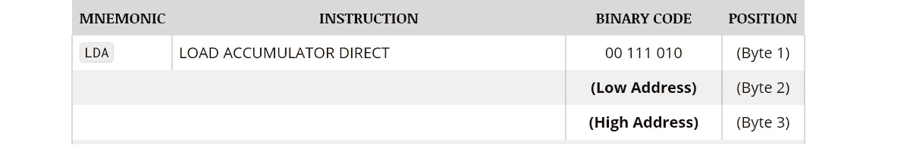
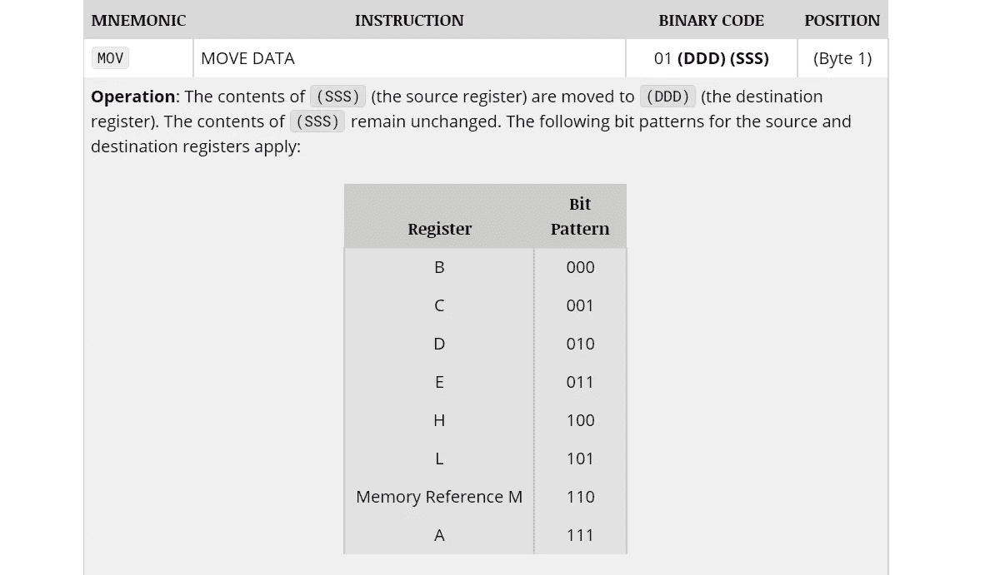
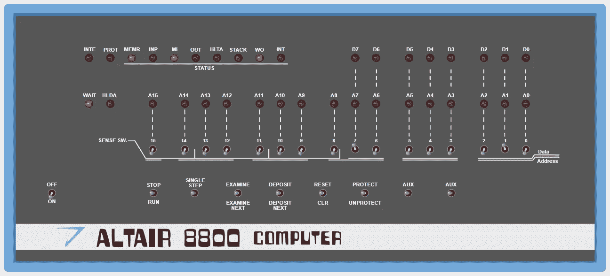
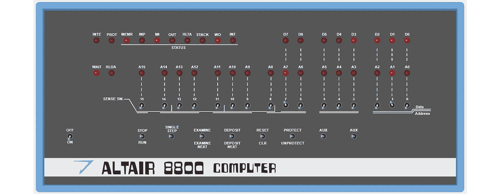
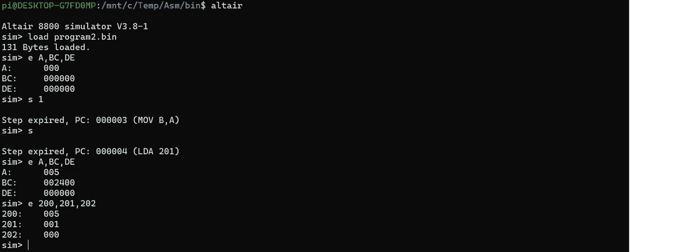

# 如何为 1975 年的 ALTAIR 8800 计算机编写程序

> 原文：<https://blog.devgenius.io/how-to-write-a-program-for-altair-8800-computer-3a4583fe601e?source=collection_archive---------0----------------------->

在 IT 界，有一些事件可以称为计算和工程史上的里程碑。其中之一是第一台个人电脑的诞生。


那些年，只有大公司的科学家和工程师使用计算机。然后，在 1975 年，一种任何人都买得起的设备诞生了。牛郎星 8800(T2)包含一个 8080 处理器，第一版有 256 字节的内存，价格低于 1000 美元——这是第一台商业上成功的个人电脑。比尔·盖茨和保罗·艾伦为这台电脑开发了基本语言，这台电脑可能是成百上千的学生和小学生来到激动人心的编程世界的第一个开始。

价格低也造成了一些弊端。第一个版本的 ALTAIR 没有键盘或屏幕，只有一个切换开关面板，如图所示。对我来说，弄清楚如何在这样一台电脑上创建和运行一个软件变得很有趣。

# 编码

第一种可用的语言只有汇编语言。ALTAIR 可以有高达 64KB 的内存，8080 处理器以 2MHz 的速度运行。

为了更好地理解它是如何工作的，我创建了一个简单的程序来计算从 1 到 5 的数字之和:

```
; Code segment: ORG    0o       ; Set Program Counter to address 0
START:  LDA    I
        MOV    B,A      ; RegB => I (1..N)
        LDA    STEP
        MOV    C,A      ; RegC => STEP (always 1)
        LDA    SUM
        MOV    D,A      ; RegD => SUM (result)
LOOP:     MOV    A,D    ; Move value to Accumulator from Register D
          ADD    B      ; Add value in Register B with Accumulator
          MOV    D,A    ; Save result back to D     I
          MOV    A,B    ; Move B to A and decrement it
          SUB    C
          JZ     PEND   ; If A is zero, the calculation is complete
          MOV    B,A    ; If not, continue
          JMP    LOOP     
PEND:   MOV A,D         ; Save result in SUM value
        STA SUM
PWAIT:  JMP PWAIT       ; Nothing to do, infinite loop; Data segment: ORG    200o     ; Set Program Counter to address 200
I:      DB     5o       ; Data Byte at address 200 = 5
STEP:   DB     1o       ; Data Byte at address 201 = 8 (10 octal)
SUM:    DB     0o       ; Data Byte at address 202 = 0 END             ; End
```

我在内存中创建了 3 个变量——I、STEP 和 SUM，它们用于组织一个从 1 到 5 的循环，步长为 1。此外，这些值被装入寄存器 B、C 和 D，用它们进行算术运算。当寄存器 A 的值变为零时，JZ(如果为零则跳转)命令结束循环。最后一步是将结果写回一个名为 SUM 的内存位置。

一般来说，上面的代码所做的与用 Python 写在一行中的代码相同:

```
s = sum(range(6))
```

# 收集

我们在 ALTAIR 上没有任何编译器，所以我们必须手动将命令翻译成机器码。例如，我们可以找到 LDA 命令的描述:



命令“LDA I”将被写成 3A 80 00，其中“I”是存储器地址 200 o = 80h(o-八位字节)。

下一个命令“MOV 乙，甲”:



我们得到机器代码 01000111b = 47h

我最终做了一点手脚，使用了一个[编译器](http://john.ccac.rwth-aachen.de:8000/as/download.html)(看一个[使用](https://ubuntourist.codeberg.page/Altair-8800/linux.html)的例子也是有用的)。但是正如我们所看到的，在纸上手工“编译”程序是完全可能的，尽管，当然，这会花费更长的时间。因此，我们应该得到下面的二进制代码:

`3a 80 00 47 3a 81 00 4f 3a 82 00 57 7a 80 57 78 91 ca 18 00 47 c3 0c 00 7a 32 82 00 c3 1c 00`

程序大小只有 38 字节。没有 MZ 前缀，保存和切换图形或内存上下文，或做其他事情-程序只是从地址 0 执行。40 年后，为了在设备上运行程序，你必须用付费证书签名

# 加载和执行

为了测试我的程序，我使用了免费的 ALTAIR 8800 模拟器，可以从 [Github](https://github.com/wixette/8800-simulator) 下载。它可以在浏览器中运行:



还是那句话，在第一版 ALTAIR 中，没有屏幕和键盘。计算机接口实际上是一个直接访问存储单元的面板。例如，要将值 10001000b 加载到地址为 1 的内存位置，我们需要设置相应的拨动开关并按下存款按钮。要输入下一个值，我们需要再次切换开关，然后按下“下一个存款”(检查开关可用于以同样的方式读取 RAM 值)。我们可以通过按下运行或单步按钮来执行程序。

我可以偷偷告诉，通过使用模拟器的调试选项卡，我们可以使用十六进制文件上传程序。然而，那些想要“感受”整个过程的人，将不得不开关制动栓大约一百次，即使是对于这样一个小的应用。

结果如下所示。我执行程序，然后用拨动开关选择存储单元 202o = 10000010b，然后按下检查开关。在 D7 号牢房..D0 我们得到值 00001111b = 15，它对应于所需的从 1 到 5 的数的和:



当然，真正的应用要复杂得多。还可以给计算机添加扩展卡，包括内存模块、外部端口、驱动器等。

1975 年比尔·盖茨和保罗·艾伦为牛郎星发布了 [BASIC](https://en.wikipedia.org/wiki/Altair_BASIC) 解释器，1976 年[微软件](https://en.wikipedia.org/wiki/History_of_Microsoft)公司成立。IT 历史上新的一页已经开始。

# 结论

学习这样的技术变得非常有趣。对我来说，理解一个现代软件开发人员如何为一个 50 年前创建的系统编写代码也很有趣。我必须说，结果并不比今天容易。如果 CPU 没有汇编指令，即使只是将两个数相乘也是一个挑战，更不用说用纸和笔写代码了。

有趣的是，牛郎星如今仍未被遗忘。除了在线模拟器，还可以基于 Arduino 制作“硬件”模拟器:

最后，ALTAIR 模拟器包含在适用于 Linux 的 **simh** 包中，使用它可以方便地逐步运行程序并查看内存值的内容:



愿意的人可以自己做实验。