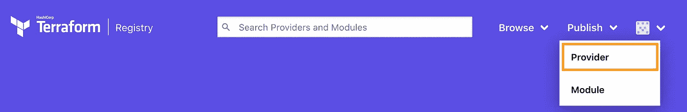

# 如何编写和调试一个定制的 Terraform 提供者——即使你不知道 Go

> 原文：<https://blog.devgenius.io/how-to-write-and-debug-a-custom-terraform-provider-even-if-you-dont-know-go-bc37fb55cbdd?source=collection_archive---------6----------------------->

Terraform 对 IaC 来说很棒——你可能需要的几乎每个提供商都已经在 Terraform 的官方[注册表](https://registry.terraform.io/)中，你需要做的就是[引用](https://www.terraform.io/language/providers/configuration)它。

但是当*不是你想做的事情的供应商时会发生什么呢？或者也许*是*社区版，但是你不能使用它，因为它有问题，不完整，或者你出于安全考虑不能使用它(也许你不信任作者或者你的公司安全政策不允许使用社区提供者)。*

当这种情况发生时，只要有一个你能击中的 API，你就是幸运的！只需在您或您的公司控制的 GitHub repo 中编写一个自定义的 Terraform 提供程序，发布它，并在您的 Terraform 模块中使用它！

但是等等！Terraform 提供者几乎完全是用 Go 编写的，更糟糕的是，他们的官方[文档](https://www.terraform.io/plugin/sdkv2/best-practices/other-languages)明确表示他们不会帮助非 Go 提供者！如果你还不知道围棋，不要着急。Terraform 提供程序非常简单，即使没有围棋经验，编写一个也很容易。在这篇文章中，我将展示一些例子和技巧，告诉你如何轻松地编写一个定制的 Terraform 提供者。

[OpenVPN Cloud](https://openvpn.net/cloud-vpn/) 是一个非常棒的工具，可以安全地将 OpenVPN 设置为服务，而不用担心管理 VPN 服务器。不幸的是，他们没有官方的平台提供商。原因很可能是因为他们的 [API](https://openvpn.net/cloud-docs/api-guide/) 仍处于测试阶段。它有两个社区提供者:一个来自 [patoarvizu](https://registry.terraform.io/providers/patoarvizu/openvpn-cloud/latest/docs) ，另一个[基于它，做了一些修改。这是我们在一些例子中用到的第二个。你可以在这里](https://registry.terraform.io/providers/RXMG/openvpncloud/latest/docs)查看源代码[。](https://github.com/RXMG/terraform-provider-openvpncloud)

***初始设置***

首先，确保你已经安装了 Go。你的操作系统的说明可以在[这里](https://go.dev/doc/install)找到，但是如果你使用的是 MacOS，这就像使用 brew 一样简单:

```
brew install go
```

安装完成后，让我们在您想要的任何目录位置创建项目。在 GitHub 中用前缀 *terraform-provider-、*命名项目**很重要，因为这既是惯例，也是 terraform 注册中心在发布项目时如何找到您的 Terraform 提供商。**

```
mkdir terraform-provider-openvpncloud
cd terraform-provider-openvpncloud
go mod init github.com/kaiden/terraform-provider-openvpncloud
```

在这里，我们正在创建我们的项目，用*terraform-PROVIDER-$ PROVIDER _ NAME*约定正确命名，然后创建初始的 *go.mod* 文件，它应该看起来像下面这样(取决于您的 go 版本，可能会有变化—我的版本当时是 1.17):

```
module github.com/kaiden/terraform-provider-openvpncloudgo 1.17 
```

模块名称也是约定的:首先是源代码位置(*github.com*)，然后是用户定义的名称空间( *kaiden —* 常见值是你的名字或公司名称)，最后是之前指定的项目名称(*terraform-provider-openvpncloud*)

接下来，我们将为项目创建目录结构，并为一个最基本的提供者创建必要的文件。

```
mkdir client
mkdir openvpncloud
touch main.go
touch openvpncloud/provider.go
```

接下来，在 *main.go* 文件中，复制并粘贴以下内容(如果您使用不同的名称空间，请记住用我的名称空间替换您的名称空间)。

```
package mainimport (
 "github.com/kaiden/terraform-provider-openvpncloud/openvpncloud"
 "github.com/hashicorp/terraform-plugin-sdk/v2/helper/schema"
 "github.com/hashicorp/terraform-plugin-sdk/v2/plugin"
)func main() {
 plugin.Serve(&plugin.ServeOpts{
  ProviderFunc: func() *schema.Provider {
   return openvpncloud.Provider()
  },
 })
}
```

这段代码使用 Terraform 插件 SDK 初始化 Terraform 提供程序。为了抽象起见，实际的提供者实现被拆分到一个单独的文件中(在 *openvpncloud* 目录中定义)。你不需要担心这些样板代码——重要的是你告诉 Terraform(它将调用你的代码),这是一个提供者。

现在让我们来看实际的提供者代码——这是您告诉 Terraform 您的提供者需要初始化什么的地方，它在 Terraform 模块中提供。例如，Google Terraform 提供程序定义了某些属性，您可以像这样在 Terraform 模块中传递这些属性:

```
provider "google" {
  project     = "my-project-id"
  region      = "us-central1"
}
```

您的提供商也将这样做，只不过它的名称是:

```
provider "openvpncloud" {
  whatever_you_define = "my-project-id"
  something_else_that_you_define = "us-central1"
}
```

既然我们明白了要做什么，那就开始做吧。将以下内容复制并粘贴到*openvpncloud/provider . go*文件中(请记住，如果您使用不同的名称空间，请使用您的名称空间，而不是我的名称空间)。

```
package openvpncloudimport (
 "context"
 "fmt" "github.com/hashicorp/terraform-plugin-sdk/v2/diag"
 "github.com/hashicorp/terraform-plugin-sdk/v2/helper/schema"
 "github.com/kaiden/terraform-provider-openvpncloud/client"
)func Provider() *schema.Provider {
 return &schema.Provider{
  Schema: map[string]*schema.Schema{
   "base_url": {
    Type:     schema.TypeString,
    Required: true,
   },
   "client_id": {
    Type:        schema.TypeString,
    Optional:    true,
    Sensitive:   true,
    DefaultFunc: schema.EnvDefaultFunc("OPENVPN_CLOUD_CLIENT_ID", nil),
   },
   "client_secret": {
    Type:        schema.TypeString,
    Optional:    true,
    Sensitive:   true,
    DefaultFunc: schema.EnvDefaultFunc("OPENVPN_CLOUD_CLIENT_SECRET", nil),
   },
  },
  ResourcesMap: map[string]*schema.Resource{
   "openvpncloud_dns_record": resourceDnsRecord(),
  },
  DataSourcesMap: map[string]*schema.Resource{
   "openvpncloud_user": dataSourceUser(),
  },
  ConfigureContextFunc: providerConfigure,
 }
}func providerConfigure(ctx context.Context, d *schema.ResourceData) (interface{}, diag.Diagnostics) {
 baseUrl := d.Get("base_url").(string)
 clientId := d.Get("client_id").(string)
 clientSecret := d.Get("client_secret").(string)
 openvpnClient, err := client.NewClient(baseUrl, clientId, clientSecret)
 var diags diag.Diagnostics
 if err != nil {
  diags = append(diags, diag.Diagnostic{
   Severity: diag.Error,
   Summary:  "Unable to create client",
   Detail:   fmt.Sprintf("Error: %v", err),
  })
  return nil, diags
 }
 return openvpnClient, nil
}
```

这有几个部分。首先，在*提供者*函数中，我们设置模式，如前所述。所有可用值的选项都可以在[这里](https://www.terraform.io/plugin/sdkv2/schemas/schema-behaviors)找到，但我放在这里的选项，如*类型、敏感、必需、可选、*都是不言自明的——它们描述了您将放入 Terraform 模块提供程序块的值。在我们的例子中，OpenVPN Cloud API 需要您的唯一 URL ( *base_url* )、您的客户端 ID ( *client_id* )和您的客户端秘密( *client_secret* )，所以这是我们初始化我们的提供者所需要的。当您在模块中使用它时，它看起来会像这样:

```
provider "openvpncloud" { base_url = var.base_url client_id = var.client_id

 client_secret = var.client_secret}
```

那个 *provider.go* 文件的下一部分是 *ResourceMap* 和 *DataSourcesMap。*这些定义了您的提供商控制的可用数据源和资源。尽管我们的示例 [repo](https://github.com/RXMG/terraform-provider-openvpncloud/tree/master/openvpncloud) 定义了其他资源和数据源，但是对于我们这里的代码，我们将只编写其中的一个。

文件的最后一部分是设置提供者上下文。这意味着设置一个拥有凭证(在本例中是我们的 OAuth 令牌)的 HTTP 客户机，以发出 API 请求。这里要注意两件事:错误处理，它*必须*扩展到您的提供者的每个部分，以及 *d.get* 函数，它允许您获取资源数据，不仅仅是在配置函数中，而且在您的所有数据源和资源函数中。

***客户端***

我们现在需要定义发出所有 HTTP 请求的基本客户机。

```
touch client/client.go
```

在这个文件中，复制并粘贴以下内容。

```
package clientimport (
 "bytes"
 "encoding/json"
 "fmt"
 "io/ioutil"
 "net/http"
 "time"
)type Client struct {
 HTTPClient *http.Client
 BaseURL    string
 Token      string
}type Credentials struct {
 AccessToken string `json:"access_token"`
}func NewClient(baseUrl, clientId, clientSecret string) (*Client, error) {
 values := map[string]string{"grant_type": "client_credentials", "scope": "default"}
 json_data, err := json.Marshal(values)
 if err != nil {
  return nil, err
 }
 req, err := http.NewRequest(http.MethodPost, fmt.Sprintf("%s/api/beta/oauth/token", baseUrl), bytes.NewBuffer(json_data))
 if err != nil {
  return nil, err
 }
 req.SetBasicAuth(clientId, clientSecret)
 req.Header.Add("Accept", "application/json")
 httpClient := http.DefaultClient
 resp, err := httpClient.Do(req)
 if err != nil {
  return nil, err
 }
 body, err := ioutil.ReadAll(resp.Body)
 if err != nil {
  return nil, err
 }
 defer resp.Body.Close()
 var credentials Credentials
 err = json.Unmarshal(body, &credentials)
 if err != nil {
  return nil, err
 }
 return &Client{
  HTTPClient: &http.Client{Timeout: 10 * time.Second},
  BaseURL:    baseUrl,
  Token:      credentials.AccessToken,
 }, nil
}func (c *Client) DoRequest(req *http.Request) ([]byte, error) {
 req.Header.Set("Authorization", fmt.Sprintf("Bearer %s", c.Token))res, err := c.HTTPClient.Do(req)
 if err != nil {
  return nil, err
 }
 defer res.Body.Close()body, err := ioutil.ReadAll(res.Body)
 if err != nil {
  return nil, err
 }if res.StatusCode < 200 || res.StatusCode >= 300 {
  return nil, fmt.Errorf("Status code: %d, Response body: %s", res.StatusCode, string(body))
 }return body, nil
}
```

这定义了客户端的初始化，使用模式中定义的客户端 ID 和客户端秘密，在前面的 *provider.go* 文件中调用。它还定义了基本的 *DoRequest* 函数，所有资源和数据源都将使用该函数，该函数为 HTTP 请求提供基本的错误处理，并封装了请求的授权方面。

***资源***

现在让我们定义一个实际的资源，一个 DNS 记录(资源和数据源的 Terraform 命名约定是分别给文件名加上前缀 *resource_* 和 *data_source* )。

```
touch openvpncloud/resource_dns_record.go
```

现在将以下内容复制并粘贴到该文件中(如有必要，用我的名称空间替换您的名称空间)。

```
package openvpncloudimport (
 "context" "github.com/hashicorp/terraform-plugin-sdk/v2/diag"
 "github.com/hashicorp/terraform-plugin-sdk/v2/helper/schema"
 "github.com/hashicorp/terraform-plugin-sdk/v2/helper/validation"
 "github.com/kaiden/terraform-provider-openvpncloud/client"
)func resourceDnsRecord() *schema.Resource {
 return &schema.Resource{
  CreateContext: resourceDnsRecordCreate,
  ReadContext:   resourceDnsRecordRead,
  DeleteContext: resourceDnsRecordDelete,
  UpdateContext: resourceDnsRecordUpdate,
  Importer: &schema.ResourceImporter{
   StateContext: schema.ImportStatePassthroughContext,
  },
  Schema: map[string]*schema.Schema{
   "domain": {
    Type:     schema.TypeString,
    Required: true,
   },
   "description": {
    Type:     schema.TypeString,
    Optional: true,
   },
   "ip_v4_addresses": {
    Type:     schema.TypeList,
    Optional: true,
    Elem: &schema.Schema{
     Type:         schema.TypeString,
     ValidateFunc: validation.IsIPv4Address,
    },
   },
   "ip_v6_addresses": {
    Type:     schema.TypeList,
    Optional: true,
    Elem: &schema.Schema{
     Type:         schema.TypeString,
     ValidateFunc: validation.IsIPv6Address,
    },
   },
  },
 }
}func resourceDnsRecordCreate(ctx context.Context, d *schema.ResourceData, m interface{}) diag.Diagnostics {
 c := m.(*client.Client)
 var diags diag.Diagnostics
 domain := d.Get("domain").(string)
 description := d.Get("description").(string)
 ipV4Addresses := d.Get("ip_v4_addresses").([]interface{})
 ipV4AddressesSlice := make([]string, 0)
 for _, a := range ipV4Addresses {
  ipV4AddressesSlice = append(ipV4AddressesSlice, a.(string))
 }
 ipV6Addresses := d.Get("ip_v6_addresses").([]interface{})
 ipV6AddressesSlice := make([]string, 0)
 for _, a := range ipV6Addresses {
  ipV6AddressesSlice = append(ipV6AddressesSlice, a.(string))
 }
 dr := client.DnsRecord{
  Domain:        domain,
  Description:   description,
  IPV4Addresses: ipV4AddressesSlice,
  IPV6Addresses: ipV6AddressesSlice,
 }
 dnsRecord, err := c.CreateDnsRecord(dr)
 if err != nil {
  return append(diags, diag.FromErr(err)...)
 }
 d.SetId(dnsRecord.Id)
 return diags
}func resourceDnsRecordRead(ctx context.Context, d *schema.ResourceData, m interface{}) diag.Diagnostics {
 c := m.(*client.Client)
 var diags diag.Diagnostics
 recordId := d.Id()
 r, err := c.GetDnsRecord(recordId)
 if err != nil {
  return append(diags, diag.FromErr(err)...)
 }
 if r == nil {
  d.SetId("")
 } else {
  d.Set("domain", r.Domain)
  d.Set("description", r.Description)
  d.Set("ip_v4_addresses", r.IPV4Addresses)
  d.Set("ip_v6_addresses", r.IPV6Addresses)
 }
 return diags
}func resourceDnsRecordUpdate(ctx context.Context, d *schema.ResourceData, m interface{}) diag.Diagnostics {
 c := m.(*client.Client)
 var diags diag.Diagnostics
 _, domain := d.GetChange("domain")
 _, description := d.GetChange("description")
 _, ipV4Addresses := d.GetChange("ip_v4_addresses")
 ipV4AddressesSlice := getAddressesSlice(ipV4Addresses.([]interface{}))
 _, ipV6Addresses := d.GetChange("ip_v6_addresses")
 ipV6AddressesSlice := getAddressesSlice(ipV6Addresses.([]interface{}))
 dr := client.DnsRecord{
  Id:            d.Id(),
  Domain:        domain.(string),
  Description:   description.(string),
  IPV4Addresses: ipV4AddressesSlice,
  IPV6Addresses: ipV6AddressesSlice,
 }
 err := c.UpdateDnsRecord(dr)
 if err != nil {
  return append(diags, diag.FromErr(err)...)
 }
 return diags
}func resourceDnsRecordDelete(ctx context.Context, d *schema.ResourceData, m interface{}) diag.Diagnostics {
 c := m.(*client.Client)
 var diags diag.Diagnostics
 recordId := d.Id()
 err := c.DeleteDnsRecord(recordId)
 if err != nil {
  return append(diags, diag.FromErr(err)...)
 }
 return diags
}func getAddressesSlice(addresses []interface{}) []string {
 addressesSlice := make([]string, 0)
 for _, a := range addresses {
  addressesSlice = append(addressesSlice, a.(string))
 }
 return addressesSlice
}
```

Terraform provider 本质上只是一个愚蠢的 CRUD(创建、读取、更新、删除)应用程序。我们用大量的错误处理来定义这四个基本方法，Terraform 负责剩下的。您会注意到，与提供者一样，资源也有一个模式，它定义了哪些选项需要或者可以插入到对该资源的调用中。对于每个 CRUD 操作，您定义一个实现该操作的方法。对于导入，您可以使用基本的 Terraform 导入器，如上所示，只要您定义了 *ReadContext* ，它就会为您处理导入。

在这里，没有什么太复杂的东西；您使用 *d.get* 从现有资源中获取您需要的任何值，并使用 d.ID 获取和设置资源的 Id(如果未设置 Id，Terraform 认为资源不存在—确保根据 CRUD 操作正确设置)。这里另一件棘手的事情是确保你对每一个可能出错的事情都有错误处理*。*

除了设置资源属性和错误处理之外，这里的大部分工作都是由客户机对象完成的。您会注意到在 *client.go* 文件中有*而不是*定义的方法。这是因为 *client.go* 文件是基本的客户端方法——对于单个资源，最好在 *client* 包中定义一个单独的类型来实现该资源的 CRUD 操作。所以让我们现在就开始吧。

```
touch client/dns_record.go
```

将以下内容复制并粘贴到该文件中。

```
package clientimport (
 "bytes"
 "encoding/json"
 "fmt"
 "net/http"
)type DnsRecord struct {
 Id            string   `json:"id"`
 Description   string   `json:"description"`
 Domain        string   `json:"domain"`
 IPV4Addresses []string `json:"ipv4Addresses"`
 IPV6Addresses []string `json:"ipv6Addresses"`
}func (c *Client) GetDnsRecords() ([]DnsRecord, error) {
 req, err := http.NewRequest(http.MethodGet, fmt.Sprintf("%s/api/beta/dns-records", c.BaseURL), nil)
 if err != nil {
  return nil, err
 }
 body, err := c.DoRequest(req)
 if err != nil {
  return nil, err
 }
 var records []DnsRecord
 err = json.Unmarshal(body, &records)
 if err != nil {
  return nil, err
 }
 return records, nil
}func (c *Client) CreateDnsRecord(record DnsRecord) (*DnsRecord, error) {
 recordJson, err := json.Marshal(record)
 if err != nil {
  return nil, err
 }
 req, err := http.NewRequest(http.MethodPost, fmt.Sprintf("%s/api/beta/dns-records", c.BaseURL), bytes.NewBuffer(recordJson))
 if err != nil {
  return nil, err
 }
 body, err := c.DoRequest(req)
 if err != nil {
  return nil, err
 }
 var d DnsRecord
 err = json.Unmarshal(body, &d)
 if err != nil {
  return nil, err
 }
 return &d, nil
}func (c *Client) UpdateDnsRecord(record DnsRecord) error {
 recordJson, err := json.Marshal(record)
 if err != nil {
  return err
 }
 req, err := http.NewRequest(http.MethodPut, fmt.Sprintf("%s/api/beta/dns-records/%s", c.BaseURL, record.Id), bytes.NewBuffer(recordJson))
 if err != nil {
  return err
 }
 _, err = c.DoRequest(req)
 return err
}func (c *Client) DeleteDnsRecord(recordId string) error {
 req, err := http.NewRequest(http.MethodDelete, fmt.Sprintf("%s/api/beta/dns-records/%s", c.BaseURL, recordId), nil)
 if err != nil {
  return err
 }
 _, err = c.DoRequest(req)
 return err
}func (c *Client) GetDnsRecord(recordId string) (*DnsRecord, error) {
 records, err := c.GetDnsRecords()
 if err != nil {
  return nil, err
 }
 for _, r := range records {
  if r.Id == recordId {
   return &r, nil
  }
 }
 return nil, nil
}
```

再说一遍，这里没有什么特别复杂的东西，即使你不知道围棋。只有定义正确 API URL 的基本 CRUD 函数、结构、一些助手函数和大量错误处理。如果你不知道 Go，需要注意的是，当返回单个记录时，你使用 *& yourResource，*但是当返回资源数组时，它只是 *yourResourceArray。*这与指针有关，但是你不需要深入理解为什么能够编写这些提供者。

***注意:对于那些不熟悉 Go 的人来说，你可能想知道结构中的*** `json:"id"` ***和类似的标记是什么意思。这是一个 struct 标记，在本例中，它允许 json。元帅和 json。解组命令，将 struct 属性映射到 JSON 进行序列化和反序列化。***

***数据来源***

现在我们已经定义了一个资源，让我们定义一个数据源(带有附带的客户机包)。

```
touch client/user.go
touch openvpncloud/data_source_user.go
```

在*openvpncloud/data _ source _ user . go*文件中，复制并粘贴以下内容。

```
package openvpncloudimport (
 "context"
 "strconv"
 "time"
 "github.com/kaiden/terraform-provider-openvpncloud/client"
 "github.com/hashicorp/terraform-plugin-sdk/v2/diag"
 "github.com/hashicorp/terraform-plugin-sdk/v2/helper/schema"
)func dataSourceUser() *schema.Resource {
 return &schema.Resource{
  ReadContext: dataSourceUserRead,
  Schema: map[string]*schema.Schema{
   "user_id": {
    Type:     schema.TypeString,
    Computed: true,
   },
   "username": {
    Type:     schema.TypeString,
    Required: true,
   },
   "role": {
    Type:     schema.TypeString,
    Required: true,
   },
   "email": {
    Type:     schema.TypeString,
    Computed: true,
   },
   "auth_type": {
    Type:     schema.TypeString,
    Computed: true,
   },
   "first_name": {
    Type:     schema.TypeString,
    Computed: true,
   },
   "last_name": {
    Type:     schema.TypeString,
    Computed: true,
   },
   "group_id": {
    Type:     schema.TypeString,
    Computed: true,
   },
   "status": {
    Type:     schema.TypeString,
    Computed: true,
   },
   "devices": {
    Type:     schema.TypeList,
    Computed: true,
    Elem: &schema.Resource{
     Schema: map[string]*schema.Schema{
      "id": {
       Type:     schema.TypeString,
       Computed: true,
      },
      "name": {
       Type:     schema.TypeString,
       Computed: true,
      },
      "description": {
       Type:     schema.TypeString,
       Computed: true,
      },
      "ip_v4_address": {
       Type:     schema.TypeString,
       Computed: true,
      },
      "ip_v6_address": {
       Type:     schema.TypeString,
       Computed: true,
      },
     },
    },
   },
  },
 }
}func dataSourceUserRead(ctx context.Context, d *schema.ResourceData, m interface{}) diag.Diagnostics {
 c := m.(*client.Client)
 var diags diag.Diagnostics
 userName := d.Get("username").(string)
 user, err := c.GetUser(userName, d.Get("role").(string))
 if err != nil {
  return append(diags, diag.FromErr(err)...)
 }
 if user == nil {
  return append(diags, diag.Errorf("User with name %s was not found", userName)...)
 }
 d.Set("user_id", user.Id)
 d.Set("username", user.Username)
 d.Set("role", user.Role)
 d.Set("email", user.Email)
 d.Set("auth_type", user.AuthType)
 d.Set("first_name", user.FirstName)
 d.Set("last_name", user.LastName)
 d.Set("group_id", user.GroupId)
 d.Set("status", user.Status)
 d.Set("devices", getUserDevicesSlice(&user.Devices))
 d.SetId(strconv.FormatInt(time.Now().Unix(), 10))
 return diags
}func getUserDevicesSlice(userDevices *[]client.Device) []interface{} {
 devices := make([]interface{}, len(*userDevices), len(*userDevices))
 for i, d := range *userDevices {
  device := make(map[string]interface{})
  device["id"] = d.Id
  device["name"] = d.Name
  device["description"] = d.Description
  device["ip_v4_address"] = d.IPv4Address
  device["ip_v6_address"] = d.IPv6Address
  devices[i] = device
 }
 return devices
}
```

这个比较长，因为*用户*数据源有更多的值要返回，但是编写起来就像我们之前定义的资源一样简单。首先，您有一个模式，它定义了您可以在 Terraform 模块中为这个数据源放置什么值。第二，你有基本的 CRUD 函数。第三，你又一次有了*许多*错误处理。现在让我们继续编写 REST API 客户端。

在 *client/user.go* 文件中，复制并粘贴以下内容。

```
package clientimport (
 "encoding/json"
 "fmt"
 "net/http"
)type User struct {
 Id        string   `json:"id"`
 Username  string   `json:"username"`
 Role      string   `json:"role"`
 Email     string   `json:"email"`
 AuthType  string   `json:"authType"`
 FirstName string   `json:"firstName"`
 LastName  string   `json:"lastName"`
 GroupId   string   `json:"groupId"`
 Status    string   `json:"status"`
 Devices   []Device `json:"devices"`
}type Device struct {
 Id          string `json:"id"`
 Name        string `json:"name"`
 Description string `json:"description"`
 IPv4Address string `json:"ipV4Address"`
 IPv6Address string `json:"ipV6Address"`
}func (c *Client) GetUser(username string, role string) (*User, error) {
 req, err := http.NewRequest(http.MethodGet, fmt.Sprintf("%s/api/beta/users", c.BaseURL), nil)
 if err != nil {
  return nil, err
 }
 body, err := c.DoRequest(req)
 if err != nil {
  return nil, err
 }
 var users []User
 err = json.Unmarshal(body, &users)
 if err != nil {
  return nil, err
 }
 for _, u := range users {
  if u.Username == username && u.Role == role {
   return &u, nil
  }
 }
 return nil, nil
}
```

就像用于 DNS 记录的另一个客户端一样，这个客户端定义了结构和 GET 操作(对于数据源，我们不需要任何其他 CRUD 操作——如果您添加了用户资源，那么您将需要其他 3 个操作),并且有很多错误处理。

***调试***

这是基本的提供者应用程序。那么，如何调试它以确保它正常工作呢？

首先，您将希望为 Terraform 提供者获得一个 Makefile 以使事情变得简单。在基目录中运行此命令。

```
curl --output Makefile [https://raw.githubusercontent.com/hashicorp/terraform-provider-hashicups/boilerplate/Makefile](https://raw.githubusercontent.com/hashicorp/terraform-provider-hashicups/boilerplate/Makefile)
```

您需要将这四个值替换为适合您的提供商和操作系统架构的值:

```
HOSTNAME=hashicorp.com
NAMESPACE=edu
NAME=hashicups
OS_ARCH=darwin_amd64
```

对于我们的示例，我将使用以下值:

```
HOSTNAME=kaiden.com
NAMESPACE=learning
NAME=openvpncloud
OS_ARCH=darwin_amd64
```

一旦完成，您就准备好构建您的提供者了。

```
make build
```

这将创建一个二进制文件。让我们运行它，以确保它的工作。

```
./terraform-provider-openvpncloud
```

这将产生以下输出:

```
This binary is a plugin. These are not meant to be executed directly.
Please execute the program that consumes these plugins, which will
load any plugins automatically
```

如果您看到这一点，这意味着它可以正常构建和运行。现在我们需要实际调试它。我们通过将它安装到机器上的特定位置来实现，当运行 *terraform init 时，您的 Terraform 模块将自动寻找该位置。*我们的 Makefile 已经为我们设置好了，所以只需运行以下命令:

```
make install
```

现在，在您的 Terraform 模块中，在同一台机器上，在 *main.tf 中添加您的提供者(*为了调试/测试，您可以硬编码这些值*)。*

```
provider "openvpncloud" {base_url = var.base_urlclient_id = var.client_id

 client_secret = var.client_secret}
```

在您的 *versions.tf* 文件中，添加对提供者的引用。

```
terraform {
 required_providers {
  openvpncloud = {
   source = "kaiden.com/learning/openvpncloud" # Put the values you defined in the Makefile here
   version = "0.2" # This is the version you defined in your Makefile }
 }
}
```

值得注意的是，这里的源格式隐式地告诉 Terraform 在您机器上的一个文件夹中查找提供者二进制文件，这个位置就是 *make install* 命令放置二进制文件的位置。一旦你发布，来源**将**改变，这取决于你在哪里发布。

现在我们需要初始化这个提供者。在您的平台模块目录(不是我们之前所在的提供者目录)中，初始化模块。

```
terraform init
```

如果您遇到找不到提供者的错误，请参考 Terraform 提供者隐式位置[文档](https://www.terraform.io/cli/config/config-file#implied-local-mirror-directories)。您可能输入了不正确的主机名、名称空间、名称或版本。

***注意:如果您已经使用此提供程序的已发布版本运行了****terra form init****，或者您已经在调试此提供程序时运行了****terra form init****，但是使用了****make install****中的以前版本，那么您需要从****terra form . HCl 中删除提供程序条目。*

一旦 init 命令成功运行，您就可以根据需要添加数据源或资源引用来测试您的提供者的 CRUD 功能了！

***文档***

要获得提供者文档的基本框架，可以在提供者目录中运行以下命令:

```
go get github.com/hashicorp/terraform-plugin-docs/cmd/tfplugindocs
go run github.com/hashicorp/terraform-plugin-docs/cmd/tfplugindocs
```

***出版***

现在您已经调试了您的提供程序，一切都运行良好，您需要发布它！对于这个例子，我们将直接发布到公共的 Terraform 提供者注册中心——如果你需要一个私有的提供者，你要么必须建立一个私有的注册中心，要么想办法把正确的二进制文件放在你运行 Terraform 的系统上。

发布一个提供者的说明在这里[如果你中途遇到困难，但是你可以留在这里按照步骤让你的提供者完全发布。](https://learn.hashicorp.com/tutorials/terraform/provider-release-publish?in=terraform/providers)

首先，在 GitHub 上将您的提供商目录作为回购进行推送。确保根据约定(*terra form-provider-PROVIDERNAME*)对其进行了正确命名。在我们的例子中，我们称之为*terra form-provider-openvpncloud。*接下来，我们将 GitHub 动作定义添加到我们的 repo 中，以便在标记提交时允许释放。

```
mkdir -p .github/workflows
curl --output .github/workflows/release.yml [https://raw.githubusercontent.com/hashicorp/terraform-provider-scaffolding/main/.github/workflows/release.yml](https://raw.githubusercontent.com/hashicorp/terraform-provider-scaffolding/main/.github/workflows/release.yml)
```

我们的 GitHub 行动还需要 goreleaser。

```
curl --output .goreleaser.yml [https://raw.githubusercontent.com/hashicorp/terraform-provider-scaffolding/main/.goreleaser.yml](https://raw.githubusercontent.com/hashicorp/terraform-provider-scaffolding/main/.goreleaser.yml)
```

接下来，您需要生成一个 GPG 密钥来签署发布。

```
gpg --full-generate-key
```

为此，选择 *RSA 和 RSA* 选项，然后选择 4096 作为密钥大小(Terraform 注册表要求)。选择一个不会过期的密钥。您可以根据需要选择其他配置选项。确保您记录了您选择的密码短语。

现在，您需要从刚刚生成的 GPG 密钥中获取公钥和私钥。运行这些命令，用 *KEY_ID* 替换刚刚生成的命令。

```
gpg --armor --export "KEY_ID"
gpg --armor --export-secret-keys "KEY_ID"
```

现在，您的 GitHub 操作需要私钥和密码来签署发布。在你的 GitHub 库中，转到“*设置*”，然后“*秘密*”，添加以下秘密。

*   GPG 私有密钥—这是您运行的导出密钥的第二个命令的输出。您必须包括 kye 的`-----BEGIN...`和`-----END`部分。
*   密码短语—这是您之前选择的密码短语

这就是 GitHub 配置所需的全部内容。现在，添加、提交和推送您的更改，并标记发布。

```
git add .
git commit -m "GitHub Action configuration for provider release."
git tag v0.2.1
git push origin v0.2.1
```

一旦 GitHub 动作运行，您应该会在 repo 的主页上看到一个发布。您可以在 UI 上的“*动作”*选项卡中看到 GitHub 动作的状态和任何错误。

一旦成功完成，您需要实际发布该版本。去 Terraform 注册中心，用你的 GitHub 账号注册(或者登录，如果你已经有账号的话)，然后点击“*发布*，点击下拉菜单中的*“提供商”*选项。



Terraform 注册表提供程序发布菜单选项

您应该看到您的提供者列在那里，可以发布了。单击它—如果您现在还没有添加公共 GPG 密钥，它会要求您添加。粘贴并保存(这是之前的*gpg-armor-export " KEY _ ID "*命令的输出)。完成后，Terraform 将允许您发布您的提供商(您可能需要导航回上图中的同一菜单选项)。点击发布，很快它就会被激活。现在你可以在你的 Terraform 模块中使用它了，就像任何其他的提供者一样！

***注意:如果您要在中使用提供程序的 Terraform 模块在****. terra form . lock . HC****l 文件中已经有该提供程序的调试版本，您必须先删除该条目—否则，该提供程序的锁条目将不匹配，您将无法使用公共版本。***

***最后的想法***

一旦掌握了基础知识，创建、调试和发布 Terraform 提供者就相当简单了。当您需要一个不存在的提供者或者需要修复一个存在的提供者的错误时，这也是一项非常有价值的技能。最重要的是，它确保你几乎没有借口不把 IaC 作为你的默认工作方式！