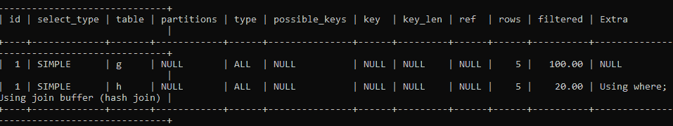

# 如何编写更好的 SQL 来提高查询性能

> 原文：<https://blog.devgenius.io/how-to-write-better-sql-to-improve-query-performance-d2167d16b7dd?source=collection_archive---------6----------------------->

## **软件工程之旅**

## 为了提高 SQL 查询的性能，软件工程师必须了解这些优化技术。


# **概述**

你是一个程序员，软件工程师，你必须熟悉写 SQL 查询，这里。在本文中，我将告诉您如何编写 SQL 查询来提高其性能并优化它以减少查询的响应时间。

然而，并不是每个人都知道如何正确地、最佳地、容易阅读地、以高处理速度来编写，本文将通过考虑可能的查询计划来帮助您确定执行查询的最佳有效方式。

# **#1 定义并理解您的需求**

每当您编写 SQL 查询来查找特定数据时，您必须知道您需要什么类型的数据，然后根据您的要求编写查询。这将使您能够只接收您需要的信息，潜在地减少执行时间，并优化 SQL 查询。

# **#2 不要在 Select 语句中使用***

每当我们在查询中使用*时，它会给出表的所有列，这会花费更多的时间，因此建议编写结果所需的列名。

**举例:**

-糟糕的方式

```
SELECT *
FROM Department
```

好方法

```
SELECT Id, DeptName, Description
FROM Department
```

# **#3 避免循环查询**

每当我们想要多次执行同一个查询时，比如我们想要插入任意数据 n 次，不要在循环中使用 insert query，而要使用 bulk insert。

**示例:**

-糟糕的方式

```
for(Int i = 0;i <= 5; i++)
{
INSERT INTO Table1(Id,Value) Values( i , 'Value' + i );
}
```

好方法

```
INSERT INTO Table1(Id, Value)
Values(1,Value1),(2,Value2),(2,Value3),(4,Value4),(5,Value5)
```

# **#4 在**列中使用有效的数据类型

有时，一些新程序员不知道数据类型的实际用途，他们对所有列使用“varchar”数据类型，但这不是正确的方法，我们需要确定需要哪种类型的数据，然后使用特定的数据类型。

**例如:**

1.  在 Isdelete 列中，如果记录是否被删除，我们只需要设置布尔值(true、false)。
2.  在创建日期列中，我们需要设置日期时间数据类型。
3.  如果 Department 列被用作任何表中的外键，那么我们只需要存储该部门的 id，而不是名称，这样我们就可以设置 Integer 数据类型。

# **#5 在查询的开头添加解释**

当我们在查询的开头添加 EXPLAIN 时，它会告诉我们执行计划的顺序以及执行需要多长时间，也就是说，你的运行时间会有多长。

通过这样做，我们可以了解最昂贵的步骤，并定位或修改它们以减少运行时间，并可以再次检查这些更改是否减少了运行时间。

**例子:**

```
EXPLAIN
SELECT CONCAT(g.FirstName,g.LastName) AS FULLNAME
FROM workTable AS g, dataTable AS h
WHERE g.Roll=h.Roll;
```

**输出:**



# **#6 使用 SQL 查询优化工具**

当我们知道我们的系统性能很差，并且我们无法确定优化哪个查询以获得更好的性能时，那么我们应该使用 SQL 查询优化工具，因为它将使您能够快速找到优化所需的查询。

查询本身并不总是导致执行缓慢。有时还有其他因素造成的，如果没有 SQL 查询优化工具，很难区分执行缓慢是由于任何查询还是其他因素造成的。

虽然您可以在 MySQL 性能模式、PostgreSQL pg _ stat _ 语句和查询日志中找到查询，但是使用 MS SQL 查询优化工具可以节省您的时间并减少您的麻烦。

# **#7 用 EXISTS()代替 COUNT()**

我们可以使用 EXISTS()和 COUNT()来查找表中是否包含任何特定的记录，但 EXISTS()更有效，因为 COUNT()将搜索整个表以提供匹配记录的总数，而 EXISTS()将只搜索到它没有找到表中的第一个条目，从而节省您的时间和计算能力，并使您能够以更好的方式优化 SQL 查询。

**举例:**

好方法

```
SET STATISTICS IO ON
IF EXISTS(SELECT * FROM OrderDetails
WHERE orderid = 10248)
PRINT 'yes'
ELSE
PRINT 'no'
SET STATISTICS IO OFF
```

-糟糕的方式

```
SET STATISTICS IO ON
IF (SELECT COUNT(*) FROM OrderDetails
WHERE orderid = 10248) > 0
PRINT 'yes'
ELSE
PRINT 'no'
SET STATISTICS IO OFF
```

# **#8 用“Where”代替“Having”从句**

当我们使用“where”时，它会根据其特定条件检查表中的所有记录，而当我们使用“having”时，我们需要使用“group by ”,这样，数据会按组显示，之后，当我们应用 Having 时，只在那些已筛选的组中搜索数据。

**举例:**

好方法

```
SELECT Emp.Id, Emp.Name,Dept.DeptName,Emp.Salary
FROM Employee Emp
RIGHT JOIN Department Dept on Emp.DeptId = Dept.Id
WHERE Emp.Salary >= 20000;
```

-糟糕的方式

```
SELECT Emp.Id, Emp.Name,Dept.DeptName,Emp.Salary
FROM Employee Emp
RIGHT JOIN Department Dept on Emp.DeptId = Dept.Id
GROUP BY dept.DeptName
HAVING Emp.Salary >= 20000;
```

# **#9 使用适当的连接代替子查询**

当我们使用连接而不是子查询时，它节省了我们大量的时间，因为当我们使用子查询时，它检查表中的所有记录，而当我们使用连接时，如左或右查询，它只检查符合标准的记录。

**示例:**

— —糟糕的方式

```
SELECT Id, Name
FROM Employee
WHERE DeptId in (SELECT Id
FROM Department
WHERE Name like '%Management%')
```

——好办法

```
SELECT Emp.Id, Emp.Name,Dept.DeptName
FROM Employee Emp
RIGHT JOIN Department Dept on Emp.DeptId = Dept.Id
WHERE Dept.DeptName like '%Management%'
```

**结论**

最后，我想对阅读我文章的读者说声谢谢。我希望它能帮助您提高 SQL 查询的性能。我已经建议了一些可以用来提高性能的东西，如果软件工程师能够注意到上面提到的事情，那么与性能相关的问题将会得到解决，运行时间将会减少。感谢阅读！