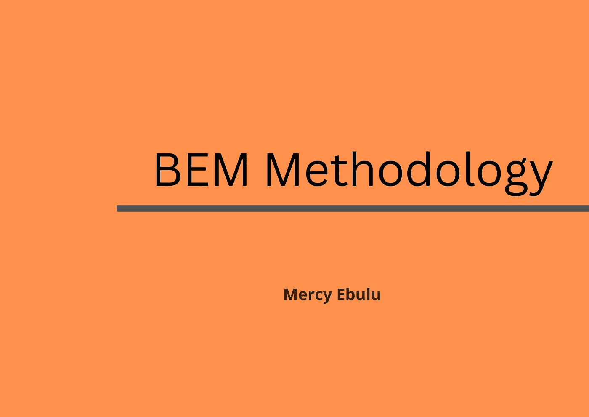
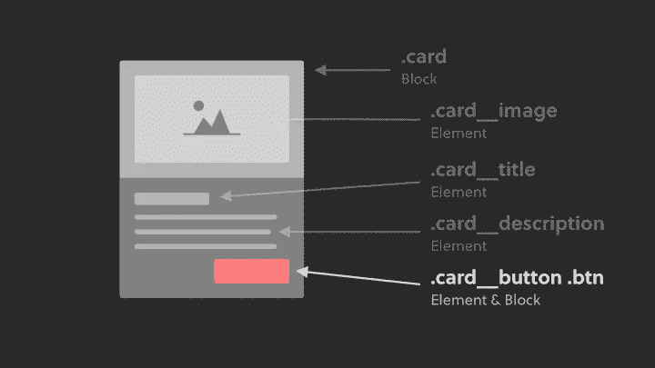

# 如何使用 BEM 编写整洁有序的 CSS？

> 原文：<https://blog.devgenius.io/how-to-write-clean-and-organized-css-using-bem-41e74ec07681?source=collection_archive---------1----------------------->



命名类从来都不是 CSS 的一个简单方面，尤其是在处理一个有很多 HTML 选择器、规则集和页面的项目时。由于潜在的特殊性问题，以及在一个地方更改和修改 CSS 样式可能会破坏另一个地方的样式，维护和开发代码可能具有挑战性。在本文中，我们将研究如何使用 CSS 命名技术 BEM 编写干净、有组织和可维护的代码，我们将研究 BEM 是什么，为什么应该采用 BEM，它如何工作以及如何成功实现 BEM。

**必备:**HTML 和 CSS 基础知识。

**什么是 BEM？**
缩写 BEM 代表块元素修改器。这是一种前端命名技术，用于对 CSS 类进行分组和命名。对于 HTML 和 CSS 中的类名，块、元素、修饰符技术被广泛使用。通过遵守一些简单的准则，编写干净的 CSS 变得更加容易。这种技巧坚持不重复(干)和保持简短(吻)的原则。
BEM 框架可以帮助任何规模的使用 CSS 的项目，除非样式是直接写在 JavaScript 文件中的，这些文件之前已经组织好了，并与样式组件或类似技术一起使用。

**为什么是 BEM？**
在一个拥有庞大代码库的大型项目中，如果不使用任何命名技术，HTML 和 CSS 中的类命名就会出现无数问题。其中有:

*   团队成员发现试图理解他们没有指定的类名的功能是困难和费时的。
*   团队成员之间的类名冲突。
*   意外重写类。
*   在不破坏整个项目的情况下，很难修改和变更代码。
*   如何处理和跟上嵌套是困难的。

这里有几个在 HTML 和 CSS 中为什么应该采用命名类的 BEM 方法的原因。

*   使用 BEM，你的类、类名和样式都将变得更有条理，在一个拥有大量代码库的项目中进行组织是一大优势。
*   **语义准确性和可读性**
    当你使用大量随机类时，为了解释你为什么做了什么或者什么控制了你代码中的什么，你必须使用大量的注释。BEM 是自文档化的，因为它的命名系统可读性强，语义准确，所以不需要任何额外的文档或注释。当你编码时，它会记录它自己。
*   **避免类名冲突**
    BEM 方法论提供了一种结构，加速了新特性的开发和实现；随着时间的推移，CSS 代码库更易于管理；这使得团队合作变得更简单，因为每个人似乎都在说同一种语言。
*   **非常容易编写和调试**
    边界元法技术为你提供了一个可靠而简单的框架，这个框架对于参与项目的每个人来说都是足够基本的。
*   **避免特殊性问题**
    众所周知，当 CSS 没有得到适当的维护和结构化时，较大的项目很快就会变得极其混乱。这由 BEM 协助。BEM 鼓励开发人员编写 HTML 和 CSS，而不用担心继承和特殊性问题。
*   **模块化和可重用性**
    通过使用 BEM 块样式，您可以避免项目中的级联问题，并将块移动到其他新项目中，这将减少您为项目编写的 CSS 代码的数量，并使您更容易维护。

BEM 是如何工作的？

BEM 是块元素修饰符的缩写。

边界元法的语法如下:

```
.block__element--modifier
```

让我们来看看 BEM 的这些组件是什么意思，以及如何使用它们。



**块**
块是一个独立的组件或实体，它本身是有意义的。一个块可以被看作是父容器，在它下面有其他的子容器和孙容器。当使用 BEM 方法命名类时，需要指定一个块。
一个块可以是一个`card`、`header`、`footer`、`menu`、`container`。
在上图中，赋予块的类名是`.card`。

**元素**
元素是一个块的一部分，它没有独立的意义，语义上与它的块绑定在一起。一个元素可以被看作是进入块中的任何东西。基本上是父容器的子容器。在 BEM 中，你用双下划线`__`表示一个元素。为了给一个元素一个类名，用双下划线`__`将元素名与块名分开。使用上面的图像，我们已经确定了一个类名为。卡片，在这个卡片中，我们有一个图像，一个描述文本和按钮作为`.card`容器中的子对象。元素`image`、`title`、`description`和`button`的类名如下:

```
/*Image*/
.card__image
/*Tittle*/
.card__title
/*description*/
.card__description
/*Button*/
.card__button
```

**修改器**

修改器定义块或元素的外观状态或行为。这是块或元素上的标志。它们用于修改元素或块的外观。在 BEM 中，你用双连字符`__`表示修饰语。要改变块或元素的外观，我们必须给块或元素一个额外的类名，其中修饰符名用一个双`__`与块或元素名分开。

**语法**

```
.block--modifier
.block__element--modifier
```

在上面的卡片组件中，我们有一个按钮。给它添加一个修饰符，即按钮的类名，因为我们希望当鼠标悬停在按钮上时，按钮的外观会发生变化。类名将写成；

```
.card__button--active
```

您可以在下面嵌入的 codepen 中查找这个示例的代码。

**结论**
总结一下，值得注意的是，为了构建可扩展和可维护的接口，没有 BEM 警察可以确保你实现了 BEM。写 CSS 的时候有很多选项可以选择。BEM 本身并不完全是一个救生员。但这是编写 CSS 的理想方式，因为它提供了一个语义准确的命名结构，在有许多开发人员参与的大型项目中非常有用。感谢您阅读我的文章。欢迎在评论区留下你的想法、建议和问题。

**延伸阅读**

[边界元法官方文档](https://en.bem.info/methodology/)

[BEM 101](https://css-tricks.com/bem-101/)

[边界元法简介](https://www.toptal.com/css/introduction-to-bem-methodology)