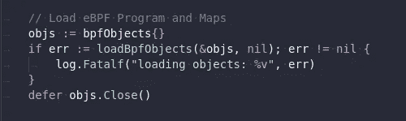

# 如何用 Golang 编写 eBPF 程序

> 原文：<https://blog.devgenius.io/how-to-write-ebpf-programs-with-golang-933d58fc5dba?source=collection_archive---------2----------------------->

我对 Linux 内核开发和生态系统中的所有工具都非常好奇。



虽然 eBPF 并不完全是新的(现在已经 7 岁了)，但就 Linux 内核而言，它仍然是早期的，新技术的采用通常进展缓慢。我早就迫不及待地想投入其中了。

最近，我有一些时间奉献给 **eBPF** 和 **BTF** ，所以我才开始在【kernel.org】T5[看文档(真的推荐！)，而且因为**做**是最好的学习方式，我只是简单地在 Golang 中围绕 **sk_lookup** 写了一个库 **sklookup-go** ，这将帮助我使用一些遗留的 TCP 服务器。](https://www.kernel.org/doc/html/latest/bpf/instruction-set.html)

## 图书馆，什么是 sklookup-go？

[**sklookup-go**](https://github.com/fbac/sklookup-go) 是一个项目，提供:

*   一个 **cli** 来运行绑定到一个 socket 中的程序，为这个程序(由其 PID 指定)提供一些额外的端口。(Max。1024)
*   它也是一个**包**，你可以从你的 Golang 代码中使用它。也许你有一些程序绑定到一个端口，由于某种原因，你不想把它绑定到其他地方。这不成问题，导入库，传递侦听器的文件描述符和一些附加端口，就可以开始了。
*   这两个能力依赖于一个 **sk_lookup** eBPF 程序，通过 [**bpf2go**](https://github.com/cilium/ebpf/tree/master/cmd/bpf2go) 和逻辑编写感谢 Golang 包[**cilium/eBPF**](https://github.com/cilium/ebpf)**。**

## 而 sk_lookup 到底是什么？

eBPF 程序类型很多，[SK _ LOOKUP](https://www.kernel.org/doc/html/latest/bpf/prog_sk_lookup.html)(**BPF _ PROG _ TYPE _ SK _ LOOKUP**)只是其中一种。

这种类型的程序运行在内核协议层，就在将连接附加到套接字中现有的接收缓冲区之前。

或者**粗略地说**当内核试图弄清楚把它接收到的这个特定的数据块传递到哪里时，sk_lookup 进入内核，把数据传递到一个指向套接字的文件描述符。

## 但是…那么，eBPF 是什么？

不可否认，eBPF 是一项革命性的技术。它在一个空间中引入了可编程性，Linux 内核( [Windows](https://github.com/microsoft/ebpf-for-windows) ，也是如此)，这在传统上仅限于内核模块。

由于显而易见的原因，内核是每个操作系统中最关键的部分，它的发展通常很慢，但是由于 eBPF，这不再是真的了。作为系统程序员，每个人都可以将程序加载到内核中，并以沙箱的方式运行它们。

## 那么，为什么这对我们有用呢？

首先，因为它极其**酷**。永远不要忘记酷的法则；你知道…什么都可以做，只要是 [**酷**](https://en.wiktionary.org/wiki/cool) 。

另外，严肃地说，想象一下这样一种场景，您必须为一个遗留应用程序提供额外的端口，而这个遗留应用程序恰好只监听一个套接字或一个 IP。你真的需要它来监听更多的套接字。

或者您可能想要实现一个 [L7 代理](https://simple.wikipedia.org/wiki/OSI_model#Layer_7:_Application_layer)，同时将您的代理只绑定到一个 IP 或套接字。

如果你有梦想，你就能做到。

## **为什么要用 Cilium 开发的 ebpf 包？**

有许多好的库可以与 ebpf 交互，但是我选择了 **cilium/ebpf** ，因为它们的方法是**纯 Go 实现**。这感觉完全合理，因为我们不再依赖其他构建工具或工作流来完成工作。

此外，当与 **bpf2go** 一起使用时，它允许你与程序交互，而不必自己编译 ELF 二进制文件，这是一件不用担心的事情。

> 记住， **bpf2go** 会将源代码编译成 eBPF 字节码，其方式与 cli **bpftool gen skeleton** 类似。

## C 和 eBPF 中的一些技术细节

eBPF 程序是用 C 语言编写的，到目前为止，我们还不能自由地编写程序。可以查看 **eBPF C 程序** [**这里**](https://github.com/fbac/sklookup-go/tree/main/pkg/ebpf/src) 。这就是 sk_lookup 程序，它作为 **sklookup-go** 的后端。

实现是基于[这个](https://github.com/jsitnicki/ebpf-summit-2020/blob/master/echo_dispatch.bpf.c) [Jakub Sitnicki](https://github.com/jsitnicki) 代码的，尽管我改变了地图以支持 BTF(我们将在下一篇文章中讨论)

此外，重要的是要提到用户通过加载到内核内存中的 [**eBPF 映射**](https://www.kernel.org/doc/html/latest/bpf/maps.html) 与 eBPF 程序交互，这是用户能够在用户空间和内核之间共享信息的方式，也是我们将在 Go 库中做的事情。

下面两张地图是神奇之处:

*   在**散列表**中，最多存储 1024 个 key:value。关键是实际的端口号，我们不关心它的值。
*   在 **sockMap** 中，key 0 处只能有一个值；目标套接字的文件描述符。

```
/* List of additional service ports. Key is the port number. */
struct { 
  __uint(type, BPF_MAP_TYPE_HASH); 
  __type(key, __u16); 
  __type(value, __u8); 
  __uint(max_entries, 1024);} 
add_ports SEC(".maps");/* Target socket */
struct { 
  __uint(type, BPF_MAP_TYPE_SOCKMAP); 
  __type(key, __u32); 
  __type(value, __u64); 
  __uint(max_entries, 1);} 
target_socket SEC(".maps");
```

## 最后，去敲打

到目前为止，您可能已经注意到，我没有将 C 代码显式编译成 ELF 二进制文件，尽管我们需要它来运行 eBPF 程序。

所以看一下 **ebpf.go** ，特别是这一点:

```
//go:generate go run github.com/cilium/ebpf/cmd/bpf2go -cc $BPF_CLANG -cflags $BPF_CFLAGS bpf src/ebpf/sk_dispatch.c -- -Isrc/headers
```

这一行调用 **bpf2go** ，并分别为 Big 和 Little Endian 生成所需的 ELF 和两个 go 文件 **bpf_bpfeb.go** 和 **bpf_bpfel.go** ，其中包含您需要从 go 代码中调用的所有函数。

ebpf.go 上的代码是主要魔力所在，它处理相当多的东西:

*   它加载需要加载到内核内存中的 BPF 对象(地图和程序)。
*   它**销()**这些物体进入系统。

> ()中的 P 是用于创建文件的方法，eBPF 图将在该文件中被访问。它需要一个 BPF 文件系统，通常是/sys/fs/bpf。

*   另外，**不要忘记**到 U **npin()** 和 **Close()** 使用后的地图和程序，否则会将地图和程序留在 fs 中。
*   它创建了 [**dispatcher 链接**](https://github.com/fbac/sklookup-go/blob/main/pkg/ebpf/ebpf.go#L269) ，克隆了调用者网络命名空间，所以进程之间的通信是可以发生的。

```
func getDispatcherLink(p *ebpf.Program) (*link.NetNsLink, error) {
 // Get self net-namespace
 netns, err := os.Open("/proc/self/ns/net")
 if err != nil {
  return nil, err
 }
 defer netns.Close()// Attach the network namespace to the link
 lnk, err := link.AttachNetNs(int(netns.Fd()), p)
 if err != nil {
  return nil, err
 }return lnk, nil
}
```

*   当将 [**附加到外部进程**](https://github.com/fbac/sklookup-go/blob/main/pkg/ebpf/ebpf.go#L237) 时，程序还会执行一个 **pidfd_getfd(pidfd_open(PID，o)，fd，0)** 的系统调用，以复制目标套接字的文件描述符，这样它就可以被我们的调用程序使用。它看起来像下面这样:

```
func (e *EbpfExternalDispatcher) getListenerFd() uintptr {
 // pidfd_open
 pidFd, err := pidfd.Open(e.TargetPID, 0)
 if err != nil {
  e.Log.Panic().Err(err).Msgf("Unable to open target pid %v", e.TargetPID)
 }
 e.Log.Trace().Msgf("getListenerFd.pidFd: %v", pidFd)// pidfd_getfd
 listenFd, err := pidFd.GetFd(int(pidFd), 0)
 if err != nil {
  e.Log.Panic().Err(err).Msgf("Unable to duplicate target fd %v", pidFd)
 }
 e.Log.Trace().Msgf("getListenerFd.listenFd: %v", listenFd)file := os.NewFile(uintptr(listenFd), "")return file.Fd()
}
```

*   最后，它处理添加目标套接字的文件描述符，添加要使用的源端口，以及一些样板代码。

## 包扎

这个库正在大量开发中，现在是 v 0 . 1 . 0-alpha 版本，因为这是我推出的第一个迭代。

我写这个的时候很兴奋，并且已经写了一个基于它的 TCP 代理(这很有效！).所以，如果你对 eBPF 和 Go 感兴趣，欢迎使用这个包，修改，贡献。

总之，我对 eBPF 技术和我们将来会看到的用例非常感兴趣。通常内核开发进展缓慢，也是创建内核模块并将其推向稳定并被社区广泛采用的过程。

有了这项技术，我相信我们将会看到令人惊叹的项目做一些很酷的事情，从 SDN 开始，到安全和许多其他用例。

**保持好奇！**