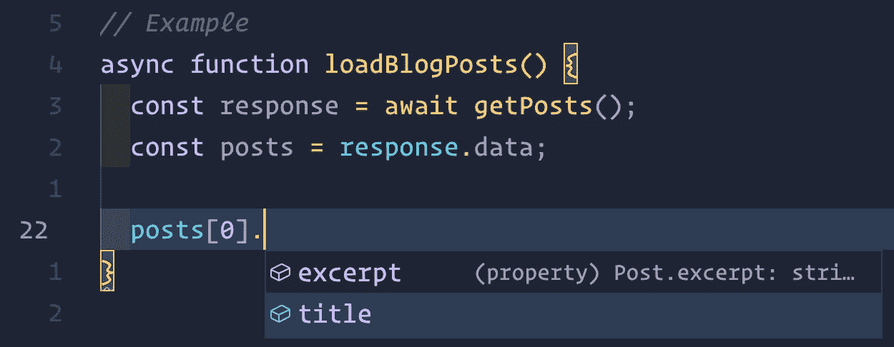

# 2023 年如何编写可维护的 JavaScript 代码— Web 或 Node.js

> 原文：<https://blog.devgenius.io/how-to-write-maintainable-javascript-code-in-2023-web-or-node-js-d66d8baead67?source=collection_archive---------0----------------------->


> 任何傻瓜都能写出计算机能理解的代码。优秀的程序员编写人类能够理解的代码。— *马丁·福勒*

2022 年 JavaScript 开发依然混乱。随着计算机越来越快，我们开始为程序员而不是机器写代码。这就是 JavaScript 的世界。

**免责声明:**本文最适合至少中等经验的 JS 开发者(web 或 Node.js)。我假设你已经有编写 JS 的丰富经验。

# 本文内容:

1.  到处使用 TypeScript
2.  学好你的 JavaScript 和框架
3.  代码格式和样式
4.  代码和内联文档中的注释
5.  在适用的地方编写有意义和有用的测试
6.  在实现复杂功能之前，使用原型和/或 MVP
7.  额外收获:一些额外的建议

# 到处使用 TypeScript

不要害怕打字稿。对于任何有一定经验的 JavaScript 开发人员来说，[官方的 5 分钟指南“面向 JavaScript 程序员的 TypeScript”](https://www.typescriptlang.org/docs/handbook/typescript-in-5-minutes.html)足以让你今天就开始编写 TypeScript。

TypeScript 帮助你重新开始。

如果您使用具有自动完成、建议、内联文档等功能的 IDE 或编辑器。，您可以体验一下 TypeScript。考虑在没有任何背景的情况下看这两个例子:

```
// src/api/posts.jsexport default {
  getPosts: () => axios.get("/posts"),
}
```

这种方法的问题对你来说应该是显而易见的。`getPosts`回报什么？如果需要从`axios`切换到`fetch`怎么办？如果你想添加一个函数来创建一个 post——你如何在一个对象中定义`data`的结构？现在看看 TypeScript 中的相同代码:

```
// src/api/posts.tsexport interface Post {
  title: string;
  excerpt: string;
}export default {
  getPosts: function(): Promise<AxiosResponse<Post[]>> {
    return axios.get("/posts");
  },
};
```

关键区别在于**透明度**。你现在可以理解代码，你的编辑或`tsc`会帮助你。当你调用 TS 版的`getPosts`时，你现在就会得到有用的信息。



VSCode 对函数类型化返回的智能感知

你可以选择全力以赴使用 TypeScript。服务器和客户机之间的共享模型确保你在两端都实施相同的结构。强制对象属性或类的类型可以防止代码中的拼写错误。多亏了 TypeScript，有很多例子可以让你发现潜在的错误。不仅如此，你还可以在两年内跳回那个代码。

# 学好你的 JavaScript 和框架

> 一个人的好坏取决于他的工具。— *埃米特·沃尔夫*

2022 年，你应该明白 JavaScript 在幕后做什么了。如果你不知道，看看我最喜欢的 JavaScript 资源——免费的雄辩的 JavaScript 电子书。您还应该知道，如今 JavaScript 提供的不仅仅是原始的数据结构和不可靠的浏览器 API。例如，你现在可以使用[下一代 JavaScript](https://www.cronj.com/blog/javascript-es7-es8-new-features/) 、[键控集合](https://developer.mozilla.org/en-US/docs/Web/JavaScript/Reference/Global_Objects#keyed_collections)，或者已经[很好支持的](https://developer.mozilla.org/en-US/docs/Web/JavaScript/Reference/Global_Objects/Intl#browser_compatibility) [国际化 API](https://developer.mozilla.org/en-US/docs/Web/JavaScript/Reference/Global_Objects#internationalization) ，节省一些 CPU 时间或者编写较少依赖于第三方的代码。


要成为一名优秀的 JS 开发人员，您需要了解异步 JavaScript、生成器函数、函数式和面向对象的范例、范围、性能等等。不幸的是，大多数 **JS 开发者对异步 JavaScript** 缺乏更深入的理解，而异步 JavaScript 是现代应用的核心特性(想想 Promises 和 async / await)。

这里是你今天可以开始做的事情，而不需要学习任何新东西。

1.  **使用文档** —可以是 Next.js、Webpack、React、TypeScript 或任何其他工具。例如，React 有很多我们大多数人从未使用过的钩子。当您开发一个主要特性或建立一个项目时，请慢慢来，深入研究您的工具文档。
2.  **用剖析器、调试器、时间测量和过度测试来测试代码性能**——为什么不在 React 表中抛出 100k 行数据呢？在发布主要功能之前，努力达到良好的可读性和性能。测试最坏的情况，看看你的代码是否是一个性能瓶颈。
    举个例子，我希望你了解一下[一个](https://stackoverflow.com/a/43032526) `[for](https://stackoverflow.com/a/43032526)` [循环和](https://stackoverflow.com/a/43032526) `[Array.prototype.forEach](https://stackoverflow.com/a/43032526)`的区别，因为对于繁重的计算操作或者大数据集的异步 JavaScript 可能会派上用场。
3.  **不要事事依赖 NPM**——大多数最简单的库都很容易自己实现。[还记得 2016 年左垫惨败吗？](https://www.theregister.com/2016/03/23/npm_left_pad_chaos/)把你自己从更新包、测试兼容性和忍受额外编码的痛苦中解救出来。
4.  **如果使用没有文档的库，请阅读源代码**。或者，您可以坚持使用文档记录良好且更受欢迎的库。
5.  **分析您的捆绑包大小影响**。您不需要为一个`_.omit`调用导入整个 lodash 库。加载一个巨大的包会显著降低应用程序的初始加载速度。关于捆绑包大小的更多信息，[看一下 Kasra 的这篇伟大的文章](https://javascript.plainenglish.io/slimming-down-your-bundle-size-d59db04c95d9)(它关注 Webpack)。

# 代码格式和样式


Unsplash 的 Pankaj Patel (@pankajpatel)的格式化代码照片。

这通常是发展中被忽视但非常重要的一个方面。不管是单独工作还是在团队中工作，执行一些规则总是有帮助的。

1.  **将**[**ESLint**](https://eslint.org/)**和**[**beautiful**](https://prettier.io/)**一起使用，你可以专注于你的代码做什么。想象一下再也不会因为缺少结尾逗号而无法通过自动化 CI 测试。此外，通过使用漂亮的惊人的默认值，您可以一劳永逸地结束代码风格的争论。**
2.  **对变量使用描述性命名**。你需要通过阅读名字来理解某样东西是什么。考虑一下`buttonDomElem`和`el`——哪个更容易理解？或者`loading` vs `isUserDataLoading`。用动词`is`或`has`作为布尔变量的前缀，不要害怕更长的变量名。IDEs 会建议名字，用户会很快复制它。
3.  **利用间距。**如果使用 beauty，它会加入多行断行。太好了。但是它保留了您想要使用的完整的单行分隔符——即使是在单个函数或对象声明中，如果它有助于可读性的话。

# 代码和内联文档中的注释


代码和内联文档中的注释实例

你甚至可以通过使用 [TSDoc](https://tsdoc.org/) 或 [JSDoc](https://jsdoc.app/) 来避免使用 TypeScript，尽管**我不建议使用**。将 JSdoc 与 TypeScript 结合使用，每个人都会明白在应用程序的不同位置执行您的调用时会发生什么。你可以使用你的关键词或文档格式，只要它非常容易阅读。

当你编写代码的复杂部分时，**总是把目标放在为那些在你不再有时间回答问题的时候你永远不会遇到的开发者编写代码上**。一旦你在 2 年后回到同一个项目来修复一个 bug，你就会明白一切是如何工作的，而不需要阅读整个源代码。

你见过没有任何解释的`setTimeout(someFn, 0)`为什么被推迟到执行周期的末尾吗？你知道它是做什么的，但是为什么像在表格里把颜色映射到用户头像一样在随机的地方调用？在这里，一个深思熟虑的评论会让你免去重新发现一个已经修复的 bug 的麻烦。

# 在适用的地方编写有意义和有用的测试

> 如果你不喜欢对你的产品进行单元测试，很可能你的客户也不会喜欢测试它。— *匿名*

你一定听说过[测试驱动开发(TDD)范式](https://en.wikipedia.org/wiki/Test-driven_development)。更多的时候，它将开发人员分成两个阵营——一些人强制执行 TDD，一些人轻视 TDD。

**我既不支持也不反对 TDD。在一些地方，这是有意义的，而在另一些地方，这是对资源的浪费。当您基于全面的规范开发一个关键的后端特性时，您将受益于 TDD。但是如果你正在创建一个前端仪表板应用程序，使用 TDD 会大大降低你的速度。考虑是否利大于弊。**


Node.js 后端应用程序中的单元测试输出示例

1.  [**单元测试**](https://www.freecodecamp.org/news/how-to-start-unit-testing-javascript/) —是大多数用例的首选测试方法。单元测试您的前端应用程序可以评估复杂的组件，如布局、模态对话框、向导、多步客户端验证表单等。在后端开发中，您可以验证端点是否按照您期望的方式处理好的和坏的情况。
2.  [**端到端(E2E)测试**](https://circleci.com/blog/what-is-end-to-end-testing/) —真正的测试 MVP。一旦你的前端应用程序变大了，每当你想把它发布给用户时，创建一个测试数据库并在一个实际的浏览器中测试你的实际代码是有意义的。在前端进行 E2E 测试的最全面的方法是像 UX 工程师一样思考——开发你的用户流或从像 HotJar 这样的工具中收集数据，并测试你的用户做了什么。

如果你愿意，你可以测试更多的东西。在更大的项目中，package.json 中的一个常见测试脚本可能是这样的- `"test": "NODE_ENV=test eslint && tsc --noEmit && jest && cypress run"`。

**更考验** `**!==**` **更考验素质。**

专注于让你的测试有用。不要浪费时间单元测试一个简单的按钮或一个小的实用功能。**这将会破坏对您已经拥有的功能的测试。**

许多经理和产品负责人，甚至高级开发人员都被代码覆盖度量所困扰。代码覆盖率应该是经验法则，而不是强制规则。通过实施高百分比的代码覆盖率，你迫使开发人员使用第三方库来节省时间，我们已经讨论了为什么这不是理想的。

# 在实现复杂功能之前，使用原型和/或 MVP

建立一个具有清晰规范的透明的项目生命周期，并且知道每个阶段何时发布，可以给你很多机会**反思已经完成的工作**。这很棒，因为一旦一个 MVP“完成”，你就可以把你的注意力从通常的工作中转移出来并评估结果。这是进行一些额外的性能测试、小的重构或其他改进的最佳时机。


**在每个主要特征之后清理并重构较小的部分**

这条规则只有在你的项目持续时间超过几个月的情况下才有意义**。一旦你完成了一个主要的功能，改变你的心态，带着一个新的愤世嫉俗的观点回来。找到瓶颈、警告和需要改进的地方，评估什么值得改变以及何时改变**。

一个很好的简单例子是，当您创建一个函数集合时，这些函数是导出的 JS 对象的属性。您不需要每次都导入整个对象，因为只要您保留对它的引用，它就会阻止 JavaScript 的内置垃圾收集器完成它的工作。用屈指可数的纯函数，应该没问题。然而，尝试 70 个不纯的函数并在 6 个地方导入它们——你的应用程序会明显变慢。相反，应该在较小的文件中创建命名导出，以降低携带数万行未使用代码的风险。

**使用原型测试特性，避免无休止的重构。**

这就是你最丑陋的不可维护的代码。一个单独的单一目的原型项目。例如，如果您是第一次使用 WebRTC，请在原型中使用它。在您验证了它满足您的需求之后，就到了编写实际代码的时候了。此时，您应该对您想要的代码的外观和行为有了更清晰的认识。

# 额外收获:一些额外的建议

1.  记录您所从事的每个项目的初始设置和部署说明，包括需求及其版本，并描述需要按什么顺序采取什么步骤。理论上也是为什么。
2.  围绕既定的实践来构建你的应用。你可以借鉴老的 MVC 方法，你可以尝试特性分离或者组合多种方法。没有对错之分。
3.  使用你的钱能买到的最好的工具。购买你喜欢使用的硬件，装饰你的办公室，花钱让你的工作变得愉快。毕竟，你一天中大约有三分之一的时间在工作。
4.  不要让自己被推到不切实际的最后期限。如果你的工作环境有毒，不要让单一的工作扼杀了你的创造力和激情。你随时可以换到另一个职位。
5.  表达你的观点并开始讨论。还记得“没有愚蠢的问题”这句话吗？所以继续问，继续说。只要这样做，你就可以扩展你的视野。

这就是关于编写更易维护的代码的技巧的详尽列表。编码快乐！