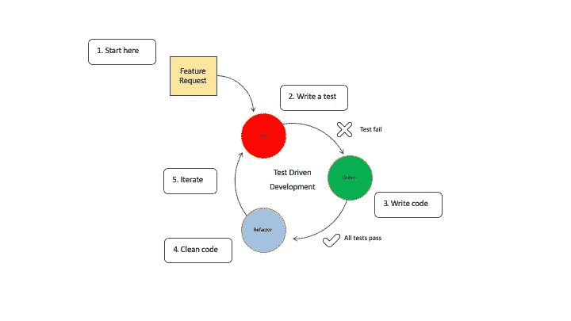

# 如何编写可测试的代码&为什么它很重要？

> 原文：<https://blog.devgenius.io/how-to-write-testable-code-why-it-matters-4ae556a940f9?source=collection_archive---------5----------------------->

## TDD 和单元测试是编写高质量代码的基础


Arif Riyanto 在 [Unsplash](https://unsplash.com?utm_source=medium&utm_medium=referral) 上拍摄的照片

> 如果你不想以失败的软件告终，你需要测试你的代码

任何程序员都讨厌单元测试(包括我自己)😐).不幸的是，我有一些坏消息；对于每个优秀的开发人员来说，单元测试就像是他们的第二天性。但是就像生活中的任何事情一样，这都是关于实践的，最终，你会爱上它。

我明白了。你没有编写生产代码，所以感觉你是在浪费时间。事实是，如果你对自己所处的位置没有很好的认识，你就无法取得进步。

尤其是随着您的应用程序的增长和需求的变化，我们需要可靠的软件。

写一个测试总比一个都没有好，十个比九个好，以此类推。你测试得越多，你就越能确定你的代码能像预期的那样工作。然而，在职业发展中，我们必须在期限内工作。所以编写无止境的单元测试也不是一个选择。

许多铁杆测试人员说你必须为每一个写好的代码写测试。

我不得不谦虚地反对。这取决于你有多少经验。

刚开始编程的时候，写的都是蹩脚的，乱七八糟的代码，没毛病。然而，你应该非常认真地对待单元测试。

没有什么比测试驱动开发更能帮助你写出高质量的代码了。

每个初学编程的人都需要一个写单元测试的习惯。即使是有多年经验的开发人员/工程师也做单元测试。

所以:

> 您拥有的单元测试的数量应该与您的产品代码成比例。

在你认为我的建议是无中生有之前，我们先来看看一些事实，好吗？

**一些公司发现** [**所有最高开发成本的 60–80%来自开发管道中后来出现的意外错误**](https://www.it-cisq.org/the-cost-of-poor-quality-software-in-the-us-a-2018-report/The-Cost-of-Poor-Quality-Software-in-the-US-2018-Report.pdf) **。**

TDD 的影响是巨大的。例如，一家体育博彩公司 Paddy Power 发现，通过实践 TDD，缺陷导致的产量减少了 90%。

让我们更深入地研究一下 TDD。

## TDD 简介



TDD 循环

TDD 是关于在编码之前先写测试。*你先思考你的代码，得到快速的反馈，必要的时候再修改。TDD 将允许你更快地开发，对我们的代码更有信心，更少的倒退。*

我们有三种类型的测试:

1.  场景/大型测试:我们测试整个应用程序，并假装是用户。然而，我们的进展缓慢且不稳定
2.  *功能/媒介测试:我们隔离应用程序的一个组件，并有类交互/多个子系统。*
3.  *单元/小测试:我们关注应用程序逻辑。它很快，没有 I/O，也不需要调试器*

单元测试是关于隔离单独的代码片段。

我们可以直接看到代码是否失败。这是一个巨大的优势，因为我们不必运行整个应用程序。我们可以写一个简单的单元测试，看看会发生什么。

这就是为什么 TDD 经常与敏捷开发结合使用。我们可以向消费者交付持续的、高质量的软件。毕竟，敏捷就是为我们的利益相关者带来价值。

[](https://medium.com/project-management-knowledge/the-agile-mindset-a-big-picture-overview-for-self-taught-developers-1880675b81c5) [## 敏捷思维:自学成才的开发人员概览

### 敏捷意味着有一个想法，知道你想要完成什么，以什么样的顺序完成，同时还要灵活

medium.com](https://medium.com/project-management-knowledge/the-agile-mindset-a-big-picture-overview-for-self-taught-developers-1880675b81c5) 

在上面的例子中，你可以看到 ***TDD 循环:红绿重构***

*   **红色相位表示代码不起作用。**
*   **绿色阶段表示一切正常；然而，不一定是最好的方式。**
*   **蓝色阶段说明测试人员正在重构代码，但是既然代码已经测试过了，测试人员就更有信心做出改变，改进我们的代码。**

我们知道代码行为背后的规范/需求，所以我们可以判断我们是否在正确的轨道上，代码是失败还是通过。如果失败了，我们可以重构代码。我们的代码越干净、稳定和灵活，我们就越能保证代码的质量。

在重构/测试期间，我们遵循以下步骤来获得高质量的代码:

1.  ***阅读、理解并处理特性或 bug 请求。***
2.  通过编写单元测试来翻译需求。如果设置了热重装，单元测试将会运行并失败，因为还没有实现任何代码。
3.  编写并实现满足需求的代码。运行所有测试，它们应该会通过；如果没有，重复此步骤。
4.  通过重构来清理你的代码。
5.  ***冲洗，打泡沫，重复。***

上面的建议只是 TDD 的冰山一角；查看一些关于如何使用 AmigoCode 练习 TDD 的教程:

让我们来看看一些最佳实践。这里有七种实用的方法可以让你写出更好的代码。

## 成功的步骤

*   ***像会计一样构建软件:***

会计行业已经存在了 500 年。他们通过维护资产负债表来管理企业财务，并跟踪企业的资产和负债。两边加起来，最后都要等于零。

为什么不在软件开发中实践同样的原则呢？就像在会计行业一样，试着通过写一点代码并马上测试来构建你的软件。以后你很可能会感谢我😌

*   ***先失败/快速失败:***

```
void Add(IProduct item)
    {
        if (item == null)
            throw new ArgumentNullException("item");

        if (!item.IsOfferedForSale)
            throw new ArgumentException("Item cannot be added to cart.");
        ...
    }
```

调试是最糟糕的。想象一下，每次运行应用程序时，程序中都会出现 bug。没有什么比得到一个空引用异常更令人沮丧的了，但是你不知道去哪里找。我又遇到了同样的问题。

这可能感觉像大海捞针。但不一定非要这样。

在 C#中，我们有一个叫做保护子句的东西。Guard 子句是 true/false 表达式，我们在方法的顶部使用它来确定我们是否应该继续运行。Guard 子句使某些前提条件得到满足，否则返回异常。

保护子句不仅仅在 C#中可用。它们是我们称之为[防御程序](https://www.easytechjunkie.com/what-is-defensive-programming.htm)的一部分。

*   ***单一责任原则/依赖注入:***

也许构建类和方法的最重要的规则。SRP 声明每个模块都应该做得很好，并且有一个改变的理由。单一责任原则是关于可靠的内聚类，内聚告诉我们一个类的责任是如何紧密相关的。

当我们使用 SRP 时，我们的类有更多的可读性，更容易被重用，因为内部的逻辑更容易在第一时间被发现。当类有许多不相关的方法时，其他开发人员更有可能重复相同的逻辑。我们打破了干燥原则。

让我们比较一下低内聚和高内聚的类:

*   低内聚:一个车辆有像编辑车辆选项，更新定价，计划维护…
*   高内聚:车辆:编辑车辆选项，更新定价。其他类车辆维护:定期维护，发送维护提醒，…

依赖注入是一种来自控制原则反转的模式，控制反转是一种简单但有益的技术，用于分离代码和单元测试。

依赖注入在 ASP.Net 核心中可用。

*   ***违反得墨忒耳定律(最小知识原理):***

德米特里定律是我们设计模式下的怪鸭。所以不要担心，如果你不知道的话。它声明您应该最小化紧密耦合并提高内聚性(彼此紧密相关的代码)。我们应该努力编写知道有限依赖的代码。

假设我们有一个下订单的地方。该订单对象应该通知客户。因此，它与另一个名为电子邮件通知的类进行对话，并且必须与库存管理进行对话，因为我们的库存发生了变化。我们还必须在未来提高我们的项目价格。Order placement 类很快获得了更多的依赖项，并且它与许多其他类紧密耦合。

为了避免这种情况，订单应该由一些类来处理；例如，订购供应商的库存可以通过库存管理而不是下订单。

物品定价也是如此。我们允许自己传播依赖。订单下达仅与电子邮件通知和库存管理相关，而库存管理与项目定价和供应商订单相关。

*   ***全局状态:***


Movietracker 应用程序使用 HTTPCliennt 对象进行 API 调用，以从第三个 API 获取数据

在 ASP.NET，我们有一个 HTTPContext 类。HTTP 上下文实例是一个应用程序状态对象，这意味着我们在应用程序的任何地方都使用这个实例。我通过依赖注入得到一个 HttpClient 实现。

然而，使用全局变量的问题是，您与我们的全局状态有耦合，并且这些变量在我们的应用程序中保持更高级别的状态。您可能会猜测这对于测试来说并不理想。这同样适用于我们的单例模式，在这种模式下，我们将整个应用程序的实例保存在内存中，例如 LoginEnabled。

当您遇到一个单元测试，当您并行运行一个测试时，它随机地失败了，但是孤立地通过了，这可能意味着您有一个测试正在以全局状态读取。因此，测试 2 修改了对象 A，而测试 1 也在运行。如果您想避免这种情况，请尽量将您的州保持在本地。此外，利用[包装类。](https://www.educative.io/edpresso/junior-dev-learning-wrapper-classes)

## 最终想法:


照片由 [Nathan Fertig](https://unsplash.com/@nathanfertig?utm_source=medium&utm_medium=referral) 在 [Unsplash](https://unsplash.com?utm_source=medium&utm_medium=referral) 拍摄

像你和其他开发者一样，我正在成为一名伟大的开发者。作为开发人员，我们可能会对不同的技术感到非常兴奋，而忽略了对开发最重要的东西。这是要重点关注的

*   成为优秀的问题解决者
*   能够通过使用正确的原则和实践来编写高质量、干净的代码
*   了解不同的技术堆栈，如用于数据库的 SQL、Reactjs(前端)、用于云的 Azure 和用于后端开发的 C#。

一旦你通过探索所有的原则和实践(比如 TDD )掌握了一种编程语言，从一种语言过渡到另一种语言就容易多了

作为一名初级开发人员，也许你能做的最好的事情就是关注如何编写高质量的代码。

如果您想定期更新关于如何在职业和个人生活中过上一个伟大的开发人员的生活，并探索不同的技术，请随时订阅。感谢您的阅读。我希望它有所帮助👊

## 资源:

[](https://www.amazon.com/Design-Patterns-Elements-Reusable-Object-Oriented/dp/0201633612) [## 设计模式:可重用面向对象软件的元素

### 设计模式:可重用面向对象软件的要素

www.amazon.com](https://www.amazon.com/Design-Patterns-Elements-Reusable-Object-Oriented/dp/0201633612) [](https://www.amazon.com/NET-Core-Test-Driven-Development/dp/1788292480) [## C#和。NET 核心测试驱动开发:深入 TDD 以创建灵活的、可维护的和…

### C#和。NET Core 测试驱动开发:深入 TDD 以创建灵活的、可维护的和生产就绪的。网络…

www.amazon.com](https://www.amazon.com/NET-Core-Test-Driven-Development/dp/1788292480) [](https://www.pluralsight.com/) [## Pluralsight -无限在线开发人员、IT 和网络安全培训

### 在 Pluralsight，我们每天都亲眼目睹技术如何将不可能变为可能。这就是为什么复视一号…

www.pluralsight.com](https://www.pluralsight.com/)  [## 有效地使用遗留代码更改软件(第 1 部分:第 4 章)

### 这是有效使用遗留代码系列的第 4 章。如果你没看过前面的第三章。

biratkirat.medium.com](https://biratkirat.medium.com/working-effectively-with-legacy-code-changing-software-part-1-chapter-4-b997b78fc0a2) [](https://www.amazon.nl/Dependency-Injection-NET-Core-Seemann/dp/161729473X/ref=asc_df_161729473X/?tag=nlshogostdde-21&linkCode=df0&hvadid=454803874950&hvpos=&hvnetw=g&hvrand=16677617428639721477&hvpone=&hvptwo=&hvqmt=&hvdev=c&hvdvcmdl=&hvlocint=&hvlocphy=1001021&hvtargid=pla-731749387872&psc=1) [## 依赖注入。网络核心

### 依赖注入。NET Core: Seemann，Mark，Deursen，Steven van: Amazon.nl: Boeken

www .亚马逊. nl](https://www.amazon.nl/Dependency-Injection-NET-Core-Seemann/dp/161729473X/ref=asc_df_161729473X/?tag=nlshogostdde-21&linkCode=df0&hvadid=454803874950&hvpos=&hvnetw=g&hvrand=16677617428639721477&hvpone=&hvptwo=&hvqmt=&hvdev=c&hvdvcmdl=&hvlocint=&hvlocphy=1001021&hvtargid=pla-731749387872&psc=1)