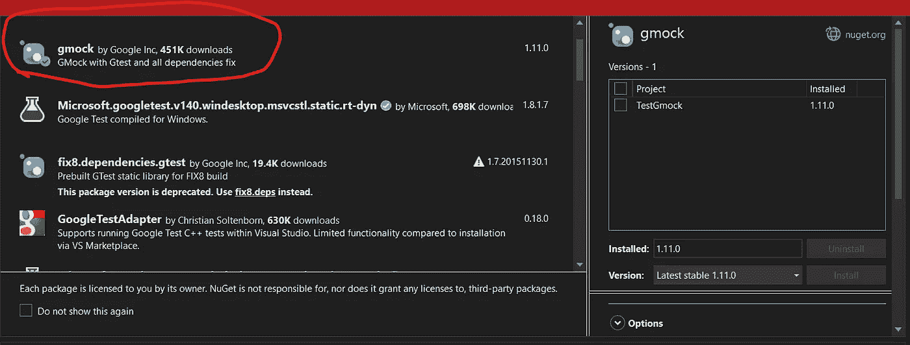
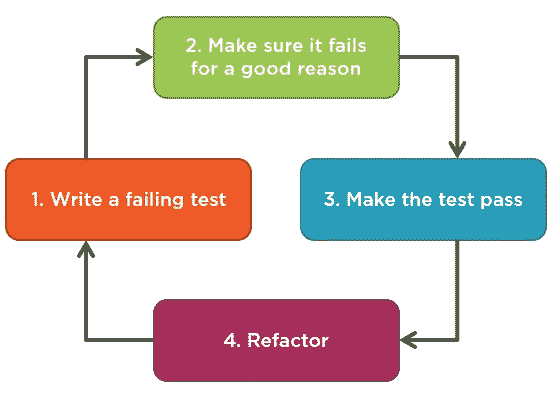

# 如何用 Gtest(C++)轻松编写单元测试(第 1 部分)

> 原文：<https://blog.devgenius.io/how-to-write-unit-tests-easily-with-gtest-c-part-1-2399f36693e6?source=collection_archive---------6----------------------->


# 介绍

这是一个快速入门指南，所以没有太多的解释，但我已经包括了参考资料。对于本教程，我使用的是 Visual Studio 2022。

提醒一下，以下是你需要知道的:

*   要编写单元测试，应该使用什么库？
*   测试类应该放在哪里？
*   在 C++中，我如何模仿对象？
*   测试功能:我如何执行它们？
*   包管理:它是如何工作的？

# 为什么是 GTest？

C++中单元测试的框架有很多，比如 Catch2、Gtest、CppUnit、Doctest 等。我们的软件部门目前正在使用 Catch2。但是，我决定用 Gtest 代替 Catch2。您可以阅读以下文档，了解不同之处以及我选择 Gtest 而不是 Catch2 的原因:

 [## 为什么要用 Google Test 而不是我喜欢的 C++测试框架？-cuhkszlib-小星…

### 如果您在这里找不到问题的答案，并且您已经阅读了初级和高级指南，请将它发送到…

cuhkszlib-Xiaoxing . readthedocs . io](https://cuhkszlib-xiaoxing.readthedocs.io/en/latest/external/gtest/googletest/docs/FAQ.html) 

# 准备使用 GTest

在 Visual Studio 中安装最新版本的 Gtest 框架



以下是我将添加到测试类中的所有头文件:

```
#include <gmock/gmock.h>
using ::testing::Return;
using ::testing::_;
```

# 包装管理

为了保持整洁，我将通过创建一个并行源代码树，把测试放在“同一个”包中。

```
Header files/
  repository/
    mappers/
      TimeMapper.h
```

```
Tests/
  repository/
    mappers/
      TimeMapperTest.cpp
```

# 生产代码

> 出于本文的目的，我们将把包含项目逻辑并在生产中运行的系统部分称为“生产代码”。**我们将项目中包含测试的部分称为“测试代码”,这些测试验证应用程序(生产代码)是否按预期工作**

[](https://hackernoon.com/how-to-deal-with-test-and-production-code-c64acd9a062) [## 如何处理测试和生产代码

### 在处理测试代码和产品代码时，我们可以识别一些模式。为了这篇文章的目的，我们…

hackernoon.com](https://hackernoon.com/how-to-deal-with-test-and-production-code-c64acd9a062) 

# 单元测试的三个部分

任何语言中的任何单元测试函数都有三个主要部分:

*   **安排**
*   **行动**
*   **断言**

> 单元测试方法**的 Arrange 部分初始化对象，并设置传递给测试方法**的数据值。
> 
> Act 部分用安排好的参数调用测试中的方法。
> 
> 断言部分验证被测方法的行为是否符合预期。

[](https://automationpanda.com/2020/07/07/arrange-act-assert-a-pattern-for-writing-good-tests/) [## Arrange-Act-Assert:一种编写好测试的模式

### 测试是对行为进行测试以确定该行为是否正常运行的过程。有几个…

automationpanda.com](https://automationpanda.com/2020/07/07/arrange-act-assert-a-pattern-for-writing-good-tests/) 

# 单元测试方法

单元测试函数可以用两种方式编写。它们各有利弊。我们不能说哪一个更好，但是要用在合适的地方。

# 最后测试方法

> 最后测试方法是我们大多数人坚持的常规方法，也是编写测试最直观的方法。
> 
> 基本上，您首先编写应用程序代码，然后用测试覆盖它。这里没什么太复杂的；这是开发软件的“正常”方式。

# 测试优先方法(TDD)

> 测试优先的方法是相反的:您首先为您将要开发的功能编写一个测试，然后编写功能本身。
> 
> 简言之，这就是测试驱动开发(TDD)。TDD 不仅仅如此(见下文)，但是测试和生产代码的排序是与传统方法最重要的区别。

下面是 TDD 流程示意图:

[](https://khorikov.org/posts/2022-01-24-test-first-vs-test-last-approaches/) [## 先试验与后试验的方法

### 今天，我想谈谈何时编写测试的话题:在生产代码之前还是之后。最后一次测试…

khorikov.org](https://khorikov.org/posts/2022-01-24-test-first-vs-test-last-approaches/) 

因为我选择了长期的方法，所以我选择了 TDD。我希望本文中的测试是这样编写的。

# 嘲弄的

在我们的例子中，我们将模仿类并存根它们的函数。我们先来复习一下。

> Mocking 是**当被测试的单元有外部依赖**时，在单元测试中使用的过程。模仿的目的是隔离并关注被测试的代码，而不是外部依赖的行为或状态。
> 
> 在模拟测试中，**依赖区域单元被替换为模拟重要单元行为的对象**。它基于基于行为的验证。模拟对象通过创建一个伪对象来实现真实对象的接口。因此，它被称为模拟。

# **存根**

> Stub 是一个对象，它将基于一组特定的输入返回特定的结果，并且通常不会响应测试程序之外的任何内容。使用 JustMock，您可以用最少的代码在测试中创建一个存根，清楚地表明依赖项将如何响应以及被测试的系统应该如何表现。

[](https://www.telerik.com/products/mocking/unit-testing.aspx#:~:text=What%20is%20mocking%3F,or%20state%20of%20external%20dependencies) [## 单元测试的模拟框架

### 单元测试在软件开发中越来越受欢迎。然而，众多的框架、工具和…

www.telerik.com](https://www.telerik.com/products/mocking/unit-testing.aspx#:~:text=What%20is%20mocking%3F,or%20state%20of%20external%20dependencies) 

# 测试套件和测试用例

> 测试套件是为了测试执行目的而分组的测试用例的集合。

 [## 测试用例及测试套件

### 一个测试用例回答了这个问题:“我要测试什么？”你开发测试用例来定义你必须…

www.ibm.com](https://www.ibm.com/docs/en/elm/7.0.3?topic=scripts-test-cases-test-suites) 

正如我所说的，这里我们想要测试一个服务类。那么这里的测试套件名称是什么呢？是“ServiceTest”。然后，我们应该考虑我们的测试用例名称。

> 测试用例中有什么？
> 
> 什么是测试用例？在软件测试的上下文中，测试用例指的是验证特定特性或功能所需的一系列动作。本质上，测试用例详细描述了验证一个特性所必需的步骤、数据、先决条件和后置条件。

[](https://www.browserstack.com/guide/how-to-write-test-cases) [## 如何用示例编写测试用例| BrowserStack

### 在软件测试的上下文中，测试用例指的是验证特定功能所需的一系列动作…

www.browserstack.com](https://www.browserstack.com/guide/how-to-write-test-cases) 

这是我们运行第一个测试需要知道的一切。我们将在文章的下一部分编写我们的第一个场景。

[](https://medium.com/@miladv33/how-to-write-unit-tests-easily-with-gtest-c-part-2-bb6b8fd0b3db) [## 如何用 Gtest(C++)轻松编写单元测试(第 2 部分)

### 介绍

medium.com](https://medium.com/@miladv33/how-to-write-unit-tests-easily-with-gtest-c-part-2-bb6b8fd0b3db)