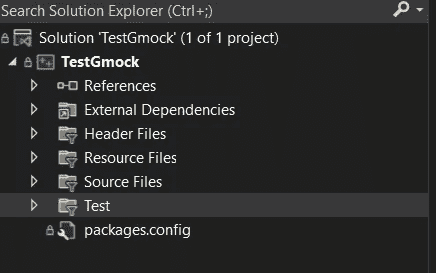
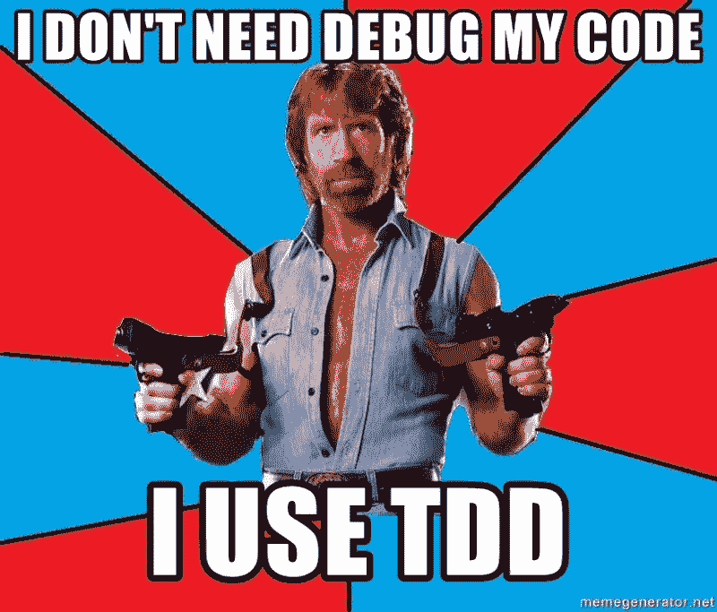

# 如何用 Gtest(C++)轻松编写单元测试(第 2 部分)

> 原文：<https://blog.devgenius.io/how-to-write-unit-tests-easily-with-gtest-c-part-2-bb6b8fd0b3db?source=collection_archive---------7----------------------->


# 介绍

正如我们在上一部分中看到的，我们设置了 Gtest，讨论了我们想要做的事情，并在运行第一个测试之前了解了我们需要知道的内容。

[](https://medium.com/@miladv33/how-to-write-unit-tests-easily-with-gtest-c-part-1-2399f36693e6) [## 如何用 Gtest(C++)轻松编写单元测试(第 1 部分)

### 介绍

medium.com](https://medium.com/@miladv33/how-to-write-unit-tests-easily-with-gtest-c-part-1-2399f36693e6) 

作为第一步，我们将编写一个非常简单的单元测试。要查看完整的代码库，请查看这个库。

[](https://github.com/miladv33/TestGmock) [## GitHub - miladv33/TestGmock

### 此时您不能执行该操作。您已使用另一个标签页或窗口登录。您已在另一个选项卡中注销，或者…

github.com](https://github.com/miladv33/TestGmock) 

# 测试什么？

“服务”是我们想要的类的名称。这个类从服务器获取当前的计时器。首先，我们必须编写测试函数，然后我们将根据我们在测试函数中想要的内容编写“生产代码”。(你好 TDD)


# 第一步

在项目中创建一个名为“Test”的新文件夹。所有测试类都将包含在该文件夹中。



在“Test”文件夹中，应该有另一个名为“Service”的文件夹。这个文件夹将包含 ServiceTest.cpp。现在是我添加我们在上一节中讨论的头的时候了。

# 测试用例名称和测试套件名称

正如我所说的，这里我们想要测试一个服务类。那么这个测试套件的名称是什么呢？是“ServiceTest”。然后我们应该考虑我们的测试用例的名字。我们想从服务器获取时间，所以姑且称之为“get time”。

# TEST(g TEST 关键字)

当你在 Gtest 中编写一个测试函数时，你做的和你定义它时有一点不同。我们的第一个测试应该定义如下:

```
#include <gtest/gtest.h>

TEST(ServiceTest, GetTime) {
//arrange

//act

//assert

}
```

我想在“排列”部分定义我想测试的类。这是“服务”类。

```
#include <gtest/gtest.h>

TEST(ServiceTest, GetTime) {
//arrange
 Service service;
//act

//assert

}
```

我们的生产代码里有没有一个叫“服务”的类？**否**。我们来写吧。这是。h 文件:

```
class Service
{
public:

};
```

和 cpp 文件:

```
#include "Service.h"
```

现在我们可以继续编写下一部分，而不会在 IDE 中看到任何错误。

```
#include <gtest/gtest.h>
#include "Service.h"

TEST(ServiceTest, GetTime) {
//arrange
 Service service;
//act
 long number = service.getNumber();
//assert

}
```

我们再次面临一个熟悉的问题。在“服务”类中，有没有一个叫“getNumber”的方法？**没有**。现在就写吧。(熟悉的回答也是)。

```
class Service
{
public:
   long getNumber();
};
```

再一次，没有错误。发生了什么事？TDD 引导我们写代码。在 TDD 中，你不会有任何代码，除了它被测试。

让我们完成我们的测试:

```
#include <gtest/gtest.h>
#include "Service.h"

TEST(ServiceTest, GetTime) {
//arrange
 Service service;
//act
 long number = service.getNumber();
//assert
 EXPECT_EQ(number, 0);
}
```

EXPECT_EQ 是一个给定参数的 Gtest 函数。第一个参数是我们想要检查的值，第二个参数是我们期望第一个参数必须是的值。所以在这种情况下，我们要检查“数字”是否等于“0”。

这是我们第一个简单的测试案例。现在，我将运行它来查看结果。

# 如何运行测试？

我将在项目的主函数中添加以下代码行:

```
#include <gtest/gtest.h>
using ::testing::_;

int main(int argc, char** argv) {
    testing::InitGoogleTest(&argc, argv);
    return RUN_ALL_TESTS();
}
```

现在可以运行测试来看看会发生什么。


# 模拟的

现在嘲讽服务类的目的是返回别的东西来代替。我想返回“1”而不是“0”。然而，我只想嘲弄它，我不想改变“服务”。cpp”。

因此，我将创建一个名为“MockService.cpp”的新文件

```
#include "Service.h"

class MockService :public Service {
public:
 MOCK_METHOD0(getNumber, long());
};
```

因为嘲讽，我应该改变服务类的一些东西。

```
class Service
{
public:
 virtual long getNumber();
};
```

这允许 Gtest 覆盖“getNumber”函数。所以我们可以尽情嘲笑。

```
#include <gtest/gtest.h>
#include "MockMyService.h"

TEST(ServiceTest, GetTime) {
//arrange
 MockService serviceTest;
//act
 long number = service.getNumber();
//assert
 EXPECT_EQ(number, 0);
}
```

现在我们使用的是“MockMyService”而不是“Service”，您可以看到不同之处。

```
#include <gtest/gtest.h>
#include <gmock/gmock.h>
#include "MockMyService.h"

TEST(ServiceTest, ServiceTestWithMock) {
 //arrange
 MockService serviceTest;
 EXPECT_CALL(serviceTest, getNumber()).Times(1).WillOnce(Return(1));
 //act 
 long number = serviceTest.getNumber();
 //assert
 EXPECT_EQ(number, 1);
}
```

# 期望 _ 呼叫

什么是 Expect_call Gtest？

> EXPECT_CALL **不仅定义了行为，还设置了一个期望，即该方法将以给定的参数调用给定的次数**(当您指定顺序时，也以给定的顺序)

[](https://stackoverflow.com/questions/13933475/gmock-setting-default-actions-on-call-vs-expect-call) [## Gmock 设置默认操作/ ON_CALL 与 EXPECT_CALL

### 这两种说法之间有细微但重要的区别。EXPECT_CALL 在模拟调用上设置期望…

stackoverflow.com](https://stackoverflow.com/questions/13933475/gmock-setting-default-actions-on-call-vs-expect-call) 

因此，我们知道如何使用 TDD 编写一个简单的单元测试。

