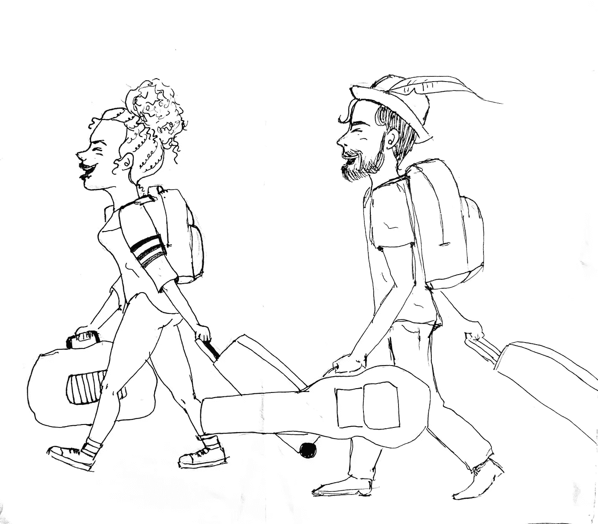

# 更新我的 LinkedIn 个人资料如何拯救了我的生活

> 原文：<https://blog.devgenius.io/how-updating-my-linkedin-profile-saved-my-life-17af48c7c8db?source=collection_archive---------14----------------------->

格雷格·布拉在 [Unsplash](https://unsplash.com?utm_source=medium&utm_medium=referral) 上的照片

那是 2017 年，我仍在委内瑞拉以自由职业者的身份谋生。我的大多数客户都是我认识的人或他们的一些朋友。

我从来没有掌握自由职业网站，因为竞争太激烈了，我不想为了几分钱而放弃我的努力。我也不想给自己假学历。

因此，我在忠诚的客户中建立了声誉，他们把我介绍给他们的朋友，我从来没有看到互联网服务或缺乏互联网服务这个大障碍的到来。

网速慢很糟糕，长时间没有网速更糟糕。想象一下那种情况，并有一个截止日期。有时甚至没有电或水。

我国政府固有的问题不仅仅影响穷人。富人和几乎不存在的中产阶级也同样受到国家提供的服务的影响。嗯，不是国家提供的，因为大多数时候他们不提供任何东西，但你明白。

我最近的两次演出是一次成功的演出，一位顾客很满意，我按时拿到了薪水，另一次是我在努力解决缺电和断断续续的互联网连接问题后被骗了，我按时交货，但仍然没有得到报酬。

在一个分崩离析的国家，谁能如此无情地欺骗一个处境艰难的人？

我无法想象生活在美国的人能够欺骗一个委内瑞拉人，更不用说另一个拉丁美洲人了。但这只是我太天真了。

# 然后我翻出了我的 LinkedIn 个人资料，这是我一生中最好的决定之一。

我花了一些时间浏览大量的教程，这些教程承诺提供最好的 LinkedIn 个人资料。最重要的是意识到这样的事情并不存在。

**你的 LinkedIn 个人资料需要帮助你被找到**，而不仅仅是为了找工作。在求职信中脱颖而出，直接申请工作会有所帮助。但是这篇文章不是关于工作申请的。

对于 LinkedIn 个人资料的细节，一些要点对我很有用:

*   一个好的头像是必须的
*   封面图片是一个很好的加分项
*   总结说了很多关于你如何沟通
*   人脉也是曝光的必备
*   正确列出的技能组合就像 LinkedIn 版的优秀 SEO

还有一个最重要的关键点:

以一种真正吸引人的方式展示自己。

你是唯一的你，我知道任何公司拥有你都是幸运的。现在，好好说服他们。

我就是这么做的。

从那以后，我的个人资料自然发展，并实现了让我在科技招聘人员面前曝光的目的。

当我为我和我的女朋友买了从马瑙斯到伊瓜苏瀑布(巴西)的机票时，我们一点也不知道(我一直想用那个表达方式)我们的命运不会如计划的那样。

作为一名自由职业者或全职员工，一个至少有稳定互联网和电力的地方是必不可少的。

我们打算利用这次旅行来旅游，所以我们在预算中增加了公园阿根廷一侧的门票。

计划是从伊瓜苏搭巴士去布宜诺斯艾利斯，开始新的生活。但是生活是一件有趣的事情，大多数时候计划并不像你想象的那样进行。

在我更新个人资料的第二天，一名招聘人员通过 LinkedIn **联系了我，**向我提供了一份在乌拉圭开设业务的美国科技公司的工作。

一个为期两个月的过程开始了，在这个过程中，我不断阅读有关求职、面试和提高我的编码技能的信息。这是我们从大门出去的机会！

打了几个电话后，一份工作邀请和临时住宿安排就来了。我从来没有这么快这么高兴地签过任何东西。

如果说我曾经对迁徙有过疑虑，那一天这些疑虑都消失了。

你可能会问，你不是要移民去阿根廷吗？

我们的决定很简单，因为我认为我们可以每月旅行一次去看望我们的朋友。毕竟布宜诺斯艾利斯只有 4 个小时的路程。但这只是我又天真了，我只去过两次。

预算变化一点也不疯狂。关于交通票，我们只需要在已经购买的计划中添加一张船票。这两个国家的移民文书工作是相似的。

购买从委内瑞拉巴塞罗那到巴西马瑙斯的机票是最棘手的事情之一。光有钱是不够的。与委内瑞拉的银行转账限额相比，机票价格实在太高了。我们不得不从两个账户转账来买它。

我们出发的那天充满了复杂的情绪，一方面，我们把整个家庭都留在了后面，另一方面，我们要经过很长的路程，经过空中、陆地和水上，才能到达一个陌生人的公寓，在一个我以前从来不知道的公司工作，在一个我知之甚少的国家。

一年后，我为我写的一首名为“Te extrañ are”的歌曲创作了一个音乐视频，这个视频包含了我们乌拉圭之行的镜头，结合了世界各地朋友的视频，展示了他们在海报上最想念的东西。这首歌是我写给我奶奶的。我仍然想念她。

伊瓜苏瀑布和世界其他地方的镜头

我们到达的那天，我们闻起来并不完全像少年精神，但即使我们很累，我们觉得我们可以吃掉这个世界。

我女朋友是个插画师(【https://instagram.com/ciorart】T2

Buquebus 船把我们留在了 Colonia del Sacramento，那里有一辆巴士正等着载我们去蒙得维的亚。

我们与乌拉圭的第一次联系是一位善良的乌拉圭妇女，她在公交车站等着我们，开车带我们去了一个公寓，那里有一瓶香槟等着我们打开，我们打算在这个地方住 3 个月。

现在，我已经在顶级科技公司连续工作了 3 年，作为一名软件开发人员，我在这个行业中成长，这个行业不仅给了我一份体面的工作、知识和成长，还让我认识了一些我见过的最聪明、最善良的人。

这一切都是从我更新 LinkedIn 个人资料开始的。