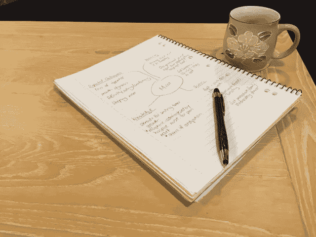

# 如何利用我的测试本能让我成为一个更好的看护者

> 原文：<https://blog.devgenius.io/how-using-my-testing-instincts-made-me-a-better-carer-318897a51505?source=collection_archive---------32----------------------->

当我妈妈的癌症复发时，在大脑和其他几个地方，我们全家都以不同的方式应对。一些人转向信仰，最受欢迎的策略是否认，但我唯一的选择是知识。

预期结果:在软件测试中，你需要在测试之前知道系统应该如何反应，这被称为“预期结果”。测试用例应该覆盖尽可能多的场景，但是当您添加预期的结果时，您可以暴露在设计和开发过程中可能没有考虑到的任何差距。让测试团队尽早参与进来，可以在计划和设计阶段的一开始就突出这些差距，这是解决问题最有效的地方。

我必须知道妈妈疾病每个阶段的“预期结果”。我必须为即将到来的事情做好准备，在我们还拥有的东西被夺走之前，珍惜它们。

**提问:**因为测试人员需要对产品有如此深刻的理解，他们会问很多问题。了解我们为什么要添加一个功能和它是如何完成的一样重要。

看到我对某种控制的极度需求，我的母亲友好地邀请我去看医生，并让我在她住院时和她床边的医生交谈。我不确定我是不是一个医生最可怕的噩梦，或者是一个转化回家庭其他成员的盟友，但我在那里等着我的问题清单——通常有几页长。我留下了很大的空白来写医生的答案，这样我以后就可以用谷歌搜索医学词汇和药物。

我真的很感激医生给我们时间，回答我所有的问题。一位医生看到了我的问题清单，甚至建议我们拉一些座位来讨论。感谢上帝，医生耐心和仁慈。

当我不在医院或赴约时，我会阅读各种自传中关于癌症、治疗以及患者如何应对和感受的书籍和文章。在我父母家，当她视力变得太差时，我会大声给她读妈妈的电子邮件，并给她打回信。我试着让每一次挫折都变成我们可以一起做的积极的事情。

妈妈决定不再忍受化疗。她的机会是非常渺茫的，结果是一样的。最后，她得了晚期癌症，活不成了。

知识和期望:在这一点上，知识救不了我妈妈，但它确实帮助了我。我需要知道会发生什么以及如何应对。她很快失去功能，但不擅长寻求帮助，所以我依靠识别症状来提供最好的支持，而不用她开口。这也有助于了解所有药片的用途。如果她抗议服用，我可以解释他们会缓解哪种疾病。有如此多的药片，如此多的疾病，不仅要了解药物的用途，还要了解剂量和潜在的副作用，这变得至关重要。

**计划**:趁还来得及，我问妈妈是否有什么事情需要整理，或者有什么关于她的葬礼的重要事情。这是一次我们都不想进行的艰难的谈话，但她确实有一些葬礼要求，我非常感谢她告诉了我。知道了她的意愿，让后来的葬礼安排变得容易了一些，但也让我安心，这是她想要的。

最后，我搬进了父母的房子。没有其他人了解药物时间表(周围仍然有很多否认)，她需要持续的护理。我还在工作(我的雇主(和丈夫)非常理解我)，但当我结束工作时，我成了护理员，晚上，我给病人用药或打电话给临终关怀护士拿吗啡。最后一周，我和姐姐一起上夜班。我非常感激得到的支持。

这听起来很可怕，但我也问过临终关怀护士，当妈妈咽下最后一口气时，我们应该做些什么。直觉告诉我，我可能没有叫救护车，但我不知道我应该做什么。临终关怀护士和蔼、耐心、善解人意。他们甚至有一本小册子，解释一旦你所爱的人去世，需要做些什么。我完全可以理解为什么否认是如此受欢迎的策略。

知道会发生什么帮助我认识到什么时候打电话给家人，让他们来家里道别。

知识、问题和预期的结果并没有减轻我的悲伤，也没有拯救我的母亲。但它帮助我用我能做到的最好的方式来面对失去亲人的痛苦。它给了我一点控制感。我认为它帮助我的家庭以他们需要的方式应对。我不确定在这样艰难的时刻我会是什么样子，但我很高兴让我成为一个伟大的测试者的技能接管了我，让我成为一个更好的照顾者和女儿。