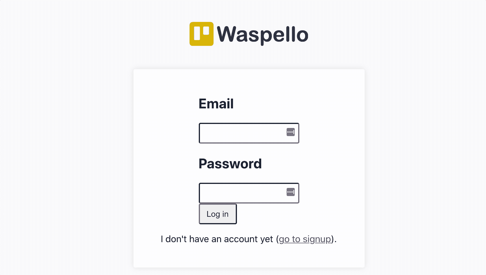

# 我们如何用 Wasp 构建了一个 Trello 克隆体——Waspello！

> 原文：<https://blog.devgenius.io/how-we-built-a-trello-clone-with-wasp-waspello-a87ad9864d43?source=collection_archive---------13----------------------->


我们用 Wasp 造了一个 Trello 克隆体！请继续阅读，了解进展情况以及您可以如何做出贡献。

[试试这里的 Waspello！](https://waspello.netlify.app/) | [参见代号](https://github.com/wasp-lang/wasp/blob/main/examples/waspello/main.wasp)

*Wasp 是一种配置语言(DSL ),用于使用更少的代码和最佳实践构建全栈 web 应用，与 React 和 Node.js 一起工作。我们的使命是简化 web 应用开发，同时使开发人员能够继续使用代码和他们喜爱的工具的力量。我们得到了 Y Combinator 和来自 Airbnb、脸书和 Lyft 的工程师的支持。*

[**我们在 Alpha(试用)！**](https://bit.ly/3Mo0Gu6) → [**加入我们的社区**](https://discord.gg/rzdnErX) → [**与我们一起工作**](https://wasp-lang.notion.site/Founding-Engineer-at-Wasp-402274568afa4d7eb7f428f8fa2c0816)

# 为什么是特雷罗？

在构建 Wasp 时，我们的目标是尽可能多地使用它来构建我们的项目并使用它，这样我们就可以了解什么是有效的，以及我们下一步应该做什么。这就是为什么 Trello 是使用 Wasp 构建应用程序的最佳选择——它是最知名的全栈 web 应用程序之一，使用起来非常简单直观，而且涵盖了当今现代 web 应用程序所使用的大部分功能。

因此，让我们深入研究一下，看看效果如何——哪些可行，哪些不可行，接下来还会有什么遗漏/即将出现！

# 什么管用？

# 它是活的⚡🤖！！

好消息是所有的基本功能都在这里——Waspello 用户可以注册/登录，这将他们带到他们的项目板，在那里他们可以对列表和卡片执行 CRUD 操作——创建它们，编辑它们，移动它们，等等。让我们来看看它的实际应用:



瓦斯佩洛在行动！

正如你所看到的，一切都正常，但并不是一切都完美(例如，创建/移动卡片时会有延迟)——稍后我们将研究为什么会这样。

# 在后台🚘 🔧

以下是 Waspello 代码剖析的简单可视化概述(适用于每个 Wasp 应用程序):


瓦斯佩洛代码解剖学

现在让我们更深入地研究一下 Wasp 支持的每个概念(页面、查询、实体等等)，并通过代码示例了解如何使用它来实现 Waspello。

## 实体

这一切都始于数据模型定义(在 Wasp 中称为`entity`),它是通过 Prisma 模式语言定义的:

main.wasp |通过 Prisma 模式语言定义实体:

```
// Entitiesentity User {=psl
   id          Int     @id @default(autoincrement())
   email       String  @unique
   password    String
   lists       List[]
   cards       Card[]
psl=}entity List {=psl
   id          Int     @id @default(autoincrement())
   name        String
   pos         Float // List has a single author.
   user        User    @relation(fields: [userId], references: [id])
   userId      Int
   cards       Card[]
psl=}entity Card {=psl
   id          Int     @id @default(autoincrement())
   title       String
   pos         Float // Card belongs to a single list.
   list        List    @relation(fields: [listId], references: [id])
   listId      Int // Card has a single author.
   author      User    @relation(fields: [authorId], references: [id])
   authorId    Int
psl=}
```

这三个实体就是我们所需要的！Wasp 使用 Prisma 在底层创建数据库模式，并允许开发人员通过其生成的 SDK 查询它。

## 查询和操作(操作)

在我们定义了数据模型之后，下一步就是用它们做点什么！我们可以读取/创建/更新/删除一个实体，这就是`query`和`action`机制的作用。下面是 Waspello 代码的一个例子，演示了它是如何工作的。

第一步是向 Wasp 声明将有一个查询，指向包含查询逻辑的实际函数，并说明它将从哪些实体读取信息:

main.wasp |中查询的声明:

```
query getListsAndCards { // Points to the function which contains query logic.
   fn: import { getListsAndCards } from "@ext/queries.js", // This query depends on List and Card entities.
   // If any of them changes this query will get re-fetched (cache invalidation).
   entities: [List, Card]
}
```

这个声明的要点是让 Wasp 知道这个查询，从而能够**为我们做很多繁重的工作——例如，它将在没有任何额外代码**的情况下为客户端提供查询，开发人员需要做的就是将它导入到他们的 React 组件中。**另一件大事是一旦数据改变，缓存失效/自动重新获取查询**(这就是为什么声明它依赖于哪些实体很重要)。

剩下的步骤是用查询逻辑编写函数。

ext/Query . js |查询逻辑，通过 Node.js 使用 Prisma SDK

```
export const getListsAndCards = async (args, context) => { // Only authenticated users can execute this query.
   if (!context.user) { throw new HttpError(403) } return context.entities.List.findMany({
      // We want to make sure user can access only their own cards.
      where: { user: { id: context.user.id } },
      include: { cards: true }
   })
}
```

这只是一个普通的 Node.js 函数，你可以返回的内容没有限制！Wasp 提供的所有东西(用户数据，特定实体的 Prisma SDK)都包含在一个`context`变量中。

动作代码非常相似(我们只需要使用`action`关键字代替`query`)，所以我在这里不再重复。您可以在这里查看`updateCard`动作[的代码。](https://github.com/wasp-lang/wasp/blob/main/examples/waspello/main.wasp#L103)

## 页面、路由和组件

为了显示我们所有的好数据，我们将使用反应组件。在 Wasp 中如何使用 React 组件没有限制，唯一的限制是每个`page`都有它的根组件。

main.wasp |中的页面和路线声明:

```
route MainRoute { path: "/", to: Main }
page Main {
   authRequired: true,
   component: *import* Main *from* "@ext/MainPage.js"
}
```

到目前为止，一切都很简单！正如您在这里看到的，Wasp 还提供了[即用型认证](https://wasp-lang.dev/docs/language/features#authentication--authorization)。

目前，Waspello 的大部分客户端逻辑都包含在`ext/MainPage.js`中(我们应该对其进行一些分解)😅- [你可以帮助我们！](https://github.com/wasp-lang/wasp/issues/334))。为了给你一个主意，这里有一个简单的介绍。

ext/MainPage.js |在 Wasp 中使用反应组件:

```
*// "Special" imports provided by Wasp.
import* { useQuery } *from* '@wasp/queries'
*import* getListsAndCards *from* '@wasp/queries/getListsAndCards'
*import* createList *from* '@wasp/actions/createList' *const* MainPage = ({ user }) => {  
   *// Fetching data via useQuery.*  
   *const* { data: listsAndCards, isFetchingListsAndCards, errorListsAndCards } = useQuery(getListsAndCards)

   *// A lot of data transformations and sub components.*  
   ...    *// Display lists and cards.
   return* (
   ...  
   )
}
```

一旦您如上所述定义了一个查询或动作，您可以通过在导入路径中使用前缀`@wasp`立即将其导入到您的客户机代码中，如代码示例所示。`useQuery`确保反应性，这样一旦数据改变，查询将被重新获取。你可以在这里找到更多关于[的细节。](https://wasp-lang.dev/docs/language/features#usequery)

这几乎是它的工作原理😄！我在这里讲得有点仓促——关于 Wasp 所有特性的更多细节，以及用 Wasp 构建你的第一个应用，请查看我们的[文档](https://wasp-lang.dev/docs)。

# 什么(还)不起作用

Waspello 当前实现的主要问题是 Wasp 中缺乏对乐观 UI 更新的支持。这意味着，当前，当进行与实体相关的更改时(例如，将一张卡片从一个列表移动到另一个列表)，我们必须等待，直到该更改在服务器上完全执行，直到它在 UI 中可见，这导致了明显的延迟。
在许多情况下，这并不是问题，但是当用户界面元素一次全部可见，并且期望它们立即更新时，这一点就很明显了。这也是我们选择在 Waspello 上工作的主要原因之一——为这个特性建立一个基准/沙箱！由于这个问题，以下是目前的情况:


您可以注意到从卡片被放入“完成”列表到它成为该列表的一部分之间的延迟。原因是，在将卡放入“完成”列表的时候，带有更改的 API 请求被发送到服务器，只有当更改在服务器上被完全处理并保存到数据库时，查询`getListsAndCards`才返回正确的信息，因此，UI 被更新到正确的状态。
这就是为什么在点击“Done”时，卡首先返回到原始列表(因为更改还没有保存在 db 中，所以`useQuery(getListsAndCards)`仍然返回“旧”状态)，它等待一段时间，直到 API 请求被成功处理，就在这时，更改在 UI 中得到反映。

## 解决方案

解决这个问题的一个典型方法是让客户端更加自信，不要等待来自服务器的确认，而是立即更新 UI，同时甚至在 API 请求被触发之前。如果后来发现服务器出了问题(这通常是不应该发生的)，它会撤销更改并显示一条错误消息。因此，名称乐观的用户界面更新，因为客户端预先假设一切将顺利提供一个更好的 UX。


这是当今开发 web 应用程序时最复杂和最容易出错的特性之一，这就是为什么我们非常兴奋能在 Wasp 中解决它，并使体验尽可能流畅！我们目前处于“找出解决方案”阶段，您可以[在 GitHub](https://github.com/wasp-lang/wasp/issues/63) 上跟踪/加入讨论！

# 缺少什么(下一个功能)

虽然乍一看起来超级简单，但 Trello 实际上是一个巨大的应用程序，在表面下隐藏着许多非常酷的功能！以下是 Waspello 目前不支持的一些比较明显的功能:

*   用户可以拥有多个板，用于不同的项目(目前我们在 Waspello 中根本没有“板”实体的概念，所以只有一个)
*   详细的卡片视图—单击卡片时，会打开带有额外选项的“完整”视图
*   搜索—用户可以搜索特定的列表/卡片
*   协作—多个用户可以参与同一个讨论板

还有更多—例如支持工作区(层次结构的下一层，一组电路板)、卡片标签、过滤器等等。拥有如此多样的特性非常有帮助，因为我们可以将它作为 Wasp 的试验场，并将其作为 Beta/1.0 的导航星！

# 成为一名 Waspeller！


如果你想参与 OSS 并同时熟悉 Wasp，这是一个很好的开始方式——请随意[选择这里列出的一个功能或添加你自己的](https://github.com/wasp-lang/wasp/issues/337),帮助我们使 Waspello 成为最好的演示生产力应用程序！

另外，请确保[加入我们的不和谐社区](https://discord.gg/rzdnErX)。我们一直在那里，并期待着看到你的建设！

[**我们在 Alpha(试用)！**](https://bit.ly/3Mo0Gu6) → [**加入我们的社区**](https://discord.gg/rzdnErX) → [**与我们一起工作**](https://wasp-lang.notion.site/Founding-Engineer-at-Wasp-402274568afa4d7eb7f428f8fa2c0816)