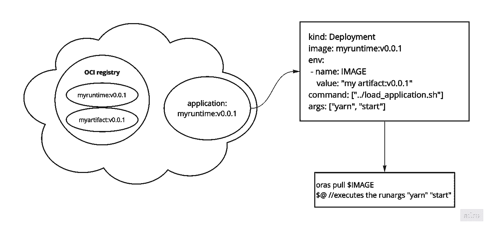

# 使用这种技术，部署应用程序的速度可提高 97%

> 原文：<https://blog.devgenius.io/how-we-further-improve-the-containerless-deployment-47a2117f80b?source=collection_archive---------2----------------------->

无集装箱部署的下一次迭代通过 OCI 注册中心分发工件。因此，它保持了快速执行的优势，同时显著提高了可伸缩性和稳定性。现在，我们通过在运行时容器内动态执行预约工件，类似于服务器端 WebAssembly。

最近，[我提出了一种向 Kubernetes 部署代码的替代方法。](/the-one-minute-deployment-rethinking-kubernetes-deployments-3f6785918855)这个想法遵循了分发代码而不是容器映像的原则。然而，它在部署过程中引入了更多的活动部分，这使得它容易出错。因此，关于可伸缩性的问题隐约出现。

## 替换 rsync

因此，我回到实验室来改进这些问题。他们连接到使用 rsync 上传代码到集群。所以，我再一次质疑自己如何分发这些艺术品。

感谢 Reddit 用户 [temitcha](https://www.reddit.com/user/temitcha/) ，他与我分享了他的智慧。这最终让我找到了一个非常好的解决方案。

> 我认为容器化的一个重要优势是工件的不变性和易于共享。

事实上，这些都是容器的宝贵特征。集装箱登记有助于所有这一切；容器图像是 tarball——应该可以通过它们分发其他工件。

这种思路最终让我使用了 [Project Oras](https://github.com/oras-project/oras) 而不是 rsync。它的 CLI 允许我将构建工件上传到容器注册中心，并大大简化了一分钟部署的想法。

## 动态加载和执行

令人想起传统的方法，部署过程构建工件并将它们上传到 OCI 注册中心。然而，这些工件还不能像容器图像一样被拉取和执行。

因此，需要在启动后将工件放入运行时容器。这与容器图像的预期用例相矛盾。正如前面指出的，容器映像应该是不可变的。容器运行时假设一切都在映像中，并执行预定义的入口点或 CMD。

然而，我仍然希望动态地定义容器装载哪个工件以及它随后执行的 runargs。

## 解决方案

图 1:容器启动

图 1 显示了当前的解决方案。OCI 注册中心为我们的部署保存了两个重要的工件。

myruntime 映像由所有运行时依赖项、Oras CLI 和一个启动脚本组成。该映像在部署清单中定义。

如前所述，myartifact 是编译后的源代码或二进制文件。这将在稍后被拉入 myruntime 容器并执行。

部署之后，启动脚本处理工件的拉取和执行。它通过从容器的 ENV 中读取图像值并通过 Oras CLI 提取图像值来实现这一点。

图 1 右上角的部署清单中定义了 ENV。清单还定义了容器的 CMD。

更重要的是，它将 runargs 描述为“yarn”“start”。这些值也由启动脚本读取和执行。

这允许将任何代码动态加载到预定义的运行时容器中并执行它。

在成功的初始部署之后，我们可以通过 *kubectl set env* 命令无缝地加载新的映像。之后，Kubernetes 更新 ENV，重启容器，并切换 pod。

## 自己试试吧！

[这个存储库](https://github.com/Falumpaset/oneminutedeployment-demo)提供了一个使用所描述的设计部署一个样本 NodsJS 应用程序的小例子。此外，还展示了更新机制。尽管如此，它仍然是必不可少的，并且基于 Makefile 和 bash 脚本的组合，但是它完成了工作。你只需要一个 Kubernetes 集群。

## 使项目成熟

我的目标是将该项目成熟为一个稳定的应用程序。虽然我认为运送工件是未来的部署方式，但我完全知道这并不适用于所有场景。

因此，我的目标是支持任何类型的部署流程。通常，管道定义部署过程，因此创建通用管道执行运行时是重中之重。

我想象它类似于 Kubernetes Api。每个人都应该可以创建自定义的扩展和动作，可以插入到部署流程中，比如 GitHub 动作，就在 golang 中。

尽管如此，我对服务器端 WebAssembly 的前景非常感兴趣。实际上，我遵循了在提供的示例中发布编译代码的核心原则。但不幸的是，它还不成熟，我正在弯曲容器来完成这项工作。

所以用实际的 WebAssembly 运行时来切换容器的想法让我非常兴奋。

此外，像 [Krustlet](https://github.com/krustlet/krustlet) 这样的概念为未来的运行时提供了蓝图。