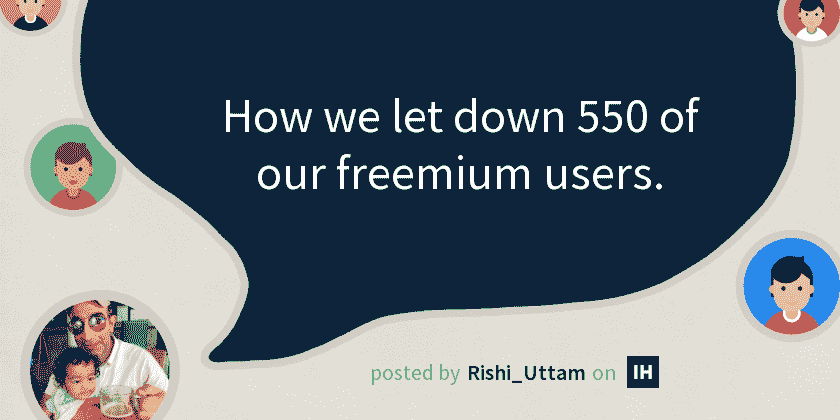
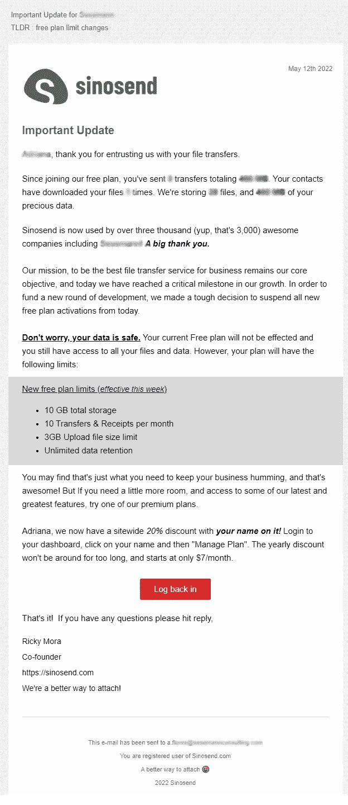

# 我们如何让 550 名免费增值用户失望。

> 原文：<https://blog.devgenius.io/how-we-let-down-550-of-our-freemium-users-a30fb7f62ce6?source=collection_archive---------5----------------------->

运营一个可行的 SaaS 业务需要成本，对于付费用户和免费增值用户来说，CAC(客户获取成本)通常是一样的。

这是一篇关于为什么我让一些最支持我们的客户失望以及为什么它很有意义的短文。

虽然相对于当前的云定价，运行云 SaaS 似乎很便宜，但一旦你考虑到用户存储、出口、云交付网络、数据库费用(仅举几例)，你就可以很快看到你的底线如何开始缩小。随着企业规模的扩大，成本会呈指数级增长。**必须拿出真金白银来支持这些行动。**

**我们一直有 3 个定价层级，以下是我的数字:-**

*   550 名免费客户(其中 120 名每月活跃，60 名非常活跃)
*   22 个专业客户
*   4 家企业客户

在早期，支持每个人是一种快乐，我是认真的。以同样的热情回复每一封支持邮件，就好像每一位顾客都是高端赌场里的一条鲸鱼。

无数 SaaS 大师总是告诉我“做不成规模的事情”，以获得你的第一个 100 个付费客户，但大师们没有告诉你的是，你可能会破产。很快，足够多的用户开始突破他们的极限，发送数 TB 的数据，这没问题，但我们的定价需要一个支点。

> 我不得不决定，*放弃免费增值还是顺其自然？*

最奇怪的是，我们有两个免费增值选项！用户可以在我们的主页上使用我们的免费服务，甚至不需要注册，你可以说它更像是一个销售线索磁铁。最重要的是，我们有完全成熟的免费增值计划，有一些非常高的限制。

> 我们在想什么，我们没有露营的钱！💰
> 
> 免费计划肯定要取消。

这就是我们如何在一次有针对性的邮件突袭中让 550 人失望的。

让用户知道他们的利用率是很重要的，例如我们存储了多少数据，以及他们是否获得了价值，在这种情况下，他们的文件被他们的客户接收了多少次。

# 结果在…

*   6 个人写了不太好的邮件。😠
*   2 个用户要求关闭他们的帐户😥
*   2 个人注册了我们新的个人计划😎
*   1 人购买了商业计划💪
*   13 个开设了新帐户，并在我们新的 7 天全面访问试用📈
*   20 多名用户重新登录，但不知道他们的密码🤣
*   300 多个用户什么也没做(预期)
*   过去 1 周内支持电子邮件减少 25%😁
*   自从取消免费增值计划后，新注册人数减少了 70%。🙄
*   90%的快乐来自我。

我现在可以专注于我们的理想客户群，并设定更高的目标🪂

我们的新计划都是付费计划，有一个短暂而甜蜜的 7 天试用期。

我们的下一个大胆的步骤将很快公布..但是时间会证明我们的失望是否有经济意义或者弊大于利。

**时间会证明…**

*最初发表于*[T5【https://www.indiehackers.com】](https://www.indiehackers.com/product/sinosend/how-we-let-down-550-of-our-freemium-users--N2N-TV3u0UQ7f3F-Q8q)*。*

推特[https://twitter.com/RishiUttamHK](https://twitter.com/RishiUttamHK)